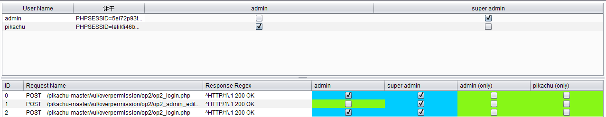
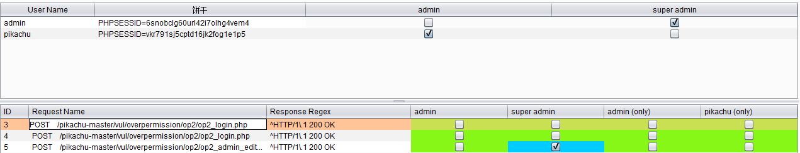

<!--
 * @Author: Suez_kip 287140262@qq.com
 * @Date: 2023-02-15 16:42:31
 * @LastEditTime: 2023-02-15 17:24:16
 * @LastEditors: Suez_kip
 * @Description: 
-->
# AuthMatrix

## 简介

AuthMatrix是一款针对Burp Suite工具的插件，该工具可以帮助广大研究人员对Web应用程序以及Web服务的认证机制进行安全测试。在AuthMatrix的帮助下，测试人员可以将注意力放在特定应用的用户表、权限、角色和请求上面了，而这些数据库表和网络请求的结构也可以直接映射到各种威胁建模方法中常见的访问控制矩阵。

工具安装配置完成之后，测试人员就可以直接通过鼠标点击就可以启动测试任务了。工具将以带有色彩高亮的界面显示测试的输出结果，并标注目标系统中存在的认证授权漏洞。

## 工具安装

AuthMatrix可以直接通过Burp Suite BApp Store来进行安装。在Burp Suite中，选择Extender标签页，然后选择BApp Store，选择AuthMatrix，然后点击安装即可。

如果研究人员想要进行手动安装的话，可以直接使用下列命令将该项目源码克隆至本地：

接下来，打开Burp Suite，选择Extender标签页，点击“Add”按钮，将扩展类型更改为Python，然后选择AuthMatrix Python文件即可：

```git clone https://github.com/SecurityInnovation/AuthMatrix.git```

## 注意事项

AuthMatrix的正常运行需要配置Burp Suite去使用Jython，具体配置方法请参考这篇【文档】。确保使用的Jython版本大于或等于v2.7.0，以保证工具的兼容性。

## 工具使用

- 在目标应用程序中创建拥有各种权限角色的用户账号，一般是User、Admin或Anonymous匿名帐户。
- 创建足够数量的用户来对应应用程序内的各种角色权限，然后通过勾选框来给用户进行分组。“单个用户”角色只包含一个用户，你也可以删除组内用户。
- 在Repeater标签页中为每一个用户生成会话令牌，并在Users表的相应列中填写令牌。Cookie可以直接通过右键点击Repeater界面中的用户来进行发送。AuthMatrix可以对Cookie中的字符串数据进行智能解析，并填充至请求中。这里的Cookie域是可选项，如果目标使用的是HTTP Header，这里也可以点击“New Header”按钮来进行Header添加。
- 在Burp Suite的其他标签页中，也可以右键点击来选择“发送给AuthMatrix”。
- 在AuthMatrix的请求表中，可以通过勾选框来选择需要发送HTTP请求的认证选项。
- 根据请求的响应行为来自定义响应正则式，并判断是否认证成功。常见的正则式包含HTTP相应Header，成功信息以及其他变量将包含在body中。
- 点击工具下方的“Run”按钮，便可以直接批量发送请求，然后通过工具接口观察测试结果。绿色内容表示无漏洞，红色表示请求中可能存在漏洞，蓝色表示结果可能存在假阳性。

## 使用效果

可以对一些基于cookie的越权漏洞进行捕获，并且可以进行简单的横向和纵向越权检测，但是在对pikachu这样的简单测试中，仍然会存在大量的不确定性，在垂直漏洞中的表现如下图：  

  
  

还可以实现一些链的操作，但是复杂度较高，不便于自动化使用；  
该系统的检测流程如下：  

1. 首先确定需要确认待测的账户，并将其代号、扮演的角色输入系统；
2. 通过例如登录等行为，获取每一个账户时下独有的cookie，甚至header（比如用于实现跨平台的越权漏洞）；
3. 在系统中分别使用这些角色去做一些容易出现越权问题的页面请求，并将其输入系统中；
4. 对各个request的行为进行权限划分，例如管理员组才能进行账户的删除，或者只有A才能控制A的账户；
5. 运行软件进行检测；

根据一些博客的叙述，其中对response的检测是使用正则化的匹配，如何实现resp的匹配的正则化，仍未实现一个高自动化水平，导致需要用户自行修补，这件事很困难，并且会引起许多不必要的漏报误报；
