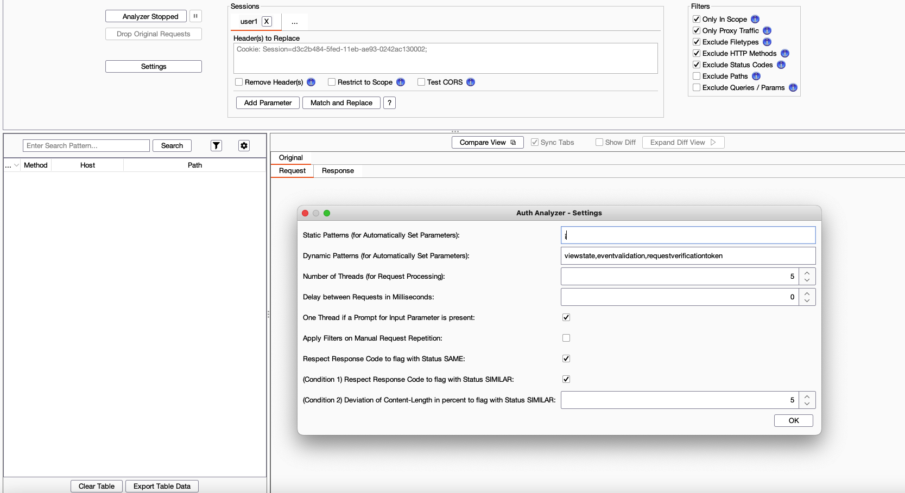
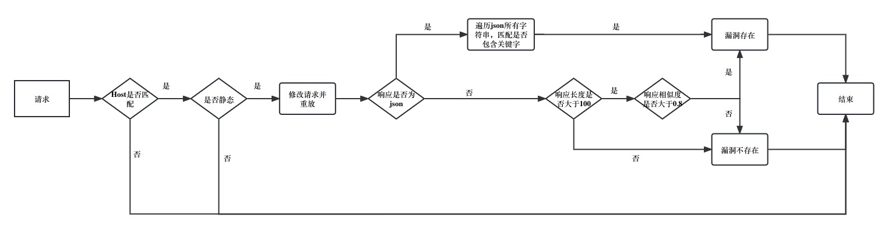
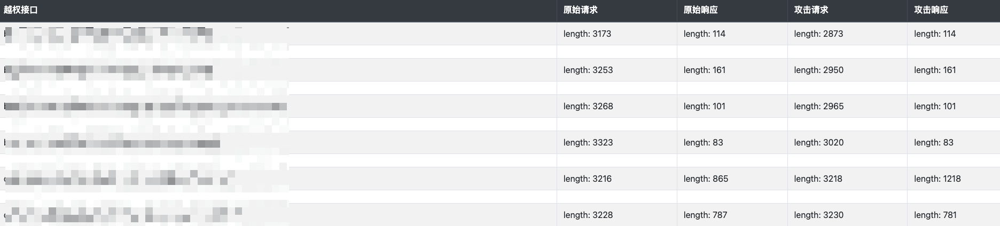
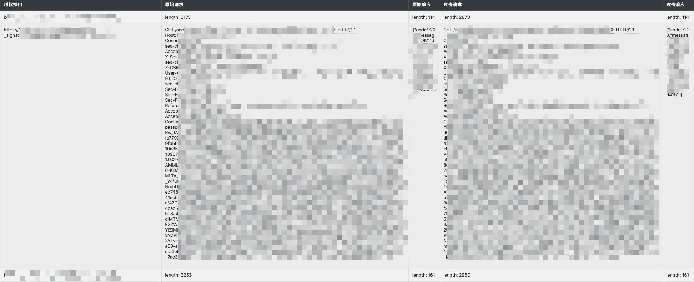

# 水平越权挖掘技巧与自动化越权漏洞检测

参考blog网址[水平越权挖掘技巧与自动化越权漏洞检测](https://www.gem-love.com/2023/01/26/%E6%B0%B4%E5%B9%B3%E8%B6%8A%E6%9D%83%E6%8C%96%E6%8E%98%E6%8A%80%E5%B7%A7%E4%B8%8E%E8%87%AA%E5%8A%A8%E5%8C%96%E8%B6%8A%E6%9D%83%E6%BC%8F%E6%B4%9E%E6%A3%80%E6%B5%8B/#undefined)

## 前言

自从2022.5入职字节无恒实验室以来，我一直从事SDLC相关工作，在SDLC中自动化安全能力卡点之一就是DAST（Dynamic Application Security Test），也是非常重要的用于实现安全左移的手段，我本人近两个月也在从事DAST产品的开发，目标自然也是希望能投入商用。我开发的DAST不会开源，但是最近恰逢一个契机需要写一款安全工具，于是随便用python简单写了一个水平越权的检测工具，误报率、漏水率这些数据不关心，反正能有个代码然后会做PPT扯淡就行了。

越权漏洞一直是各大公司业务的痛点，传统的SSRF、SQL注入、XXE等漏洞在IDE安全插件、安全开发包、SAST、IAST、DAST、人工测试等的覆盖下已经可以很好地在业务上线前被在编码和测试阶段检出。但越权作为逻辑漏洞，语言特点和鉴权逻辑各有不同，安全工具若是过度卡点不仅会提升误报率，还会降低研发对安全的信心，阻碍SDLC或DevSecOps的落地了；安全工具若是过松卡点又会使得大量漏洞漏水到线上，对业务产生极大安全威胁，所以如何准确、高效、全面的检出逻辑漏洞是各大厂商安全工具都亟待提升的方面。

## 水平越权漏洞的挖掘

从数据上看，在我挖到的三位数个越权里，95%都有共同的特点，这个特点既是挖漏洞的技巧，又是检测漏洞的特征。

### 挖掘技巧

首先举两个例子，分别是查询订单列表和查询订单详情的接口

- 查询订单列表:

```http
GET /order/list/get_order_list HTTP/1.2
Host: shop.y1ng.vip
Cookie: passport_session=JXJXXJXJXJXJXJX
Accept-Encoding: gzip, deflate
Connection: close
```

- 查询订单详情:
  
```http
GET /order/detail/get_order_detail?order_id=83898379392 HTTP/1.2
Host: shop.y1ng.vip
Cookie: passport_session=JXJXXJXJXJXJXJX
Accept-Encoding: gzip, deflate
Connection: close
```

在上述两个接口，很明显只可能第二个存在越权，第一个不可能。原因也很简单，第一个接口查询所有订单列表，直接就根据cookie判断登录态用户然后获取该用户的订单列表即可，没有任何可伪造的参数；第二个接口则不同，后端会根据传入的order_id查询订单详情，若没有做order_id和当前登录态用户的校验，则存在水平越权。

对于第一种接口，可以做“多此一举”的改造，使其存在漏洞：

```http
GET /order/list/get_order_list?user_id=1234567 HTTP/1.2
Host: shop.y1ng.vip
Cookie: passport_session=JXJXXJXJXJXJXJX
Accept-Encoding: gzip, deflate
Connection: close
```

所以通过上述例子我们可以发现一个特点：越权漏洞基本都发生在接口的某个参数上，通过修改该参数为其他用户的资源ID并访问，即可判断越权是否存在。

实际挖掘漏洞时候，无非就是两种手段：

将数据包中的xxxId或xxxCode替换为他人的xxxId/xxxCode并重放，看是否能请求成功
将数据包中的鉴权信息(如cookie/jwt)替换为账号B的，然后重放，这时xxxId参数还是A账号的，看以B账号的身份能否访问A的数据成功。
在黑盒漏洞挖掘时，注重定位那些需要传参的接口，收集各种参数信息，必要时可以直接遍历。

甲方视角下的漏洞挖掘▸
实际上公司内部报告的漏洞比外部SRC多的多的多，基本上95%左右漏洞都是内部员工发现的，而且都会把高危严重占比100%作为目标，并且实际上也很少高危严重漏水到外部。但实际的情况是，外部白帽子人数比内部员工还多，为什么更多漏洞被内部发现呢？

对于越权而言，刚提到有两种检测手段：

1. 将数据包中的xxxId或xxxCode替换为他人的xxxId/xxxCode并重放，看是否能请求成功
2. 将数据包中的鉴权信息(如cookie/jwt)替换为账号B的，然后重放，这时xxxId参数还是A账号的，看以B账号的身份能否访问A的数据成功。

然而实际上纯黑盒有非常多的困难，也是作为白帽子比较难搞的：

1. 对系统不熟悉，很多功能没权限，因此很多api接口都接触不到;
2. 好不容易找到一个接口，需要把参数替换成别人的参数，但是根本不知道别人的参数是多少，参数本身也没有规律;
3. 网站本身不允许注册两个账号，或网站功能使用存在成本（需要充值），为了挖洞充钱得不偿失;
4. 有些接口的行为结果并不返回，因此无法判定是否越权成功;
5. 有些功能点是没数据的，没有数据就没办法对其操作并发起请求，直接分析js又分析不出来;

但是甲方视角下就不同了，作为甲方，优势非常多：

1. 可以看源代码，功能一目了然;
2. 不懂的不确定的地方可以直接拉研发/质检/项目管理同学;
3. 有专属测试账号，基本上功能都能用，不用充值也能随便用;
4. 遇到没数据的情况，直接让质检给造数据;
5. 需要请求他人的xxxId，不需要去收集相关信息，也不需要遍历，直接日志里搜，所有用户的请求数据都会落盘，或者直接去数据库里找，非常方便（但要注意不能影响线上用户，对于读接口可以放心搞，写操作接口需要在测试环境）;
6. 依赖于完善的基础设施，直接远程非阻断式debug，现场调代码

另外，白帽子为了拿奖金会尽量风险最大化，攻防演练的攻击方也是同理，因此发现一个潜在安全问题需要尽可能多的深入。但是甲方则不同，对于甲方而言无非就是风险挖掘->风险治理，点到为止，发现了漏洞让研发去修就完事了，不需要深入利用，因为无论能不能深入利用最终的解决方案都是修漏洞、结果都是漏洞修好了就不能利用了，这也导致甲方自己挖洞效率很高，可以一天就产出好多个。

### 一些其他场景

当然并不是所有越权都符合上述描述的特征，还有一些比较特殊的场景，可能由于基础架构、中台、兜底逻辑、请求降级等多方因素共同导致；也可能是代码本身逻辑有问题，例如可以用通配符、特殊字符；还可能是开源组件的nday，例如shiro绕过。

这些都比较极端，但是我平时很多工作内容是基础架构相关，遇到的也比较多，由于没有通用性就不展开说了。

## 自动化越权漏洞检测

### 实现方法

继续回顾一下提到的两种越权检测手段：

1. 将数据包中的xxxId或xxxCode替换为他人的xxxId/xxxCode并重放，看是否能请求成功
2. 将数据包中的鉴权信息(如cookie/jwt)替换为账号B的，然后重放，这时xxxId参数还是A账号的，看以B账号的身份能否访问A的数据成功。

很明显对于自动化场景应该选择第2种，因为你的工具根本无法获知那么多其他人的xxxId，不同的接口都有着不同的xxxId，除非能够直接mock或者接入后端RDS，这对于纯黑盒的检测工具来讲不现实。但是第2种就很简单了，工具在检测时只需要先提前配置好新账户的Cookie，对于请求替换新Cookie然后重放，再去对比两个响应，对比成功则认为存在越权。

在实际的开发过程中，应充分考虑到目标系统的多样性，例如鉴权可能不完全经过Cookie，Header或GET中某些参数也参与鉴权，那么单纯的Cookie的替换是不行的，工具需要提供给用户完善的替换功能，允许用户对越权数据包进行充分的DIY；如果可行的话，工具也可以通过原始流量自动化去提取一些特征参数，这些多个请求包中都存在且不变的往往和鉴权有关，例如accountId=xxxxxx

Burp里有很多现成的插件，比如Auth Analyzer / AuthMatrix / Authorize，他们都是使用的相同的思路  
[AuthMatrix参考blog](https://blog.csdn.net/qq_42322144/article/details/112462703)

  

### 判定逻辑

当我们重放数据包后，剩下的就是对比原始响应和越权响应，判断是否越权，如何判断就是现在要讨论的问题。

假设有个接口，请求成功返回：

```json
{
    "code" : 200,
    "message" : "success",
    "data" : [{
        "name" : "Y1ng",
        "type" : "shuaige"
    }]
}
```

请求失败返回：

```json
{
    "code" : 100001,
    "message" : "无权限访问",
    "data" : []
}
```

看上去只要判断两个响应是否相等就行了，实则不然，因为有很多接口可能返回一些每次都不同的内容，例如logid requestid等。为了解决这个问题可以选择使用相似度比较，例如判断两者请求的相似度是否大于90%，python有现成的包：

```python
import difflib

def __similarity(str1, str2) -> float:
    return difflib.SequenceMatcher(None, str1, str2).quick_ratio()
```

但是新的问题又引入了，假设一个接口本来就没有返回有效数据而是单纯返回了一个json骨架，越权响应也同样的，那么两者相似度依然很高；或者对于公共接口、html页面也是同理，此时还需要再进一步筛选。可以通过长度卡点把短长度的接口排除，因为往往很短的响应可能只是一个json的骨架。

长度可以解决一部分空接口的误报问题，但是对于一些共有的接口例如/api/user/get_role_list这种又返回很长又不需要鉴权的接口就没办法，这种其实可以通过某种手段进一步清洗，我的DAST里有写，但是由于逻辑复杂我这个精简版没有写这层功能，暂时不透露具体细节了。

当我们通过长度卡点把短长度的接口排除时，也可能无意间排除掉一些越权成功接口，特别是写操作接口，例如：

```json
{
    "code" : 200,
    "message" : "ok"
}
```

因此在长度卡点前应该再加一层关键字判断，如果能用NLP当然更好，总之先判定一下它是否是一个“成功”请求，若是则直接报漏洞。

最终这个精简版小工具的判定流程为：

  

但是如果想要实现商用，还是要有更加精细的逻辑判断，目前是有一些方案的，但大多都在开发中，可以期待一下，上线时间暂时不知

工具地址为  
<https://github.com/y1nglamore/IDOR_detect_tool>

主要是基于mitmproxy做中间人代理，截获到请求进行异步重放，再使用判定模块对比响应结果来判定是否存在漏洞

1. 支持HTTPS
2. 自动过滤图片/js/css/html页面等静态内容
3. 多线程检测，避免阻塞
4. 支持输出报表与完整的URL、请求、响应
每次有新漏洞都会自动添加到report/result.html中，通过浏览器打开：  

  

点击具体条目可以展开/折叠对应的请求和响应：

  
