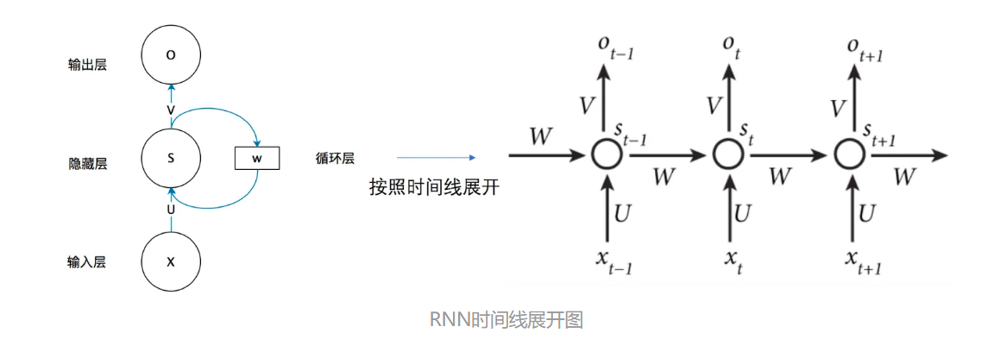
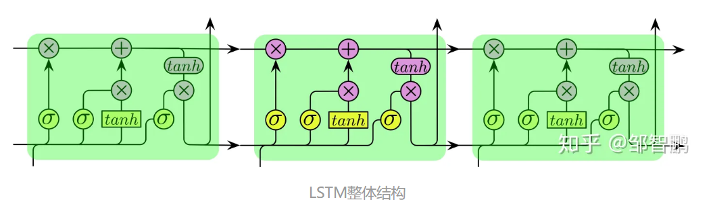
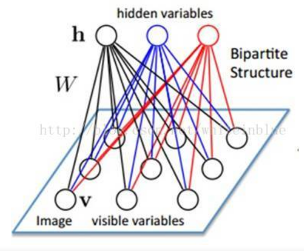
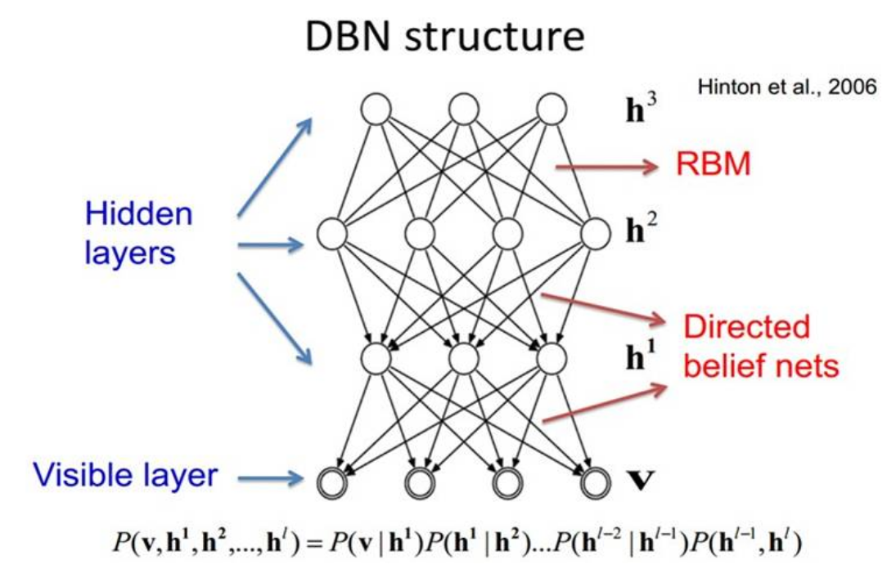
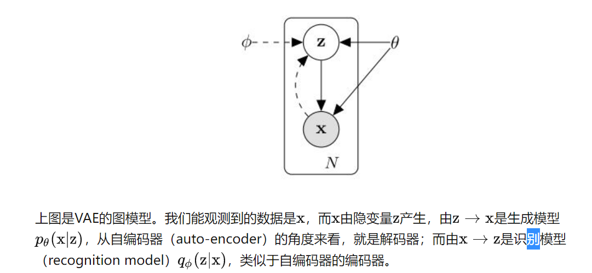

<!--
 * @Author: Suez_kip 287140262@qq.com
 * @Date: 2022-10-18 19:43:22
 * @LastEditTime: 2022-10-24 17:34:10
 * @LastEditors: Suez_kip
 * @Description: 
-->
# AI 代码漏洞检测

代码分析技术是漏洞检测的基础，可以分为静态、动态和混合方法。

## 静态技术

基于规则模板的分析、代码相似性检测和符号执行，主要依赖于对源代码的分析，但往往存在较高的误报率。

## AI

### 基本介绍

使用模式识别和机器学习（ML）的数据驱动漏洞发现，
具有显著提高泛化水平的潜力。
现有的基于ML的方法主要操作源代码，有高可读性。
研究人员应用了基于源代码的功能（潜在脆弱文件或代码片段的指标）：

- 导入（例如头文件）
- 函数调用
- 软件复杂性度量
- 代码更改

从版本控制系统获得的特性和信息：

- 代码提交
- 开发人员活动  
  
**任务目标：**：缩小语义鸿沟（语义鸿沟是指从业者可以理解的漏洞抽象语义与ML算法可以学习的获得语义之间缺乏一致性）  
  
### 传统ML

专家定义特征取决于人类经验、专业知识水平和领域知识的深度，特征工程过程可能很耗时，并且可能容易出错。如早期根据最佳编程实践提取规则模板&抽象语法树（AST）和控制流图（CFG）；系统从特征集中学习到的内容也可能受到各种因素的影响（例如，模型的表达能力、数据过拟合、数据中的噪声等）  

**解决方案：**  
1)基于软件度量的方法;使用度量的漏洞检测模型建立在这样一个假设上:复杂的代码对于从业者来说很难理解，因此很难维护和测试。作为漏洞检测指标的代码流失指标意味着频繁修改的代码往往是错误的，因此更有可能是有缺陷的和可能是脆弱的；  
显然存在较大的假阳性概率，因此后续研究者会从源代码上下文中提取代码模式，使用词袋技术（bag-of-words based on N-gram），来仅仅统计术语、关联令牌等代码特征共出现的计数，但不能保留代码的长期上下文依赖性；  
相较于上述扁平化代码分析，现在会使用高纬度特征集，这些特征集是从静态分析生成的不同形式的程序表示中提取出来的，包括ast、cfg、数据流图(dgs)、程序依赖图(PDGs)等。将AST、CFG和PDG组合成一种称为代码属性图(CPG)的联合表征，而从动态分析中获得的程序执行轨迹也被用作特征；  
2)基于脆弱代码模式与3)基于异常：  
脆弱的代码模式是偏离正确和正常的代码模式的异常模式，异常状态包括：***异常API使用模式[6]、导入和函数调用[73]以及API符号缺失检查***
导致许多假阳性或只适用于特定任务的应用程序

### 新兴ML

抽象和高度非线性模式的学习，能够捕获复杂数据的内在结构。自动提取特征，并且具有多个抽象级别，并且可能具有更高的泛化级别以及发现未考虑过的潜在特征；该类方案目标是使基于ML的检测系统最终能够像人类一样学习和理解易受攻击的代码语义，用以进一步减少语义差距。  
如RNN，将长短期记忆(LSTM)网络与密集层结合起来，用于学习函数级表示作为高级特征，实现注意层以学习特征重要性，并添加外部内存“插槽”以捕获远程代码依赖；  

#### 常见架构类型

*FCN*  
    FCN也被称为多层感知器（MLP），与随机森林、支持向量机(SVM)和C4.5等传统的ML算法相比，FCN能够拟合高度非线性和抽象的模式，通用逼近定理[23]所支持的，一个具有单一隐层和有限数量神经元的FCN可以近似任何连续函数。FCN的另一个优点是它是“输入结构不可知的”，这意味着网络可以采用多种形式的输入数据；  

*CNN*  
    在文本分类任务中，应用于上下文窗口(即包含少量单词嵌入)的CNN过滤器可以将上下文窗口中的单词投影到上下文特征空间中的局部上下文特征向量上，其中语义相似的单词向量非常接近。  

*RNN*  
      
      
    双向形式的rnn能够捕获序列的长期依赖性。许多研究利用双向LSTM (Bi-LSTM)和门通循环单元(GRU)结构来学习代码上下文依赖关系，这对于理解许多类型漏洞(例如缓冲区溢出漏洞)的语义至关重要。

*Other*  
    一些网络结构不适合上述类型，如深度信念网络(DBN)和变分自编码器(VAEs)；  
-DBN：  
    假设有一个二部图，每一层的节点之间没有链接，一层是可视层，即输入数据层（v)，一层是隐藏层(h)，如果假设所有的节点都是随机二值变量节点（只能取0或者1值），同时假设全概率分布p(v,h)满足Boltzmann 分布，我们称这个模型是Restricted BoltzmannMachine (RBM)。在已知v的情况下，所有的隐藏节点之间是条件独立的，同理所有的可视节点都是条件独立的，所有的v和h满足Boltzmann 分布；我们把隐藏层的层数增加，我们可以得到Deep Boltzmann Machine(DBM)；  
      
      

-VAEs：
      

-记忆网络：  
    该网络配备了外部内存“插槽”，用于存储之前引入的信息，以供未来访问。与LSTM结构相比，该网络能够捕获更远距离的序列相关性;因此，它增强了捕获范围更广的代码序列的能力，这些代码序列是识别依赖于上下文的缓冲区溢出漏洞的关键；  

#### 研究现状

1)基于图的特征表示:大量研究应用dnn从不同类型的基于图的程序表示中学习特征表示，包括AST、DFG、CFG、PDG和它们的组合。  
2)基于序列的特征表示:这类研究利用dnn从序列代码实体中提取特征表示，如执行跟踪、函数调用序列和变量流/序列。  
3)基于文本的特征表示:对于这类作品，特征表示直接从代码的表面文本中学习。  
4)混合特征表示:这一类包括最近结合上述三种类型的特征表示的研究。  
***Target***  
Ⅰ如何处理软件代码以生成特征表示->促进DNN对代码语义的理解，并将模式捕获为潜在脆弱代码片段的指示器；  
ⅡDNN模型用作具有内置表示学习能力的分类器;  

##### 基于图的特征表示

包括AST、CFG、PDG和数据依赖图（DDG）作为DNN的输入；  
***Paper93***：  
一个针对语句级检测的细粒度解决方案，针对PHP的web应用程序的SQL注入（SQLI）和跨站点脚本（XSS）漏洞。他们提出了一组静态代码属性，用于描述CFG（生成输入）和DDG（定位执行输入净化）中的杀毒代码模式；输入以20-D特征向量描述消毒模式，以C4.5、朴素贝叶斯（NB（追求最高概率））FCN作为分类器进行训练和分类，其中FCN在数据集上优于其他两种传统的ML分类器。  
***Paper110***：  
利用AST学习神经表示来检测Java源代码。AST包含了3种类型的节点 ***（1）函数调用和类实例创建的节点；（2）声明节点；（3）控制流节点。***  
之后，将节点转换为token seq，特定于项目的标记被通用名称替换，例如方法声明/调用。应用距离相似度计算算法从数据中去除噪声。之后使用k最近邻算法计算距离。如果某个实例的标签与其相邻实例的标签相反，则该实例将作为杂讯被删除。最后，通过使用一对一映射表将剩余的令牌序列标记化，以将每个令牌映射为一个整数，从而将序列用作DBN的输入。  
作者将样本馈送到经过训练的DBN，以自动生成高级特征表示，然后将其用于训练常规ML算法，如ADTree、NB和逻辑回归（LR）；作者从PROMISE3缺陷库中选择了Java项目，并将他们提出的方法与两个不同的特征集进行了比较：1）软件度量和2）AST。DBN生成的基于AST的特征在所有选定的项目中都取得了最佳性能。  
绩效评估显示，在22个跨项目场景中的17个场景中，基于DBN的方法在F1得分方面优于TCA+。  
***Paper60***：  
基于AST的方法应用Bi-LSTM网络学习跨项目漏洞发现的特征表示。他使用自动生成的软件复杂度替代实际标签，从源代码函数的AST中提取了原始特征，使用了***CodeSensor***（能够在没有AST提取工作构建环境的情况下获得AST），使用深度优先遍历（DFT）将AST转换为序列。  
将AST序列模糊化（标记与项目无关）并整数化，并映射到64维嵌入向量以便剩下的，该网络由两个Bi-LSTM层组成，用于从嵌入的AST序列学习上下文信息和两个全连接层；**开源项目FFmpeg和LibTIFF作为训练集，LibPNG作为实验测试集**  
考虑到表示没有提供标签信息，使用代码复杂度度量来代替实际标签or通过从历史软件项目的漏洞数据中学习可转换表示；  
***Paper61***  
相较于Paper60他们将Word2vec[67]与连续词袋（CBOW）模型结合起来，将序列的每个元素转换为100维的嵌入，以恢复代码语义信息；他们提出的网络仅包括一个用于学习AST序列上下文信息的Bi-LSTM层，然后是一个全局最大池层和两个完全连接的层。全局最大池层的功能类似于CNN结构中的最大池层，**资源为CVE，国家脆弱性数据库NVD**  
***Paper24***  
基于序列对序列（seq2seq）LSTM网络对Java源代码检测，AST->seq构建查找表，将每个token映射到一个固定长度的向量用于（seq2seq）LSTM网络,网络能够学习令牌序列的关系。  
为了生成顺序结构的语法特征，作者将序列嵌入馈送到网络，并将均值池应用到网络的输出，状态聚合同一序列中的令牌输出功能向量，将功能级向量组合成文件向量。  
word vec->pooling->function vec->combine->file vec  
作者为提高泛化性总结了所有令牌状态（即语义空间），用于执行跨项目检测。使用k-means对训练集中的所有状态向量进行聚类，获得令牌的状态。算了文件中所有状态向量与每个簇的最近质心之间的距离，以生成该文件的特征向量。
***Paper55***  
使用基于语法的脆弱性候选（SyVC），作者需要将其转换为基于语义的脆弱性候选人（SeVC），以容纳与SyVC语义相关的语句并转化为CFG-程序切片技术->DFG->PDG  
SyVC与向量的描述语句编码->word2vec固定长度；**数据来源NVD、SARD**
对CNN、DBN、LSTM、GRU和Bi-GRU进行检测，Bi-GRU上表现最好，DBN上表现最差；
先进的漏洞检测系统进行了比较，包括**Flawfinder、RATS、Checkmarx、VUDDY和VulDeePecker**

***总结***  
AST可以成为不同类型的神经模型学习与潜在脆弱模式相关的特征表示的有用来源；  
AST与其他形式的基于图形的程序表示（如CFG、PDG或DDG）进行比较、  
哪种程序表示可以使神经模型学习更有效的代码语义
研究并没有使用原始树形图进行处理，而是在将它们送入深层网络之前将其“展平”  

##### 序列特征表示  

基于序列的特征表示:这类研究利用dnn从序列代码实体中提取特征表示，如执行跟踪、函数调用序列和变量流/序列：  
***Paper35***
动静态提取轻量级特征，假设分析调用序列/跟踪可以揭示C库函数的使用模式（如存在内存损坏漏洞）以c库提取的静态特征（反汇编二进制文件）进行操作
动态：有限时间的执行与获取->动态调用序列包含大量函数调用的参数（低级计算值）要求进行子分类以减少类型量。N-gram语言模型和Word2vec将文本序列转换为有意义的向量表示，输入三个分类器：LR、FCN和随机森林，用于训练、验证和测试。  
***Paper116***  
比较不同类型DNN在从动态函数调用序列提取的特征集上的性能：
-CNN网络
-仅包含一个LSTM层的LSTM网络
-分别具有一个卷积层和一个LSTM-层的CNN-LSTM网络
-具有两个隐藏层的FCN
基于允许程序在有限的时间段内执行来获得C标准库函数调用序列，提取函数的参数子类型来减少参数类型的多样性，使用**Keras**提供的标记化工具，将函数调用序列转换为数字，为了将输入序列馈送到网络，添加了一个嵌入层作为三个网络的第一层；  
LSTM网络的误报率最低（19%），CNN-LSTM网络在F-Score方面优于其他网络，为83.3%。
***Paper56***
针对缓冲区错误和资源管理错误漏洞；语义上相互关联，形成一系列描述变量流和数据依赖性的语句

## 动态分析

包括模糊测试和污点分析，通常存在代码覆盖率低的问题。

## 混合方法

结合了静态和动态分析技术，旨在克服上述缺点。

## 附录  

***AST***：abstract syntax tree  
***CFG***：control flow graph  
***CDG***：Control Dependence Graphs  
***DDG***：Data Dependence Graphs  
***PDG***：Program Dependence graphs  
***CPG***：Code Property Graphs
***LR***：逻辑回归模型(Logistic regression)，又称对数几率模型
***随机森林***：属于 集成学习 中的 Bagging（Bootstrap AGgregation 的简称）方法。随机森林是由很多决策树构成的，不同决策树之间没有关联。输入样本进入，就让森林中的每一棵决策树分别进行判断和分类，每个决策树会得到一个自己的分类结果，决策树的分类结果中哪一个分类最多，那么随机森林就会把这个结果当做最终的结果。  

