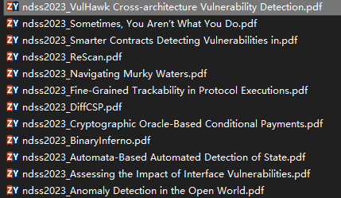

<!--
 * @Author: Suez_kip 287140262@qq.com
 * @Date: 2022-11-24 18:29:38
 * @LastEditTime: 2023-03-06 17:00:05
 * @LastEditors: Suez_kip
 * @Description: 工作记录
-->
# 工作记录

***持续更新***

## 3.6 Monday

- Rescan非常有意义的黑盒web漏洞挖掘的框架，Rescan；解决了目前项目中遇到的很多技术难题，并且很有后续开发的可能，主要包括了URL聚类算法、web页面事件发现策略、基于ISD的注入与接收的链接发现方案；文章笔记记录在[Rescan.md](笔记/Rescan.md)中；
- 关于调研ZTOSEC的检测手段，效果非常依赖于页面相似度的设置；对于网页相似性的检测，每个网页的相似性的阈值设置差距很大，完全没有办法进行检测；其中pikachu.com的阈值可能只有70-80，但是之前部署的商城页面的阈值要达到90，还会存在个例问题，这一点非常困难；

## 3.1 Wednesday

- 开始进行ReScan: A Middleware Framework for Realistic and Robust Black-box Web Application Scanning论文阅读，提出了一个全新的黑盒web检测框架，有源码，需要尽快调研；

## 2.20 Monday

- 完成对VulHawk: Cross-architecture Vulnerability Detection with Entropy-based Binary Code Search论文阅读，记录在[codeRepresentation.md](笔记/codeRepresentation.md)中；

## 2.15 Wednsday

- 开始对越权类逻辑漏洞的产生和挖掘进行研究，记录在文件夹[BrokenAccessControl](./BrokenAccessControl/)中；
- 记录一篇有意义的越权漏洞blog，并开始尝试其中提到的burpsuite的越权漏洞挖掘插件，记录在[blog.md](BrokenAccessControl/literature/blog.md)中；
- 对AurhMatrix插件完成调研，记录在[AuthMatrix.md](./BrokenAccessControl/literature/AuthMatrix.md)中，后续调查将在本地进行不再上传；

## 2.14 Tuesday Fucking Valentine's Day

- 快完成对VulHawk: Cross-architecture Vulnerability Detection with Entropy-based Binary Code Search论文阅读，还差一个渐进搜索部分，记录在[codeRep vresentation.md](笔记/codeRepresentation.md)中；

## 2.13 Monday

- 对2023NDSS文章中Summer Cycle和Full Cycle，选定一定预读论文：
  
- 自动更新代码完成，以后更新直接执行update.bat
- 完成对RoBERTa,BERT,ELMO,GPT的相关知识学习,开始关注chatgpt，记录在[BERT.md](./笔记/BERT.md)；
- 开始对VulHawk: Cross-architecture Vulnerability Detection with Entropy-based Binary Code Search论文阅读；

## 重新开始记录日常log，重新开始进行ai漏挖论文阅读

## 12.25 Sunday

- 开始对Blackhat会议进行调研，结果已发送至微信群，具体presentation topic还未确定；
- 完成Quo Vadis: Hybrid Machine Learning Meta-Model based on Contextual and Behavioral Malware Representations的论文阅读，使用动静态结合的方案，获取的运用文件路径、API调用以及Ember数据集的信息。进行三合一综合AI模型漏洞挖掘，作为会议论文叙述，很不详细，仅作参考；
- 完成对Ember数据集的学习，记录在[dataset.md](./笔记/dataSets.md)中，是一个针对windows的PE漏洞文件的数据集，有一定的综合工作量；

## 12.24 Saturday

- 完成The Fusion of Secure Function Evaluation and Logic Synthesis的论文阅读；
- 完成AutoVAS: An automated vulnerability analysis system with a deep learning approach 论文阅读，记录在[VulDeepecker.md](./笔记/VulDeepecker.md)中,从切片、嵌入、处理、模型选择上进行了全测试，可以看作一篇综述文章；
- 开始Neural software vulnerability analysis using rich intermediate graph representations of programs论文阅读，记录在[VulDeepecker.md](./笔记/VulDeepecker.md)中；

## 12.22 Tursday

- 进行[《从VulDeePecker出发对AI漏洞挖掘技术讨论》](../笔记/../PaperController/笔记/从VulDeePecker出发对AI漏洞挖掘技术讨论.docx)的课程论文的撰写，，未进行格式化；
- 开始进行漏洞挖掘领域信息论使用的相关信息进行调研，未形成一个较好的分析结果与内容，需进一步研究，获取的结果放置在了[信息论相关内容](../PaperController/信息论相关内容)中；

## 12.21 Wednesday

- 完成对IEEE S&P会议的2020-2022年的论文进行了调研，获取的结果放置在了[未分类文件夹](../PaperController/其他未分类)中；
- 完成Detecting Logical Bugs of DBMS with Coverage-based Guidance的论文阅读；

## 12.20 Tuesday

- 完成ACM和usenix的论文调研，获取的结果放置在了[未分类文件夹](../PaperController/其他未分类)中；
- 开始对FUGIO进行论文阅读；
- 完成Devils in the Guidance: Predicting Logic Vulnerabilities in Payment Syndication Services through Automated ocumentation Analysis的阅读；
- 完成Mining Node.js Vulnerabilities via Object Dependence Graph and Query的论文阅读；

## 12.19 Monday

- 完成了code2vec的学习，是由AST提取路径在前的注意力加权的预测模型，对给定一些单词候选标签进行预测，记录在[word2vec.md](./笔记/word2vec.md)中；
- 完成了fasttext等文字嵌入方案的学习，记录在[word2vec.md](./笔记/word2vec.md)中；
- 开始进行usenix和ACM的论文调研；
- 完成NDSS会议的论文调研，获取的结果放置在了[未分类文件夹](../PaperController/其他未分类)中；

## 12.18 Sunday

- 完成Deep neural-based vulnerability discovery demystified: data, model and performance论文阅读，记录在[benchmark.md](./笔记/benchmark.md)中；
- 完成DeepWukong: Statically Detecting Software Vulnerabilities Using Deep Graph Neural Network论文阅读，记录在[VulDeepecker.md](./笔记/VulDeepecker.md)中，使用CFG和DFG生成上下文的切片，然后使用top-k的池化层实现了卷积层、池化层、输出、MLP的deep learning GNN；

## 12.14-16

- HOSPITAL...

## 12.13 Tuesday

- 完成SySeVR: A Framework for Using Deep Learning to Detect Software Vulnerabilities论文阅读，记录在[VulDeepecker.md](./笔记/VulDeepecker.md)中，针对C、C++的，基于SyVC的slice切片的，使用BGRU的改进vuldeepecker；
- 完成Deep Learning Based Vulnerability Detection: Are We There Yet?论文阅读，一篇很有意思的综述类文章，更加具体且有发展研究价值，适合都很多文章后再看；
- 开始Deep neural-based vulnerability discovery demystified: data, model and performance论文阅读，记录在[benchmark.md](./笔记/benchmark.md)中；
- 开始DeepWukong: Statically Detecting Software Vulnerabilities Using Deep Graph Neural Network论文阅读，记录在[VulDeepecker.md](./笔记/VulDeepecker.md)中；

## 12.11 Sunday

- 完成VulDeeLocator: A Deep Learning-Based Fine-Grained Vulnerability Detector论文阅读，记录在[VulDeepecker.md](./笔记/VulDeepecker.md)中，使用中间代码、代码插入实现切片，然后实现了一个BRNN-vdl，通过位置信息的乘法层和池化层实现了对BRNN的粒度细化和注意力机制；

## 12.8 Thursday

- 完成VulDetector: Detecting Vulnerabilities Using Weighted Feature Graph Comparison论文阅读，记录在[VulDeepecker.md](./笔记/VulDeepecker.md)中，在$\mu VulDetector$的基础上，将图进一步发展为代码行和CFG获取的WFG进行genius的图匹配；

## 12.7 Wednesday

- 完成A novel deep learning-based feature selection model for improving the static analysis of vulnerability detection论文阅读，记录在[Traditional.md](./笔记/Traditional.md)中，特征优化的遗传算法（GA）和用于分类的DNN相结合；
- 开始VulDetector: Detecting Vulnerabilities Using Weighted Feature Graph Comparison论文阅读，记录在[VulDeepecker.md](./笔记/VulDeepecker.md)中；

## 12.6 Tuesday

- 调查了NDSS2022-2019年的相关漏洞挖掘文章获取了一批相关文章列入[TODO.md](./TODO.md)中等待学习；

## 12.3 Saturday

- 完成A deep learning based static taint analysis approach for IoT software vulnerability location论文阅读，记录在[Traditional.md](./笔记/Traditional.md)中，基于污点传播分析直接提取到目标路径，使用word2vec+CNN-BLSTM进行训练，实验数据的比较方式很魔幻；
- 完成Combining Graph-Based Learning With Automated Data Collection for Code Vulnerability Detection论文阅读，记录在[FUNDED.md](./笔记/FUNDED.md)中，提出基于模型准确率的专家委员会机制的漏洞自动收集系统，以及复合AST的GGNN漏挖模型；
- 了解基于MPP、CP的模型准确率相关知识，记录在[FUNDED.md](./笔记/FUNDED.md)中；
- 了解基于GA相关知识，记录在[Note.md](./笔记/Note.md)中；
- 开始A novel deep learning-based feature selection model for improving the static analysis of vulnerability detection论文阅读，记录在[Traditional.md](./笔记/Traditional.md)中，特征优化的遗传算法（GA）和用于分类的DNN相结合；

## 12.1 Thusday

- 开始A deep learning based static taint analysis approach for IoT software vulnerability location论文阅读，记录在[Traditional.md](./笔记/Traditional.md)中；

## 11.30 Wednesday

- 开始进行框架的整理，于[Conclusion.md](./笔记/Conclusion.md)中，整理了到目前为止的部分idea信息，**谨记持续更新**；
- 完成Machine-learning Supported Vulnerability Detection in Source Code 论文阅读，记录在[benchmark.md](./笔记/benchmark.md)中，对现在的AI漏挖进行了部分总结，提出了联合检测；
- 完成Devign-Effective Vulnerability Identification by Learning Comprehensive Program Semantics via Graph Neural Networks论文阅读，结合AST、CFG、DFG、NCS+GGRN+CNN+Softmax记录在[Graph.md](./笔记/Graph.md)中；
- 完成Software Vulnerability Discovery via Learning Multi-Domain Knowledge Bases 论文阅读，记录在[SampleSizeIssue.md](./笔记/SampleSizeIssue.md)中，基于异构数据源与对应模型的组合迁移学习；

## 11.29 Tuesday

- 完成$\mu$VulDeePecker: A Deep Learning-Based System for Multiclass Vulnerability Detection 论文阅读，基于VulDeepecker的三BiLSTM模型，分别提取上下文PDG（data+control）和基于调用的注意力，分别分析全局、本地以及综合特征用于分类，记录在[VulDeepecker.md](./笔记/VulDeepecker.md)中；
- 开始Machine-learning Supported Vulnerability Detection in Source Code 论文阅读，记录在[VulDeepecker.md](./笔记/VulDeepecker.md)中；

## 11.28 Monday

- 了解N-gram、完善skip-gram、CBOW相关知识，记录在[word2vec.md](./笔记/word2vec.md)中；
- 完成Neural Machine Translation Inspired Binary Code Similarity Comparison beyond Function Pairs论文阅读，参考CoP、NMT，基于word2vec的孪生LSTM的块相似+LCS统计评分进行跨架构的二进制代码相似性分析，记录在[INNEREYE.md](./笔记/INNEREYE.md)Line31中；
- 完成Deep Learning-Based Vulnerable Function Detection: A Benchmark论文阅读，记录在[benchmark.md](./笔记/benchmark.md)Line31中；

## 11.26 Saturday

- Cross-Project Transfer Representation Learning for Vulnerable Function Discovery论文阅读完成，在[Graph.md](./笔记/Graph.md)中，相关FIRR、island grammar；解析器CodeSensor；
- Automated Vulnerability Detection in Source Code Using Minimum Intermediate Representation Learning论文阅读完成，在[codeRepresentation.md](./笔记/codeRepresentation.md)中；使用DFS图嵌入的AST+CNN+RF的学习；
- 开始Neural Machine Translation Inspired Binary Code Similarity Comparison beyond Function Pairs论文阅读，记录在[INNEREYE.md](./笔记/INNEREYE.md)Line31中；
- 了解SMT相关知识，可作为约束求解器，用于控制流约束求解，记录在[INNEREYE.md](./笔记/INNEREYE.md)中；
- 了解ASM2vec相关知识，是基于汇编代码库的函数级代码搜索算法，记录在[INNEREYE.md](./笔记/INNEREYE.md)中；

## 11.24 Thusday

- End-to-End Prediction of Buffer Overruns from Raw Source Code via Neural Memory Networks论文阅读完成，在[Note.md](./笔记/Note.md)中；
- Gemini论文阅读完成，记录在[Gemini.md](./笔记/Gemini.md)中；
- 完成孪生神经网络相关学习，记录在[Gemini.md](./笔记/Gemini.md)中；
- 完成Struc2vec、DTW相关学习，记录在[Gemini.md](./笔记/Gemini.md)中；
- 开始Cross-Project Transfer Representation Learning for Vulnerable Function Discovery论文阅读，记录在[Graph.md](./笔记/Graph.md)Line31中；
