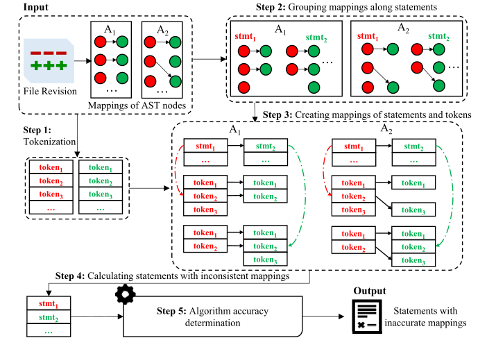
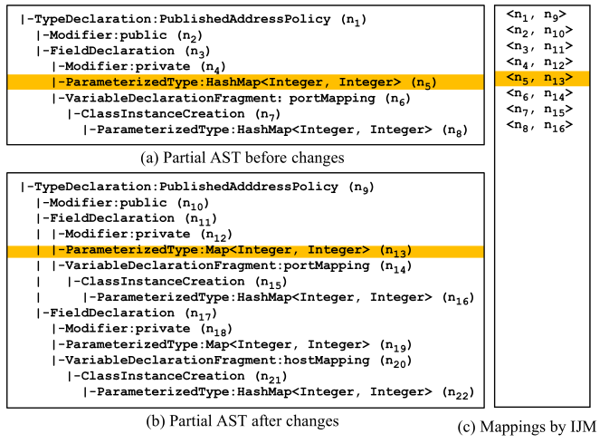
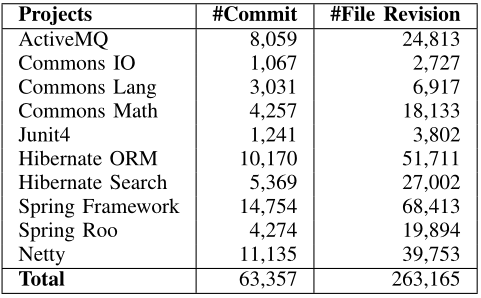
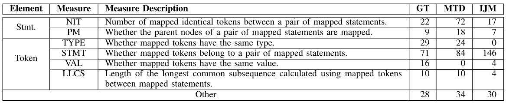
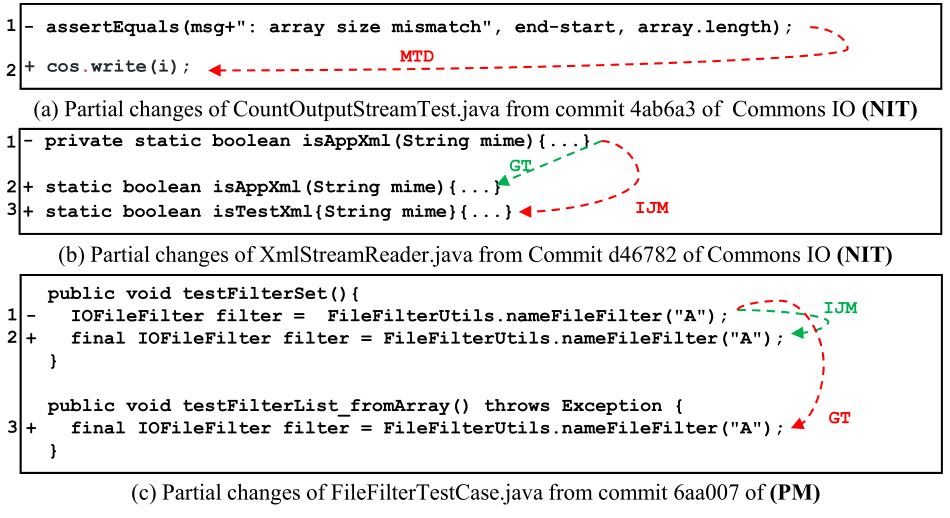
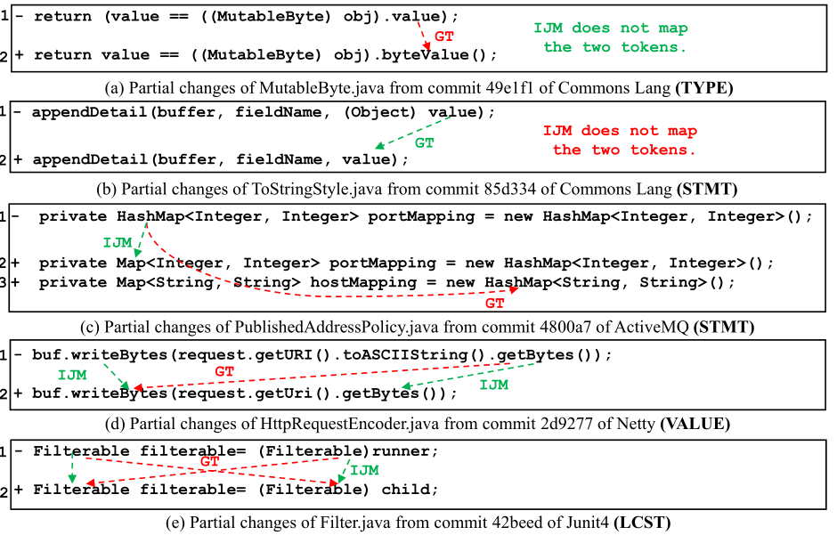
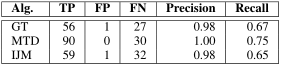
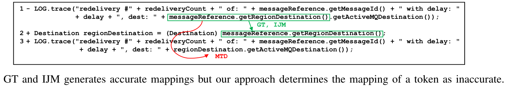
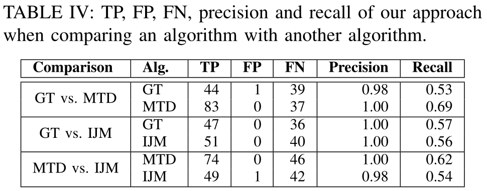
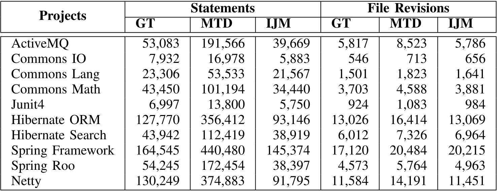

<!--
 * @Author: Suez_kip 287140262@qq.com
 * @Date: 2023-10-26 16:35:14
 * @LastEditTime: 2023-11-06 20:24:43
 * @LastEditors: Suez_kip
 * @Description: 
-->
# AST Diff

首先介绍三种常见的AST Diff方案

## GUMTree(GT)

GumTree (GT)是由Falleri等人提出的。给定两个ast, GT分两个阶段在ast之间匹配节点:在第一阶段，GT应用贪婪自顶向下算法搜索和映射相同的子树。在第二阶段，如果两个ast共享大量的映射后代，则GT应用自底向上算法在它们之间映射一对节点。然后，GT尝试映射以前未映射的这些节点的后代。

计算AST编辑脚本的问题仍然存在，主要有两个挑战:处理移动操作，以及扩展到具有数千个节点的细粒度AST 1，找到一个能够很好地反映开发人员意图的序列。设计了一种基于启发式的算法，该算法包含关于什么是好的编辑脚本的实用规则，同样重要的是，它是高效的，并且可以扩展到大型ast。

----

## MTDiff(MTD)

MTDiff (MTD)是由Dotzler等人提出的。MTD基于ChangeDistiller算法[11]。首先，MTD应用相同的子树优化，通过从ast中删除未更改的子树来减少映射问题。然后，MTD使用ChangeDistiller算法映射节点。最后应用另外四个优化来查找节点的其他映射。

----

## IJM

IJM是由Frick等人提出的。IJM是一种专门用于Java的AST映射算法，针对移动和更新更有意义。与GT相比，IJM工作在简化的AST上，其中许多名称节点被修剪，每个被修剪的节点的值被合并到它的父节点。然后，IJM沿着每个声明将AST分成几个部分。最后，利用自适应的GT算法从两个AST之间的对应部分映射AST节点。该调整为GT添加了名称感知功能，它在映射两个节点时考虑值的相似性。

修改包括部分匹配、名称感知匹配、合并名称节点：

- 部分匹配：减少不同方法间的节点数量；
- 名称感知匹配：考虑名称和值；
- 合并名称节点：将节点类型与其各自的名称节点合并；

----

## AST_DIFF

[论文链接](../%E4%BB%A3%E7%A0%81%E5%AE%A1%E8%AE%A1/AST/AST_DIFF.pdf)  
[工具网址](www.cs.mcgill.ca/~swevo/diffcat)

挖掘软件存档中捕获的变更数据，用于检测软件系统修订历史中不必要的代码差异。在版本控制系统中存储的低级增量和用于表示软件开发活动的抽象之间建立概念上的桥梁，借此分辨高级和低级修改。本文追求：

- 描述变更历史中非本质差异的普遍性；
- 衡量它们对与代码提交相关的代码流失和方法更新的影响

用于检测从变更历史中挖掘的变更集中的非本质差异的工具，确定了修改的程序语句被一个或多个预定义的细粒度差异类型更新的情况，通过解析和操作语句更新中相关子表达式的类型来验证候选语句更新的非必要性。

----

## A Differential Testing Approach for Evaluating Abstract Syntax Tree Mapping Algorithms

AST节点的粒度范围从一条语句到单个文字。分析所有粒度级别的AST节点的映射太复杂了。此外，通过不同的算法从使用的ast中找到相应的节点是一个很大的挑战。因为不同的算法可能会使用具有不同节点集(包括叶节点)的ast来表示同一个文件。不同的算法通常将语句编码为AST节点。将每个语句(包括语句本身及其令牌)视为一个分析单元。

  

  

如图，在基于A1和A2两种算法，为文件修改生成映射。然后进行以下五个步骤，来为每种算法计算具有不准确映射的语句：

### STEP1 Tokenization

在修改之前和之后对文件进行token化。使用源文件的解析AST来标记文件。例如，包含标点和空格的字符串字面值被视为单个标记。我们分别为一个文件在修订之前和之后检索两个令牌列表。令牌列表不受每个算法使用的AST的影响。

Java文件：使用Eclipse JDT解析器生成标准的JDT AST，然后从每个AST节点的值中提取令牌。其中忽略表示注释和javadoc的AST节点。因为注释和javadoc通常不被视为代码。

### STEP2 按语句分组映射

在这一步中，我们根据A1和A2的语句分别对AST节点的映射进行分组。在AST中，一个语句(例如，一个方法声明)可以有后代语句。对于算法正在分析的源ast和目标ast中的每个语句：

1. 对属于该语句但不属于它的后代语句。例如，在图1(b)中，我们的框架将类型声明**PublishedAddressPolicy**的n1、n2和n3分组。
2. 找到算法对分组节点生成的映射。这些映射针对语句进行分组

### STEP3 创建语句和令牌的映射

在这一步中，我们分别为A1和A2计算语句和令牌的映射。在每个语句的分组映射中，我们可以直接找到语句的映射。例如，在图1(b)中，n1表示类型声明**PublishedAddressPolicy**，将n1的映射视为该声明的映射。

1. 对于令牌，我们引用AST节点，其对应的程序元素包含令牌作为令牌的相关节点。在令牌的相关节点中，我们将级别最低的节点称为令牌的直接相关节点。将令牌引用为节点的直接相关令牌。

```text
我们以图1(a)中第1行的第一个HashMap为例。在图1(b)所示的GT使用的AST中，n1、n4、n6、n7和n8是令牌的相关节点。与令牌直接相关的节点是n8。在图2(a)所示的IJM使用的AST中，n1、n3和n5是令牌的相关节点。与令牌直接相关的节点是n5。
```

2. AST节点可以有几个直接相关的令牌

```text
例如，图2(a)中的节点n5有三个直接相关的令牌，包括一个HashMap和两个Integer令牌。这些标记组成了n5的值。另一个例子是图2中的n1，它有两个直接相关的令牌，包括图1(a)中的class和PublishedAddressPolicy令牌。PublishedAddressPolicy令牌是节点的值，而类令牌不属于它的值。
```

3. 我们观察到令牌的映射是由其直接相关节点的映射决定的。

```text
我们还以图1(a)中第1行的第一个HashMap为例。在图中，GT将n8映射到n59 -表明该令牌映射到图1(a)中第3行的HashMap。在图中，IJM将n5映射到n13，这表明该令牌只能映射到n13的直接相关令牌。
```

4. 对于源ast和目标ast的每个节点，我们计算所有直接相关的令牌，并根据其字符位置列出令牌。然后，对于每一对映射节点，我们从节点的直接相关令牌列表中映射令牌。如果两个列表只有一个令牌，则直接映射两个令牌。否则，我们将分别映射构成节点值的令牌和其他令牌，因为构成节点值的令牌只能映射到构成另一个节点值的令牌。对于组成两个节点值的标记，我们首先在两个列表之间顺序映射相同的标记，然后映射被已经映射的标记对包围的标记(包括第一个和最后一个标记)。程序元素映射算法常用的一种启发式方法是用已经映射的对包围程序元素进行映射。之后，我们的框架应用相同的方法来映射不属于这两个节点的值的令牌。

```text
例如，在图2中，n5和n13是映射的。与n5直接相关的令牌包括HashMap、Integer和Integer。与n13直接相关的令牌包括Map、Integer和Integer。所有令牌都属于这两个节点的值。首先按顺序映射两个列表之间的两个Integer令牌。HashMap和Map被已经映射的令牌包围，它们被进一步映射。
```

### STEP4 计算具有不一致映射的语句

比较A1和A2。对于修改前后文件中的每条语句，

1. 计算两种算法对语句的映射是否不一致
2. 对于语句中的每个令牌，我们计算两种算法是否不一致地映射令牌
3. 我们输出具有不一致映射的语句，对于每个语句，我们通过比较两种算法对语句及其令牌的不一致映射进行分组

### STEP5 算法精度判定

比较每对不同算法中映射语句和令牌的相似性。通过执行比较，我们确定语句或标记映射中每个算法的准确性。

- 举例：

```text
让我们将两个程序元素e和$\hat{e}$之间的相似性表示为$Sim(e, \hat{e})$。元素可以是语句或令牌。假设两种算法(A0和A1)将程序元素e0分别映射到两个不同的元素e1和e2。我们注意到这两种算法也不一致地映射e1和e2。假设A0将元素e3映射到e2, A1将元素e4映射到e1。换句话说，A0生成两个映射{{e0, e1}, {e3, e2}}。A1生成两个映射{{e0, e2}, {e4, e1}}。

假设Sim(e0, e1)大于Sim(e0, e2)，我们确定在映射e0时A0比A1更精确。

检查条件:Sim(e0, e1) > Sim(e4, e1)，即A0在映射e1时也比A1更精确。如果这个条件也满足，我们确定A1不准确地映射e0和e1。类似地，我们还可以确定A0生成的两个映射是否不准确。
```

给定一对算法和一个文件修订，我们计算具有不一致映射的语句。对于每个具有不一致映射的语句，我们执行上述比较对于由正在进行比较的两种算法生成的语句及其令牌的映射。因此，我们为每个算法计算带有不准确映射的语句。

对于每一种算法，我们分别将其与其他两种算法进行比较。最后，我们为正在比较的任何算法计算具有不准确映射的语句的联合集。

### STEP6 相似性比较

通过不同的算法自动比较映射语句和标记的相似性:

1. 我们对具有不一致映射的语句执行手动分析。
2. 我们还验证具有不一致映射的语句是否会暴露算法生成的不准确映射。

十个开源Java项目。

  

我们可以比较三对算法，即GT vs. MTD, GT vs. IJM, MTD vs. IJM。

```text
对于每一对算法，我们抽样了50个文件修订，其中两种算法不一致地映射了所研究项目中的程序元素。对于每个文件修订，我们分析修订前后涉及不一致映射的所有语句。我们分别分析了178条、191条和206条语句，比较了三对算法。我们总共分析了575条语句。对于每个语句，我们使用Frick等人的标准确定由每个比较算法生成的映射的准确性。我们总共做了1150个决定(575×2)。
```

计算Fleiss ' Kappa来估计两个人类专家的确定结果的一致性。Kappa值为0.81，一致性较好。

我们分析了所有具有不准确映射的语句，以设计相似性度量来区分语句和令牌的准确映射和不准确映射。我们根据每个相似度度量对算法的不准确映射对语句进行分类。

对于每个具有不准确映射的语句，设计了一个可以识别不准确映射的度量、一种新的相似度度量来区分准确和不准确的映射。

手工分析发现：

- 在比较GT和MTD的178条语句中，分别有71条和129条语句涉及到由GT和MTD生成的不准确映射。
- 在比较GT和IJM的191条语句中，分别有114条和91条语句涉及到由GT和IJM生成的不准确映射。
- 在比较MTD和IJM的206条语句中，分别有113条和117条语句涉及由MTD和IJM生成的不准确映射。
- 对于用于比较两种算法的不一致映射的每条语句，至少确定有一种算法生成不准确的映射。因此，具有不一致映射的语句可能会暴露算法生成的不准确映射。
- 存在两种算法一致产生语句或令牌的不准确映射的情况。

总共发现185条(71 + 114)、242条(129 + 113)、208条(91 + 117)语句对GT、MTD和IJM的映射不准确。根据我们的观察，我们设计了两个相似度度量来比较两个语句和四个相似度度量来比较两个标记。

将两个具有相同值的令牌定义为相同的令牌。使用六种相似度度量来比较不同算法生成的映射。下面详细阐述了六种相似性度量:

  

  

  

#### NIT

定义为一对映射语句之间映射的相同令牌的数量。如果两个语句映射的NIT为0，则确定映射不准确。否则，对于一对映射语句，检查其中一个语句到另一个语句的映射是否可以实现更大的NIT。

#### PM

描述一对映射语句的父节点是否也被映射。我们观察到，具有映射父节点的语句更有可能被映射。对于一对映射语句，我们检查将其中一条语句映射到具有映射父节点的另一条语句是否可以实现相同的NIT。例如，在图5(c)中，IJM将第1行和第2行的语句映射为已映射的父节点，而GT将第1行和第3行的语句映射为未映射的父节点。我们确定IJM在映射第1行语句时比GT更准确。

BLOCK是介于平衡大括号(即“{”和“}”)之间的一组语句。我们观察到，一个块应该与其父节点一起映射，例如，图5(c)中testFilterSet方法后面的“{”应该与方法声明一起映射。因此，具有未映射父节点的映射块被确定为不准确的。

#### TYPE

映射的令牌是否具有相同的类型。对于直接相关节点是名称节点的令牌，定义了四种类型:变量名、类型名、方法名和声明名。
对于其直接相关节点不是名称节点的令牌，我们将令牌的类型定义为其直接相关节点的标签。认为不同类型的令牌的映射是不准确的。
例如，在图6(a)中，GT将变量名值映射到方法名bytevalue，我们确定这样的映射是不准确的。

#### STMT

描述映射的令牌是否属于一对映射statement。来自映射语句的两个令牌更有可能被映射。我们观察到映射令牌从映射语句映射比(1)不映射令牌和(2)从未映射语句映射令牌要好。

```text
例如，在图6(b)中，两个value token都是变量名，它们属于一对映射语句。GT映射这两个令牌，而IJM不映射它们。我们确定GT在映射两个令牌方面比IJM更准确。
```

```text
我们发现GT和IJM都将图6(c)中第1行的语句映射到第2行的语句。GT在未映射语句中映射两个HashMap令牌，而IJM将HashMap从映射语句映射到Map。使用STMT度量，我们确定IJM在第1行映射HashMap时比GT更准确。
```

#### VAL

表征映射的记号是否具有相同的**字符串值**。一对映射语句中的两个相同的令牌更有可能被映射。我们认为映射这样的两个标记比在两个语句之间将一个标记映射到另一个具有不同值的标记要好。例如，在图6(d)中，GT将getBytes映射到writeBytes，而IJM映射两个getBytes令牌。使用此度量，我们确定IJM在映射getBytes令牌时比GT更准确。

#### LLCS length of the longest common subsequence

定义为使用映射语句之间的映射令牌计算的LCS (最长common子token序列)的长度。我们注意到在语句中记号的顺序很少改变。我们使用LLCS来量化在映射语句之间顺序映射的令牌数量。例如，在图6(e)中，GT改变了第1行语句中两个Filterable令牌的顺序。因此，语句之间最多顺序映射三个令牌，即Filterable、=和runner。映射令牌的LLCS计算为三个。IJM在两个语句之间依次映射五个令牌。映射令牌的LLCS计算为5。使用LLCS度量，我们确定IJM在映射Filterable令牌时比GT更准确。

### 具体方案步骤

1. 如果一个算法映射两个NIT为0的非块语句，我们确定该映射是不准确的。
2. 如果一个算法映射两个具有未映射父节点的块，则我们认为该映射不准确。
3. 如果一个算法映射两个不同类型的令牌，我们认为映射是不准确的。
4. 当这两种算法将一个语句映射到不同的语句时，使用较大的NIT映射语句被认为更准确。如果两对语句具有相同的NIT，则认为具有映射父节点的映射语句比具有未映射父节点的映射语句更准确。
5. 当两种算法一致地映射语句时，我们假设这两种算法准确地映射语句。从该语句中，我们检索所有由两种算法不一致映射的令牌。对于由两种算法不一致映射的令牌，我们首先使用STMT度量来比较由两种算法生成的令牌映射。如果两种算法都从映射语句映射标记，则认为映射相同的标记比映射具有不同值的标记更准确。如果两种算法从映射语句映射相同的令牌，则认为具有较大LLCS的映射令牌更准确。

也即分成特定结果、不同语句、相同语句的检测：

1. NIT=0 -> PM=0 -> TYPE=Different Token Type\
2. 不同语句比较NIT，NIT相同则比较PM
3. 同一语句，则先假设都准确；检测不一致映射的令牌，首先分析STMT，再次分析VAL，最后分析LLCS；

### 实验结果

#### RQ1 对于所研究的算法，我们的方法在检测具有不准确映射的语句方面有多有效?

将专家分成四组，每组三名专家，让专家确定语句的映射或语句的令牌是否不准确。对于所研究的每一种算法，都有三种算法在映射语句及其令牌时的准确性判定结果。对于每个语句以及由算法生成的语句及其令牌的映射，如果至少有两个专家确定存在不准确的映射，我们将映射标记为不准确。  
以人类专家分析的结果，随机选择20个语句。于每个选定的语句，至少有两种算法不一致地映射语句或其标记。总共选择了200个具有不一致映射的语句。所选语句涉及各种更改模式，包括添加、删除、移动和更新语句和令牌。我们将这200条语句随机分成四组，每组50条语句。从200条语句中确定具有GT、MTD和IJM不准确映射的语句。最后，将本文方法的确定结果与专家的确定结果进行了比较。

- Truth定义为具有不准确映射的语句，该语句由我们的方法和专家确定。
- FP定义为具有不准确映射的语句，该语句由算法方法确定，而不是由专家确定。
- FN定义为由专家确定而不是由算法确定的算法的具有不准确映射的语句。

  

误报举例：

  

#### RQ2 当将一个算法与多个算法进行比较时，我们的方法与另一个算法进行比较时，效果如何?

GT vs. MTD、GT vs. IJM和MTD vs. IJM。对于RQ1中分析的200条语句，我们使用我们的方法来比较每对算法为语句和令牌生成的映射。对于每一对算法，我们计算一组具有不准确映射的语句。

1. 将一个算法与另一个算法进行比较。
2. 然后，计算了我们的方法在检测两种算法的不准确映射语句时的精度和召回率。
3. 最后，将表中显示的结果与我们的方法的精度和召回率进行比较，该方法将一种算法与另一种算法进行比较。

  

#### RQ3 最先进的AST映射算法会生成许多不准确的映射吗?

  

### 有效性威胁

手动分析非常耗时，需要理解每个语句和每个令牌的映射。每个专家平均花费1.5小时来分析分配的50条语句。这200条语句随机取自10个不同的项目，它们来自不同的文件版本。  

方法有两个局限性：

1. 重构变更可能会影响我们方法的准确性，在重构更改时，从未映射语句映射令牌可能比从映射语句映射令牌更好。我们注意到，研究人员提出了几种重构检测工具，例如N. Tsantalis, M. Mansouri, L. Eshkevari, D. Mazinanian, and D. Dig. Accurate and efficient refactoring detection in commit history. In 2018 IEEE/ACM 40th International Conference on Software Engineering (ICSE), pages 483–494. IEEE, 2018.
2. 仍然存在相当数量的不准确映射，我们的方法无法检测到。将一个算法与更多算法进行比较，可能会发现生成的不准确映射更多通过算法。此外，研究人员提出了各种启发式方法来映射程序元素b，M. Kim and D. Notkin. Program element matching for multi-version program analyses. In Proceedings of the 2006 international workshop on Mining software repositories, pages 58–64, 2006.。可以从这些启发式中派生出其他相似性度量。
