<!--
 * @Author: Suez_kip 287140262@qq.com
 * @Date: 2023-09-04 10:06:16
 * @LastEditTime: 2023-09-16 17:26:07
 * @LastEditors: Suez_kip
 * @Description: 
-->
# Break Access Control

难点：

- 语义：非特殊输入，无法用数据消毒预防；
- 复杂性：与业务逻辑、语义深度耦合；
  - web应用程序不再适应DAC、RBAC或MAC等简单的访问控制模型，细粒度和程序逻辑深度耦合；
  - 未经训练的开发人员可能会忽略其实现中的一些潜在假设；
  - 厂商的不遵循；
  - Orange CERT等使用很容易被利用的短随机令牌；
- 部分控制策略甚至是动态的；
  - web应用程序中的访问控制策略是不断更新的，留下可利用的信息，如资源标识符、URL模式等。
  - 旧的被弃用的功能如果不引起注意，就会留下过时的api和孤立的页面，而新添加的功能在没有经过彻底测试的情况下可能容易受到访问控制绕过的攻击。
- 系统支持缺失
  - 工具支持应该更多地在预部署阶段作为主动的方式
  - web框架目前大多遵循MVC[30]、MVP[12]或MVVM[18]等软件架构模式，并没有对访问控制进行特殊的处理；
  - 访问控制测试作为中间步骤嵌入到其他功能测试中，导致阻碍其他测试，本身也容易遗漏；

# web架构

- MVC模式：
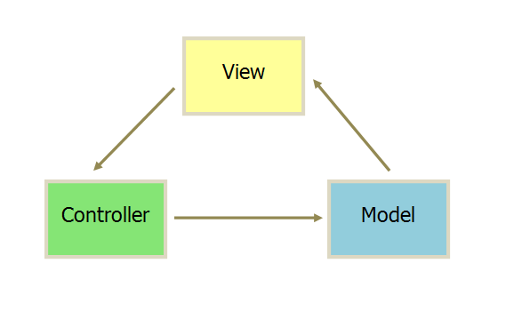  

  - 视图（View）：用户界面。
  - 控制器（Controller）：业务逻辑
  - 模型（Model）：数据保存
  - View 传送指令到 Controller
  - Controller 完成业务逻辑后，要求 Model 改变状态
  - Model 将新的数据发送到 View，用户得到反馈

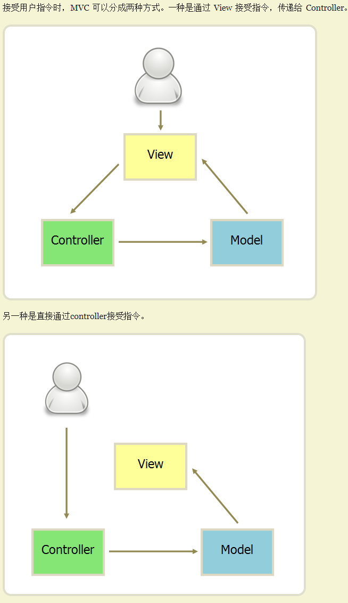  

- MVP 模式：将 Controller 改名为 Presenter，同时改变了通信方向。
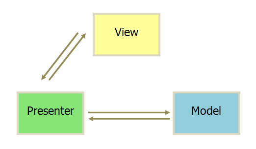  

  - 各部分之间的通信，都是双向的。
  - View 与 Model 不发生联系，都通过 Presenter 传递。
  - View 非常薄，不部署任何业务逻辑，称为"被动视图"（Passive View），即没有任何主动性，而 Presenter非常厚，所有逻辑都部署在那里；

- MVVM 模式：MVVM 模式将 Presenter 改名为 ViewModel。
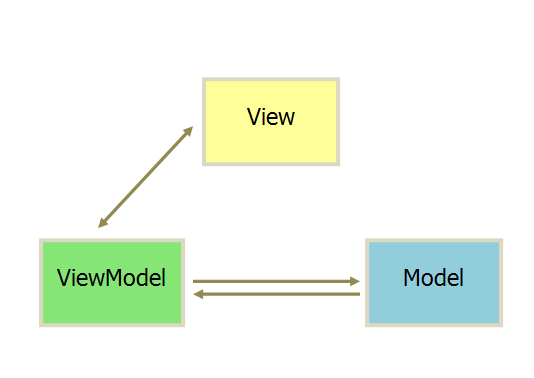  

  - 唯一的区别是，它采用双向绑定（data-binding）：View的变动，自动反映在 ViewModel，反之亦然。Angular 和 Ember 都采用这种模式；

# 访问控制设计

## 系统设计与实现

### 框架支持

领域特定语言(DSL)接口和数据模型以强制应用访问控制策略

### 数据库支持

DBMS层的一个方向是利用现有的数据库特性，设计特殊的数据库和中间件，在内部实施访问控制

### 语言支持

实施信息流控制，这样数据流就必须遵守数据对象上的安全断言/属性。这种强化可以通过利用编程语言的概念和技术来实现，比如细化类型、逻辑证明、静态信息流分析等。

### 开发环境支持

提醒开发者开发环境中潜在的访问控制漏洞，以实现高交互性低侵入性；

## 软件分析和测试

### 异常值检测

根据Clark-Wilson模型，访问控制模型可以表示为一个认证主体(subject)、一组程序(program)和一组待操作数据项(object)之间的关系，即访问控制三元组(access control triple)。通过检查该部分的偏差来达到BAC的分析；

#### MACE

基于用户id、角色、其他会话相关变量的注释进行，依赖于程序分析和符号计算来从这些注释中识别web应用程序的授权上下文。

- 如果每个程序点从不同的执行路径访问相同的资源，它就会检查授权上下文；
- MACE用一个四元组（U,R,S,P）来推断和表达访问控制规则，其中U是经过认证的用户，R是角色集，S是会话变量或标识符，P是对资源所要求的权限；
- 通过对数据库查询CF、DF分析来计算授权上下文，并基于数据依赖性构建source-target图，然后收集target中的约束以构建每个查询的授权上下文。

MACE可以可以进行垂直、水平越权

#### SPACE

Security Pattern Checker 安全模式检查器，一个查找访问控制错误的无规范工具，但源码在伯克利的网站上已经无法访问。

- SPACE使用符号执行从源代码中提取数据
- 用约束求解器alloy检查与数据公开关联的约束是否也在**用户给定目录**的允许范围内
- 从SPACE提供到他们选择的访问控制模式目录的映射。SPACE检查是否允许每个数据公开。
- SPACE提出了“目录”的六种模式:
  - 公共对象
  - 验证
  - 明确的权限
  - 用户配置文件
  - 管理员
  - 明确的角色。

- 创建者完全权；
- 公开资源；
- 登录权限；
- 应用程序定义资源；
- 用户相关联的概要信息；
- 管理员
- 明确的角色；应用程序指定不同的角色，用资源类型表示它们。为用户分配角色，并允许或拒绝基于角色的执行操作的权限；

符号求解：

- Rubicon对Rails应用程序上的用户定义属性进行有界验证
- Derailer与用户交互以发现安全策略统一应用中的错误。
- 在Alloy中对web应用程序、基于角色的访问控制和安全模式目录进行建模。
- 每个模式由RBAC对象上的一组Alloy约束组成，新子集的模式是Alloy的extends关键字建模的，模式目录定义的关系是使用Alloy的全局关系表示的。

举例如下：
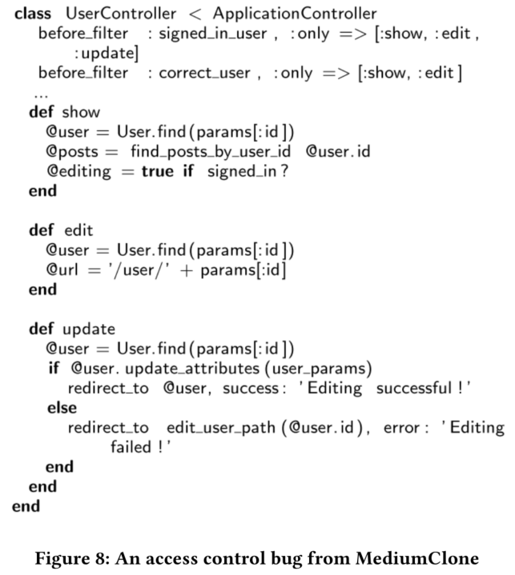  

#### RoleCast

静态分析工具，不依赖于开发人员的任何注释或安全策略规范。相反，它试图捕捉web应用程序中安全检查的一些常见模式，并应用于推断缺失的检查。该系统总共分为四个阶段：

1. 分析过程间控制流，收集敏感事件的上下文，包括条件中的关键变量，其中要过滤掉没有异常退出分支的候选者；
2. 根据程序文件附加的角色将其划分为不同的组。通过分析文件上下文对它们进行分区，并减少不同角色之间共享的文件数量。
3. 为每个角色确定要检查的关键变量集。
4. 每个敏感事件的调用上下文，如果它们符合以下模式则报告:
   1. 安全敏感操作的调用上下文没有任何检查；
   2. 角色包含唯一的上下文，无法检查一致性；
   3. 检查与大多数其他调用上下文不一致；

由于查询字符串不依赖于用户输入，因此如果缺少检查，污点分析将不会检测到错误。用安全术语来说，从条件事件到安全敏感事件之间存在(隐式)信息流。

为了将JSP和PHP程序转换为Java类文件，我们分别使用Tomcat Web服务器和Quercus编译器。Quercus不分析PHP代码中的调用，而是将每个PHP函数转换为一个Java类，其中包含一个主方法和初始化全局散列表和成员变量的方法。将每个函数调用转换为反射方法调用或在散列表中查找。使用流程和上下文不敏感的过程内符号传播来解析Quercus产生的间接方法调用的目标。

将PHP代码中的INSERT、DELETE和UPDA mysql查询语句标记为安全敏感事件。对于JSP, ROLECAST将java.sql.Statement.executeQuery和. executeupdate调用执行INSERT、DELETE或update TE SQL查询标记为安全敏感事件。如果没有程序员提供的注释或规范，就不可能将需要保护的SELECT操作与不需要任何检查就可以合法访问的SELECT操作分开。

- 安全逻辑观察：
  - 当用户不拥有适当的权限或者他的凭据没有通过验证时，程序会很快退出；
  - 从任何程序入口点通向安全敏感事件的每条路径都必须包含安全检查。
  - 不同的特定于应用程序的角色通常涉及不同的程序文件。应用程序的文件结构(在Web应用程序中表示模块结构)反映了由用户特权定义的角色之间的明确区别。单个程序文件只包含特定于单个用户角色的代码。
  - 每个角色中的安全检查通常非常相似的观察结果。
  - 因为每个应用程序文件也是一个程序入口点，PHP和JSP开发人员必须在每个文件中复制应用程序的安全逻辑。在复杂的应用程序中，意外入口点的数量可能非常大。这大大增加了手工检查的复杂性，并激发了对自动分析的需求。

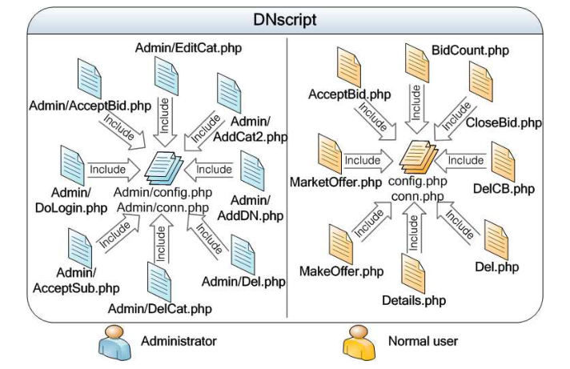  

##### 安全敏感事件

执行程序间、流程和上下文敏感的控制依赖和数据流分析。它根据失败的授权检查很快导致程序退出的观察结果，使用分支不对称来细化关键变量集，基于以下规律进行开发：

1. 任何安全检查都涉及一个或多个关键变量的分支语句。
2. 在检查失败对应的分支中，程序未达到安全敏感事件，程序异常退出。例如，程序调用exit，调用die，或者返回到初始页面。
3. 从检查到异常退出的分支中的程序语句数明显少于导致安全敏感事件的分支中的程序语句数。
4. 正确的安全逻辑必须在执行安全敏感事件之前一致地检查关键变量的某个子集。
5. 大量开发者会将种子字符串和变量进行结合实现动态的sql语句查询；

具体流程如下

1. 获取敏感行为作为根节点，并搜索敏感行为上下文，形成以程序入口为叶子节点的程序数据流树；
2. 每个调用上下文cc中作为参数传递的字符串传播到候选事件e，并消除可以静态证明e不可能是安全敏感事件的所有对(cc, e)，在e处的任何静态可行的数据库操作，只能执行SELECT或SHOW查询。
3. ROLECAST对字符串连接、字符串赋值以及字符串get()和set()方法的行为进行建模。它对事件e的每个调用上下文cc的字符串参数执行前向的、过程间的、上下文敏感的常量传播。如果字符串作为参数传递给某个方法m /∈cc，我们保守地假设字符串被修改，并且ROLECAST将事件e标记为安全敏感事件。否则，分析将实际参数的字符串值传播给方法的形式参数，则分析出非安全敏感事件；
4. 执行过程间控制依赖分析，查找在关键方法CM(cc, e)中执行的关键分支B(cc, e)，关键方法包含一个或多个关键分支：
   1. 若G = (N, E)为控制流图(CFG)，且s, b∈N, b->s 假设G中至少存在一条从b到s的路径。
   2. 若G = (N, E)为控制流图(CFG)，s, b∈N, s控制依赖于b, iff b->s S和S后支配所有v != b在b->s, s不在后支配b。
   3. 敏感行为依赖于控制的分支语句集分两步计算:
      1. 对调用进行迭代加入，对于mi调用mi+1的每个方法mi∈cc，算法找到mi+1的调用点依赖于控制的分支状态，并将其添加到B(cc, e)中。
      2. 其中方法集N，使得ni∈N的调用位置优于某个方法m∈cc，或者ni从nj∈N被无条件地调用。也即每个方法ni∈N在到达e之前都被调用，所以ni在程序间支配e。对于每个ni∈N, 找到分支语句，其中程序退出调用ni(如果有的话)依赖于控制，并将它们添加到B(cc, e)中。
      3. 找到其中一个分支快速退出而另一个分支执行更多语句的分支语句，ROLECAST计算每个B中b的不对称比率：循环中的每条语句算作一条语句。不对称比例是后者的数量除以前者。该值越大，表示分支越不对称。小于θ阈值则将B中的b将被去除：当一个或多个分支语句的计算比率大于100时，我们的实验使用100作为默认的阈值;否则，我们使用所有分支语句的中位数比率。
5. 将B(cc, e)映射到关键方法CM(cc, e)的集合，其包含一个或多个分支；
6. 涉及的所有安全关键变量(例如，持有用户权限的变量、会话状态等)都是关键的，但反过来并不总是正确的:关键变量是安全关键变量的超集。从关键分支B(cc, e)直接或间接引用的变量中导出关键变量集。给定B(cc, e)，我们计算关键变量V (cc, e)的集合，并且迭代加入针对其的关键变量，计算v的向后过程内数据流切片。

##### 划分组并最小化组并集

遵循的规律如下：

1. 应用程序将为不同角色生成页面的代码放入不同的文件中
2. 包含给定角色的安全逻辑的文件与包含其他角色的安全逻辑的文件是不同的。
3. 与安全相关的文件上下文的正确分区也应该提供所有文件上下文的良好分区。

负责检查关键变量的方法集映射到程序文件，并将它们划分到组中，最小化组之间共享文件的数量。为了发现开发人员将负责不同应用程序角色的代码放入不同文件的流行程序结构。

定义CF和F，其中：

- CF是一组关键方法CM的映射到的文件，cf中定义了任何方法属于CM中的关键方法；
- F是定义了任何方法m并程序间支配e；因此F是CF的超集；
- 其中所有安全敏感事件e的上下文集合F称为$\hat{F}$，而所有的关键上下文CF集合为$\hat{CF}$；

该阶段主要用于生成$\hat{CF}$的候选区算法，并最小化角色之间共享文件数量分区；将相似的关键文件上下文分组到分区的相同元素中。如果两个关键文件上下文共享关键文件，则认为它们相似。选择一个“种子”关键文件cf1，并将$\hat{CF}$中引用cf的所有关键文件上下文放入同一组，因此算法取决于选择种子的关键文件顺序，只考虑频繁发生的关键文件，尝试所有顺序，评估候选文件如何区分更一般的文件上下文$\hat{F}$，ROLECAST更倾向于使用组最自包含的分区，即不引用其他组使用的许多文件。具体算法如下：

1. 对于每个CM(cc, e)，计算关键文件上下文CF (cc, e)和文件上下文F (cc, e)。
2. 排除所有CF共有的关键文件(cc, e)。如果文件f属于所有cf∈$\hat{CF}$的关键文件上下文CF，则从$\hat{CF}$中的所有上下文中删除f。由于这些文件出现在每个关键文件上下文中，因此它们无助于区分角色。这里是否可以控制阈值，来达到删除部分高频关键点？
3. 从$\hat{CF}$提取一组种子文件(SD)。如果文件f至少出现在关键文件上下文cf∈$\hat{CF}$的θseed（预设阈值）部分中，我们将其放入SD中。在我们的实验中，我们设置θseed = 0.2。我们只使用相对常见的关键文件作为分区算法的种子，这有助于提高以下步骤的效率。
4. 生成所有有序排列SDi。对于每个SDi，生成一个分区属于$\hat{CF}$的$Pi =\left\{G1,…,Gk\right\}$如下。令SDi = {f1，…fn}。令$\hat{TF}=\hat{CF}$，设k = 1。令i = 1 ~ n时，$Ci\subseteq\hat{TF}$为$\hat{TF}$包含文件fi的所有关键文件上下文的集合。如果Ci不为空，则从$\hat{TF}$中删除这些上下文，将它们添加到组Gk中，并增加k。
5. 给定候选分区，选择能够将来自不同组的文件之间的重叠最小化的分区。我们的算法计算每个候选{G1，…Gk}如下。首先，对于每一组关键文件上下文Gj，取相应的文件上下文集Fj。然后，对于$k\not ={}l$的每一对Fk, Fl，计算它们共有的文件数:|Fk∩Fl|。该算法选择最小的$\sum_{k<l}|F_k\cap F_l|$

具体流程如下：

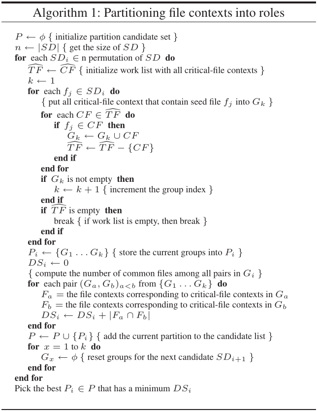  

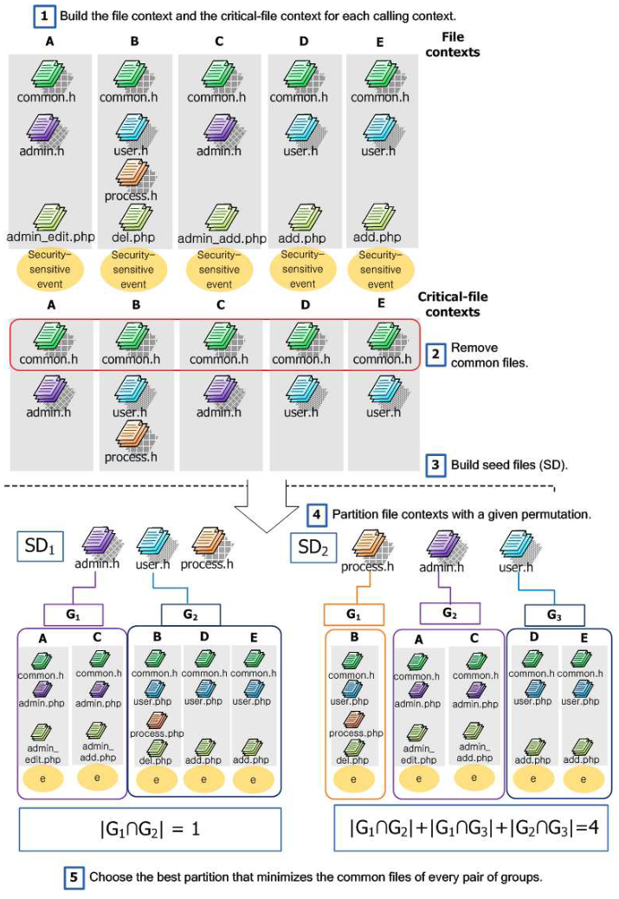  

其中最后计算的是重叠的文件数量：

比如在$SD_1$中$|G_1\cap G_2|=|\left\{common.h\right\}|=1$，而在$SD_2$中$|G_2\cap G_3|=|\left\{common.h，user.php\right\}|=2$这一步感觉可以进行改进，可以根据种子文件在文件上下文中出现的频率来确定优先级。

##### 关键变量子集分析

考虑每个角色，并计算一致使用的关键变量子集，在与该角色相关的足够大的上下文部分中——以控制该角色中安全敏感事件的***可达性***。在每个关键文件上下文CF (cc, e)和它的关键变量集合V (cc, e)之间存在一对一的映射。对于一个给定分区SD，设Vi为Gi中关键文件上下文中所有关键变量的集合，初始化安全关键变量SVi = Vi的集合。对于变量$v\in SV_i$出现在Gi中关键文件上下文的少于θ一致阈值。其中θ一致阈值这里取0.5；

##### 发现缺失的检查并报告

1. 检查$sv\in SV_i$，针对i角色对应的上下文组中的每个(cc,e)验证sv是否属于V（cc,e），若不属于则报错；
2. 对于执行安全敏感事件且不检查任何关键变量的每个文件；
3. 对于每个单例关键文件上下文(即，只有一个关键文件上下文的角色)。  

  

##### 结果

分析使用三个阈值:分支不对称阈值θasymm，种子文件的通用性阈值θseed，以及安全关键变量的一致性阈值θconsistency：

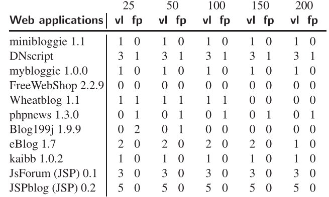  

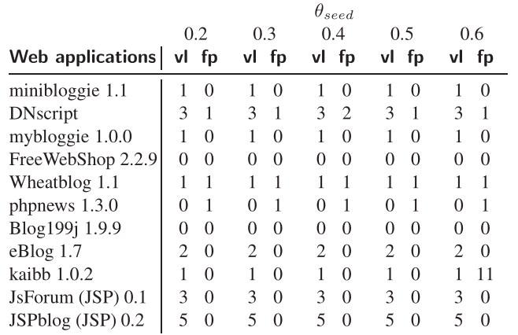  

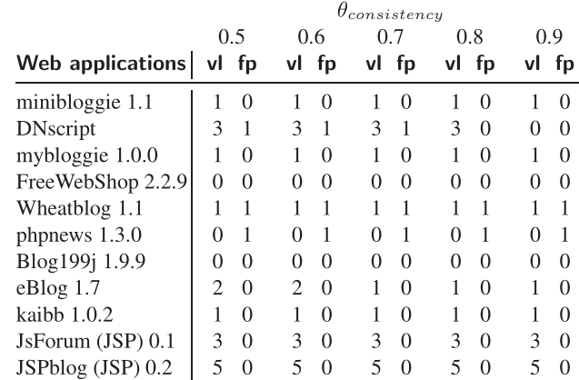  

特定角色一致性分析后的假阳性数量非常少。剩下的假阳性有几个原因：

1. 如果一个角色只包含一个上下文，ROLECAST就不能应用一致性分析，并且保守地报告一个潜在的漏洞；
2. Web应用程序可能只对一小部分上下文使用一组特殊的关键变量(这种情况很少见)；
3. 其次一小部分上下文导致敏感数据库操作；

#### Static Detection of Access Control Vulnerabilities in Web Applications

可以检测访问控制漏洞，而不需要提供显式的访问控制规范。从PHP程序源代码中捕获隐式访问控制假设，其中隐式地指示系统中每个角色的预期访问。  
如果一个角色可以在这个系统中强制浏览特权网页，这是一个潜在的漏洞。

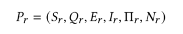  

针对角色r，S程序入口集，Q是页面包含的敏感应用状态集，E是页面之间的显式边集，I = <ni, nj>是能从页面集合ni强制浏览nj的边，II是是该角色可以导航到的所有网页的集合，N是一组可以从S开始通过E显示访问的网页；本工作将访问控制漏洞定义为:

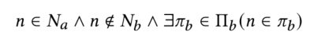  

这个定义意味着，如果角色a合法访问的页面可以被角色b强制浏览，但不能被b显式访问，则该页面可能存在访问控制漏洞。技术路线如下：

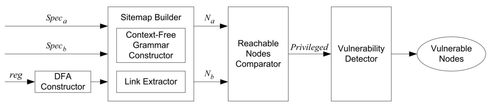  

该系统需要提供的是入口集和状态集该系统的工作流程如下：

1. 根据控制流分析设置的条目构建站点地图，并查找角色可以触发的分支。
2. 它递归地收集每个角色可以触发的所有PHP文件，使用Z3来求解约束剔除不可行路径；
3. 收集两个角色的可访问节点，比较器将在两个集合之间进行比较并推断特权节点，这意味着只有特权用户才能访问。
4. 用分析器模拟低权限用户在这些特权节点上的强制浏览尝试，以确定它们是否会成功。
5. 手动确认，该工具将输出易受攻击的节点。

#### 动态方法

***Viktoria Felmetsger, Ludovico Cavedon, Christopher Kruegel, and Giovanni Vigna. 2010. Toward automated detection of logic vulnerabilities in web applications. In 19th USENIX Security Symposium (USENIX Security 10).***使用动态分析来推断一组行为规范，然后使用模型检查来识别程序中可能破坏规范的路径作为漏洞。

***Ivan Bocić and Tevfik Bultan. 2016. Finding access control bugs in web applications with CanCheck. In 2016 31st IEEE/ACM International Conference on Automated Software Engineering (ASE). IEEE, 155–166.***利用访问控制库CanCan的应用程序来帮助在web应用程序中进行仪器授权检查，从而能够从动态执行中构建访问控制模型，因为使用集中的CanCan模块和显式的can检查。然后将形式化的访问控制模型推导为一阶逻辑公式。如果存在一个动作，对某个对象的某些操作没有按照访问控制模型的规定进行授权检查，CanCheck将其视为访问控制错误。

***Sooel Son, Kathryn S McKinley, and Vitaly Shmatikov. 2013. Fix Me Up: Repairing Access-Control Bugs in Web Applications.. In NDSS. Citeseer.***不仅可以检测访问控制漏洞，还可以为它们生成修复。缺失的访问控制检查总是在调用上下文中显示，以便它可以重用语句来生成修复。
FixMeUp的工作过程：

1. 需要输入访问控制策略的高级规范，这些规范可以由用户手工编写或从程序分析中获得。如针对访问控制检查、敏感操作和此策略应用的用户角色进行的源代码注释；
2. FixMeUp根据规范生成访问控制模板(ACT)。它从正确的访问控制检查开始，并以向后的过程间方式进行计算，以构建具体的低层策略规范的表示。这种表示也将在以后生成修复时作为程序转换模板；
3. FixMeUp检查每个调用上下文，以验证访问控制逻辑是否与ACT匹配。查看程序的入口点，访问控制检查通常在那里进行规范化。然后，如果缺少检查，则生成修复。

***A Model-Driven-Engineering Approach for Detecting Privilege Escalation in IoT Systems***
第一阶段从SmartThings应用程序的描述、首选项和代码中部分基于TXL恢复权限规则。恢复的权限模型符合我们为SmartThings构建的元模型；

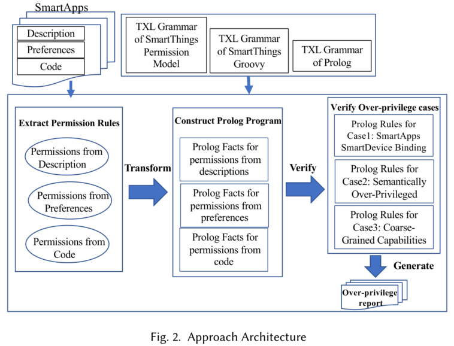  

第二阶段生成Prolog程序，并从Prolog主程序中创建可执行文件，其中包括:每个过度特权案例的Prolog规则和从SmartApp中提取的Prolog事实。

最后一步是运行Prolog程序，生成包含特权过度结果的最终报告。

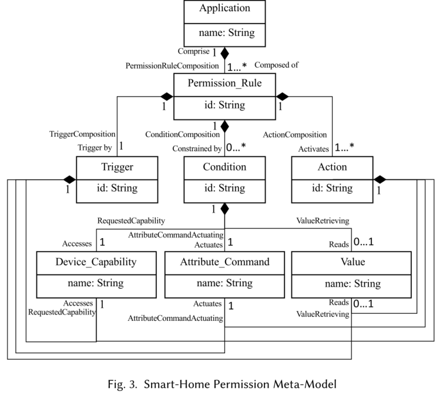  

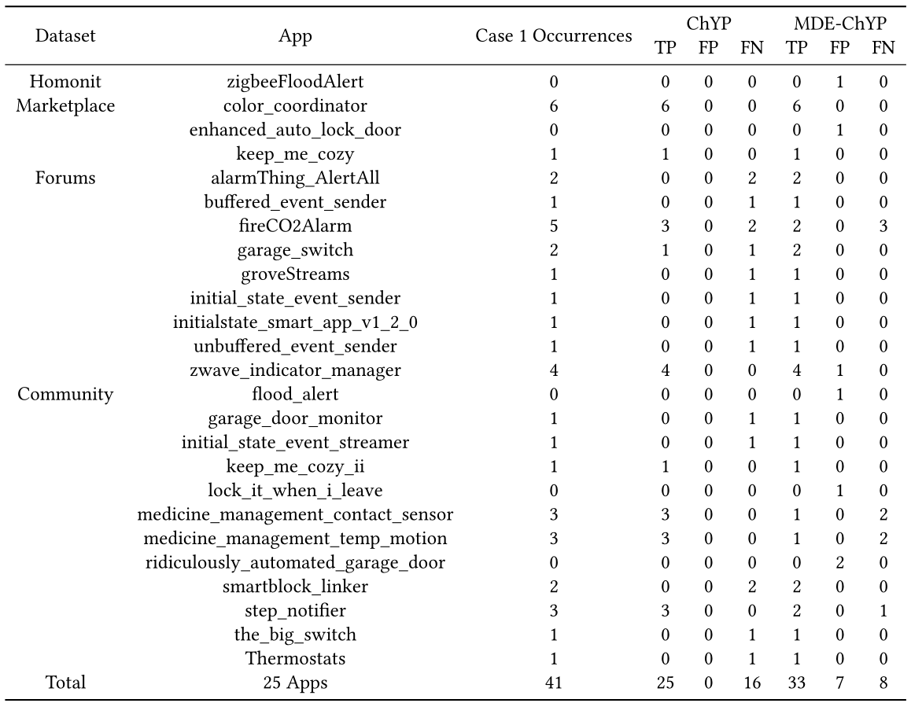  

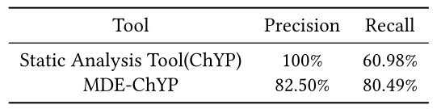  

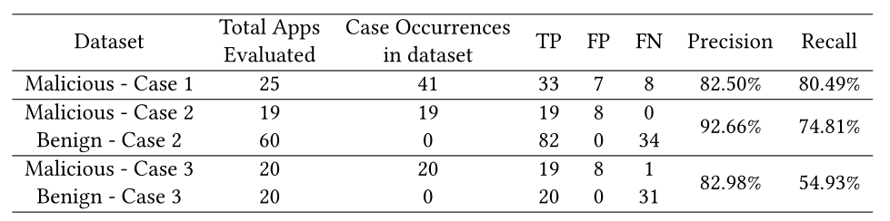  

- ***related work***

Earlence Fernandes, Jaeyeon Jung, and Atul Prakash. Security analysis of emerging smart home applications. In Proceedings of the IEEE Symposium on Security and Privacy, 2016, pages 636–654, 2016.
Fernandes介绍了SmartThings平台中发现的不同类型的漏洞，并通过利用平台中的设计缺陷进行了概念验证攻击。Fernandes等人开发了一种静态分析工具，用于检测SmartThings中的过度特权，此外还有运行时分析和手工分析，该工具无法完成分析。没有评估开发工具的有效性，也没有为研究人员提供一种简单的评估方法。

Wei Zhang, Yan Meng, Yugeng Liu, Xiaokuan Zhang, Yinqian Zhang, and Haojin Zhu. Homonit: Monitoring smart home apps from encrypted traffic. In Proceedings of the 2018 ACM SIGSAC Conference on Computer and Communications Security, pages 1074–1088. ACM, 2018
设计开发的HoMonit系统使用灰盒技术可以检测SmartThings平台的两类漏洞:SmartApps中的过权限漏洞和事件窃听和欺骗漏洞。HoMonit首先通过对开源SmartApps的静态分析或对闭源SmartApps的NLP技术提取SmartApp的预期行为。然后进行侧信道分析，监控加密报文的大小和时间间隔。良性和恶意应用程序之间嗅探包的变化表明DFA状态的变化并分析，并获得了0.98的基于过度权限访问的正确标记行为不端的SmartApps的率。但HoMonit中的过度特权检测只针对由粗粒度功能引起的问题，并且需要在良性和恶意状态下执行应用程序，以比较它们之间的差异，自动化水平低。

Yuan Tian, Nan Zhang, Yue-Hsun Lin, XiaoFeng Wang, Blase Ur, Xianzheng Guo, and Patrick Tague. Smartauth: User-centered authorization for the internet of things. In Proceedings of the 26th USENIX Security Symposium, pages 361–378, 2017.
提出了一种名为SmartAuth的技术，SmartAuth通过基于应用程序实际执行的内容生成新的授权用户界面，提出以用户为中心的授权。SmartAuth使用NLP和程序分析来分析应用程序的描述、代码和注释，以检测应用程序中的过度权限。

### 自动化检测

AuthScope通过使用差分流量分析来比较和识别web请求中感兴趣的字段，然后替换请求中的字段并观察服务器响应来处理测试用例的生成。其方法挑战主要包括：

1. 如何通过大多数应用程序的身份验证，使工具可以获得身份验证后的请求和响应。*？通过使用社交登录界面来解决的？*；
2. 他们需要识别可能被猜测生成测试用例的字段。使用欧几里得距离测量标识符的随机性；
3. 如何从响应中确认被利用的漏洞。对不同帐户的响应消息应用差异分析，并过滤无语义差异。

LogicScope捕获web应用程序中的逻辑漏洞，其中未经授权的访问是一个主要类别。

1. 他们使用有限状态机(FSM)对从执行轨迹观察到的用户合法输入建模web应用程序的逻辑；
2. 基于FSM，为每个状态构建随机输入，并评估响应。

### 形式化方法

使用严格的数学模型来确保系统的正确行为

UrFlow以SQL查询的形式要求安全策略规范，然后使用符号求值和自动定理证明来静态检查这些策略。

Rui Wang, Yuchen Zhou, Shuo Chen, Shaz Qadeer, David Evans, and Yuri Gurevich. 2013. Explicating {SDKs}: Uncovering Assumptions Underlying Secure Authentication and Authorization. In 22nd USENIX Security Symposium (USENIX Security 13). 399–314.考虑了sdk中的授权问题。开发人员可以利用在线提供商来进行身份验证和授权服务。但安全使用sdk很困难。

1. 该文中设计了所需安全属性的精确定义，以构建SDK和底层系统的安全模型
2. 他们应用形式验证来检测反例，这样他们就可以找到模型中不正确的部分，或者向模型中添加新的假设
3. 在这个迭代过程中，他们能够获得一组假设和模型，用于辅助规范使用SDK；

其安全属性定义如下:

- 安全模型的粒度是session；
- 安全模型的基础是使用密钥和签名数据，用于识别每个用户；
- 期望的安全包括身份验证违反、授权违反和关联违反；

## 运行时检测

pass

# Alloy

[alloy github website](https://github.com/AlloyTools/org.alloytools.alloy)
