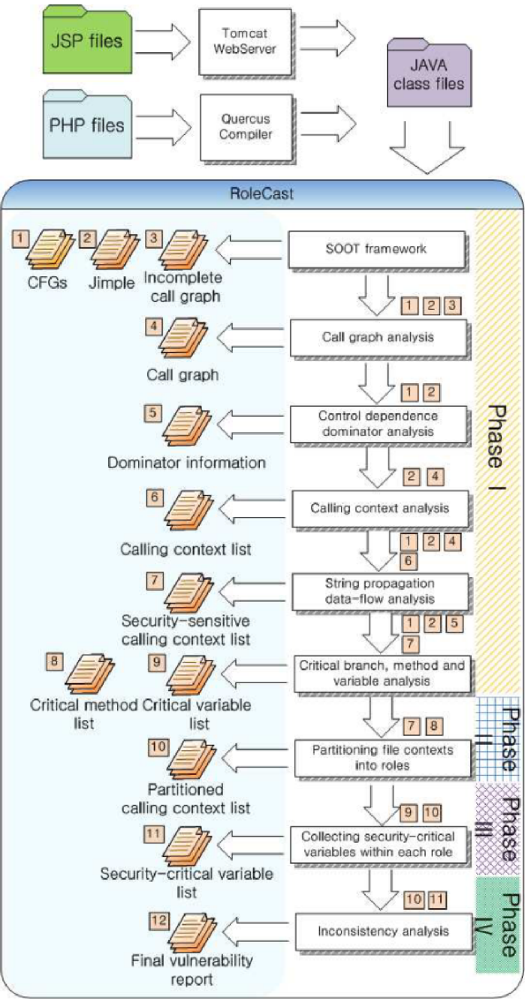

<!--
 * @Author: Suez_kip 287140262@qq.com
 * @Date: 2023-09-04 10:06:16
 * @LastEditTime: 2023-09-05 08:33:46
 * @LastEditors: Please set LastEditors
 * @Description: 
-->
# Break Access Control

难点：

- 语义：非特殊输入，无法用数据消毒预防；
- 复杂性：与业务逻辑、语义深度耦合；
  - web应用程序不再适应DAC、RBAC或MAC等简单的访问控制模型，细粒度和程序逻辑深度耦合；
  - 未经训练的开发人员可能会忽略其实现中的一些潜在假设；
  - 厂商的不遵循；
  - Orange CERT等使用很容易被利用的短随机令牌；
- 部分控制策略甚至是动态的；
  - web应用程序中的访问控制策略是不断更新的，留下可利用的信息，如资源标识符、URL模式等。
  - 旧的被弃用的功能如果不引起注意，就会留下过时的api和孤立的页面，而新添加的功能在没有经过彻底测试的情况下可能容易受到访问控制绕过的攻击。
- 系统支持缺失
  - 工具支持应该更多地在预部署阶段作为主动的方式
  - web框架目前大多遵循MVC[30]、MVP[12]或MVVM[18]等软件架构模式，并没有对访问控制进行特殊的处理；
  - 访问控制测试作为中间步骤嵌入到其他功能测试中，导致阻碍其他测试，本身也容易遗漏；

## web架构

- MVC模式：
  

  - 视图（View）：用户界面。
  - 控制器（Controller）：业务逻辑
  - 模型（Model）：数据保存
  - View 传送指令到 Controller
  - Controller 完成业务逻辑后，要求 Model 改变状态
  - Model 将新的数据发送到 View，用户得到反馈

  

- MVP 模式：将 Controller 改名为 Presenter，同时改变了通信方向。
  

  - 各部分之间的通信，都是双向的。
  - View 与 Model 不发生联系，都通过 Presenter 传递。
  - View 非常薄，不部署任何业务逻辑，称为"被动视图"（Passive View），即没有任何主动性，而 Presenter非常厚，所有逻辑都部署在那里；

- MVVM 模式：MVVM 模式将 Presenter 改名为 ViewModel。
  

  - 唯一的区别是，它采用双向绑定（data-binding）：View的变动，自动反映在 ViewModel，反之亦然。Angular 和 Ember 都采用这种模式；

## 访问控制设计

### 系统设计与实现

#### 框架支持

领域特定语言(DSL)接口和数据模型以强制应用访问控制策略

#### 数据库支持

DBMS层的一个方向是利用现有的数据库特性，设计特殊的数据库和中间件，在内部实施访问控制

#### 语言支持

实施信息流控制，这样数据流就必须遵守数据对象上的安全断言/属性。这种强化可以通过利用编程语言的概念和技术来实现，比如细化类型、逻辑证明、静态信息流分析等。

#### 开发环境支持

提醒开发者开发环境中潜在的访问控制漏洞，以实现高交互性低侵入性；

### 软件分析和测试

#### 异常值检测

根据Clark-Wilson模型，访问控制模型可以表示为一个认证主体(subject)、一组程序(program)和一组待操作数据项(object)之间的关系，即访问控制三元组(access control triple)。通过检查该部分的偏差来达到BAC的分析；

##### MACE

基于用户id、角色、其他会话相关变量的注释进行，依赖于程序分析和符号计算来从这些注释中识别web应用程序的授权上下文。

- 如果每个程序点从不同的执行路径访问相同的资源，它就会检查授权上下文；
- MACE用一个四元组（U,R,S,P）来推断和表达访问控制规则，其中U是经过认证的用户，R是角色集，S是会话变量或标识符，P是对资源所要求的权限；
- 通过对数据库查询CF、DF分析来计算授权上下文，并基于数据依赖性构建source-target图，然后收集target中的约束以构建每个查询的授权上下文。

MACE可以可以进行垂直、水平越权

##### SPACE

Security Pattern Checker 安全模式检查器，一个查找访问控制错误的无规范工具。

- SPACE使用符号执行从源代码中提取数据
- 用约束求解器检查与数据公开关联的约束是否也在**用户给定目录**的允许范围内
- 从SPACE提供到他们选择的访问控制模式目录的映射。SPACE检查是否允许每个数据公开。
- SPACE提出了“目录”的六种模式:
  - 公共对象
  - 验证
  - 明确的权限
  - 用户配置文件
  - 管理员
  - 明确的角色。

举例如下：
  

##### RoleCast

静态分析工具，不依赖于开发人员的任何注释或安全策略规范。相反，它试图捕捉web应用程序中安全检查的一些常见模式，并应用于推断缺失的检查。该系统总共分为四个阶段：

1. 分析过程间控制流，收集敏感事件的上下文，包括条件中的关键变量，其中要过滤掉没有异常退出分支的候选者；
2. 根据程序文件附加的角色将其划分为不同的组。通过分析文件上下文对它们进行分区，并减少不同角色之间共享的文件数量。
3. 为每个角色确定要检查的关键变量集。
4. 每个敏感事件的调用上下文，如果它们符合以下模式则报告:
   1. 安全敏感操作的调用上下文没有任何检查；
   2. 角色包含唯一的上下文，无法检查一致性；
   3. 检查与大多数其他调用上下文不一致；

  

##### Static Detection of Access Control Vulnerabilities in Web Applications

可以检测访问控制漏洞，而不需要提供显式的访问控制规范。从PHP程序源代码中捕获隐式访问控制假设，其中隐式地指示系统中每个角色的预期访问。  
如果一个角色可以在这个系统中强制浏览特权网页，这是一个潜在的漏洞。

  

针对角色r，S程序入口集，Q是页面包含的敏感应用状态集，E是页面之间的显式边集，I = <ni, nj>是能从页面集合ni强制浏览nj的边，II是是该角色可以导航到的所有网页的集合，N是一组可以从S开始通过E显示访问的网页；本工作将访问控制漏洞定义为:

  

这个定义意味着，如果角色a合法访问的页面可以被角色b强制浏览，但不能被b显式访问，则该页面可能存在访问控制漏洞。技术路线如下：

  

该系统需要提供的是入口集和状态集该系统的工作流程如下：

1. 根据控制流分析设置的条目构建站点地图，并查找角色可以触发的分支。
2. 它递归地收集每个角色可以触发的所有PHP文件，使用Z3来求解约束剔除不可行路径；
3. 收集两个角色的可访问节点，比较器将在两个集合之间进行比较并推断特权节点，这意味着只有特权用户才能访问。
4. 用分析器模拟低权限用户在这些特权节点上的强制浏览尝试，以确定它们是否会成功。
5. 手动确认，该工具将输出易受攻击的节点。

##### 动态方法

***Viktoria Felmetsger, Ludovico Cavedon, Christopher Kruegel, and Giovanni Vigna. 2010. Toward automated detection of logic vulnerabilities in web applications. In 19th USENIX Security Symposium (USENIX Security 10).***使用动态分析来推断一组行为规范，然后使用模型检查来识别程序中可能破坏规范的路径作为漏洞。

***Ivan Bocić and Tevfik Bultan. 2016. Finding access control bugs in web applications with CanCheck. In 2016 31st IEEE/ACM International Conference on Automated Software Engineering (ASE). IEEE, 155–166.***利用访问控制库CanCan的应用程序来帮助在web应用程序中进行仪器授权检查，从而能够从动态执行中构建访问控制模型，因为使用集中的CanCan模块和显式的can检查。然后将形式化的访问控制模型推导为一阶逻辑公式。如果存在一个动作，对某个对象的某些操作没有按照访问控制模型的规定进行授权检查，CanCheck将其视为访问控制错误。

***Sooel Son, Kathryn S McKinley, and Vitaly Shmatikov. 2013. Fix Me Up: Repairing Access-Control Bugs in Web Applications.. In NDSS. Citeseer.***不仅可以检测访问控制漏洞，还可以为它们生成修复。缺失的访问控制检查总是在调用上下文中显示，以便它可以重用语句来生成修复。
FixMeUp的工作过程：

1. 需要输入访问控制策略的高级规范，这些规范可以由用户手工编写或从程序分析中获得。如针对访问控制检查、敏感操作和此策略应用的用户角色进行的源代码注释；
2. FixMeUp根据规范生成访问控制模板(ACT)。它从正确的访问控制检查开始，并以向后的过程间方式进行计算，以构建具体的低层策略规范的表示。这种表示也将在以后生成修复时作为程序转换模板；
3. FixMeUp检查每个调用上下文，以验证访问控制逻辑是否与ACT匹配。查看程序的入口点，访问控制检查通常在那里进行规范化。然后，如果缺少检查，则生成修复。

***A Model-Driven-Engineering Approach for Detecting Privilege Escalation in IoT Systems***
第一阶段从SmartThings应用程序的描述、首选项和代码中部分基于TXL恢复权限规则。恢复的权限模型符合我们为SmartThings构建的元模型；

  

第二阶段生成Prolog程序，并从Prolog主程序中创建可执行文件，其中包括:每个过度特权案例的Prolog规则和从SmartApp中提取的Prolog事实。

最后一步是运行Prolog程序，生成包含特权过度结果的最终报告。

  

  

  

  

- ***related work***

Earlence Fernandes, Jaeyeon Jung, and Atul Prakash. Security analysis of emerging smart home applications. In Proceedings of the IEEE Symposium on Security and Privacy, 2016, pages 636–654, 2016.
Fernandes介绍了SmartThings平台中发现的不同类型的漏洞，并通过利用平台中的设计缺陷进行了概念验证攻击。Fernandes等人开发了一种静态分析工具，用于检测SmartThings中的过度特权，此外还有运行时分析和手工分析，该工具无法完成分析。没有评估开发工具的有效性，也没有为研究人员提供一种简单的评估方法。

Wei Zhang, Yan Meng, Yugeng Liu, Xiaokuan Zhang, Yinqian Zhang, and Haojin Zhu. Homonit: Monitoring smart home apps from encrypted traffic. In Proceedings of the 2018 ACM SIGSAC Conference on Computer and Communications Security, pages 1074–1088. ACM, 2018
设计开发的HoMonit系统使用灰盒技术可以检测SmartThings平台的两类漏洞:SmartApps中的过权限漏洞和事件窃听和欺骗漏洞。HoMonit首先通过对开源SmartApps的静态分析或对闭源SmartApps的NLP技术提取SmartApp的预期行为。然后进行侧信道分析，监控加密报文的大小和时间间隔。良性和恶意应用程序之间嗅探包的变化表明DFA状态的变化并分析，并获得了0.98的基于过度权限访问的正确标记行为不端的SmartApps的率。但HoMonit中的过度特权检测只针对由粗粒度功能引起的问题，并且需要在良性和恶意状态下执行应用程序，以比较它们之间的差异，自动化水平低。

Yuan Tian, Nan Zhang, Yue-Hsun Lin, XiaoFeng Wang, Blase Ur, Xianzheng Guo, and Patrick Tague. Smartauth: User-centered authorization for the internet of things. In Proceedings of the 26th USENIX Security Symposium, pages 361–378, 2017.
提出了一种名为SmartAuth的技术，SmartAuth通过基于应用程序实际执行的内容生成新的授权用户界面，提出以用户为中心的授权。SmartAuth使用NLP和程序分析来分析应用程序的描述、代码和注释，以检测应用程序中的过度权限。

#### 自动化检测

AuthScope通过使用差分流量分析来比较和识别web请求中感兴趣的字段，然后替换请求中的字段并观察服务器响应来处理测试用例的生成。其方法挑战主要包括：

1. 如何通过大多数应用程序的身份验证，使工具可以获得身份验证后的请求和响应。*？通过使用社交登录界面来解决的？*；
2. 他们需要识别可能被猜测生成测试用例的字段。使用欧几里得距离测量标识符的随机性；
3. 如何从响应中确认被利用的漏洞。对不同帐户的响应消息应用差异分析，并过滤无语义差异。

LogicScope捕获web应用程序中的逻辑漏洞，其中未经授权的访问是一个主要类别。

1. 他们使用有限状态机(FSM)对从执行轨迹观察到的用户合法输入建模web应用程序的逻辑；
2. 基于FSM，为每个状态构建随机输入，并评估响应。

#### 形式化方法

使用严格的数学模型来确保系统的正确行为

UrFlow以SQL查询的形式要求安全策略规范，然后使用符号求值和自动定理证明来静态检查这些策略。

Rui Wang, Yuchen Zhou, Shuo Chen, Shaz Qadeer, David Evans, and Yuri Gurevich. 2013. Explicating {SDKs}: Uncovering Assumptions Underlying Secure Authentication and Authorization. In 22nd USENIX Security Symposium (USENIX Security 13). 399–314.考虑了sdk中的授权问题。开发人员可以利用在线提供商来进行身份验证和授权服务。但安全使用sdk很困难。

1. 该文中设计了所需安全属性的精确定义，以构建SDK和底层系统的安全模型
2. 他们应用形式验证来检测反例，这样他们就可以找到模型中不正确的部分，或者向模型中添加新的假设
3. 在这个迭代过程中，他们能够获得一组假设和模型，用于辅助规范使用SDK；

其安全属性定义如下:

- 安全模型的粒度是session；
- 安全模型的基础是使用密钥和签名数据，用于识别每个用户；
- 期望的安全包括身份验证违反、授权违反和关联违反；

### 运行时检测

pass
