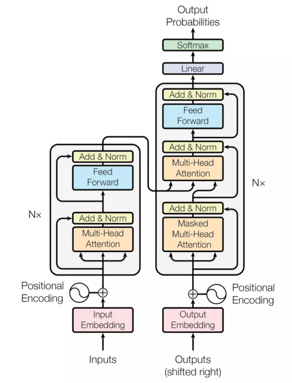
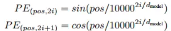
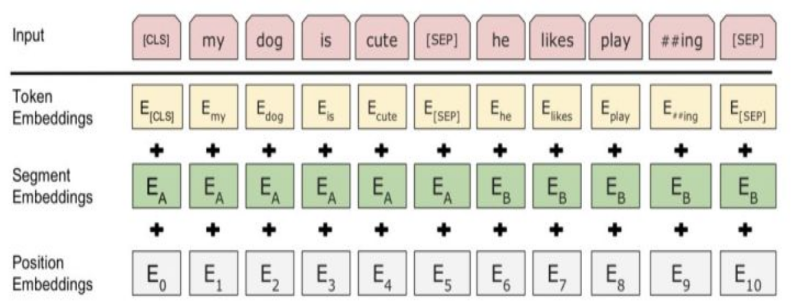
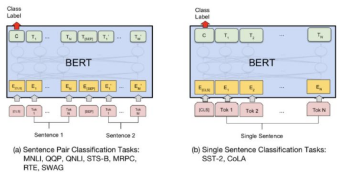
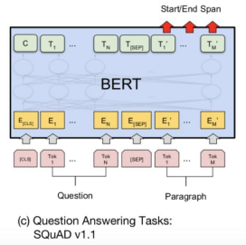
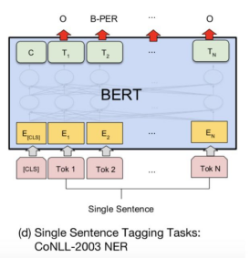
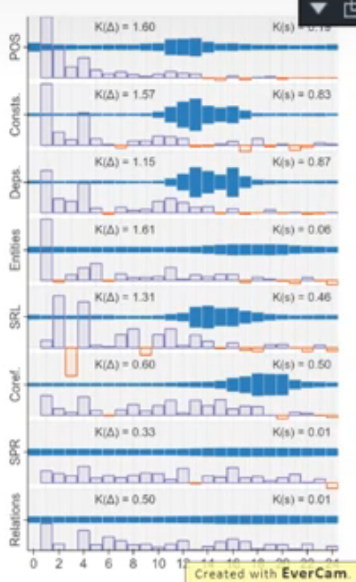
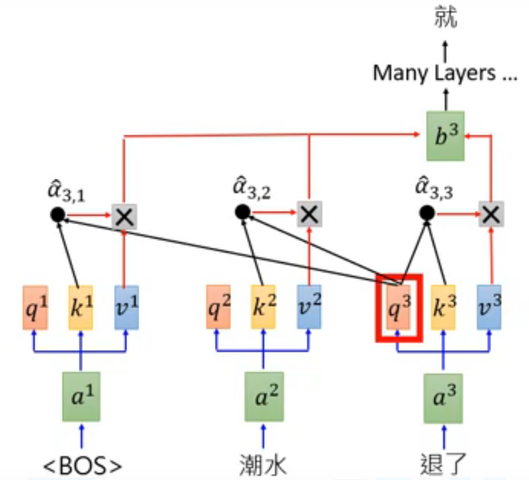

<!--
 * @Author: Suez_kip 287140262@qq.com
 * @Date: 2023-02-13 17:36:08
 * @LastEditTime: 2023-02-13 20:41:30
 * @LastEditors: Suez_kip
 * @Description: Contextualized Word Embedding
-->
# BERT（Transformer Eecoder）

## Masked Language Model

随机mask语料中15%的token，然后将masked token 位置输出的最终隐层向量送入softmax，来预测masked token。
这样输入一个句子，每次只预测句子中大概15%的词，所以BERT训练速度慢

## Transformer

Transformer模型是2018年5月提出的，可以替代传统RNN和CNN的一种新的架构，用来实现机器翻译，论文名称是attention is all you need。左边Nx框框的encoder和右边Nx框框的decoder，较于RNN+attention常见的encoder-decoder之间的attention（上边的一个橙色框），还多出encoder和decoder内部的self-attention（下边的两个橙色框）。每个attention都有multi-head特征。最后，通过position encoding加入没考虑过的位置信息。  
  

### multi-head attention

　　将一个词的vector切分成h个维度，求attention相似度时每个h维度计算。由于单词映射在高维空间作为向量形式，每一维空间都可以学到不同的特征，相邻空间所学结果更相似，相较于全体空间放到一起对应更加合理。比如对于vector-size=512的词向量，取h=8，每64个空间做一个attention，学到结果更细化。

### self-attention

　　每个词位的词都可以无视方向和距离，有机会直接和句子中的每个词encoding。比如上面右图这个句子，每个单词和同句其他单词之间都有一条边作为联系，边的颜色越深表明联系越强，而一般意义模糊的词语所连的边都比较深。比如：law，application，missing，opinion。。。

### position encoding

　　transformer计算token的位置信息这里使用正弦波↓，类似模拟信号传播周期性变化。这样的循环函数可以一定程度上增加模型的泛化能力。  
  
BERT直接训练一个position embedding来保留位置信息，每个位置随机初始化一个向量，加入模型训练，最后就得到一个包含位置信息的embedding（简单粗暴。。），最后这个position embedding和word embedding的结合方式上，BERT选择直接拼接。

## sentence-level representation

　　在很多任务中，仅仅靠encoding是不足以完成任务的（这个只是学到了一堆token级的特征），还需要捕捉一些句子级的模式，来完成SLI、QA、dialogue等需要句子表示、句间交互与匹配的任务。对此，BERT又引入了另一个极其重要却又极其轻量级的任务，来试图把这种模式也学习到。

### 句子连续性的负采样

句子级别的连续性预测任务，即预测输入BERT的两端文本是否为连续的文本。训练的时候，输入模型的第二个片段会以50%的概率从全部文本中随机选取，剩下50%的概率选取第一个片段的后续的文本。 即首先给定的一个句子（相当于word2vec中给定context），它下一个句子即为正例（相当于word2vec中的正确词），随机采样一个句子作为负例（相当于word2vec中随机采样的词），然后在该sentence-level上来做二分类（即判断句子是当前句子的下一句还是噪声）。

### 句子表示与嵌入

BERT是一个句子级别的语言模型，不像ELMo模型在与下游具体NLP任务拼接时需要每层加上权重做全局池化，BERT可以直接获得一整个句子的唯一向量表示。它在每个input前面加一个特殊的记号[CLS]，然后让Transformer对[CLS]进行深度encoding，由于Transformer是可以无视空间和距离的把全局信息encoding进每个位置的，而[CLS]的最高隐层作为句子/句对的表示直接跟softmax的输出层连接，因此其作为梯度反向传播路径上的“关卡”，可以学到整个input的上层特征。

嵌入示例：  
  

## 任务目标

  
  
  

- a句子关系判断（句对匹配）：MultiNLI文本蕴含识别（M推理出N，蕴含/矛盾/中立），QQP（文本匹配），QNLI（自然语言问题推理），STS-B（语义文本相似度1-5），MRPC（微软研究释义语料库，判断文本对语音信息是否等价）、RTE（同MNLI，小数据），SWAG（113k多项选择问题组成的数据集，涉及丰富的基础情境）

- b分类任务（文本匹配）：SST-2（斯坦福情感分类树），CoLA（语言可接受性预测）对于左三图抽取式任务，用两个线性分类器分别输出span的起点和终点

- c序列标注（文本抽取）：SQuAD（斯坦福问答数据集，从phrase中选取answer）对于左四图序列标注任务，就只需要加softmax输出层

- d序列标注：NER命名实体识别

## 进一步的研究

  
对BERT每一层进行研究，不同的层对不同的任务有不同的帮助，每一层肯定会出现一个vector，对其进行权重和。
简单的文法问题会倾向于浅层vector，复杂的问题会倾向于深层vector；

# RoBERTa

# GPT（Transformer Decoder）

GPT 則是使用 Transformer 的 Decoder 來訓練一個中規中矩，從左到右的單向語言模型。
大型LM：
ELMO 94M
BERT 340M
GPT-2 1542M
  
可以实现0样本实现QA、Summarization、Translation
实现一个前向的词汇attention，比如“如果A拿B的钱被发现，他就会被打。”“他”这个词可能就attention到A；

## GPT3

相对bert收集资料，针对每个task实现每个model；

# ELMo（Transformer Eecoder）

它的encoder模型为Bi-LSTM,通过无监督的方式对语言模型进行预训练来学习单词表示；  
下一个单词的预测，如根据long short term提高预测精度；
由每层BLSTM可以输出每个词的embedding h1和h2，由$\alpha_1\times h_1+\alpha_2\times h_2$决定该层的输出，其中$\alpha_1和\alpha_2$也是学习部分，根据不同任务其结果不同

# ERNIE

针对中文的修正，mask会提升到中文的词汇级别；

# chatgpt

来自于intro gpt

## 训练流程

1. 预测下文，无需监督，这一步甚至可以实现QA；
2. 有监督的有标记的进一步学习，部分标注，引导学习；
3. 训练基于专家标注的teacher model，拟合人类的选择；
4. 使用基于teacher model得到的reward的增强学习；
