<!--
 * @Author: Suez_kip 287140262@qq.com
 * @Date: 2023-09-13 17:05:09
 * @LastEditTime: 2023-09-13 20:12:02
 * @LastEditors: Suez_kip
 * @Description: 
-->
# CAN总线调研

Controller Area Network，是 ISO 国际标准化的串行通信协议。CAN总线有两个ISO国际标准：

- ISO 11898 定义了通信速率为 125 kbps～1 Mbps 的高速 CAN 通信标准，属于闭环总线，传输速率可达1Mbps，总线长度 ≤ 40米.
- ISO 11519 定义了通信速率为 10～125 kbps 的低速 CAN 通信标准，属于开环总线，传输速率为40kbps时，总线长度可达1000米。

左边是高速CAN总线的拓扑结构，右边是低速CAN总线的拓扑结构：

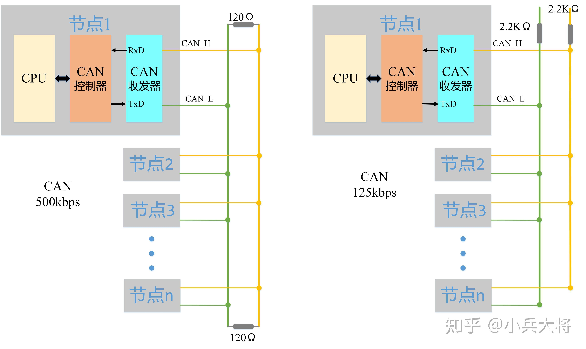  

节点通过CAN控制器和CAN收发器连接到CAN总线上，利用CAN_H和CAN_L两根线上的电位差来表示CAN信号，电位差分为显性电平和隐性电平。其中显性电平为逻辑0，隐性电平为逻辑1。

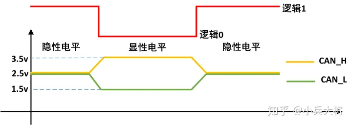  
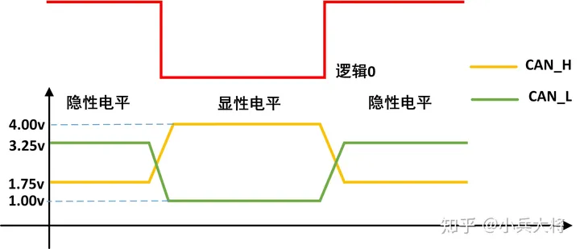  
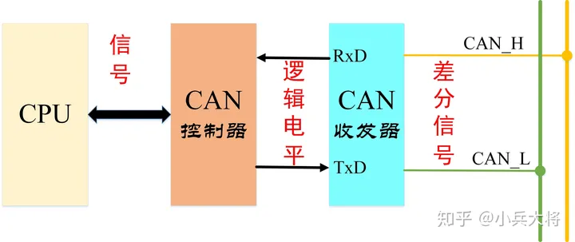  
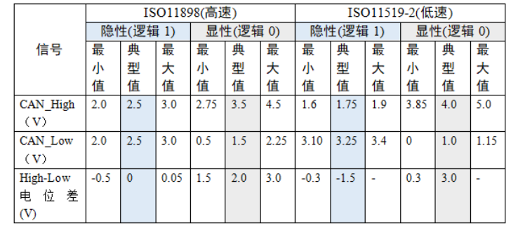  

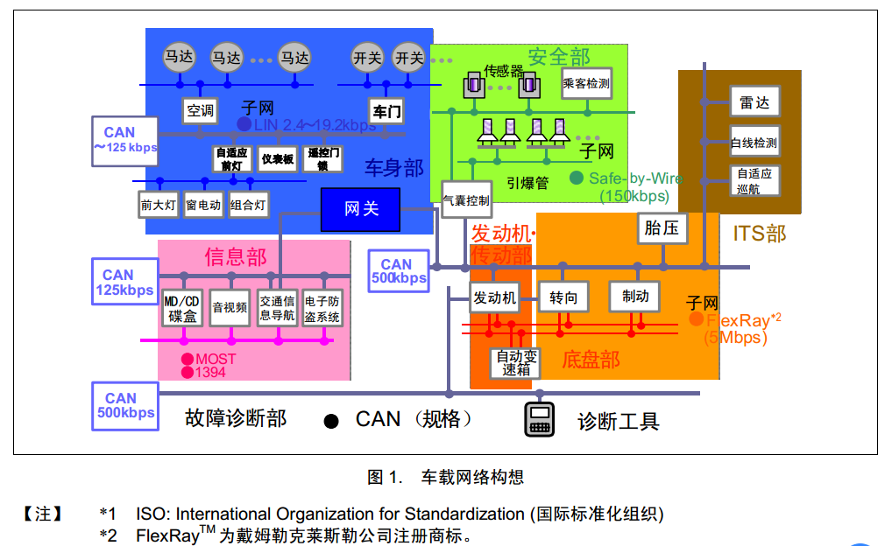  

## 网络结构

CAN总线网络底层只采用了OSI基本参照模型中的数据链路层、传输层。

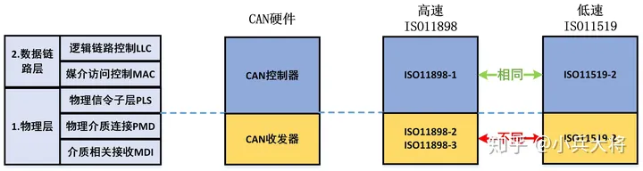  
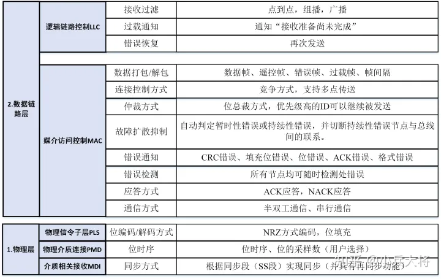  

### CAN 的波特率及位同步、位时序分解

节点间使用约定好的波特率进行通讯；CAN 协议把每一个数据位的时序分解成如图 所示的 SS 段、PTS 段、PBS1 段、PBS2 段，这四段的长度加起来即为一个 CAN 数据位的长度。总线上的各个通讯节点只要约定好 1 个 Tq 的时间长度以及每一个数据位占据多少个 Tq，就可以确定 CAN 通讯的波特率。  

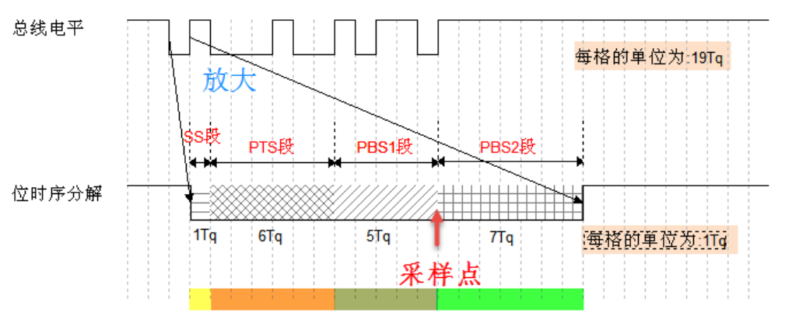  

- SS 段 (SYNC SEG)译为同步段，若通讯节点检测到总线上信号的跳变沿被包含在 SS 段的范围之内，则表示节点与总线的时序是同步的，当节点与总线同步时，采样点采集到的总线电平即可被确定为该位的电平。SS 段的大小固定为 1Tq。
- PTS 段 (PROP SEG)译为传播时间段，这个时间段是用于补偿网络的物理延时时间。是总线上输入比较器延时和输出驱动器延时总和的两倍。PTS 段的大小可以为 1~8Tq。
- PBS1 段 (PHASE SEG1)译为相位缓冲段，主要用来补偿边沿阶段的误差，它的时间长度在重新同步的时候可以加长。PBS1 段的初始大小可以为 1~8Tq。
- PBS2 段 (PHASE SEG2)这是另一个相位缓冲段，也是用来补偿边沿阶段误差的，它的时间长度在重新同步时可以缩短。PBS2 段的初始大小可以为 2~8Tq。

### 同步

#### 硬同步

若某个 CAN 节点通过总线发送数据时，它会发送一个表示通讯起始的信号 (即下一小节介绍的帧起始信号)，该信号是一个由高变低的下降沿。而挂载到 CAN 总线上的通讯节点在不发送数据时，会时刻检测总线上的信号。所以节点以硬同步的方式调整，把自己的位时序中的 SS 段平移至总线出现下降沿的部分，获得同步。

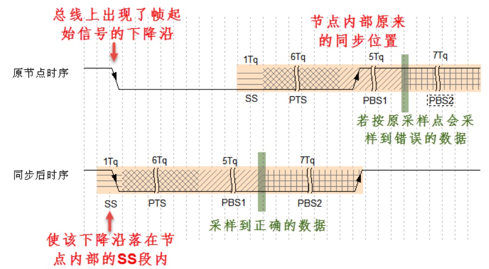  

#### 重新同步

重新同步的方式分为超前和滞后两种情况，以总线跳变沿与 SS 段的相对位置进行区分。

- 第一种相位超前的情况如图 ，节点从总线的边沿跳变中，检测到它内部的时序比总线的时序相对超前 2Tq，这时控制器在下一个位时序中的 PBS1 段增加 2Tq 的时间长度，使得节点与总线时序重新同步。

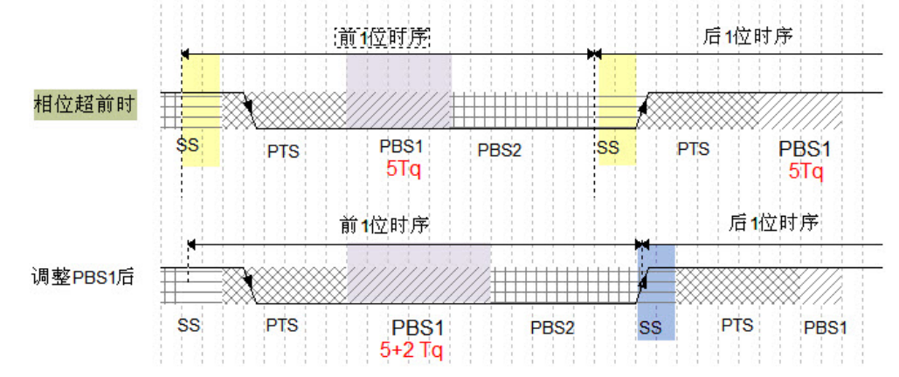  

- 第二种相位滞后的情况如图 ，节点从总线的边沿跳变中，检测到它的时序比总线的时序相对滞后 2Tq，这时控制器在前一个位时序中的 PBS2 段减少 2Tq 的时间长度，获得同步。

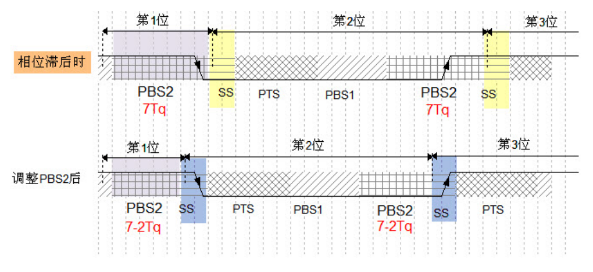  

在重新同步的时候，PBS1 和 PBS2 中增加或减少的这段时间长度被定义为“重新同步补偿宽度SJW* (reSynchronization Jump Width)”。一般来说 CAN 控制器会限定 SJW 的最大值，如限定了最大 SJW=3Tq 时，单次同步调整的时候不能增加或减少超过 3Tq 的时间长度，若有需要，控制器会通过多次小幅度调整来实现同步。当控制器设置的 SJW 极限值较大时，可以吸收的误差加大，但通讯的速度会下降；

## CAN通信的基本原理

### 多主工作方式

在总线空闲状态（当总线上出现连续的11位隐性电平，那么总线就处于空闲状态），任意节点都可以向总线上发送消息。

### 非破坏性仲裁机制

当多个节点同时向总线发送消息时，总线对各个消息的标识符（即ID号）进行逐位仲裁。如果某个节点发送的消息仲裁获胜，那么这个节点将获取总线的发送权，仲裁失败的节点则立即停止发送并转变为监听（接收）状态。既不会造成已发送数据的延迟，也不会破坏已经发送的数据；

### 系统的柔性

CAN总线上的节点没有“地址”的概念，因此在总线上增加节点时，不会对总线上已有节点的软硬件及应用层造成影响。

### 通信速度

在同一条CAN线上，所有节点的通信速度（位速率）必须相同，如果两条不同通信速度总线上的节点想要实现信息交互，必须通过网关。

### 数据传输方式

CAN总线可以实现一对一，一对多以及广播的数据传输方式，这依赖于验收滤波技术。验收滤波技术可以简单的理解为: Node_A 节点将需要接收的CAN报文的ID号记录下来，当Node_A在总线上侦听到一帧报文时, 它就会判断听到的这一帧报文的ID号是否在自己记录的ID号中，如果在，那么Node_A就接收该报文,否则就不管这一帧报文.

### 远程数据请求

某个节点Node_A可以通过发送“remote帧”到总线上的方式，请求某个节点Node_B来发送由该remote帧所指定的报文。

### 错误检测、错误通知、错误恢复功能

只要总线上发生了错误, 那么该总线上的所有节点都能发现这个错误；
检测出错误的节点会立即通知总线上其它所有的节点（错误通知功能）；
正在发送消息的节点，如果检测到错误，会立即停止当前的发送，并在同时不断地重复发送此消息，直到该消息发送成功为止（错误恢复功能）。

### 故障封闭

CAN总线上的节点能够判断错误的类型，能够判断是暂时性的错误（如噪声干扰）还是持续性的错误（如节点内部故障），如果判断是严重的持续性错误，那么节点就会切断自己与总线的联系，从而避免影响总线上其他节点的正常工作。

## UDS

UDS（Unified Diagnostic Services，统一的诊断服务）是在汽车电子ECU环境下的一种诊断通信协议，在ISO 14229中规定。UDS服务使用OSI模型的第五层和第七层（会话层和应用层）。服务ID（SID）和与服务相关的参数包含在CAN数据帧的8个数据字节中，这些数据帧是从诊断工具发出的。UDS专指ISO 14229-1吗？这种说法是不对的，UDS包含了ISO 14229下属的7个子协议，其中ISO 14229-2还是会话层的，所以UDS仅包括应用层的说法也是错误的。
