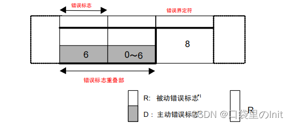

<!--
 * @Author: Suez_kip 287140262@qq.com
 * @Date: 2023-09-13 17:05:09
 * @LastEditTime: 2023-09-19 16:14:20
 * @LastEditors: Suez_kip
 * @Description: 
-->
# CAN总线调研

Controller Area Network，是 ISO 国际标准化的串行通信协议。CAN总线有两个ISO国际标准：

- ISO 11898 定义了通信速率为 125 kbps～1 Mbps 的高速 CAN 通信标准，属于闭环总线，传输速率可达1Mbps，总线长度 ≤ 40米.
- ISO 11519 定义了通信速率为 10～125 kbps 的低速 CAN 通信标准，属于开环总线，传输速率为40kbps时，总线长度可达1000米。

左边是高速CAN总线的拓扑结构，右边是低速CAN总线的拓扑结构：

  

节点通过CAN控制器和CAN收发器连接到CAN总线上，利用CAN_H和CAN_L两根线上的电位差来表示CAN信号，电位差分为显性电平和隐性电平。其中显性电平为逻辑0，隐性电平为逻辑1。

  
  
  
  

  

## 网络结构

CAN总线网络底层只采用了OSI基本参照模型中的数据链路层、传输层。

  
  

### CAN 的波特率及位同步、位时序分解

节点间使用约定好的波特率进行通讯；CAN 协议把每一个数据位的时序分解成如图 所示的 SS 段、PTS 段、PBS1 段、PBS2 段，这四段的长度加起来即为一个 CAN 数据位的长度。总线上的各个通讯节点只要约定好 1 个 Tq 的时间长度以及每一个数据位占据多少个 Tq，就可以确定 CAN 通讯的波特率。  

  

- SS 段 (SYNC SEG)译为同步段，若通讯节点检测到总线上信号的跳变沿被包含在 SS 段的范围之内，则表示节点与总线的时序是同步的，当节点与总线同步时，采样点采集到的总线电平即可被确定为该位的电平。SS 段的大小固定为 1Tq。
- PTS 段 (PROP SEG)译为传播时间段，这个时间段是用于补偿网络的物理延时时间。是总线上输入比较器延时和输出驱动器延时总和的两倍。PTS 段的大小可以为 1~8Tq。
- PBS1 段 (PHASE SEG1)译为相位缓冲段，主要用来补偿边沿阶段的误差，它的时间长度在重新同步的时候可以加长。PBS1 段的初始大小可以为 1~8Tq。
- PBS2 段 (PHASE SEG2)这是另一个相位缓冲段，也是用来补偿边沿阶段误差的，它的时间长度在重新同步时可以缩短。PBS2 段的初始大小可以为 2~8Tq。

### 同步

#### 硬同步

若某个 CAN 节点通过总线发送数据时，它会发送一个表示通讯起始的信号 (即下一小节介绍的帧起始信号)，该信号是一个由高变低的下降沿。而挂载到 CAN 总线上的通讯节点在不发送数据时，会时刻检测总线上的信号。所以节点以硬同步的方式调整，把自己的位时序中的 SS 段平移至总线出现下降沿的部分，获得同步。

  

#### 重新同步

重新同步的方式分为超前和滞后两种情况，以总线跳变沿与 SS 段的相对位置进行区分。

- 第一种相位超前的情况如图 ，节点从总线的边沿跳变中，检测到它内部的时序比总线的时序相对超前 2Tq，这时控制器在下一个位时序中的 **PBS1** 段**增加** 2Tq 的时间长度，使得节点与总线时序重新同步。

  

- 第二种相位滞后的情况如图 ，节点从总线的边沿跳变中，检测到它的时序比总线的时序相对滞后 2Tq，这时控制器在前一个位时序中的 **PBS2** 段**减少** 2Tq 的时间长度，获得同步。

  

在重新同步的时候，PBS1 和 PBS2 中增加或减少的这段时间长度被定义为“重新同步补偿宽度SJW* (reSynchronization Jump Width)”。一般来说 CAN 控制器会限定 SJW 的最大值，如限定了最大 SJW=3Tq 时，单次同步调整的时候不能增加或减少超过 3Tq 的时间长度，若有需要，控制器会通过多次小幅度调整来实现同步。当控制器设置的 SJW 极限值较大时，可以吸收的误差加大，但通讯的速度会下降；

### CAN报文

以下几个通讯方案能轻易进行数据同步或区分数据传输方向：

1. 在 SPI 通讯中，**片选、时钟信号、数据输入及数据输出**这 4 个信号都有单独的信号线;
2. I2C 协议包含有**时钟信号及数据信号** 2 条信号线;
3. 异步串口包含**接收与发送** 2 条信号线;

CAN 使用的是两条差分信号线，CAN 协议给出的解决方案是对数据、操作命令 (如读/写) 以及同步信号进行打包，打包后的这些内容称为报文。

在原始数据段的前面加上传输起始标签、片选 (识别) 标签和控制标签，在数据的尾段加上 CRC校验标签、应答标签和传输结束标签。CAN 一共规定了 5 种类型的帧，它们的类型及用途说明如下：

1. 数据帧：用于节点向外传送数据
2. 遥控帧：用于向远端节点请求数据
3. 错误帧：用于向远端节点通知校验错误，请求重新发送上一个数据
4. 过载恢：用于通知远端节点:本节点尚未做好接收准备
5. 帧间隔：用于将数据帧及遥控帧与前面的帧分离开来

#### 数据帧

  

数据帧以一个显性位 (逻辑 0) 开始，以 7 个连续的隐性位 (逻辑 1) 结束，在它们之间，分别有仲裁段、控制段、数据段、CRC 段和 ACK 段。  

- 帧起始

SOF 段 (Start OfFrame)，译为帧起始，帧起始信号只有一个数据位，是一个显性电平，它用于通知各个节点将有数据传输，其它节点通过帧起始信号的电平跳变沿来进行硬同步。  

- 仲裁段

仲裁段的内容主要为本数据帧的 ID 信息 (标识符)，数据帧具有标准格式和扩展格式两种，区别就在于 ID 信息的长度，标准格式的 ID 为 11 位，扩展格式的 ID 为 29 位，它在标准 ID 的基础上多出 18 位。  

CAN 协议对于重要的信息，我们会给它打包上一个优先级高的 ID。报文的优先级，是通过对 ID 的仲裁来确定的。如果总线上同时出现显性电平和隐性电平，总线的状态会被置为显性电平，CAN 正是利用这个特性进行仲裁。  

若两个节点同时竞争 CAN 总线的占有权，当它们发送报文时，若首先出现隐性电平，则会失去对总线的占有权，进入接收状态。在开始阶段，两个设备发送的电平一样，所以它们一直继续发送数据。到了图中箭头所指的时序处，节点单元 1 发送的为隐性电平，而此时节点单元 2 发送的为显性电平，由于总线的“线与”特性使它表达出显示电平，因此单元 2 竞争总线成功，这个报文得以被继续发送出去。

  

因为在 CAN 总线上数据是以广播的形式发送的，所有连接在 CAN 总线的节点都会收到所有其它节点发出的有效数据，因而我们的 CAN 控制器大多具有根据 ID 过滤报文的功能，它可以控制自己只接收某些 ID 的报文。回看数据帧格式，可看到仲裁段除了报文 ID 外，还有 RTR、IDE 和 SRR 位。

1. RTR 位 (Remote Transmission Request Bit)，译作远程传输请求位，它是用于**区分数据帧和遥控帧**的，当它为显性电平时表示数据帧，隐性电平时表示遥控帧。
2. IDE 位 (Identifier ExtensionBit)，译作标识符扩展位，它是用于区分**标准格式与扩展格式**，当它为显性电平时表示标准格式，隐性电平时表示扩展格式。
3. SRR 位 (Substitute Remote Request Bit)，**只存在于扩展格式**，它用于替代标准格式中的 **RTR** 位。由于扩展帧中的 SRR 位为隐性位，RTR 在数据帧为显性位，所以在两个 ID 相同的标准格式报文与扩展格式报文中，标准格式的优先级较高。

- 控制段

在控制段中的 r1 和 r0 为保留位，默认设置为显性位。它最主要的是 DLC 段 (Data Length Code)，译为数据长度码，它由 4 个数据位组成，用于表示本报文中的数据段含有多少个字节， DLC 段表示的数字为 0~8。

- 数据段

数据段为数据帧的核心内容，它是节点要发送的原始信息，由 0~8 个字节组成，MSB 先行。

- CRC 段

包含了一段 15 位的 CRC 校验码，一旦接收节点算出的CRC 码跟接收到的不同，则它会向发送节点反馈出错信息，利用错误帧请求它重新发送。出错时的处理则由软件控制最大重发数。在 CRC 校验码之后，有一个 CRC 界定符，它为隐性位，主要作用是把 CRC 校验码与后面的 ACK段间隔起来。

- ACK 段

ACK 段包括一个 ACK 槽位，和 ACK 界定符位。类似 I2C 总线，在 ACK 槽位中，发送节点发送的是隐性位，而接收节点则在这一位中发送显性位以示应答。在 ACK 槽和帧结束之间由 ACK 界定符间隔开。

- 帧结束

EOF 段 (End Of Frame)，译为帧结束，帧结束段由发送节点发送的 7 个隐性位表示结束。

#### 遥控帧

接收单元向发送单元请求发送数据所用的帧。遥控帧由 6 个段组成。遥控帧没有数据帧的数据段。
遥控帧的构成如下图所示。

  

- 遥控帧的 RTR 位为隐性位，没有数据段。没有数据段的数据帧和遥控帧可通过 RTR 位区别开来。
- 遥控帧的数据长度码以所请求数据帧的数据长度码表示。
- 可用于各单元的定期连接确认/ 应答、或仲裁段本身带有实质性信息的情况下。

#### 错误帧

用于在接收和发送消息时检测出错误通知错误的帧。错误帧由错误标志和错误界定符构成。错误帧的构成如下图所示。

  

(1) 错误标志
错误标志包括主动错误标志和被动错误标志两种。
主动错误标志： 6 个位的显性位。
被动错误标志： 6 个位的隐性位。
(2) 错误界定符
错误界定符由 8 个位的隐性位构成。

#### 过载帧

过载帧是用于接收单元通知其尚未完成接收准备的帧。过载帧由过载标志和过载界定符构成。过载帧的构成如下图所示。

  

(1) 过载标志
6 个位的显性位，过载标志的构成与主动错误标志的构成相同。
(2) 过载界定符
8 个位的隐性位，过载界定符的构成与错误界定符的构成相同。

#### 帧间隔

帧间隔是用于分隔数据帧和遥控帧的帧。数据帧和遥控帧可通过插入帧间隔将本帧与前面的任何帧（数据帧、 遥控帧、错误帧、过载帧）分开。过载帧和错误帧前不能插入帧间隔。帧间隔的构成如下图所示。

  

(1) 间隔
        3 个位的隐性位。
(2) 总线空闲
        隐性电平，无长度限制（0 亦可）。
        本状态下，可视为总线空闲，要发送的单元可开始访问总线。
(3) 延迟传送（发送暂时停止）
        8 个位的隐性位。
        只在处于被动错误状态的单元刚发送一个消息后的帧间隔中包含的段。

#### CAN协议的其他要点

[Blog网址](https://blog.csdn.net/wangguchao/article/details/124718110)

按位分辨仲裁位判别优先级，数据帧优先于遥控帧、标准格式优先于扩展格式；

位填充是为防止突发错误而设定的功能。当同样的电平持续 5 位时则添加一个位的反型数据，接收方则相反。

错误类：

  

## CAN通信的基本原理

### 多主工作方式

在总线空闲状态（当总线上出现连续的11位隐性电平，那么总线就处于空闲状态），任意节点都可以向总线上发送消息。

### 非破坏性仲裁机制

当多个节点同时向总线发送消息时，总线对各个消息的标识符（即ID号）进行逐位仲裁。如果某个节点发送的消息仲裁获胜，那么这个节点将获取总线的发送权，仲裁失败的节点则立即停止发送并转变为监听（接收）状态。既不会造成已发送数据的延迟，也不会破坏已经发送的数据；

### 系统的柔性

CAN总线上的节点没有“地址”的概念，因此在总线上增加节点时，不会对总线上已有节点的软硬件及应用层造成影响。

### 通信速度

在同一条CAN线上，所有节点的通信速度（位速率）必须相同，如果两条不同通信速度总线上的节点想要实现信息交互，必须通过网关。

### 数据传输方式

CAN总线可以实现一对一，一对多以及广播的数据传输方式，这依赖于验收滤波技术。验收滤波技术可以简单的理解为: Node_A 节点将需要接收的CAN报文的ID号记录下来，当Node_A在总线上侦听到一帧报文时, 它就会判断听到的这一帧报文的ID号是否在自己记录的ID号中，如果在，那么Node_A就接收该报文,否则就不管这一帧报文.

### 远程数据请求

某个节点Node_A可以通过发送“remote帧”到总线上的方式，请求某个节点Node_B来发送由该remote帧所指定的报文。

### 错误检测、错误通知、错误恢复功能

只要总线上发生了错误, 那么该总线上的所有节点都能发现这个错误；
检测出错误的节点会立即通知总线上其它所有的节点（错误通知功能）；
正在发送消息的节点，如果检测到错误，会立即停止当前的发送，并在同时不断地重复发送此消息，直到该消息发送成功为止（错误恢复功能）。

### 故障封闭

CAN总线上的节点能够判断错误的类型，能够判断是暂时性的错误（如噪声干扰）还是持续性的错误（如节点内部故障），如果判断是严重的持续性错误，那么节点就会切断自己与总线的联系，从而避免影响总线上其他节点的正常工作。

## UDS

[参考网站](https://zhuanlan.zhihu.com/p/37310388)

UDS（Unified Diagnostic Services，统一的诊断服务）是在汽车电子ECU环境下的一种诊断通信协议，在ISO 14229中规定。UDS服务使用OSI模型的第五层和第七层（会话层和应用层）。服务ID（SID）和与服务相关的参数包含在CAN数据帧的8个数据字节中，这些数据帧是从诊断工具发出的。UDS专指ISO 14229-1吗？这种说法是不对的，UDS包含了ISO 14229下属的7个子协议，其中ISO 14229-2还是会话层的，所以UDS仅包括应用层的说法也是错误的。

## 安全方面调研

在车辆环境下，对CAN总线的入侵点包括：

1. 诊断接口（OBD-II）：OBD-II（On-Board Diagnostics）是用于汽车诊断的标准接口，通常位于车辆的驾驶室内。黑客可以通过OBD-II接口进入CAN总线，通过该接口，车辆制造商和维修技师可以访问车辆的诊断和设置功能。然而，如果没有适当的安全措施，未经授权的人员也可能利用该接口访问CAN总线并执行恶意操作。
2. USB和Bluetooth接口：许多现代汽车配备了USB和蓝牙接口，用于连接移动设备和其他外部设备。黑客可能通过这些接口中的漏洞或未经授权的访问，入侵车辆的系统并最终访问CAN总线。
3. 无线钥匙和遥控器：某些车辆使用无线钥匙和遥控器来解锁和启动车辆。如果这些系统存在安全漏洞，黑客可能通过无线信号干扰或攻击这些系统，进而访问CAN总线。
4. 车载网络（V2X）：V2X（Vehicle-to-Everything）是一种车辆间和车辆与基础设施之间进行通信的技术。如果V2X通信存在安全问题，黑客可能通过该通信渠道入侵车辆CAN总线。
5. 其他无线连接：现代汽车越来越多地使用无线连接，例如车载Wi-Fi和移动数据网络。如果这些无线连接存在漏洞，黑客可能通过这些通信途径入侵车辆系统和CAN总线。

诊断接口上的攻击面：

1. 故障码读取和清除：OBD-II接口可以读取车辆的故障码，这些故障码指示车辆可能存在的故障或问题。维修技师可以使用OBD-II扫描工具读取这些故障码，并根据结果进行故障排除。一旦故障得到修复，故障码也可以通过OBD-II接口清除。
2. 实时数据读取：OBD-II接口可以实时读取车辆的各种传感器数据，如引擎转速、车速、冷却液温度、空燃比等。这些数据可以帮助车主和维修技师监控车辆的性能和工作状态。
3. 燃油经济性监测：OBD-II接口可以提供关于车辆燃油经济性的信息，如燃油消耗率和行驶里程等。这些信息有助于车主了解车辆的燃油效率，并可能帮助他们采取节能措施。
4. 排放监测：OBD-II接口可以监测车辆的排放水平，并检测是否存在排放问题。一些地区要求车辆经过OBD-II排放检测来确保其排放符合规定标准。
5. 车辆信息查看：OBD-II接口可以提供车辆的一些基本信息，如车辆识别号（VIN）、制造日期、发动机类型等。
6. 车辆状态检测：OBD-II接口可以检测车辆是否准备好通过排放测试。这有助于确保在进行排放检测前，车辆的各个系统都已经完成了自检和监测过程。

  

CAN总线可能受到的威胁：

1. 拒绝服务攻击：包括从网络层、传输层、应用层进行攻击，具体有：
   1. CAN总线风暴：攻击者可能通过向CAN总线发送大量无效数据帧或错误数据帧，耗尽总线带宽，导致合法数据无法传输，从而导致系统不可用。
   2. 错误帧洪泛：攻击者可能发送大量伪造的错误帧，导致系统频繁错误处理和应答，从而占用控制器的处理能力，影响正常的数据传输。
   3. 重放攻击：攻击者可能截获合法的CAN帧，并在稍后将其重新发送到总线上，导致系统重复处理相同的数据，从而浪费资源和带宽。
2. 网络侦听：
   1. 通过CAN-USB适配器接入车辆网络的内部
   2. 将车辆网络的数据引入Linux模拟的CAN网络
   3. 使用嗅探工具捕获这些数据包
   4. 观察数据包特征，识别不同数据包的功能
   5. 将自己构造的数据包投放到虚拟CAN网络，并流入实车网络
3. 数据包伪造 / 篡改

CAN总线设计导致的安全模型：

  

| **安全机制**     | **描述**                                                     |
|---------------|------------------------------------------------------------|
| **身份认证和访问控制** | 引入身份认证机制，确保只有经过授权的节点能够连接到CAN总线并进行通信。这可以通过节点的唯一标识符和安全密钥来实现。 |
| **数据加密**      | 对CAN总线上传输的敏感数据进行加密，以防止数据在传输过程中被窃听或篡改。                      |
| **数字签名**      | 对CAN帧进行数字签名，确保数据的完整性和来源可信。这可以防止数据被伪造或篡改。                   |
| **安全网关**      | 引入安全网关，对CAN总线的流量进行监控和过滤，防止恶意报文进入系统，并对异常行为进行响应。             |
| **隔离与分区**     | 将不同的功能模块和系统隔离开来，确保一个系统的安全问题不会影响其他系统。                       |
| **时钟同步和时间戳**  | 确保CAN节点的时钟同步，防止恶意节点利用时间差攻击系统。                              |
| **入侵检测系统**    | 引入入侵检测系统来监控CAN总线的通信，并及时发现潜在的入侵行为。                          |
| **物理安全措施**    | 保护CAN总线的物理接入点，防止未经授权的物理访问。                                 |

### 热插拔

