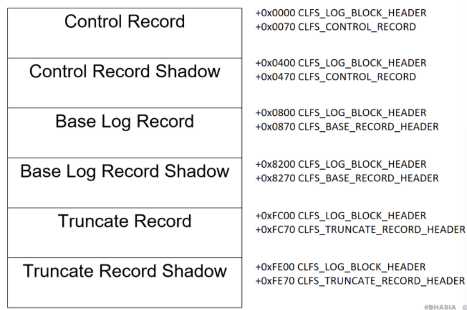
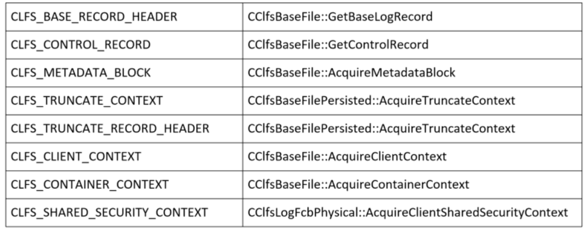
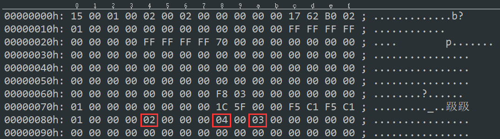
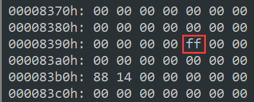
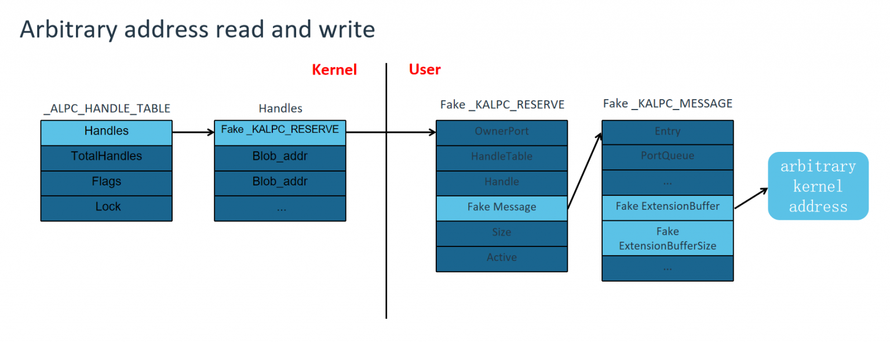

# 针对CLFS的攻击

## CLFS(common log file system)

根据微软官方文档可以知道，通用日志文件系统 (clfs) 是 Windows Vista 引入的一种新的日志记录机制，它负责提供一个高性能、通用的日志文件子系统，供专用客户端应用程序使用，多个客户端可以共享以优化日志访问。  

- Windows Vista简介：  
  - Windows Vista是微软开发的Windows NT操作系统的主要版本。它是五年前发布的Windows XP的直接继承者，当时是Microsoft Windows桌面操作系统连续发布之间最长的时间跨度。开发于 2006 年 11 月 8 日完成，在接下来的三个月中，它分阶段发布给计算机硬件和软件制造商、商业客户和零售渠道。2007 年 1 月 30 日，它在国际上发布，可从 Windows 应用商店购买和下载;这是通过数字分发平台提供的第一个Windows版本。  
  - Windows Vista的新功能包括更新的图形用户界面和称为Aero的视觉样式，称为Windows Search的新搜索组件，重新设计的网络，音频，打印和显示子系统，以及新的多媒体工具，如Windows DVD Maker。Vista旨在提高家庭网络上机器之间的通信水平，使用点对点技术来简化计算机和设备之间的文件和媒体共享。Windows Vista包含.NET Framework的3.0版，允许软件开发人员在没有传统Windows API的情况下编写应用程序。Windows Vista 删除了对没有 ACPI 的设备的支持.  
  
### BLF文件

- 我们可以使用 CreateLogFile 函数创建或打开一个日志文件 (.blf),日志可以通过 CloseHandle 函数关闭。 
```
CLFSUSER_API HANDLE CreateLogFile(
  [in]           LPCWSTR               pszLogFileName,
  [in]           ACCESS_MASK           fDesiredAccess,
  [in]           DWORD                 dwShareMode,
  [in, optional] LPSECURITY_ATTRIBUTES psaLogFile,
  [in]           ULONG                 fCreateDisposition,
  [in]           ULONG                 fFlagsAndAttributes
);
```
- 日志名决定这个日志为单路日志还是多路日志，日志名格式为
```
 (log :<LogName>[::<LogStreamName>])
```

- BLF格式
  
在日志文件中有6个不同的元数据块，分别为Control Record、Base Record、Truncate Record以及三个对应的shadow blocks。在每个元数据块开始也会有一个_CLFS_LOG_BLOCK_HEADER用来保存一些基本信息。

- 一个CLFS日志的存储由两部分组成：

1.	**包含元数据（metadata）的base log file（BLF）**；BLF文件大小通常为64KB，但是可以根据需要增长，其中包含了日志存储所需的一些元信息，例如日志的起始位置，容器的大小和路径，日志名称，客户端信息等，考虑到日志恢复的需要，BLF文件中包含了一份元数据的拷贝，使用dump count参数来识别哪份信息是最新的。

2.	**最多1023个包含真正数据的容器文件**；容器是一个活动的日志流在空间上的基础分配单元，同一日志中的容器大小是一致的，是512KB（一个扇区的大小）的倍数，最大为4GB，CLFS客户端通过增加和删除容器实现日志流的扩大和缩小，在实现时，CLFS把容器当作BLF所在卷上的一个连续文件，通过在逻辑上将多个容器串在一起，形成包含一条日志的单个逻辑顺序磁盘区。初始化的时候一条日志至少要分配两个容器。CLFS使用日志块对记录进行组织管理，每个日志块由多个512字节的扇区组成，之后对日志数据的读取和写入操作都在日志块上进行。

- _CLFS_LOG_BLOCK_HEADER结构

```
typedef struct _CLFS_LOG_BLOCK_HEADER
{
UCHAR MajorVersion;
UCHAR MinorVersion;
UCHAR Usn;
CLFS_CLIENT_ID ClientId;
USHORT TotalSectorCount;
USHORT ValidSectorCount;
ULONG Padding;
ULONG Checksum;         // 日志块数据的校验和（Crc32校验）
ULONG Flags;
CLFS_LSN CurrentLsn;
CLFS_LSN NextLsn;
ULONG RecordOffsets[16];       // 每个记录的偏移值
ULONG SignaturesOffset;         // 一块内存的偏移值
} CLFS_LOG_BLOCK_HEADER, *PCLFS_LOG_BLOCK_HEADER;
```
- tip:
  - Checksum是该日志块数据的校验和，在读取数据时会对该数据进行校验，采用的是CRC32的校验方式。
  - RecordOffsets保存每一个记录的偏移值，第一个记录与BlockHeader相连，偏移为sizeof(CLFS_LOG_BLOCK_HEADER)，也就是0x70；
  - SignaturesOffset字段保存了一块内存的偏移值，日志在编码时每0x200字节的最后两个字节将被签名所覆盖，被覆盖前的数据将存放在SignaturesOffset字段所计算偏移的内存中。当解码的时候再将这段内存中保存的数据写回到原来的区域，编码和解码的函数分别为ClfsEncodeBlock和ClfsDecodeBlock
  - 由于在编码阶段每个扇区的最后两个字节被改写成了扇区签名，因此需要对原始数据进行备份，日志块的最后一个扇区结尾处，有一个签名数组，这个数组中就保存了原始数据，由_CLFS_LOG_BLOCK_HEADER中的SignatureOffset表示。在写入日志的时候，可以比较每个扇区结尾签名位置的数据是否和签名数组中的数据一致来判断写入是否成功。

- _CLFS_CONTROL_RECORD结构
```
typedef struct _CLFS_CONTROL_RECORD
{
    CLFS_METADATA_RECORD_HEADER hdrControlRecord;
    ULONGLONG ullMagicValue;
    UCHAR Version;
    CLFS_EXTEND_STATE eExtendState;
    USHORT iExtendBlock;
    USHORT iFlushBlock;
    ULONG cNewBlockSectors;
    ULONG cExtendStartSectors;
    ULONG cExtendSectors;
    CLFS_TRUNCATE_CONTEXT cxTruncate;
    USHORT cBlocks;
    ULONG cReserved;
    CLFS_METADATA_BLOCK rgBlocks[ANYSIZE_ARRAY];
} CLFS_CONTROL_RECORD, *PCLFS_CONTROL_RECORD;
typedef struct _CLFS_METADATA_BLOCK
{
    union
    {
        PUCHAR pbImage; // 指向内存中数据的指针，
        ULONGLONG ullAlignment;
    };
    ULONG cbImage;          // 日志块的大小
    ULONG cbOffset; // 偏移
    CLFS_METADATA_BLOCK_TYPE eBlockType;
} CLFS_METADATA_BLOCK, *PCLFS_METADATA_BLOCK;
```
- tip:包含了有关布局，扩展区域以及截断区域的信息，其中cBlocks表示整个文件中包含的日志块的数量。


- _CLFS_BASE_RECORD_HEADER格式
```
typedef struct _CLFS_BASE_RECORD_HEADER
{
    CLFS_METADATA_RECORD_HEADER hdrBaseRecord;
    CLFS_LOG_ID cidLog;
    ULONGLONG rgClientSymTbl[CLIENT_SYMTBL_SIZE];
    ULONGLONG rgContainerSymTbl[CONTAINER_SYMTBL_SIZE];
    ULONGLONG rgSecuritySymTbl[SHARED_SECURITY_SYMTBL_SIZE];
    ULONG cNextContainer;
    CLFS_CLIENT_ID cNextClient;
    ULONG cFreeContainers;
    ULONG cActiveContainers;             // 当前活跃的容器数
    ULONG cbFreeContainers;
    ULONG cbBusyContainers;
    ULONG rgClients[MAX_CLIENTS_DEFAULT];
    ULONG rgContainers[MAX_CONTAINERS_DEFAULT];   // 保存容器上下文的偏移值
    ULONG cbSymbolZone;
    ULONG cbSector;
    USHORT bUnused;
    CLFS_LOG_STATE eLogState;
    UCHAR cUsn;
    UCHAR cClients;
} CLFS_BASE_RECORD_HEADER, *PCLFS_BASE_RECORD_HEADER;
```

- _CLFS_CONTAINER_CONTEXT结构
```
typedef struct _CLFS_CONTAINER_CONTEXT
{
    CLFS_NODE_ID cidNode;
    ULONGLONG cbContainer;
    CLFS_CONTAINER_ID cidContainer;
    CLFS_CONTAINER_ID cidQueue;
    union
    {
        CClfsContainer* pContainer;    // 指向内核对象的指针，内核对象的首部有虚函数表
        ULONGLONG ullAlignment;
    };
    CLFS_USN usnCurrent;
    CLFS_CONTAINER_STATE eState;
    ULONG cbPrevOffset;
    ULONG cbNextOffset;
} CLFS_CONTAINER_CONTEXT, *PCLFS_CONTAINER_CONTEXT;
```
- tip:包含了因为截断操作而需要对扇区进行更改的客户端信息，以及具体更改的扇区字节。

## CLFS攻击面

### clfs.sys 中日志**文件解析**相关漏洞

针对文件解析的fuzz，步骤有三：

1. 创建日志文件(单路、多路、是否设置 Container 容器)
2. 根据文件格式随机数据
3. 调用函数使 clfs.sys 对日志文件进行解析

- 需要注意的是在每次随机文件内容的时候，需要绕过一个循环冗余校验，伪代码如下
```C
__int64 __fastcall CCrc32::ComputeCrc32(BYTE* Ptr, int Size)
{
  unsigned int Crc;

  for ( int i = 0; i < Size; i++ )
  {
    data = Ptr[i];
    Crc = (Crc >> 8) ^ CCrc32::m_rgCrcTable[(unsigned __int8)Crc ^ data];
  }

  return ~Crc;
}
```

作者在逆向时发现get和acquire的函数会直接读取blf文件，因此后续随机数据要关注他们。
  

#### CVE-2022-21916

伪代码如下：
```C
CClfsBaseFilePersisted::ShiftMetadataBlockDescriptor(this,UINT iFlushBlock,UINT iExtendBlock)
{
  // ...
  NewTotalSize = -1;
  TotalSize = iExtendBlock * this->SectorSize;
  if ( TotalSize > 0xFFFFFFFF )//验算长度，防止溢出
    return STATUS_INTEGER_OVERFLOW;
  TotalSectorSize = this->BaseMetaBlock[iFlushBlock].TotalSectorSize; // 越界读取，未对iFlushBlock做check
  if ( TotalSectorSize + TotalSize >= TotalSectorSize )//检查是否调整空间meta信息，并返回状态用于实际控制
    NewTotalSize = TotalSectorSize + TotalSize;
  Status = TotalSectorSize + TotalSize < TotalSectorSize ? STATUS_INTEGER_OVERFLOW : 0;
  this->BaseMetaBlock[iFlushBlock].TotalSectorSize = NewTotalSize;
  return Status;
}
```

- 漏洞点到达条件：eExtendState 字段设置为 2，此字段存在于 blf 文件 0x84 的位置

- 该函数在解析 CLFS_CONTROL_RECORD 结构的时候出现了问题，该结构可以在 blf 文件偏移 0x70 的位置找到，其中 iFlushBlock 存在于 blf 文件的 0x8A 处，iExtendBlock 存在于文件的 0x88 处，此函数未正确对iFlushBlock进行检查导致了越界漏洞的产生。

  

#### Vulnerability for TianfuCup

伪代码如下：
```C
CClfsLogFcbPhysical::OverflowReferral(CClfsLogFcbPhysical *this, struct _CLFS_LOG_BLOCK_HEADER * LogBlockHeader)
{
  // NewOwnerPage is a Paged Pool of size 0x1000
  NewOwnerPage = &LogBlockHeader->MajorVersion + LogBlockHeader->RecordOffsets[2]; 
  OldOwnerPage = &this->OwnerPage->MajorVersion + this->OwnerPage->RecordOffsets[2];
  ClientId = CClfsBaseFile::HighWaterMarkClientId(this->CClfsBaseFilePersisted); // BaseLogRecord->cNextClient - 1
  i = 0;
  do
  {
    i = i++;
    i *= 2i64;
    *(CLFS_LSN *)&NewOwnerPage[8 * i] = CLFS_LSN_INVALID; // 越界写
    *(_QWORD *)&NewOwnerPage[8 * i + 8] = *(_QWORD *)&OldOwnerPage[8 * i + 8];
  }
  while ( i <= ClientId ); // ClientId > 0x60时导致循环内溢出
}
```
CClfsBaseFile::HighWaterMarkClientId 函数基于cNextClient 负责获取 blf 文件中的 ClientId 信息。其中
```
ClientId = BaseLogRecord->cNextClient - 1;
```
可以通过修改 CLFS_BASE_RECORD_HEADER 结构中的 cNextClient 字段从而控制 ClientId，而 cNextClient 可以直接从 blf 文件中找到并修改。  
  

### clfs.sys 中 **IoCode 处理**相关漏洞

## CLFS漏洞利用

Windows分页池溢出的利用方式一般有如下两种：

1.	WNF 通过溢出占用**_WNF_NAME_INSTANCE结构的StateData指针**可以实现有***限制***的任意地址读写

- WNF的利用方式限制
  - 当**_WNF_NAME_INSTANCE**结构的大小为0xC0或者0xD0，而我们的漏洞是一个大小为0x1000的分页池溢出漏洞，我们无法将0xC0或者0xD0大小的分页池分配在0x1000的分页池后面，所以我们无法利用这个漏洞溢出WNF的_WNF_NAME_INSTANCE结构；
  - Windows通知功能(WNF)是一个(不是很知名的)内核组件，用于在系统中分发通知。它既可以在内核模式中使用，也可以在用户空间中使用，其中包含一组导出(但显然没有记录在案)的API函数和相关的数据结构。应用程序可以订阅特定类型的事件(由StateName标识)，以便在每次发生状态更改(可以与StateData关联)时得到通知。另一方面，发布者组件负责提供与通知一起发送的数据并触发事件；

- 利用方案
  - 可以溢出0x1000大小的**_WNF_STATE_DATA**结构，通过溢出_WNF_STATE_DATA结构中的**AllocateSize**字段，我们可以实现最大长度为0x1000的越界写，它只能越界写0x1000大小的_WNF_STATE_DATA结构后的数据，并且刚好只能越界写16字节，所以我们需要找到一个0x1000大小的分页池结构，然后通过修改这个结构的前16字节来实现任意地址写，我们可以在Windows ALPC中找到这个结构。ALPC（Advanced/Asynchronous Local Procedure Call），是微软发展出来替代LPC，用于本机RPC的一种C/S模型技术。

  - 通过溢出占用 _ALPC_HANDLE_TABLE 结构的 Handles 指针，我们可以实现任意地址的读写。_ALPC_HANDLE_TABLE 的结构如下：
    ```C
    kd> dt nt!_ALPC_HANDLE_TABLE
    +0x000 Handles          : Ptr64 _ALPC_HANDLE_ENTRY
    +0x008 TotalHandles     : Uint4B
    +0x00c Flags            : Uint4B
    +0x010 Lock             : _EX_PUSH_LOCK
    ```
  - 应用流程
  1. NtAlpcCreateResourceReserve 函数来创建1个Reserve Blob，它会调用 AlpcAddHandleTableEntry 函数把刚创建的 Reserve Blob 的地址写入到 _ALPC_HANDLE_TABLE 结构的Handles数组中；
  2. 创建 alpc 端口时，AlpcInitializeHandleTable 函数会被调用来初始化 HandleTable 结构；
  3. 放着 blob 地址的 Handles 初始大小为 0x80 的数组，当重复步骤（1）时，Handles 就会变大，直到达到0x1000可以被利用；
  4. 溢出占用 Handles 数组的 _KALPC_RESERVE 结构的指针就可以伪造一个虚假的 Reserve Blob，用于假冒_KALPC_RESERVE；
  5. 因为 _KALPC_RESERVE 中存储着 Message 的地址，所以你可以进一步伪造一个虚假的 _KALPC_MESSAGE 结构；
    ```C
    kd> dt nt!_KALPC_RESERVE
    +0x000 OwnerPort        : Ptr64 _ALPC_PORT
    +0x008 HandleTable      : Ptr64 _ALPC_HANDLE_TABLE
    +0x010 Handle           : Ptr64 Void
    +0x018 Message          : Ptr64 _KALPC_MESSAGE
    +0x020 Size             : Uint8B
    +0x028 Active           : Int4B
    ```
  6. 任意写：调用 NtAlpcSendWaitReceivePort 函数发送消息时，它会将用户传入的数据写入到 _KALPC_MESSAGE 结构中 ***ExtensionBuffer*** 所指向的地址，写***ExtensionBufferSize***大小;
  7. 任意读：调用 NtAlpcSendWaitReceivePort 函数接收消息时，它会读取 _KALPC_MESSAGE 结构中 ***ExtensionBuffer*** 所指向的地址处的数据，我们可以用它来实现任意地址读取，读***ExtensionBufferSize***大小。
    ```C
    kd> dt nt!_KALPC_MESSAGE
   +0x000 Entry            : _LIST_ENTRY
   +0x010 PortQueue        : Ptr64 _ALPC_PORT
   +0x018 OwnerPort        : Ptr64 _ALPC_PORT
   +0x020 WaitingThread    : Ptr64 _ETHREAD
   +0x028 u1               : <anonymous-tag>
   +0x02c SequenceNo       : Int4B
   +0x030 QuotaProcess     : Ptr64 _EPROCESS
   +0x030 QuotaBlock       : Ptr64 Void
   +0x038 CancelSequencePort : Ptr64 _ALPC_PORT
   +0x040 CancelQueuePort  : Ptr64 _ALPC_PORT
   +0x048 CancelSequenceNo : Int4B
   +0x050 CancelListEntry  : _LIST_ENTRY
   +0x060 Reserve          : Ptr64 _KALPC_RESERVE
   +0x068 MessageAttributes : _KALPC_MESSAGE_ATTRIBUTES
   +0x0b0 DataUserVa       : Ptr64 Void
   +0x0b8 CommunicationInfo : Ptr64 _ALPC_COMMUNICATION_INFO
   +0x0c0 ConnectionPort   : Ptr64 _ALPC_PORT
   +0x0c8 ServerThread     : Ptr64 _ETHREAD
   +0x0d0 WakeReference    : Ptr64 Void
   +0x0d8 WakeReference2   : Ptr64 Void
   +0x0e0 ExtensionBuffer  : Ptr64 Void
   +0x0e8 ExtensionBufferSize : Uint8B
   +0x0f0 PortMessage      : _PORT_MESSAGE
    ```

  

- 具体利用流程：

  1. 调用 NtUpdateWnfStateData 去喷射大量的 0x1000 大小的 _WNF_STATE_DATA 结构，然后让它们在内存中相邻排列；
  2. 调用 NtDeleteWnfStateName 函数在这之中创建大量的内存空洞；
  3. 创建存在漏洞的池块：
     1. 创建一个 Multiplexed 类型的 blf 文件，并存在两个 container 文件，然后向 container 中写入大量的 record 记录，当记录的长度超过 0x7f000 的时候，写入 record 时会自动创建 Ownerpage 页到 container 中。
     2. 调用 CreateLogFile 去打开一个 Multiplexed 类型的 blf 文件，该函数会解析 container，并在内存中创建 Ownerpage 池块。
  4. 利用OverflowReferral 函数实现越界写操作，覆盖相邻wnf；本文中WNF 的 AllocatedSize 成员从0x000 00ff0 0010 0904覆盖为 0xffff ffff 0000 0000；
  5. WNF 块后面分配一个 Handles 结构，由于WNF 有 0x1000 大小的写入限制，写入的起始位置在WNF 结构 +0x10 的偏移处，所以我们只能向下一个块写入16字节长度的内容。
  6. 将 Handles 原来的指针成员，替换成了我们自己的指针 0x00000282`99055970，该指针指向我们在用户态伪造的 ALPC_RESERVE 结构。
  7. 调用 NtAlpcSendWaitReceivePort ，进入到 AlpcpLookupMessage 函数内，然后调用 AlpcReferenceBlobByHandle 函数，从 Handles 中获取到我们伪造的用户态地址
  8. 伪造的用户态 _KALPC_MESSAGE 结构，需要将 Token 的地址，写入在 _KALPC_MESSAGE+0xe0 偏移处，也就是 ExtensionBuffer 的位置。
  9. NtAlpcSendWaitReceivePort 后，流程会进入到 AlpcpCaptureMessageDataSafe 函数，会调用 memmove 向 ExtensionBuffer (Token的地址) 写入可控的任意内容。这里将 token 的 Privileges 全部覆盖为0xff，获得所有特权；
  10. 打开Procexp.exe 查看利用进程的权限，发现已经获得了 SeDebugPrivilege 权限；

2.	命名管道 通过溢出占用**PipeAttribute结构的Flink指针**可以实现***任意***地址读