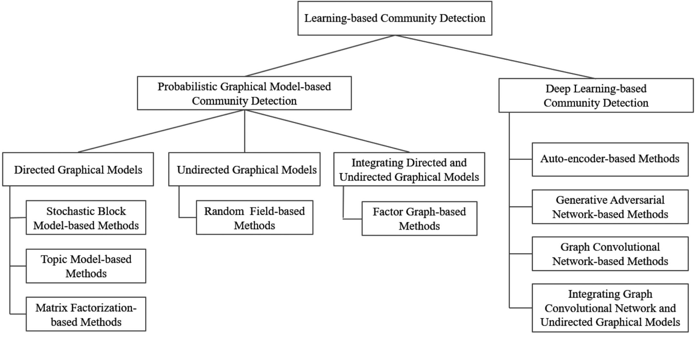
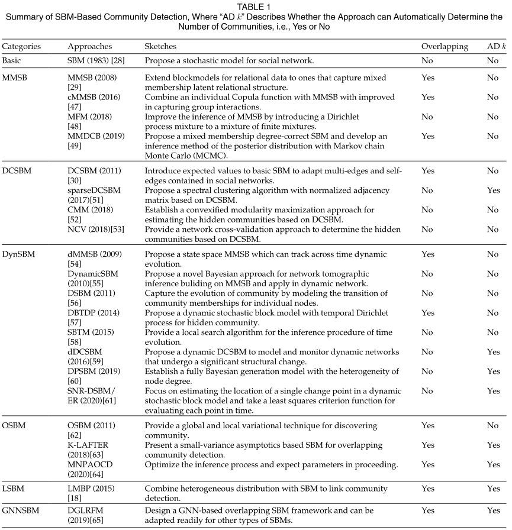
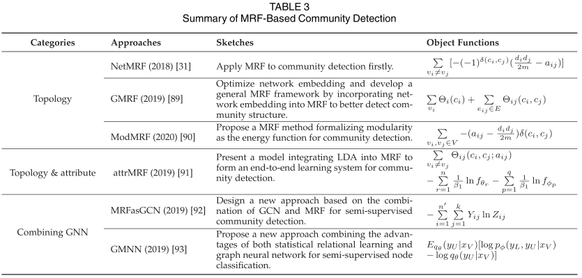
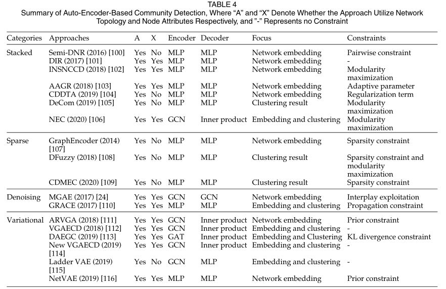

<!--
 * @Author: Suez_kip 287140262@qq.com
 * @Date: 2023-12-17 18:45:45
 * @LastEditTime: 2023-12-19 20:30:38
 * @LastEditors: Suez_kip
 * @Description: 
-->
# 社群探测 CommunityDetection

  

## 常见社群探测分类

- 层次聚类
- 模块化优化
- 谱聚类
- 统计推断
- 基于节点语、节点属性
  - 启发式优化（多目标）
  - 自动编码器
- 生成对抗方法

## 基于学习的社区检测

学习给定网络的网络结构，包括基于模型的生成模型，举例如下：

- SBM随机块模型，通过将网络的生成过程形式化为严格的概率分布序列来检测社区。
- 马尔可夫随机场MRF，一种无向图形模型，以利用网络中的邻域结构；
- 利用卷积神经网络CNN和池化来降低网络维数；
- 图卷积网络（GCN）继承了CNN的优势，直接对网络结构化数据进行操作，也被用于推导社区表示。

### 概率图形模型

使用启发式或元启发式来发现网络社区。采用一些网络结构模型来描述实体（即节点）之间通过网络边缘的依赖关系。根据所使用的概率图形模型的类型，社区检测可以进一步分为三大类：有向图形模型、无向图形模型和混合图形模型。

#### 有向图

基于隐藏变量（即样本中未观察到的变量），利用节点或块结构的相似性，生成网络中观察到的边；

##### 随机block model（SBM）

  

使用节点隶属度似然函数将网络中的节点概率地分配给不同的社区（块结构），然后通过对似然函数进行推理来逐步推断节点隶属度的概率，以导出网络中的隐藏社区。

- 第一步是迭代地为网络中的每个节点分配一个社区；
- 第二步是计算或更新两个节点通过一条边连接的概率。

[计算机社会数字图书馆](Estimation and prediction for
stochastic blockmodels for graphs with latent block structure)

之后基于SBM的隐式推理，对三种推理方法（启发式谱方法、平均场相似、置信传播）进行了研究。由于不可重复划分，混合隶属度SBM（MMSB）通过引入随机模型是节点可以被划分在多个社区。

将迪利克雷过程引入有限混合物的混合物来改进MMSB的推断，提出混合隶属度矫正SBM，利用马尔可夫链蒙特卡罗（MCMC）开发后验分布的推理工具，提高MMSB的嵌入性能。

通过将度矫正引入，用于适应广泛的度分布，基于SBM根据节点的程度划分节点（DCSBM），其向每个节点引入度参数以缩放边缘概率并使期望度与观测度相匹配。使用模型推理，实现对稀疏网络的分析。后提出了一种在DCSBM下估计隐藏社区的凸模块化最大化方法和基于逐块节点对划分的网络交叉验证（NCV）方法来确定DVSBM的隐藏社区；

动态SBM:DSBM，动态随机块模型，通过使用模型参数的分布来代替模型参数的最可能值，以在大型动态稀疏网络中找到社区，并提供离线推断和在线推断来估计参数。后研究者将迪利克雷过程引入，也有包括两个隐式马尔可夫假设的随机转移模型（SBTM），还有使用变点估计优化SBM。基于MMSB的想法，MMSBTM以及具有交叉时间的状态空间混合隶属度随即快模型，以及DVSBM的动态版本。

OSBM表示被设计为寻找重叠社区的SBM（具有全局和局部变分技术的OSBM，以及提供了一个随机模型来适应每个社区中每个节点的相对重要性和期望程度，并改进了其使用的推理技术），LSBM表示被扩展为寻找链路社区的SBM（链接社区通常比节点社区更具信息性和直观性，因为链接通常具有唯一的身份，而节点可能具有多个角色，通过异质分布（例如幂律分布等），引入交互式二分方案对SBM用于链路社区检测），甚至还有将图神经网络与SBM结合。

##### 主题模型

通过结合NLP实现对文本北河隐藏的主题进行建模统计，比如迪利克雷分配（LDA）。此类模型可以分为网络结构建模为文档，以及将用户兴趣等网络属性建模以检测社区。

- 网络结构建模为文档

1. 首先假设网络中的每个节点可能属于多个社区，因此社区被视为“主题”，而节点则被视为是“文档”；
2. 它选择几个初始社区，并根据网络的拓扑结构迭代更新社区，以获得最终的社区；

代表性模型：SSN-LDA一种基于LDA的链路网络上 的分层贝叶斯算法，其中社区被建模为潜在变量，这种社交网络中的节点被视为社会行动者，边缘被视为社交互动。每个社交参与者的社交互动简档（SIP）由一组邻居和权重组成，用于表征参与者。具体而言，社会网络被视为一个语料库，其中社会互动档案被视为文档，社会互动的发生被视为词语。通过SSN-LDA将节点建模为语料库，在转换后的语料库上挖掘社区，该问题等效于利用LDA在语料库上进行主题检测。

- 将用户兴趣等网络属性建模以检测社区

将社区检测和话题模型相结合，来产生了潜在社区话题分析（LCTA），具体来说将采样过程分为用户节点采样和链路采样，对所有网络过程进行采样，并利用这两个阶段的采样结果作为用户节点的采样结果。LCTA为每个用户节点和链接分配社区成员属性。在采样过程之后，可以根据社区成员身份将用户节点分配给社区。优点是两阶段采样过程形成了以用户节点为核心的采样区域，可以模拟用户节点对周围链接的语义影响。缺点是，LCTA在假设社区成员度时没有考虑社交网络的链接关系，这可能会断开单个社区的连接。

还有研究者根据社交网络中关注者的主题信息设计了一个树关系模型，使用层次LDA对树关系模型中的文本信息进行建模，并提出了用于语义社交网络分析的HLDA，另一些研究者提出一种将主题模型与贝叶斯模型相结合的方法。一些研究者介绍了一种生成模型，用于同时识别社区并推导其语义描述。他们将嵌套EM算法与信念传播相结合，并探索这两部分之间的隐藏相关性，以改进生成的社区和描述，还有一些研究者观察到属性通常体现了一种层次语义结构。为了解决这个问题，他们提出了一个新的贝叶斯模型，名为（BTLSC），该模型将单词与背景以及一般主题与专业主题区分开来。

与传统的假设社交网络主题独立的主题模型不同，主题嵌入方法侧重于通过将单词和主题嵌入到主题模型中来描述主题之间的相关性。一种研究提出一种将分布式表示学习与主题相关性建模相结合的主题嵌入模型，还有些研究者开发了一种新的主题嵌入模型，称为社区增强主题嵌入（CeTe），该模型结合主题文档和网络结构来检测社区。CeTe由三个组件组成：一个用于描述主题的文档组件，一个用于表示网络社区的拓扑组件，以及连接前两部分的概率转换机制。具体来说，CeTe使用DCSBM来描述网络社区的子组件，其中社区服从狄利克雷分布，主题服从均匀分布。对于每个文档，社区分配是从多项式分布中提取的，而两个文档之间的链接遵循伯努利分布。对于每个单词，CeTe按照多项式分布绘制主题分布。

##### 矩阵分解

这里的矩阵分解具体为非负矩阵因子分解（NMF），其损失函数有二，一个是A和~A之间差值的Frobenius范数的平方，另一个是测量它们差值的KL散度。此外，对于a对称的无向网络，非负因子分解矩阵W和H应该相等。NMF最初用于识别非重叠社区。由于NMF易于扩展，它已被用于解决其他类型的社区检测问题，如重叠、归因、动态和半监督。

  

- 基础NMF
  - 提出了一种通用的图聚类方法，该方法继承了NMF的优点，对聚类分配矩阵强制执行非负性；
  - 提出了一种新的成对约束非负对称矩阵分解（PCSNMF）方法，该方法施加了由真实社区信息生成的成对约束，以提高社区检测的性能；
  - 设计了一种非负对称编码器-解码器方法，以导出更好的潜在表示，从而改进社区检测，它们将解码器和编码器的损失结合起来构建统一的损失函数，从而使获得的每个节点的社区成员关系更清晰、更具解释性。
- 重叠NMF
  - 开发了一个NMF框架来识别不重叠和重叠的群落结构，以及给出了无向网络的对称NMF公式。此外，他们阐明了非对称NMF和联合NMF的方法，前者能够识别定向网络中的社区结构，而后者更适合于复合网络；
  - 提出了一种聚类隶属模型BIGCLAM，用于检测大规模网络中密集重叠、分层嵌套和非重叠的社区。具体来说，BIGCLAM首先基于节点的社区隶属关系建立社区，即每个节点通过为节点-社区对分配一个非负潜在因子来对每个社区具有隶属强度，然后将NMF与块随机梯度下降相结合，从而估计非负潜在因素来检测大型网络中的社区。
- 属性NMF
  - 将社会关系和用户内容相结合，通过基于非负矩阵三因子化（NMTF）的聚类和三种类型的图正则化来检测社区。然而，上述方法仅仅利用网络拓扑和内容信息来发现社区，而没有考虑如何利用挖掘的内容，即语义信息来解释社区的含义。
  - 提出了一种称为SCI的语义社区识别，它集成了表示网络拓扑的社区成员矩阵和表示语义信息的社区属性矩阵。
- 动态与半监督NMF
  - 利用基于NMF的贝叶斯模型来识别时间网络上的重叠社区，并基于自动相关性确定自动推导每个快照网络中的社区数量。
  - 通过阐明进化谱聚类、进化NMF和进化模块密度优化之间的等价关系，NMF可以应用于动态群落检测。因此，他们利用上述等价关系开发了一种半监督进化NMF方法，称为sENMF，以整合先验信息来检测动态时间网络中的群落。
  - 针对NMF生成的两个非负矩阵，结合先验信息和拓扑信息，提出了一种统一的半监督算法。此外，利用必须链接的先验信息（即由两个节点组成的节点对必须属于同一社区的先验信息），他们在损失函数中添加了一个图正则化项作为惩罚函数，以最小化同一社区中节点之间的差异，从而提高社区检测的性能。

#### 无向图

基于字段结构，使用一元势和成对势的约束（例如，附近节点之间的社区标签一致性）以发现社区；现有的社区检测无向图模型研究主要利用马尔可夫随机场（MRF）；基于MRF的方法可分为三类（如表4所示）：

- 第一类是基于MRF，基于网络拓扑检测社区关系的建模；
  - 首先将MRF应用于网络分析，其中数据组织在具有不规则结构的网络上，并提出了特定网络的MRF方法，其名为NerMRF。该方法有效地将不规则网络的结构特性编码为能量函数，使得能量函数的最小化产生最佳的群落结构。
  - 将模块化函数形式化为统计模型，并提出了一种新的社区检测MRF方法。该方法通过模块化表示的方法重新定义了能量函数，并利用最大和置信传播（BP）来推断模型参数以提高性能。
  - 提出了一种通用的MRF方法，将节点对之间的耦合关系纳入网络嵌入中，以更好地检测社区。在该方法中，能量函数由两个分量组成：一组使网络嵌入发挥主导作用的一元势和一组利用节点对约束来微调一元势的成对势。
- 第二类是利用语义属性的信息；
  - 提出了一种新的模型，命名为attrMRF，将LDA和MRF集成在一起，形成一个端到端的学习系统来联合训练参数。具体来说，attrMRF首先将LDA和MRF转换为统一的因子图，实现了有向图模型（即LDA）和无向图模型的有效集成。然后，它采用反向传播（BP）算法同时训练参数，从而实现两个模型的端到端学习。
- 第三类是将MRF与图神经网络（GNN）相结合；
  - MRFasGCN
  - GMNN

#### 混合图

混合图形模型通常将这两种类型的模型转换为统一的因子图，以利用这两种模型进行社区检测；

- 一种基于因子图的实例化模型，该模型包含三层，即底层（观测节点）、中间层（隐藏向量）和顶层（社区的潜在变量）。它利用节点特征和边缘特征函数来挖掘底层和顶层节点之间的依赖关系，以表示相应的社区，从而更好地检测社区。
- 将因子图模型应用于自我中心网络（人类社会网络的一种表示，用于表示自我与他人之间存在社会关系的网络），并提出了一种以自我为中心的方法来分析社会学术对合作者网络的影响。该方法在统一的因子图中对以自我为中心的社区检测进行建模，采用参数学习算法来估计主题层面的社会影响、这些节点之间的社会关系强度和社区结构，以检测自我-社区结构。
- 采用因子模型来克服有向图形模型（即LDA）和无向图形模型，即MRF）由于参数共享和联合训练而不足以集成的缺陷，并使所发现的社区结构具有语义可解释性。这可以很好地克服两个模型的参数难以通过因子图和信念传播共享和一起训练的困难。

### 基于深度学习

通过一些学习策略将网络数据从原始输入空间映射到低维特征空间，从而获得新的网络表示，具有计算复杂度低、并行化能力强的优点。

常见五种类型如下：

#### 直接使用深度学习

- 基于细胞神经网络和邻接矩阵的拓扑特征，设计了一种用于自动社区检测的新方法。（A deep learning based community detection
approach）
- 提出了一种概率生成模型，即vGraph，用于联合检测重叠（和非重叠）社区并学习节点（和社区）表示。（vGraph: A generative model for joint community detection and node representation learning）
- 社区检测、社区嵌入和节点嵌入之间存在闭环关系。在这一见解的指导下，他们提出了一种新的社区嵌入方法，称为ComE，以共同解决这三项任务。（Learning community embedding with community detection and node embedding on graphs）
- 设计了一种新颖的自翻译网络嵌入（STNE）方法，将内容序列映射到节点身份序列以改进社区检测。（Content to node: Self-translation network embedding）

#### 基于自动编码器

  

利用无监督自动编码器，将网络编码为潜在空间中的低维表示，并从低维表示重建网络及其社区结构。自动编码器的目标是最小化原始输入和重建数据之间的误差。由于大多数基于自动编码器的方法都将网络嵌入作为其输出，因此随后应用聚类（如Kmeans和谱聚类）来提取社区。另一种选择是将聚类集成到模型中，以直接发现社区。

根据使用的自动编码器的类型，我们将模型分为四种类型，即堆叠式、稀疏式、去噪式和变分式自动编码器：

##### 堆叠式自动编码器

堆叠式自动编码器是由一系列自动编码器组成的基本类型，通常用作其他类型自动编码器的块。

- semi-DNR堆叠一系列自动编码器，以形成输入网络的深度非线性重构（DNR），并要求编码器的每一层包含比前一层更少的神经元，以降低数据维度并提取输入数据中最显著的特征。
- DeCom中的分层堆叠自动编码器来根据网络的结构找到种子节点并将节点添加到社区中。DeCom适合处理大型网络，并且由于自适应学习过程，无需预先定义社区的数量。
- CDDTA有效地结合了迁移学习和自动编码器。
- AAGR和DIR利用堆叠的自动编码器自适应地融合拓扑和属性的信息，从而很好地实现了网络拓扑和节点属性之间的平衡。
- NEC采用图卷积网络对网络数据进行编码和解码，以拓扑和属性信息为输入，但仅选择重构邻接矩阵，以确保模型在没有节点属性的情况下仍然可以工作。

##### 稀疏式自动编码器

通过向自动编码器添加稀疏约束来自适应地找到最优表示。GraphEncoder为隐藏层引入了一个显式正则化项，以限制隐藏表示的大小。

- DFuzzy是一个以稀疏自动编码器为构建块的并行且可扩展的模糊聚类模型。它使用个性化PageRank训练自动编码器，这对于捕获网络节点之间的关系是有效的。
- CDMEC将迁移学习与自动编码器相结合，其中输入矩阵A用于构建复杂网络的四个相似矩阵。CDMEC将一个矩阵作为源域，将其他三个矩阵作为目标域，以获得多个不同的低维特征表示。然后，将所有表示放入聚类算法中，并将聚类结果集成到一个新的一致性矩阵Q中。引入一致性矩阵Q来测量聚类结果中样本的共现性，其中Qij表示vi和vj被分组到同一类中的平均时间。

##### 去噪式自动编码器

去噪自动编码器可以应用于有噪声的输入，以获得对噪声鲁棒的节点表示。

- MAGE首先采用卷积网络来整合内容和结构信息，然后在自动编码器过程中迭代地将随机噪声添加到内容信息中。通过这种方式，结构信息和内容信息被整合到一个统一的框架中，并且可以分析两者之间的相互作用。
- GRACE来处理动态网络。他们在考虑网络动力学的情况下对集群进行建模，并认为集群的形成需要动态嵌入才能达到稳定状态。

##### 变分式自动编码器

#### 基于生成对抗网络

通过生成器和鉴别器之间的对抗性游戏来检测社区。

#### 基于GCN

过特征在网络拓扑上的传播和聚合来提取社区。

#### 集成图卷积网络和无向图形模型

集成了图形卷积网络和无向图形模型，例如，通过转换马尔可夫随机场层转换为GCN来集成卷积网络和无向图模型；

## Reference

[2023 IEEE From Statistical Modeling to Deeplearning](../%E5%85%B6%E4%BB%96%E5%88%86%E7%B1%BB/Graph/A_Survey_of_Community_Detection_Approaches_From_Statistical_Modeling_to_Deep_Learning.pdf)
