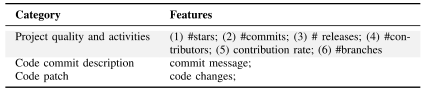
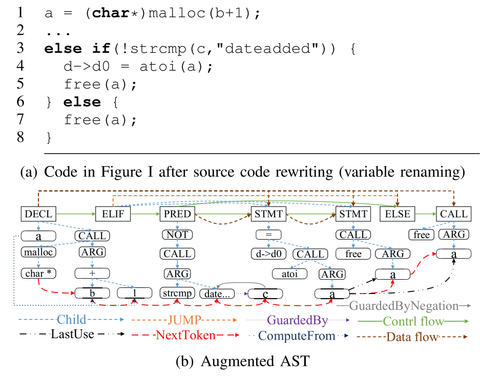
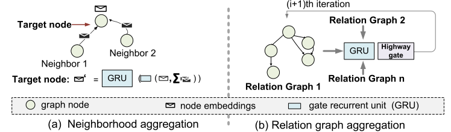
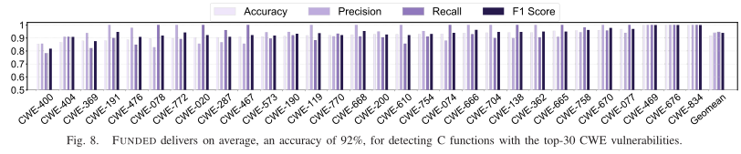
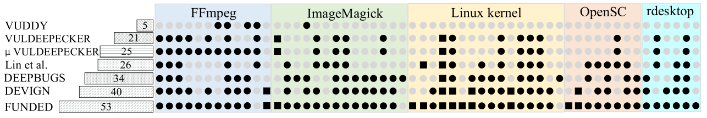

<!--
 * @Author: Suez_kip 287140262@qq.com
 * @Date: 2022-11-22 10:08:30
 * @LastEditTime: 2022-12-03 20:31:54
 * @LastEditors: Suez_kip
 * @Description: 
 * 
-->
# Combining Graph-Based Learning With Automated Data Collection for Code Vulnerability Detection

[论文链接](../AI漏洞挖掘/Graph/Combining_Graph-Based_Learning_With_Automated_Data_Collection_for_Code_Vulnerability_Detection.pdf)

- 标准GNN在具有非类型化边的单个图形表示上运行，因此无法区分控制和数据流信息。
- FUNDED扩展了GNN区分和建模多个代码关系的能力。不同的关系图编码不同的代码关系，然后使用可学习的、特定于关系的函数在关系图中传播和聚合信息来实现的。
- 基于GGNN的建模与区分多代码关系；

## 漏洞自动收集系统

预测代码提交是否用于修补代码漏洞，当前的实现只考虑每次修改一个源文件的代码修订；  

- 使用多个预测模型，应用共形预测PyCP来测量单个模型给出的预测的统计有效置信度，本文中置信度阈值为0.3。其中针对不同置信度的专家系统：
  - 低置信度的预测：开发人员检查，以提供基本事实，然后作为额外的训练数据；
  - 高置信度的预测：多数投票方案来汇总剩余的预测结果；
- 具体专家系统设计：
  - 输入：正则表达式（RE）规则来选择可能与漏洞相关的提交；提交消息特征和提交的代码更改；
  - 输出：是否为漏洞补丁；
  - 包括以下五个专家模型：
    - 支持向量机（SVM）
    - 随机森林（RF）
    - k近邻（KNN）
    - 逻辑回归（LR）
    - 梯度增强（GB）
- 专家系统的训练：
  - 使用相同3000多个手动标记的代码提交（来自以C或Java为主要语言的项目）来训练专家模型：
    - CVE+NVD：如果先前在CVE中报告了已识别的漏洞，CVE编号与CVE描述建立链接。否则手动提取包含漏洞的代码段、提交日志和问题报告（如果有）；
    - GitHub上托管的开源项目中提取的提交日志和补丁（1000个排名靠前的项目，主要为C&Java，因此选这两个语言）；
  
使用预训练的word2vec网络将提交消息和修改的代码语句映射到嵌入向量，分为以下三种方向：  
  

## 漏洞检测系统

\TODO III. OVERVIEW OF OUR APPROACH

  

GGNN由基于门控递归单元（GRU）的四个堆叠嵌入模型组成

代码预处理：命名方案标准化：

- 程序图：为有向关系图（图G加后向边，后向边提供更多边数量和类型，有助于跨关系图传播信息），是基于AST的扩展图：

1. 共包含节点两类；处理方案：word2vec将节点类型和AST节点名的嵌入连接；
   1. 语法节点（语言语法中的非终结符，语句、代码块，如if,函数声明）
   2. 语法标记（如标识符名称和常量值）
2. 共包含九种边类型：
   1. 标准AST中的父子关系；
   2. 数据流：从PCDG提取至AST；
   3. 控制流：从PCDG提取至AST；
   4. GuardedBy: 连接AST参数的token与变量的封闭保护表达式；如if（A）{B}表达式B对应到A这个封闭守护表达式；
   5. Jump: 变量与控件依赖项连接，GuardedBy和Jump可用于描述控制流；
   6. 计算源于: v=expression；
   7. 下一token: 每个语法标记连接到其后续节点；
   8. 上次使用: 对同一个变量的上次操作，可以刻画数据流；
   9. 上次词典使用: 对同一个变量的上一次statement操作，可以刻画控制流；

多关系GNN在关系图上生成100个特征的全局一维嵌入：

- 节点嵌入更新：节点通过将其嵌入向量作为消息发送给沿边缘的所有邻居来交换信息。在每个节点，消息被聚合，然后用于下一次迭代更新关联的节点表示。
- 多关系建模：

1. 使用可学习的、特定于关系的函数来通过邻域聚合计算单个关系图的新图状态。
2. GRU单元来聚合和更新关系图中相同节点的状态。
  

- 使用读出函数，连接所有邻域聚合迭代和嵌入层的图表示后输出向量hG，作为m个关系图的全局程序表示；

## RESULT

benchmark:VCCFINDER ,SABETTA ,VULPECKER , ZVD and ZHOU.  
  
  

## 模型的准确率方案

机器学习模型的表现好坏多由训练数据与待预测的真实数据决定，模型的泛化力不同，根据收到的数据不同，预测效果也好坏不一。因此，如何选择适合的模型、如何预测模型是否会失效、模型的准确度如何，都是需要解决的问题。
同时，真实数据多根据外界环境的变化而有敏锐的改变，因此机器学习模型也需要不断更新。而这一过程如果由人力来操作则是复杂甚至不现实的，因此最好是由自动化的算法实现。工业生产中的数据往往没有标注，因此传统的将预测结果和标注对比的方式并不能预测生产过程中机器学习模型的准确度。
为了尝试解决以上这些问题，预测模型的准确率的方法被提出。

### I　共型预测

1. 使用训练集训练出一个模型，此处简称原模型；
2. 使用训练集的数据以及原模型对训练集作出的预测相结合作为训练集，训练出一个新的模型（此处称为CP模型）
3. CP模型的输入特征可以与原模型的输入不同（两个模型的特征相关但不一定要完全一致）CP模型的输出是1个置信度和1个不一致程度。CP模型直接使用新模型去拟合原模型输出是否与真实y值不一致的程度（如直接拟合差值的绝对值等，原论文中未出现明确的方法），然后会通过公式将该值映射到0~1之间的值：$p^f=\frac{|{i=1,...,n|\aleph^y_i\geq aleph^y_n}|}{n}$||代表数量值;

### II MMP（Model Performance Prediction）

MPP模型是一个二分类模型，其输出了原模型是否会预测正确的判断;

1. 使用训练集训练出一个模型，此处简称原模
2. 使用训练集的数据以及原模型对训练集作出的预测相结合作为训练集，训练出一个新的模型（此处称为MPP模型）MPP模型的输入特征可以与原模型的输入不同（两个模型的特征相关但不一定要完全一致）MPP模型的输出是0（预测错误）或1（预测正确），在这里有两种情况：分类与拟合，在分类时，原模型预测正确则向MPP模型输入y=1，反之输入y=0；在拟合时，人为规定一个阈值ε，如果原模型预测的结果与真实值相差小于阈值则判断为预测正确，向MPP模型输入y=1，反之输入y=0;
3. 在拟合问题中，阈值ε的取值使用了空模型理论（the null model concept）与REC(Regression Error Characteristic)肘部法则来确定;
