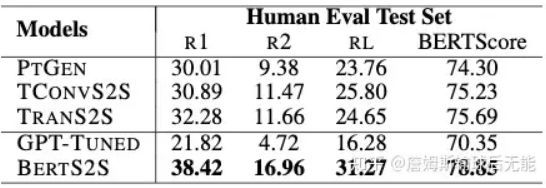
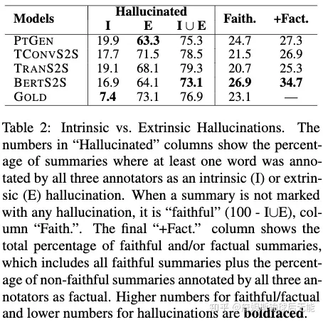
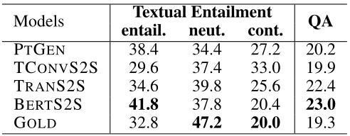
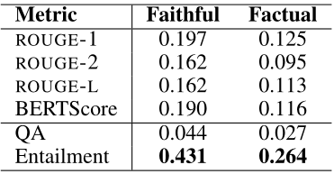
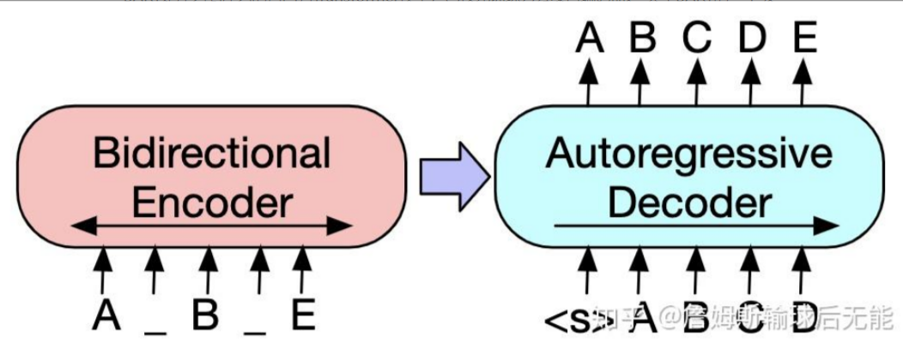
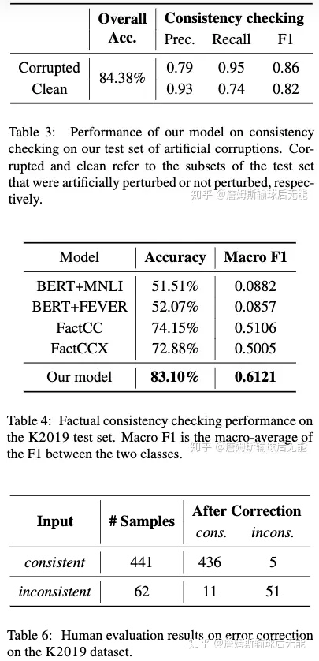

<!--
 * @Author: Suez_kip 287140262@qq.com
 * @Date: 2023-05-15 15:33:13
 * @LastEditTime: 2023-05-15 21:12:52
 * @LastEditors: Suez_kip
 * @Description: 
-->
# Factual Consistency 事实一致性

事实一致性的问题与自然语言推理（NLI）和事实检查紧密相关。  
当前的NLI数据集专注于对短而单个的句子对之间的逻辑进行分类，但要验证事实的一致性可能需要结合源文档。

- 事实检查（fact checking）的重点是根据所有可用知识对事实进行核实；
- 事实一致性的检查（factual consistency checking）则侧重于将事实遵守原始文档所提供的信息，而无需保证信息是真实的。

## 自然语言推理 NLI

自然语言推理主要是判断两个句子（前提Premise, 假设Hypothesis）或者两个词之间的语义关系，为了保证模型能够集中在语义理解上，该任务最终退化为一个分类任务，目前类别主要是三分类（蕴含Entailment，矛盾Contradiction，中立Neutral）。  
目前对这三类有各种各样的定义，但是我认为这三类的分类依据还是要落在语义理解上，通过语义关系来确定类别。

研究问题：  

### Accuracy

### Lexical Knowledge

词汇知识，对假设句单独修改一个词来做比较，在没有相关数据进行训练或无法确切理解词汇的情况下，会存在问题；

### Annotation Artifacts

来自论文Annotation Artifacts in Natural Language Inference Data；  
注释任务的框架对群体工作者在创作假设时做出的语言生成选择有显著影响，从而在数据中产生某些模式。  

- 许多数据集包含注释工件；
- 受监督的模型利用注释工件：监督词汇推理模型在很大程度上依赖于数据集中的人工产物，特别是一些单词作为原型超同义词的趋势；
- 注释工件夸大了模型性能；

### 事实检测

检测互联网上的虚假信息,将事实核查定义为在特定上下文中对某一主张赋予真理值。因此，将其视为二元分类任务是很自然的。然而通常情况下，这些说法并不完全正确或错误，并不是二分类的。比如在不同条件下的事实是不同的。  

FEVER问题Fact Extraction and VERification；

- FEVER: A large-scale dataset for fact extraction and VERification:
  - 一个包含145449个训练声明的数据集，并组织了两个竞赛（即共享任务），其中提出了几个模型。
- Feverous: Fact extraction and verification over unstructured and structured information

[自然语言推理](https://little1tow.github.io/2018/05/28/NLI-introduce/)

## 事实一致性检查

### 下文中的理论都是相关文本摘要模型下的事实一致性

***[ACL 2020] On Faithfulness and Factuality in Abstractive Summarization***  

序列到序列的生成模型需要学习如何在忠实于源文本和构建流畅的语言模型之间寻求平衡。双重目标使得抽象摘要模型很容易产生与源文档不符的幻觉内容。抽象模型生成的摘要中多达30％包含事实不一致。

幻觉分为内在幻觉和外在幻觉：

- 内在幻觉出现了与输入信息的矛盾，是必然需要着重避免的；
- 外在幻觉只是信息不存在于输入中，其正误并不确定；
- 在一些情况下，外在幻觉甚至是可以利用的对象。幻觉性问题是文本生成领域的根本问题之一；

在大模型中，foundation model本身任务中基本上不会携带文本信息，而是只有prompt，

首先，内在和外在的幻觉经常发生，超过70％的单句摘要。
其次，大多数幻觉是外在的，可能是使用背景知识的有效抽象。但是，我们的研究发现，超过90％的外在幻觉是错误的。因此，幻觉发生在大多数摘要中，并且其中大多数既不忠实也不是事实。
第三，用预训练参数初始化的模型在自动度量和对真实性/事实的人工判断上均表现最佳，它们具有的外在幻觉百分比最高。

在某些情况下，由于两个比较句子中的任何一个都存在歧义，因此可能需要从源文档获得更长的多句子上下文。 摘要句子可能会解释源文档的多个片段，而源文档句子可能会使用某些语言结构（例如共指）将文档的不同部分绑定在一起。

DataBase：

- 摘要XSUM数据集，其中包括226,711个BBC文章以及由他们撰写文章的记者提供的单句摘要；
- Multi-NLI数据集（Williams等人，2018）；

分析了一下几个模型：

- RNN-based Seq2Seq
- Topic-aware Convolutional Seq2Seq
- Transformer-based Abstractive Methods：
  - GPT-TUNED：提出了基于Transformer的生成式预训练（GPT）语言模型；

- TRANS2S
- BERTS2S

评价标准ROUGE（Lin和Hovy，2003）得分，BERTScore（Zhang等人，2020）和语义推断度量，例如文本蕴含度。
  

  
$Faith = ( 100 - I \cup E )$
+Fact = percentage of faithful and/or factual summaries

  
基于文本暗示和问答（QA）的总结评估措施。摘要包含（包含）文档、对文档中立（中性）和与文档矛盾（矛盾）的次数百分比。  

  
具有忠实和事实注释的不同度量的斯皮尔曼相关系数（|rs|）（评估的两变量的单调关系）  

***[EMNLP 2020] Factual Error Correction for Abstractive Summarization Models***  

针对三元组（s'，s，d）的训练，其中d为源文本、参考摘要s、不一致摘要s'；  
使用BART（自回归的Transformer的seq2seq）作为摘要校正器的基础，因为它在条件文本生成任务中表现出了卓越的性能水平；可以表示为在编码器-解码器模型中最大化P（s | s'，d）的可能性的问题；  

  
  

### 下文中的理论都是相关QA问题的事实一致性

***Asking and Answering Questions to Evaluate the Factual Consistency of Summaries***

这项工作介绍了一个评估条件文本生成的一般框架，它被设计用来检测与某些输入相关的生成文本中的事实不一致性。该框架包括三个步骤:

1. 给定生成的文本，问题生成(QG)模型生成一组关于文本的问题；
2. 使用问答(QA)模型来回答输入和生成的文本；
3. 根据对应答案的相似度计算分数；

文章利用这个框架开发了QAGS(问题回答和摘要生成)，这是一种评估摘要事实性的度量。相比ROUGE，QAGS表现出了明显与人类评估更高的相关度，同时也超越了以往基于NLI的评估模型。  

文章接着指出了使用基于n-gram重合度的生成任务判别指标的缺陷：  

1. 这些度量标准需要一、多个引用文本来进行比较。获得引用可能是困难的，在高熵值的生成任务中更加困难，例如摘要或对话。在这些情况下，与单一的参考相比不充分。
2. 如果单参考比较，基于n-gram的方法对文本的所有部分进行同等的权衡，即使只有一小部分n-gram包含了大部分的语义内容。由小的变化引起的事实不一致可能被其他高n-gram的重叠淹没，使这些度量对这些错误不敏感。
