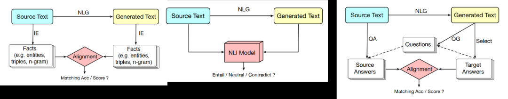
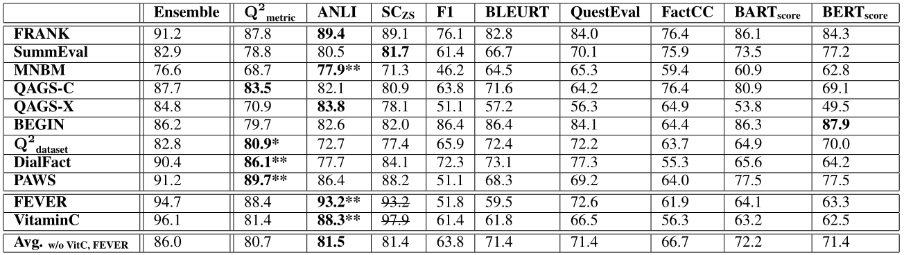
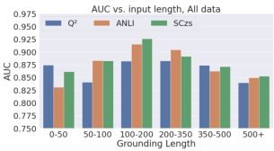

<!--
 * @Author: Suez_kip 287140262@qq.com
 * @Date: 2023-05-15 15:33:13
 * @LastEditTime: 2023-05-22 21:23:25
 * @LastEditors: Suez_kip
 * @Description: 
-->
# Factual Consistency 事实一致性

事实一致性的问题与自然语言推理（NLI）和事实检查紧密相关。  
当前的NLI数据集专注于对短而单个的句子对之间的逻辑进行分类，但要验证事实的一致性可能需要结合源文档。

- 事实检查（fact checking）的重点是根据所有可用知识对事实进行核实；
- 事实一致性的检查（factual consistency checking）则侧重于将事实遵守原始文档所提供的信息，而无需保证信息是真实的。

## 自然语言推理 NLI

自然语言推理主要是判断两个句子（前提Premise, 假设Hypothesis）或者两个词之间的语义关系，为了保证模型能够集中在语义理解上，该任务最终退化为一个分类任务，目前类别主要是三分类（蕴含Entailment，矛盾Contradiction，中立Neutral）。  
目前对这三类有各种各样的定义，但是我认为这三类的分类依据还是要落在语义理解上，通过语义关系来确定类别。

研究问题：  

### Accuracy

### Lexical Knowledge

词汇知识，对假设句单独修改一个词来做比较，在没有相关数据进行训练或无法确切理解词汇的情况下，会存在问题；

### Annotation Artifacts

来自论文Annotation Artifacts in Natural Language Inference Data；  
注释任务的框架对群体工作者在创作假设时做出的语言生成选择有显著影响，从而在数据中产生某些模式。  

- 许多数据集包含注释工件；
- 受监督的模型利用注释工件：监督词汇推理模型在很大程度上依赖于数据集中的人工产物，特别是一些单词作为原型超同义词的趋势；
- 注释工件夸大了模型性能；

### 事实检测

检测互联网上的虚假信息,将事实核查定义为在特定上下文中对某一主张赋予真理值。因此，将其视为二元分类任务是很自然的。然而通常情况下，这些说法并不完全正确或错误，并不是二分类的。比如在不同条件下的事实是不同的。  

FEVER问题Fact Extraction and VERification；

- FEVER: A large-scale dataset for fact extraction and VERification:
  - 一个包含145449个训练声明的数据集，并组织了两个竞赛（即共享任务），其中提出了几个模型。
- Feverous: Fact extraction and verification over unstructured and structured information

[自然语言推理](https://little1tow.github.io/2018/05/28/NLI-introduce/)

## 事实一致性检查

### 下文中的理论都是相关文本摘要模型下的事实一致性

***[ACL 2020] On Faithfulness and Factuality in Abstractive Summarization***  

序列到序列的生成模型需要学习如何在忠实于源文本和构建流畅的语言模型之间寻求平衡。双重目标使得抽象摘要模型很容易产生与源文档不符的幻觉内容。抽象模型生成的摘要中多达30％包含事实不一致。

幻觉分为内在幻觉和外在幻觉：

- 内在幻觉出现了与输入信息的矛盾，是必然需要着重避免的；
- 外在幻觉只是信息不存在于输入中，其正误并不确定；
- 在一些情况下，外在幻觉甚至是可以利用的对象。幻觉性问题是文本生成领域的根本问题之一；

在大模型中，foundation model本身任务中基本上不会携带文本信息，而是只有prompt，

首先，内在和外在的幻觉经常发生，超过70％的单句摘要。
其次，大多数幻觉是外在的，可能是使用背景知识的有效抽象。但是，我们的研究发现，超过90％的外在幻觉是错误的。因此，幻觉发生在大多数摘要中，并且其中大多数既不忠实也不是事实。
第三，用预训练参数初始化的模型在自动度量和对真实性/事实的人工判断上均表现最佳，它们具有的外在幻觉百分比最高。

在某些情况下，由于两个比较句子中的任何一个都存在歧义，因此可能需要从源文档获得更长的多句子上下文。 摘要句子可能会解释源文档的多个片段，而源文档句子可能会使用某些语言结构（例如共指）将文档的不同部分绑定在一起。

DataBase：

- 摘要XSUM数据集，其中包括226,711个BBC文章以及由他们撰写文章的记者提供的单句摘要；
- Multi-NLI数据集（Williams等人，2018）；

分析了一下几个模型：

- RNN-based Seq2Seq
- Topic-aware Convolutional Seq2Seq
- Transformer-based Abstractive Methods：
  - GPT-TUNED：提出了基于Transformer的生成式预训练（GPT）语言模型；

- TRANS2S
- BERTS2S

评价标准ROUGE（Lin和Hovy，2003）得分，BERTScore（Zhang等人，2020）和语义推断度量，例如文本蕴含度。
  

  
$Faith = ( 100 - I \cup E )$
+Fact = percentage of faithful and/or factual summaries

  
基于文本暗示和问答（QA）的总结评估措施。摘要包含（包含）文档、对文档中立（中性）和与文档矛盾（矛盾）的次数百分比。  

  
具有忠实和事实注释的不同度量的斯皮尔曼相关系数（|rs|）（评估的两变量的单调关系）  

***[EMNLP 2020] Factual Error Correction for Abstractive Summarization Models***  

针对三元组（s'，s，d）的训练，其中d为源文本、参考摘要s、不一致摘要s'；  
使用BART（自回归的Transformer的seq2seq）作为摘要校正器的基础，因为它在条件文本生成任务中表现出了卓越的性能水平；可以表示为在编码器-解码器模型中最大化P（s | s'，d）的可能性的问题；  

  
  

### 下文中的理论都是相关QA问题的事实一致性

***Asking and Answering Questions to Evaluate the Factual Consistency of Summaries***

这项工作介绍了一个评估条件文本生成的一般框架，它被设计用来检测与某些输入相关的生成文本中的事实不一致性。该框架包括三个步骤:

1. 给定生成的文本，问题生成(QG)模型生成一组关于文本的问题；
2. 使用问答(QA)模型来回答输入和生成的文本；
3. 根据对应答案的相似度计算分数；

文章利用这个框架开发了QAGS(问题回答和摘要生成)，这是一种评估摘要事实性的度量。相比ROUGE，QAGS表现出了明显与人类评估更高的相关度，同时也超越了以往基于NLI的评估模型。  

文章接着指出了使用基于n-gram重合度的生成任务判别指标的缺陷：  

1. 这些度量标准需要一、多个引用文本来进行比较。获得引用可能是困难的，在高熵值的生成任务中更加困难，例如摘要或对话。在这些情况下，与单一的参考相比不充分。
2. 如果单参考比较，基于n-gram的方法对文本的所有部分进行同等的权衡，即使只有一小部分n-gram包含了大部分的语义内容。由小的变化引起的事实不一致可能被其他高n-gram的重叠淹没，使这些度量对这些错误不敏感。

### 数据集

- XSUM数据集

- FEVER

- conv - FEVER ***Rome was built in 1776: A case study on factual correctness in knowledge-grounded response generation***

- 发表于NAACL 2021的数据集FRANK则服务于元评估任务，致力于评价不同幻觉性评估标准的合理性。该工作分析发现在不同数据集上，不同模型生成结果的错误类型分布也不同，选取不当可能会导致幻觉评估过多集中在某一种错误上，产生过拟合的问题。因此，作者在两个常见数据集CNN/DM与XSum上对多种模型的摘要结果进行了人工标注，人工确定了每个摘要结果中幻觉性的严重程度，构建了元评估数据集FRANK。

## 常见的幻觉研究

### 衡量幻觉程度的指标

ROUGE、BLEU、METEOR等常见的文本生成评估标准均基于单词级别的相似度，但幻觉问题影响的单词数量可能很少，使得这些指标难以衡量文本中的幻觉问题。  
  

常见的指标：

1. 利用信息抽取系统，将事实抽取成三元组后对三元组进行文本相似性评估来检测文本中的幻觉性。这种思路可解释性好，但会受到信息抽取系统本身精确度的影响，同时较难比较同义文本；
2. 基于自然语言理解（NLI）模式，直接将幻觉检测视作文本对的分类任务，训练自然语言理解模型来判断输出结果中的信息能否被输入信息所证实。这一思路便于训练，但需要训练数据的支持。
3. 基于问答（QA）模式，基于文本设计问题后分别使用输入文本与生成结果作为背景知识对问题进行回答，对回答结果进行比对以判断文本的幻觉性。由于问答可以使用多选题的形式，这一思路避免了信息抽取难以比较同义文本的问题，具有更强的鲁棒性，被广泛运用于人工评测之中。但相应地，问题与答案选项的质量会严重影响最终的评估可信度。
4. Knowledge F1 指标用于测量生成回复数据集收集期间参考的真实知识之间的重叠，非常适用于知识对话场景。

### 幻觉的研究过程

1. 幻觉缓解，也即研究如何减少文本中的幻觉问题，比如：
   1. 从数据角度，去噪操作，修改语法，指代不明或事实错误，确保语言模型能学习到事实准确的知识，另外也可以用 Wikipedia 这样的知识库或其他三元组表示的知识来对语言模型的进行知识增强，这些数据都是公认的包含世界知识的准确数据，对于降低模型幻觉的干扰有很大帮助；
   2. 在知识对话中，模型幻觉很大程度来源之一是外部知识选择不正确，因此用更强的检索模型搜索知识，返回更加有用的知识，也是消除对话回复幻觉的有效途径之一 ；***Retrieval augmentation reduces hallucination in conversation***
   3. 利用经过训练的token进行回复的形式设置，是否是一种形式的知识检索；
2. 幻觉性的评估过多依赖于人工评测，成本较高且难以统一复现，由此引出了第二阶段对幻觉性评估标准的研究；
3. 由于这些评估标准大多依赖神经网络模型，难以进行直观解释，因此又有学者提出了元评估任务，也即对评价指标进行评估，与人类评测结果相比较以选出最合理的评价指标。

## 常见的一致性数据集

***Abstractive Summarization***

### FRANK

一种基于框架语义的事实错误类型学和语言话语理论,在CNN/DayMail和XSum数据集上收集了模型生成摘要的注释,对每个句子进行多数投票，以获得句子级别的标签，如果所有句子都一致，则认为摘要是一致的。

### SummEval

来自CNN/DM数据集的100篇文章的16个模型输出的人类判断,在Likert量表上对摘要进行评分，从1到5，分为4个维度：一致性、连贯性、流畅性和相关性,只有当所有专家注释者的一致性得分为5时，我们才会将摘要标记为一致性。

### MNBM

对XSum数据集的系统输出进行了注释,对四个不同系统生成的500篇文章和注释摘要以及黄金摘要进行了抽样。注释者被要求评估摘要是否包括幻觉。为每个文档摘要对收集来自三个不同注释器的判断。

### QAGS

这句话由3名注释者注释,使用多数票作为最终得分。

***Dialogue Generation***

### BEGIN

用于评估基于知识的对话系统中的接地性(groundedness)的数据集，其中系统输出应与提供给对话代理的基础知识一致。BEGIN将任务框架为文本蕴涵，采用了隐含和矛盾标签，并将中性标签分为幻觉、离题反应和一般反应三个子类别。通过在维基百科向导(WOW)数据集(Dinan等人，2019)上微调两个系统生成的，其中响应应该基于维基百科的一段文本。生成的响应被分成句子，每个句子都被单独注释。

### Q2

注释了1088个生成的对话响应，用于二元事实一致性，而不是提供给对话模型的知识段落，用于在WOW上训练的两个对话模型。

### DialFact

对话中事实验证的任务，并构建了一个会话声明数据集，该数据集与维基百科的证据片段配对。  
他们定义了三个任务:

1. 检测一个回应是否包含可验证的内容;
2. 检索相关证据;
3. 预测一个回应是否得到证据的支持、驳斥，或者无法确定。

***事实验证***

### FEVER

一个针对文本来源进行事实验证的数据集。通过从维基百科中提取信息，使用注释器生成声明，然后标记每个声明是否被维基百科支持或反驳、NotEnoughInfo来构建的。  

给定一个主张，FEVER定义的任务是首先提取证据，然后确定它是否支持或反驳该主张。在一个略有不同的框架中，FEVER的后一阶段是确定该主张是否与事实一致，是否与证据一致，这与我们在TRUE中测量的目标是一致的。  

FEVER的NLI版本的开发集(Nie et al, 2019, 2020)；  

### VitaminC

从维基百科页面的事实修订中获得了一个大规模的事实验证数据集。  
作者收集了维基百科文章的事实修订(“前”句和“后”句对)，并要求注释者为每对写两个事实:一个是第一句支持的，第二个是反驳的，反之亦然。当没有明确的矛盾存在时，注释者写下的事实是中立的，而不是证据。  
通过修改FEVER中的示例创建了额外的示例。我们将包含支持事实的例子视为一致的，而将反驳或中立的事实视为不一致的。

***Paraphrase Detection***

### PAWS

构建了一个用于释义识别的数据集，包含108,463对释义和非释义对，具有高词汇重叠，通过控制词交换和反翻译生成，然后由人类评分员判断。源句子取自维基百科和Quora问题对语料库。

## 评测基线指标

- BERTScore：汇总了候选句子和参考句子中标记的BERT上下文嵌入之间的相似性得分。BERTScore-precision变体的结果，
- BLEURT：一种基于BERT的学习度量，用于评估文本生成。对合成数据进行额外的预训练，然后对人类判断进行微调，以训练一个对系统输出进行评分的模型。我们使用推荐的BLEURT-20检查点。
- FactCC：是一个基于bert的度量，用于验证摘要的事实一致性。它通过应用基于规则的转换来生成一致和不一致的摘要，从而对合成生成的数据进行训练。
- BARTScore：使用BART模型强制解码的概率评估文本，有在ParaBank2数据集上微调的版本。
- CTC：使用BERT序列标记模型测量生成文本与基础文本的平均标记级对齐。该模型被训练以自监督的方式检测BART模型产生的幻觉标记。

## 指标

NLI和QGQA指标都存在问题

### 自然语言推理指标

- ANLI：NLI与事实一致性评估的相似性导致使用NLI模型来测量事实一致性，以基础文本为前提，以生成的文本为假设计算蕴涵概率，并将其用作示例级事实一致性得分；
- SUMMAC：总结中的事实一致性。他们使用NLI来检测不一致性，方法是将文档和摘要分割成句子，并计算所有文档/摘要句子对的蕴涵概率，其中前提是文档句子，假设是摘要句子。他们通过取每个总结句的最大分数并平均(SCZS)或通过训练卷积神经网络来汇总分数(SCConv)来汇总所有对的NLI分数。

### 基于QG-QA的指标

使用问题生成(QG)和问题回答(QA)模型自动评估抽象摘要中事实一致性的方法，并取得了良好的效果。  
步骤如下:

1. 在生成的文本中自动为跨度生成问题，这样问题的答案就是其各自的输入跨度。
2. 生成的问题在基础文本上使用QA模型进行回答，从而产生答案跨度或“无答案”输出。
3. 对于每一个问题，从基础和生成文本的两个答案跨度进行比较，得到一个分数。
4. 所有的问题都汇总成一个最终分数。

- Q2：通过使用QA模型回答每个生成的问题并使用精确匹配与原始提取的候选答案进行比较来验证每个生成的问题；
- QuestEval：通过颠倒生成文本和基础文本的角色，根据答案在生成文本中出现的相关性对每个生成的问题进行加权。与SummEval基准的先前工作相比，他们的结果显示与人类判断高度相关；

参数分析：  
  
长度影响：  
  

高错误注释率确实只是“硬”示例的特征，而不是我们使用的数据集的一般属性。通过过滤事实不一致的例子来“清理”训练数据的自动方法的潜力；缓解这种情况的一种可能的方法是从评估中自动排除非事实部分。

## 研究方向

- 由于基于QG-QA和nli的方法比其他方法表现出更好的性能，特别是当结合在一起时；
- 建议报告ROC AUC而不是相关性，因为它更易于解释和操作；
- 鼓励数据管理员使用二进制注释方案；
