<!--
 * @Description: 
-->
# 大模型

- [大模型](#大模型)
  - [发展介绍](#发展介绍)
    - [模型赛道](#模型赛道)
    - [论文支持](#论文支持)
    - [AIGC](#aigc)
      - [Transformer](#transformer)
      - [GPT](#gpt)
      - [Diffusion Model](#diffusion-model)
      - [CLIP（ Contrastive Language-Image Pre-Training，大规模预训练图文表征模型）](#clip-contrastive-language-image-pre-training大规模预训练图文表征模型)
      - [Stable Diffusion](#stable-diffusion)
  - [负担](#负担)
  - [安全问题](#安全问题)
    - [隐私安全](#隐私安全)
    - [鲁棒性](#鲁棒性)
    - [安全和校对](#安全和校对)
      - [传统漏洞](#传统漏洞)
      - [现行模型](#现行模型)
  - [reference](#reference)

存在一些称谓：  

- 大规模预训练模型 (large pretrained language model)
- 基础模型 (Foundation Models)

下文主要从 Foundation Model 来考虑：  
在大规模无标注数据上进行训练，学习出一种特征和规则。基于大模型进行应用开发时，将大模型进行微调（在下游小规模有标注数据进行二次训练）或者不进行微调，就可以完成多个应用场景的任务，实现通用的智能能力。

## 发展介绍

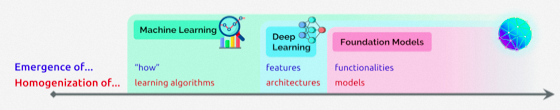  

大模型发展的前期被称为预训练模型，预训练技术的主要思想是迁移学习。在这一过程中，这种在公开数据集训练过的深层网络模型，被称为“预训练模型”。2018年出现的大规模自监督（self-supervised）神经网络是真正具有革命性的。
《On the Opportunities and Risks of Foundation Models》

### 模型赛道

- 多语言预训练大模型

Facebook已发布了一个百种语言互译的模型M2M-100，该模型不依赖英文作为中介语言，可实现一百种语言之间的直接翻译，在机器翻译领域实现新突破。
谷歌宣布开源了多语言模型MT5，基于101种语言进行训练，采用750GB文本，最大含有130亿个参数， 目前已在大多数多语言自然语言处理任务基准测试中达到最优水平，包括机器翻译、阅读理解等。  

- 多模态预训练大模型

OpenAI已研发DALL·E、CLIP等多模态模型，参数达120亿，在图像生成等任务上取得优秀表现。  

- 多任务预训练大模型

谷歌在2022年的IO大会上公开了MUM(多任务统一模型 : Multitask Unified Model)的发展情况。据谷歌透露，MUM模型基于大量的网页数据进行预 训练，擅长理解和解答复杂的决策问题，能够理解75种语言，从跨语言多模态网页数据中寻找信息。  

- 视觉预训练大模型

具备视觉通用能力的大模型，如ViTransformer等。视觉任务在日常生活和产业发展中占据很大的比重，视觉大模型有可能在自动驾驶等依赖视觉处理的领域加速应用。

### 论文支持

2020年1月，OpenAI发表论文[3]，探讨模型效果和模型规模之间的关系。
[Scaling Laws for Neural Language Models](https://arxiv.org/abs/2001.08361)
结论是：模型的表现与模型的规模之间服从Power Law，即随着模型规模指数级上升，模型性能实现线性增长  

2022年8月，Google发表论文，重新探讨了模型效果与模型规模之间的关系。
[Emergent Abilities of Large Language Models](https://openreview.net/pdf?id=yzkSU5zdwD)  
结论是：当模型规模达到某个阈值时，模型对某些问题的处理性能呈现快速增长。作者将这种现象称为Emergent Abilities，即涌现能力。
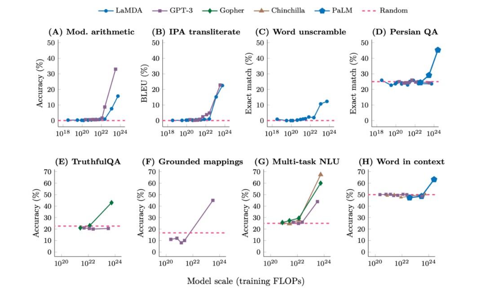  

### AIGC

国内产学研各界对于AIGC的理解是:  
“继专业生成内容（Professional Generated Content，PGC）和用户生成内容（User Generated Content，UGC）之后，利用人工智能技术自动生成内容的新型生产方式”。  

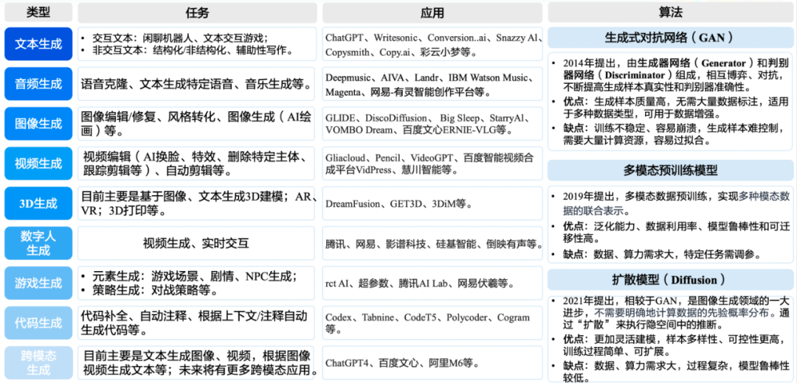  

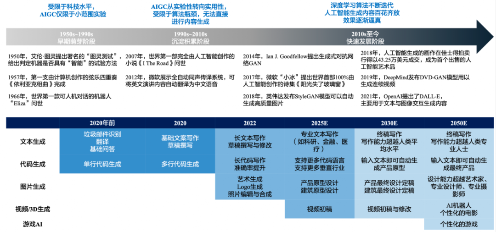  

#### Transformer

- 自注意力机制(Self-Attention)：例：翻译The animal didn't cross the street because it was too tired. 以前的模型在处理该句子时，无法像人类一样判断it代指animal还是street，而Self-Attention机制的引入使得模型不仅能够关注当前位置的词，还能够关注句子中其他位置的词，从而在翻译时关联it和animal，提高翻译质量


- 语言模型(LM)是指对语句概率分布的建模。具体是判断语句的语序是否正常，是否可以被人类理解。它根据句子中先前出现的单词，利用正确的语序预测句子中下一个单词，以达到正确的语义。例如，模型比较“我是人类”和“是人类我”出现的概率，前者是正确语序，后者是错误语序，因此前者出现的概率比后者高，则生成的语句为“我是人类”


- 大型语言模型(LLM)是基于海量数据集进行内容识别、总结、翻译、预测或生成文本等的语言模型。相比于一般的语言模型，LLM 识别和生成的精准度会随参数量的提升大幅提高。

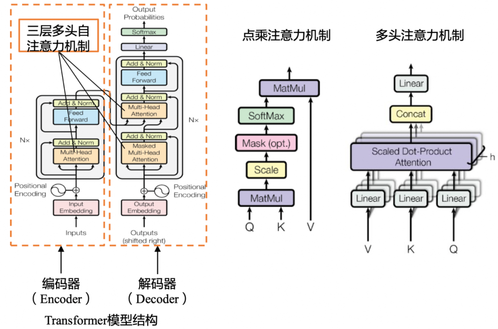  

#### GPT

- 指示学习(Instruct)和提示学习(Prompt) [指示学习](Instruction Learning) 《Finetuned Language Models Are Zero-Shot Learners》的目的都是去挖掘语言模型本身具备的知识。不同的是Prompt是激发语言模型的补全能力，例如根据上半句生成下半句，或是完形填空等。Instruct是激发语言模型的理解能力，它通过给出更明显的指令，让模型去做出正确的行动。指示学习的优点是它经过多任务的微调后，也能够在其他任务上做zero-shot，而提示学习都是针对一个任务的。泛化能力不如指示学习。

```
1.提示学习：给女朋友买了这个项链，她很喜欢，这个项链太____了。
2.指示学习：判断这句话的情感：给女朋友买了这个项链，她很喜欢。选项：A=好；B=一般；C=差。
```

- 人类反馈信号强化学习（RLHF）：指使用强化学习的方式直接优化带有人类反馈的语言模型，使得语言模型能够与复杂的人类价值观“对齐”。它负责 ChatGPT 预训练中微调的部分，首先在人类的帮助下训练一个奖赏网络(RM)，RM 对多个聊天回复的质量进行排序， 从而增加 ChatGPT 对话信息量，使其回答具有人类偏好。

GPT1: 使用n-gram方法对单词进行预测，使用对数最大似然函数来计算loss，使用transformer的解码器，并且其中使用了position embedding引入了位置信息。执行以下四种下游任务：  

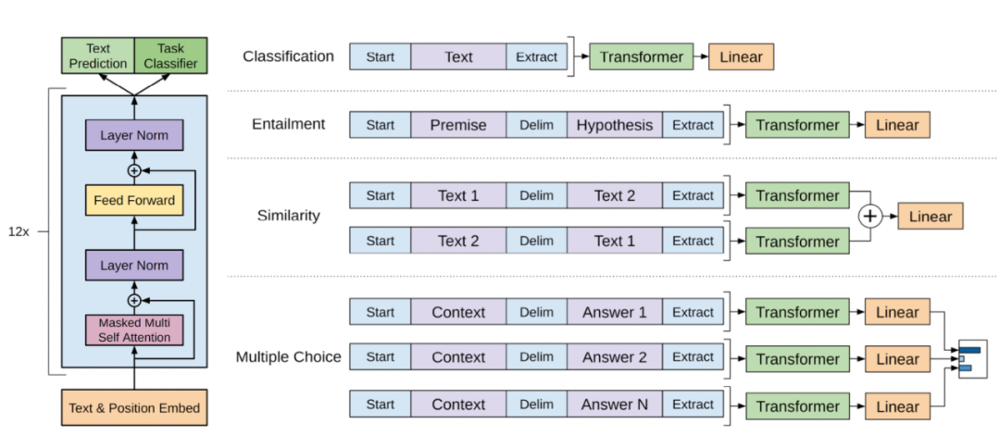  

GPT2：GPT2要做zero-shot，构建下游任务输入时不能引入那些模型没见过的符号，而是引入prompt提示，如(translate to french, english text, french text).数据集上没有选择Common Crawl这种具有很多冗余无用信息的项目，选用的是reddit里面已经被人工筛选出的有意义的，并且具有至少3karma值的网页进行数据处理，大概有800万个文本，40gb的文字。

GPT3解决了：

1. 做下游子任务时需要大量有标号的数据集。
2. 样本没有出现在数据分布里面，大模型的泛化性不见得比小模型更好。微调效果好不能说明预训练模型泛化性好，因为可能是过拟合预训练的训练数据，这些训练数据与微调使用的数据刚好有一定的重合性。
3. 人类不需要一个很大的数据集做任务。

为了解决上面几个问题，GPT-3的训练使用了情境学习（In-context Learning），它是元学习（Meta-learning）的一种，元学习的核心思想在于通过少量的数据寻找一个合适的初始化范围，使得模型能够在有限的数据集上快速拟合，并获得不错的效果。数据集方面：

1. 使用之前的reddit的数据作为正例，Common Crawl作为负例训练二分类器，预测Common Crawl的网页，过滤掉不好的；
2. 使用lsh算法（常用技术）去重；
3. 增加已知高质量数据，把之前的BERT、GPT1、GPT2数据集拿过来；
4. 因为Common Crawl数据集还是很脏，所以在真实采样时赋予了一定权重进行采样；

人工反馈的强化学习(Reinforcement Learning from Human Feedback，RLHF)将人工反馈作为强化学习的奖励，将模型的输出内容和人类喜欢的输出内容的对齐。

GPT-4实现了升级多模态模型、支持复杂问题解决、可靠性与安全性提升、推出可预测深度学习堆栈和开源Evals评估框架。
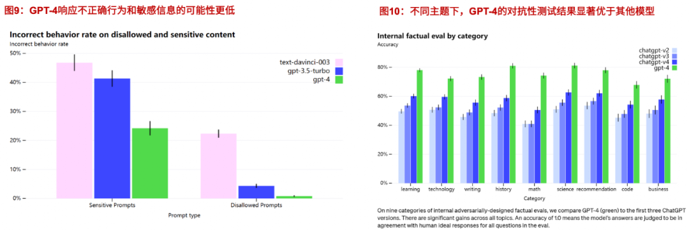  

Evals可用于分析 GPT-4 等模型的性能来评估其有效性。

#### Diffusion Model

研究人员对图片加噪点，让图片逐渐变成纯噪点图；再让 AI 学习这个过程的逆过程，也就是如何从一张噪点图得到一张有信息的高清图。

#### CLIP（ Contrastive Language-Image Pre-Training，大规模预训练图文表征模型）

进行下游任务时，只需要提供和图上的concepts对应的文本描述，就可以进行zero-shot transfer，把自然语言级别的抽象概念带到计算机视觉里。CLIP是将图片分类任务转换成图文匹配任务：

1. 用两个encoder分别处理文本和图片数据，text encoder使用Transformer，image encoder用了2种模型，ResNet和Vision Transformer(ViT)；
2. encoder representation直接线性投影到multi-modal embedding space；
3. 计算两模态之间的余弦相似度，让N个匹配的图文对相似度最大，不匹配的图文对相似度最小；
4. 对称的交叉熵loss；
5. 数据增强：对resized图片进行random square crop；

#### Stable Diffusion

AI绘画：文字到图片的多模态算法CLIP和图像生成算法Diffusion的结合体。

1. 图像编码器将图像从像素空间（Pixel Space）压缩到更小维度的潜在空间（Latent Space），捕捉图像更本质的信息；
2. 对潜在空间中的图片添加噪声，进行扩散过程（Diffusion Process）；
3. 通过CLIP文本编码器将输入的描述语转换为去噪过程的条件（Conditioning）；
4. 基于一些条件对图像进行去噪（Denoising）以获得生成图片的潜在表示，去噪步骤可以灵活地以文本、图像和其他形式为条件（以文本为条件即 text2img、以图像为条件即 img2img）；
5. 图像解码器通过将图像从潜在空间转换回像素空间来生成最终图像。
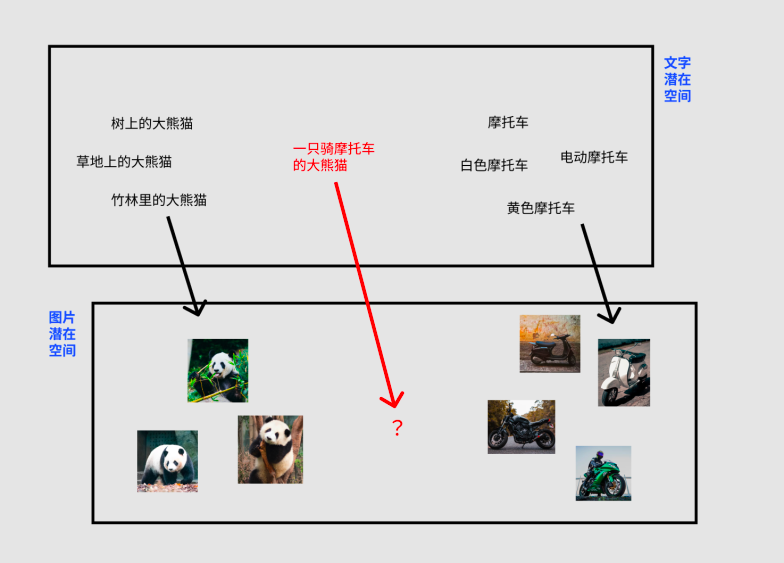  
当 AI 建立了“文字潜在空间”到“图片潜在空间”的对应关系，就能够通过文字控制图片的去噪过程，实现通过文字描述左右图像的生成。

## 负担

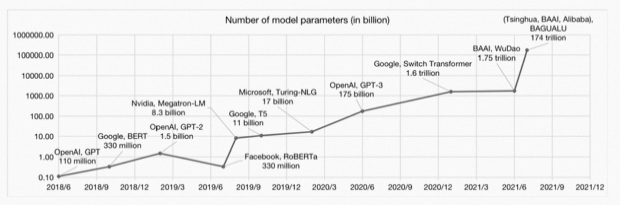  
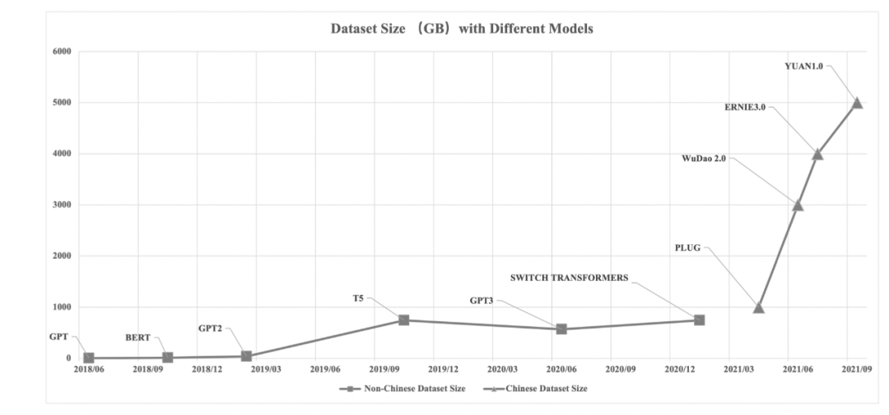  
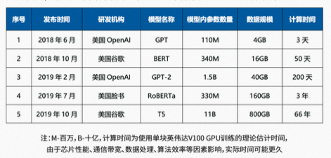  

## 安全问题

基础模型可能会成为单一故障点，从而成为攻击该模型衍生的应用程序的主要目标。

### 隐私安全

ML系统应保护用户数据的机密性，使其免受推理，重建攻击和模型窃取攻击，对抗样本，数据中毒攻击，资源消耗攻击的风险；

- 单点故障 
  - 针对基础模型的对抗样本更容易地转移到下游应用程序，Wallace等人【2019】甚至发现，一个单一的对抗性触发因素添加到任何输入可以导致诸如GPT-2之类的语言模型输出预定义的文本。
  - 在公司的私人数据上预先训练的，并且该模型存储了部分数据，那么所有下游应用程序都可能面临暴露这些数据的风险[Calini等人2021]。GPT-3的API要求用于微调或推断的所有（潜在敏感）数据都上传到OpenAI的服务器。如果基础模型的参数是公共的，则可以促进对自适应应用程序的模型窃取攻击，因为攻击者只需要对公共基础模型的“delta”进行逆向工程；
  - 拒绝服务攻击 使用特殊的高成本输入查询模型而加剧
- 数据中毒 成功的基础模型已经在从网络上抓取的大型且往往未经处理的数据集上进行了训练，例如针对CLIP风格的有针对性攻击[Radford等人2021]模型只需要修改300万个训练示例中的两个。
- Function creep & dual use
  - 功能蠕变 基础模型的使用可能超出其最初预期的目的，机器学习中功能蠕变的例子包括过度学习[Song和Shmatikov 2019]和对抗性重新编程[Elsayed等人2018]。CLIP最初被训练来解决预测图像-文本对的一般任务，但在这样做的过程中，它也学会了捕捉丰富的面部特征，虽然CLIP的明确将面部识别和其他监控技术排除在范围之外，但CLIP当然可以重新用于此类任务；
  - 双重使用 基础模型的使用可能超出其最初预期的目的
- 多模式一致性 利用跨模态的不一致性，从而增加基础模型的攻击面。如攻击者可能能够通过穿着印有文本的衣服来逃避面部识别；

几个研究方向：

- 单点故障的安全瓶颈
- 更便宜的私人学习 隐私
- 对大规模对抗性示例的鲁棒性 与标准训练相比，训练一个对对抗性示例具有鲁棒性的模型需要更多的数据，但未标记的数据可能足以弥补这一差距

### 鲁棒性

考虑基础模型对分布变化鲁棒性的作用。

- 虚假的相关性。伪相关性是特征和标签之间的统计相关性，在训练分布上具有预测能力，但在测试分布上没有预测能力。基础模型可能会加剧或减轻虚假相关性的影响，但这取决于特定下游任务的性质及其与基础模型训练数据和算法的关系。 通过使用不同的数据集进行训练，基础模型可以提高对仅在训练数据的子集中发现的虚假相关性的鲁棒性；
- 外推和时间漂移外推和时间漂移仍需提高，尽管已经普遍提出了分布变化的现有分类法，但理解和定义基础模型有效的分布变化类型是稳健性研究的一个主要开放问题。

- 现有的关于基础模型稳健性的研究大多是实证的，对稳健性增益背后的机制了解甚少。现有理论是有限的，无法解决其他经验有效的基础模型，如完全生成语言模型（例如，GPT-3和图像GPT；
- 基础模型训练中的数据扩充 基础模型的训练方式而产生的某些统计偏差可能会持续存在于下游应用；基础模型训练中的编码结构 探索编码数据中已知结构和不变量的新方法是基础模型训练的重要途径。元数据可以用作预训练的目标，以提高下游OOD的准确性；HTML数据中的标签进行建模提供了额外的下游任务相邻监督，允许新形式的提示并提高了数据效率；
- 基础模型训练数据的专业化与多样性 基础模型训练数据的选择会产生下游影响，在更多样化的数据集上训练并不总是比更专业的基础模型更能提高下游性能；
- 适应方法 如何使用预训练的信息会影响鲁棒性。冻结参数似乎能提高OOD性能，但原因未知；虽然自适应方法可能足以实现ID泛化，但这些方法在设计中没有明确考虑分布变化。

### 安全和校对

#### 传统漏洞

如何开发一个先进的人工智能系统，使我们能够获得该系统的计算优势，同时给我们留下足够的控制，使系统的部署不会导致全球灾难；很难为人工智能指定和实例化与人类价值观一致的奖励函数。

强化学习（RL）的一个突出的问题是奖励黑客攻击；
纯RL并不是通往高级人工智能的唯一理论途径。基础模型也可以用简单（自我）监督的目标进行训练，如下一个token预测

#### 现行模型

对目标导向模型进行安全研究的一个主要目的是对主体所采取的行动获得更原则的控制和可解释性，而不是依赖于黑盒神经网络的难以理解的决策。现行尽管没有明确优化，但目标导向的行为可能会出现；数据的倾向问题；

基础模型的训练目标和期望行为之间的不一致，如用行动的自然语言描述来训练他们；  
识别和消除人类数据中获取欺骗性或其他不受欢迎的行为；

面对新数据和新任务时的鲁棒性问题；
未指定目标 可能会增加优化不一致但易于指定的目标的风险，通常被称为古德哈特定律（仍然是解释性问题）

## reference

- On the Opportunities and Risks of Foundation Models (2021)
- CoCa
- mPLUG-2
- LLaMA
- FLAVA
- https://mp.weixin.qq.com/s/i6niDdbptYrQQEBYB0jdXA