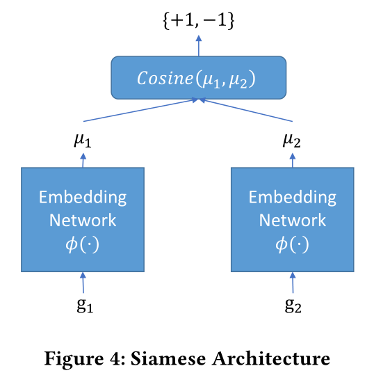
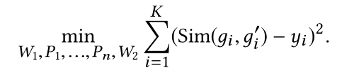

<!--
 * @Author: Suez_kip 287140262@qq.com
 * @Date: 2022-11-23 20:32:09
 * @LastEditTime: 2022-11-29 14:27:36
 * @LastEditors: Suez_kip
 * @Description: 
-->
# Gemini

- [Gemini](#gemini)
  - [ACFG图嵌入](#acfg图嵌入)
  - [孪生神经网络相似度检测](#孪生神经网络相似度检测)
  - [附录](#附录)
    - [孪生神经网络](#孪生神经网络)
      - [常见的距离计算方式](#常见的距离计算方式)
    - [struct2Vec](#struct2vec)
      - [论文1：Discriminative Embeddings of Latent Variable Models for Structured Data](#论文1discriminative-embeddings-of-latent-variable-models-for-structured-data)
      - [论文2：struc2vec: Learning Node Representations from Structural identity](#论文2struc2vec-learning-node-representations-from-structural-identity)

[论文连接](../AI漏洞挖掘/Graph/Neural%20Network-based%20Graph%20Embedding%20for%20Cross-Platform.pdf)

简介：

- 基于二进制文件的代码相似性检测
- 本文方案：Structure2vec+孪生神经网络；
- 再培训技术：预先训练的模型可以在附加监督的情况下快速重新训练，以适应新的应用场景。

- 输入输出的CFG：消耗大；
- discovRE轻量级的语法级特征（如calculate、call的数量）：精度下降
- Genius:码本生成代价高，图规模限制；图嵌入开销随着码本大小线性增加，码本规模小，导致失真；搜索精度最终受到二分图匹配质量的限制；

在整个控制流图中迭代传播嵌入来评估整个图形表示；
Structure2vec+孪生神经网络

tips：解决孪生网络信息量不足的问题：

- 提出假设：同一源代码编译的二进制函数是相似的，反之则不相似，可以使用此数据集***预训练***独立于任务的模型。
- 进行特定任务***再训练***，将任务特定数据纳入其中，更频繁取样、更多的epochs  

## ACFG图嵌入

1. 获取ACFG的图g，特征$x_v$
2. 计算顶点的p维特征$\mu _v$；
3. 聚合(求和或平均)$\mu_v$为$\mu_g$

参数更新：
  
初始$\mu^0$为0；经过几次全局完全递归后，网络将为每个顶点生成特征表示，同时考虑了图形特征和顶点特征之间的长距离交互：
  

- 基于图拓扑结构以同步方式执行
- 顶点特征通过F传播到其他顶点，同时越迭代传播越远，k次执行则该点特征表示包含k范围内的信息；

本文的F函数设计  
  

## 孪生神经网络相似度检测

  
两个ACFG图嵌入网络，生成的结果进行余弦距离比较；随机梯度下降来优化目标，优化以下结果：
  

## 附录

### 孪生神经网络

共享权值的两个神经网络，用于衡量两个输入的相似度，但不仅能进行二分类；  
根据两边的神经网络是否相同可以分为：孪生神经网络和伪孪生神经网络；  
  

根据两边的体量和类型的是否区别，就可以使用孪生/伪孪生神经网络；
向量距离计算方式：欧式距离、余弦距离、exp func(?)
博主在NLP领域的使用经验：cosine更适用于词汇级别的语义相似度度量，而exp更适用于句子级别、段落级别的文本相似性度量。其中的原因可能是cosine仅仅计算两个向量的夹角，exp还能够保存两个向量的长度信息，而句子蕴含更多的信息。

三重网络：Triplet network
[论文连接](https://link.springer.com/chapter/10.1007/978-3-319-24261-3_7)  
输入是三个，一个正例+两个负例，或者一个负例+两个正例，训练的目标是让相同类别间的距离尽可能的小，让不同类别间的距离尽可能的大。
  

#### 常见的距离计算方式

- 欧式距离；
- 余弦相似度（归一化为1）；
- 汉明距离；
- 曼哈顿距离（折线欧式距离，高维中不一定路径对短）；
- 切比雪夫距离（两个向量在任意坐标维度上的最大差值，棋盘距离，不常用）；
- 闵氏距离（Minkowski）
- 雅卡尔指数（Jaccard Index）；$D(x,y)=(\sum^n_{i=1}|x_i-y_i|^p)^{\frac{1}{p}}$
  - p=1：曼哈顿距离
  - p=2：欧氏距离
  - p=∞：切比雪夫距离
- 半正矢（Haversine）半正矢距离是指球面上的两点在给定经纬度条件下的距离。半正矢距离不可能有直线，因为这里的假设是两个点都在一个球面上。
- Sørensen-Dice 系数是度量样本集的相似性和多样性的,夸大了很少或没有真值的集合的重要性;  
$D(x,y)=\frac{2|x\cap y|}{|x|+|y|}$

### struct2Vec

#### 论文1：Discriminative Embeddings of Latent Variable Models for Structured Data

[论文链接1](../AI漏洞挖掘/Graph/structrue2vec.pdf)  
可计算的数据规模大、是分类器和回归器体量小、精度较高；
Related Work：

- 结构袋BOS；
- 概率图形模型；例如，可以对序列数据使用隐马尔可夫模型，对图数据使用成对马尔可夫随机场。Fisher核、概率积核；参数需要专家先验经验、生成模型拟合到数据很困难；

//TODO 2 Background

#### 论文2：struc2vec: Learning Node Representations from Structural identity

[论文链接2](../AI漏洞挖掘/Graph/struc2vec.pdf)
基于Deepwalk和图的空间相似性的研究,动态调整图的池化范围；

1. 根据不同距离的邻居信息分别算出每个节点对的结构相似度，这涉及到了不同层次的结构相似度的计算。$f_k(u,v)=f_{k-1}(u,v)+g(set(R_k(u)),set(R_k(v)))$其中$set(R_k(u))$是按照度由小到大排序的u距离k的节点集合；k可以计算图的直径层，保证信息采样完整；
g为DTW衡量两个不同长度且含有重复元素的的序列的距离；  
  
基于DTW，定义元素之间的距离函数$d(a,b)=\frac{max(a,b)}{min(a,b)}-1$，惩罚了当两个顶点的度数都比较小的时候两者的差异  
  
$$g(i,j)=min\left\{
\begin{aligned}
g(i-1,j)+d(i,j) \\
g(i-1,j-1)+2d(i,j) \\
g(i,j-1)+d(i,j)
\end{aligned}
\right.
$$
2. 构建一个多层次的带权重网络M，每个层次中的节点皆由原网络中的节点构成。  
每一层均为带权重$w_k(u,v)=e^{-f_k(u,v)}$的完全图
层与层之间有向连接图的权重
  
表示第k层中所有指向u的边中权重大于该层平均权重的数量
  
  
上式表示第k层中与节点u相似的节点数，如果u与很多节点都相似，说明此时一定处于低层次，应该考虑跳到更高层去找合适的上下文。
3. 在M中生成随机游走，为每个节点采样出上下文。
Deepwalk,可以在上下层游走，是否跃层的概率q，本层每个节点的概率：  
$p_k(u,v)=\frac{e^{-f_k(u,v)}}{\sum_{v\in V,v\neq u} e^{-f_k(u,v)}}$
  
一般不会出现连续跃层现象、高层概率低甚至直接没有定义；  

4. 使用word2vec的方法对采样出的随机游走序列学习出每个节点的节点表示。如SGNS（skip-gram with negative sampling）

优化动态规划多层次的带权重网络M生成：

1. 压缩度序列，降低度序列长度。比如{1,1,1,1,2,2,5,5,5,8}压缩成{(1,4),(2,2),(5,3),(8,1)}；
2. 略去很多初始值就很大的点对；根据二分查找与当前节点度数相近的节点，与当前节点构成节点对，直接将n个节点对降低到logn个节点对。
3. k计算图的平均距离长度，用高层相似信息来换取速度；
