<!--
 * @Author: Suez_kip 287140262@qq.com
 * @Date: 2022-11-06 09:18:11
 * @LastEditTime: 2022-11-15 16:28:23
 * @LastEditors: Suez_kip
 * @Description: 
-->
# 漏洞挖掘中的图的使用

## AST

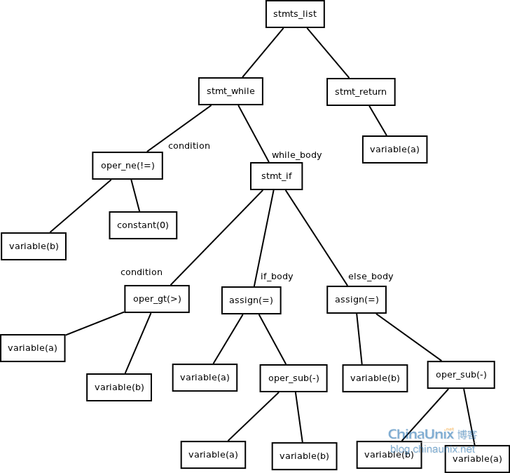  

抽象语法树特点：

- 无论是LL(1)文法，还是LR(1)等方法，都要求在语法分析构造出相同的语法树。即使是前端采用了不同的文法，都只需要改变前端代码，而不用连累到后端。
- 在构造语法树时，不依赖于语言的细节。

简单流程：

1. 词法分析，scanner。对每一个代码中的单词进行分析，并得出其性质；->数组
2. 语法分析，解析器；数组->语法树（AST会删除其中没有必要的token，如不完整的括号，这与CST（具体语法树）对应）；例babel

[2021论文](../AI漏洞挖掘/Graph/Combining_Graph-Based_Learning_With_Automated_Data_Collection_for_Code_Vulnerability_Detection.pdf)  
丰富AST，增加分支8个，特定适配不同的特殊漏洞类型，来解决一些传统方案无法挖掘的漏洞；
序列化模型的问题：误识别部分漏洞类型，代码拼接会出现问题，有可能逻辑上不一定有连续执行的可能性；
MRAKING待看

## 控制流与数据流

### CFG、CDG

cfg 控制流图->cdg 控制依赖图（由FDT前向支配树产生）：  
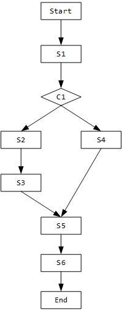  

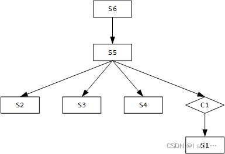  

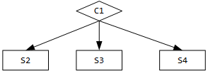  

所有从函数出口到S2的路径都一定会经过S5；比如S1 -> C1 和 C1 -> S1 互相抵消。不过这还剩一个问题，就是像 C1 -> S3 这种依赖是怎么产生的？

ACFG 源自于Genius项目见下文

### DFG、DDG

变量使用的依赖，eazy，pass

## 图嵌入

<https://zhuanlan.zhihu.com/p/62629465>

图分析的目的包括四种： ( a )节点分类，( b )链接预测，( c )聚类，( d )可视化
嵌入的思想是在向量空间中保持连接的节点彼此靠近。拉普拉斯特征映射（Laplacian Eigenmaps）和局部线性嵌入（Locally Linear Embedding ，LLE）
自2010年以来，关于图嵌入的研究已经转移到解决网络稀疏性的可伸缩图嵌入技术上。
保持一阶二阶网络邻近度

目前研究的难点和目标：  

- *属性选择*  节点的“良好”向量表示应保留图的结构和单个节点之间的连接。第一个挑战是选择嵌入应该保留的图形属性。考虑到图中所定义的距离度量和属性过多，这种选择可能很困难，性能可能取决于实际的应用场景。
- *可扩展性*  大多数真实网络都很大，包含大量节点和边。嵌入方法应具有可扩展性，能够处理大型图。定义一个可扩展的模型具有挑战性，尤其是当该模型旨在保持网络的全局属性时。
- *嵌入的维数*  实际嵌入时很难找到表示的最佳维数。例如，较高的维数可能会提高重建精度，但具有较高的时间和空间复杂性。较低的维度虽然时间、空间复杂度低，但无疑会损失很多图中原有的信息。

大体上可以将这些嵌入方法分为三大类：

- 基于因子分解的方法
- 基于随机游走的方法(源于word2vec)
    首先选择某一特定点为起始点，做随机游走得到点的序列，然后将这个得到的序列视为句子，用word2vec来学习，得到该点的表示向量。
- 基于深度学习的方法
- LINE
  PAPER SOURCE：ang J , Qu M , Wang M , et al. LINE: Large-scale information network embedding[J]. 24th International Conference on World Wide Web, WWW 2015, 2015.

## 聚类

使用聚类算法：频谱聚类算法
[谱聚类的相关知识](https://www.cnblogs.com/pinard/p/6221564.html)

### K-means聚类算法介绍

[K-means聚类算法](https://www.cnblogs.com/pinard/p/6164214.html)  

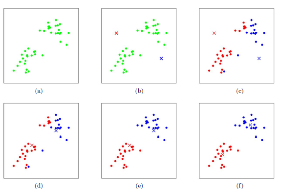  

简单介绍：  

``` 上图a表达了初始的数据集，假设k=2。
  在图b中，我们随机选择了两个k类所对应的类别质心，即图中的红色质心和蓝色质心，
  然后分别求样本中所有点到这两个质心的距离，并标记每个样本的类别为和该样本距离最小的质心的类别，如图c所示，
  经过计算样本和红色质心和蓝色质心的距离，我们得到了所有样本点的第一轮迭代后的类别。
  此时我们对我们当前标记为红色和蓝色的点分别求其新的质心，如图4所示，
  新的红色质心和蓝色质心的位置已经发生了变动。
  图e和图f重复了我们在图c和图d的过程，即将所有点的类别标记为距离最近的质心的类别并求新的质心。
  最终我们得到的两个类别如图f。
```

- ***传统K-means算法流程***  
  1. 经验确定k值；
  2. 随机选择k个样本作为初始质心；
  3. 计算其他点到已选质心的欧式距离，将最小值加入对应的聚类中；
  4. 重新以平均值计算该类的质心；
  5. 若质心不再变化则结束，否则继续执行第三步；
- ***K-means++算法流程***  
    优化质心选择算法：  
  1. 随机选择一个点作为起始质心；
  2. 计算为选择点到已选择点的距离（取各个点中的最小值），取其最大值作为下一个质心；
  3. 重复2直至完成k个点的质心选择；
- ***距离计算优化的elkan K-means算法***  
    执行两种规律，利用质心间的距离减少点到质心的计算距离：  
  1. 是对于一个样本点x和两个质心μj1,μj2。如果我们预先计算出了这两个质心之间的距离D(j1,j2)，则如果计算发现2D(x,j1)≤D(j1,j2),我们立即就可以知道D(x,j1)≤D(x,j2)。此时我们不需要再计算D(x,j2),也就是说省了一步距离计算。
  2. 规律是对于一个样本点x和两个质心μj1,μj2。我们可以得到D(x,j2)≥max{0,D(x,j1)−D(j1,j2)}。这个从三角形的性质也很容易得到。
- ***大样本优化 Mini Batch K-Means算法***  
  选取部分集中的样本首先进行传统K-means算法，batch size一般是通过无放回的随机采样得到的。  
  为了增加算法的准确性，我们一般会多跑几次Mini Batch K-Means算法，用得到不同的随机采样集来得到聚类簇，选择其中最优的聚类簇。

### DBSCAN聚类算法

[参考博客链接](https://blog.csdn.net/hansome_hong/article/details/107596543)

DBSCAN是一种基于密度的聚类算法，基于定义距离下的半径内最少点数目进行聚类；邻域半径R内的点的个数大于最少点数目时就是密集。

评价：简单快捷，仅按照点与点之间的距离作为判断依据，因此半径和最小内点数量需要经验设计；

***节点定义***：

- *核心点*：邻域半径R内样本点的数量大于等于最小内点数量；
- *边界点*：不属于核心点但在某个核心点的邻域内；
- *噪声点*：排除上述两者剩余的点；

***关系定义***：

- *密度直达*：
  - 出发点是核心点（具有单向性）；
  - 在R邻域内；  
- *密度可达*：
  - 间接直达；
  - 基于直达，以此也具有单向性；
- *密度相连*：
  - 取消起点是核心点的要求（去除单向性）后，密度可达；
  - 具有双向性；
  - 在该定义下，密度相连的两组认为同属一个簇；
- *非密度相连*：
  - 非密度相连的情况；
  - 表示不属于同簇或者为噪声点；  
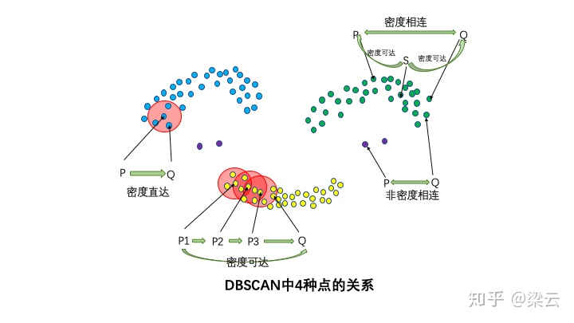  

***聚类流程***：

*输入*：数据集，邻域半径 Eps，邻域中数据对象数目阈值 MinPts;
*输出*：密度联通簇的集；

1. 从数据集中任意选取一个数据对象点 p，按照参数Eps（半径）和MinPts判断点p是否为核心点；
2. 是，则找出所有从 p 密度可达的数据对象点，形成一个簇；
3. 否则选取另一个数据对象点；
4. 重复2、3步，直到所有点被处理。

## 图神经网络

***Scalable Graph-based Bug Search for Firmware Images***  
[论文链接](../AI漏洞挖掘/Graph/Scalable%20Graph-based%20Bug%20Search%20for%20Firmware%20Images.pdf)  

固件漏洞挖掘

参考计算机视觉中的技术，基于CFG的高阶向量的表示方法 Genius
  
计算机视觉图形检索的主要步骤：  

1. 原始特征提取
2. 码本生成
3. 特征编码
4. 在线搜索
离线索引（包括前三步）和在线搜索

### 文章提出的ACFG
  
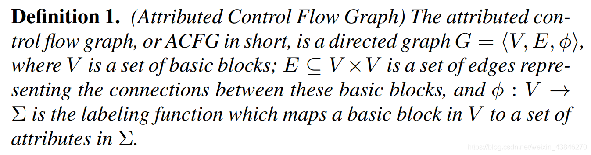  
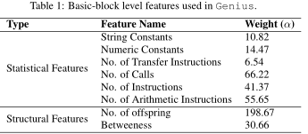  
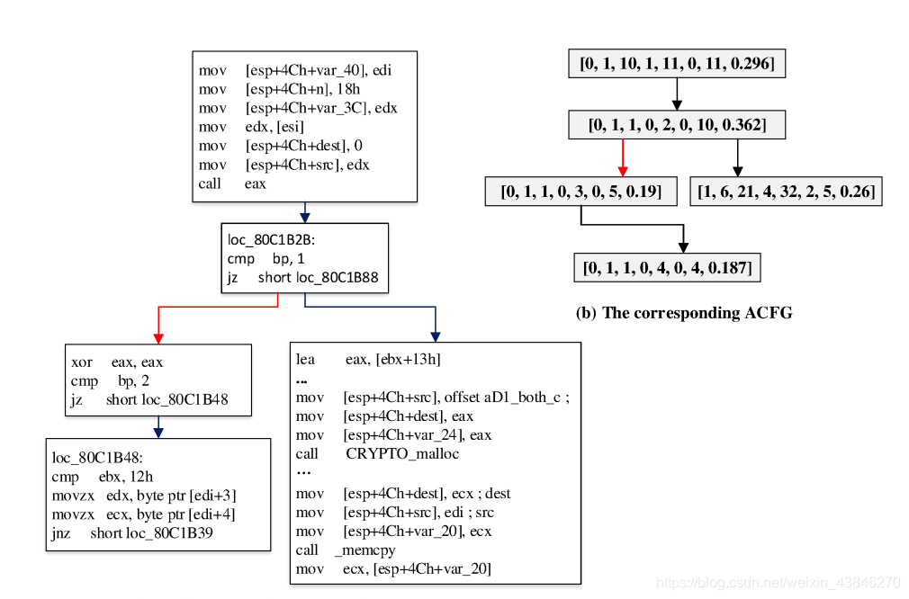  

其他方法MCS最大公共子图，效率有限

### 码本生成

从原始特征中学习一组分类：C={c1，c2，…，ck}，其中ci是第i个码字或“质心”，共分为两步：

- 相似性度量计算：
  二部图法量化相似性，并用结构特征添加来防止二部图无图结构特征造成的误差积累导致不精确  
  将两张ACFG图组合为一张二部图，每个匹配都与成本相关联。两个图的最小代价是映射上所有边代价的总和。二部图匹配可以有效地遍历所有映射，并以最小的代价选择从G1到G2的节点上的一对一映射。边缘成本由该边缘上两个基本块之间的距离计算。  
  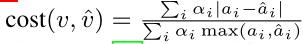  
  如果特征是集合，我们使用Jaccard来计算集合差。  
2
  - 利用空图计算的归一化；  
    两个图的匹配成本大于一，并且与比较的ACFG的大小正相关。因此，我们将成本归一化以计算相似性得分。对于成本归一化，我们为每个比较的ACFG创建一个空ACFGΦ。空图中的每个节点都有一个空特征向量，并且空图的大小被设置为对应的比较图的大小。通过与这个空的ACFG进行比较，我们可以获得被比较图可以得到的最大匹配成本;  
    $\kappa(g_1,g_2)=1-\frac{cost(g_1,g_2)}{max(cost(g_1,\phi),cost(\phi,g_2))}$  

  学习目标是找到能够最大化不同ACFG的距离同时最小化等效ACFG距离的权重参数(人话：不同类差距最大化，近似类差距最小化)  

  雅卡尔指数（英语：Jaccard index），又称为交并比、雅卡尔相似系数，比较样本集的相似性与多样性的统计量，定义为交集与并集的比值；  
  雅卡尔距离（Jaccard distance）用于量度样本集之间的不相似度，其定义为1减去雅卡尔系数；
  有人将雅卡尔距离定义两集合对称差$A\Delta B=|A\cup B|-|A\cap B|$的大小与并集大小之间的比例
  
- 聚类
  输入为相应ACFG的相似性得分核矩阵，为用于训练集的ACFG划分，寻找聚类和划分质心，所有质心节点的集合构成代码本。此处考虑效率和准确率，码本大小设置为16；

  分层抽样：首先收集一个数据集，该数据集涵盖了来自不同架构的不同功能的ACFG。参见第5.2节。然后将ACFG分成不同尺寸范围的单独“地层”。然后将每个层作为独立的子群体进行采样，从中随机选择各个ACFG。

加速方式：并行聚类、近似聚类、层次聚类算法

- 特征编码
  - 能更好容忍函数在不同体系结构中的变化，每个维度都是与分类的相似关系，与ACFG本身相比，该分类对二进制函数的变化不太敏感。
  - 编码后的ACFG原始特征成为高维空间中的一个点，可用hash方法快速搜索；  
  $q:G\to R^n$ in $C=\{c_1,...,c_n\}$  
  设$NN(g_i)$表示图$g_i$码本中最近质心邻居
  $NN(g_i)=\arg\,\max_{c_i\in C}\kappa (g_i,c_j)$  
  图像检索中的一种常见做法是不仅考虑最近的邻居，还考虑几个最近的邻居;

1. 特征包编码BOF模型  
特征包编码将图形映射到码本中的一些质心，将每个函数表示为特征包。量化器是将图转化至码本中的最近质心的独热码；

2. VALD编码  
词袋是只要质心是图的最近邻居，图与质心距离就会被忽视；
该方案合并一阶差异，将图分配给单个混合物组分
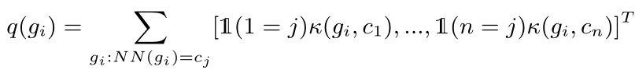  
将独热码更改为相关信息，提高了向量包含的语义信息，反应了质心的相似性分布；  
以三个函数举例：
F1在x86的架构下编译的结果，F1在mips架构下编译的结果，F2在mips下编译的结果；
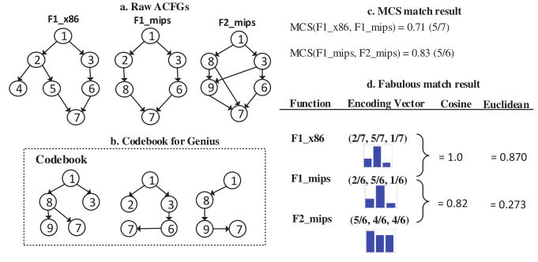  
   - 编译不同，结构图存在一定的差别；
   - 相似性是最大共子图/最大图；
   - 成对匹配将通过ACFG直接匹配两个函数，而Genius将通过编码向量匹配它们。VLAD编码通过将ACFG与其码本中最接近的前3个质心节点进行比较来生成编码向量。

- 在线搜索
LSH（位置敏感散列）

1. 使用BOF算法或VALD算法，进行函数特征编码；
2. 使用LSH，通过学习投影来在大数据集中进行查询；投影公式：  
$h_i(q(g))=\lfloor(v·q(g)+b)/w\rfloor$  
where w is the number of quantized bin, v is a randomly selected
vector from a Gaussian distribution, and b is a random variable
sampled from a uniform distribution between 0 and w.  
理论基础：如果两个点在特征编码空间中更靠近，那么它们在哈希空间中的投影之后应该保持接近；
$lsh(g)=[h_1(q(g)),...,h_w(q(g))]$
距离可用余弦距离和欧氏距离；

- discovRe
- Multi-MH和Multi-k-MH
- 基于质心的搜索
