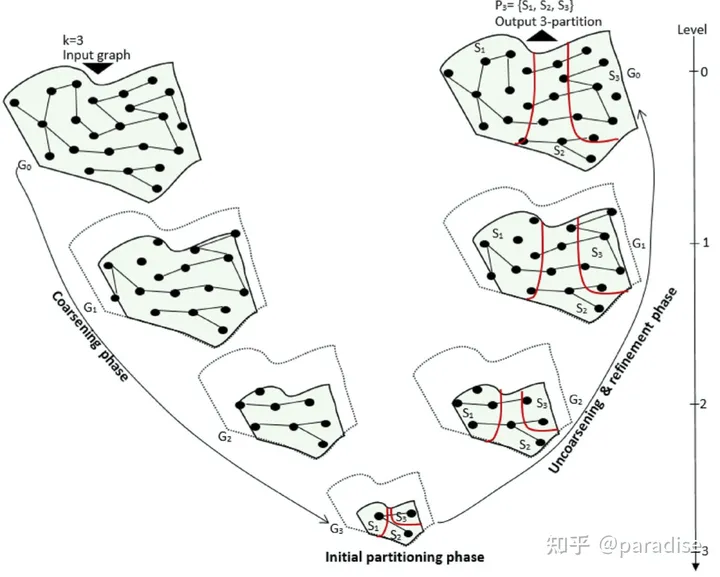
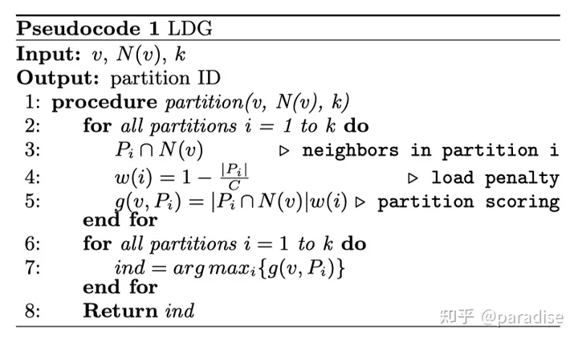
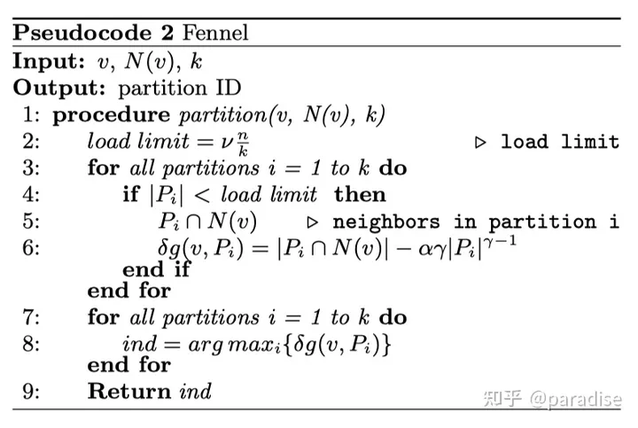

<!--
 * @Author: Suez_kip 287140262@qq.com
 * @Date: 2024-04-11 19:03:03
 * @LastEditTime: 2024-04-11 19:20:08
 * @LastEditors: Suez_kip
 * @Description: 
-->
# 图分析

## 子图划分

这里讨论的是点分割

### 传统算法

传统方法速度较快，负担较少

当我们考虑小图的时候，用传统的算法，考虑系统轻量化，增加可信度。

#### METIS

是一种层次化的分割算法（multi-level partitioning），核心思想对于给定原图结构持续的稀疏化融合结点和边来降低原图的大小，然后达到一定程度对于缩减后的图结构进行分割，最后将分割后的小图还原成原始的图结构保证每份子图的均衡性。如图，将一个图分割为3份，首先进行3层的稀疏化然后对于缩小后包含3个顶点的子图切分成3份，最后将这三个结点所包含的原始图结构还原成子图。METIS在稀疏化阶段采用heavy edge matching策略，在分割缩减后子图的时候随机初始化一个节点进行宽度优先遍历breadth-first fearch得到最小切边的子图，最后将子图映射到原始的图结构。由于METIS需要对整个图结构进行遍历和缩放，对于大规模图来说内存消耗大分割效率低。

  

Karypis, G., Kumar, V. A fast and high quality multilevel scheme for partitioning irregular graphs. SIAM J. Sci. Comput. 20, 359–392 (1998)

#### Ramdon Hash

随机哈希的点分割就是将结点通过一个给定的哈希函数映射到不同的分割子图中，最简单的hash函数就是给每个结点分配不同的id，然后通过分割分数k进行取模，最后分配到指定的子图中。这种分割方法可以拓展到边分割上，将每条边进行id话然后取模进行分割。基于hash的分割方法不需要任何图结构的先验知识虽然高效但是随机化造成划分后子图内结点点的局部性很难得到维持，被切掉的边会非常多。

#### Linear Deterministic Greedy partitioning (LDG)

LDG考虑在分割的时候将邻居结点放置在一起，以减少edge-cut。它采用贪心算法将一个结点放置在包含其邻居最多的子图中，同时保证每个子图的结点负载均衡，整个算法流程图如下：

  

#### Fennel

Fennel分割与LDG相比，其打分函数对子图中结点数量的约束从乘法换成了减法操作，进行了松弛：

  

C. Tsourakakis, C. Gkantsidis, B. Radunovic, and M. Vojnovic. Fennel: Streaming graph partitioning for massive scale graphs. In Proceedings of the 7th ACM International Conference on Web Search and Data Mining, pages 333–342. ACM, 2014.

### AI算法
