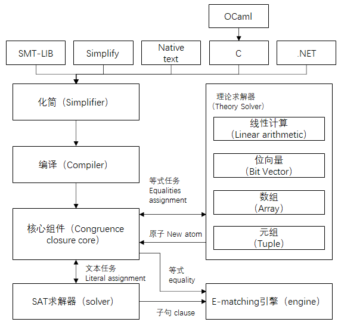
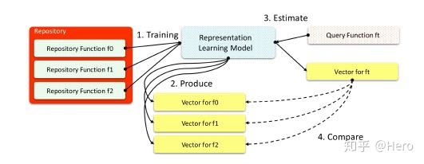
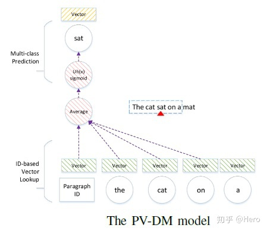

<!--
 * @Author: Suez_kip 287140262@qq.com
 * @Date: 2022-11-26 18:38:14
 * @LastEditTime: 2022-11-26 21:03:30
 * @LastEditors: Suez_kip
 * @Description: 
-->
# innerEye

基于NMT（将翻译的属性在这里理解为不同架构中的同一语义的相似度比较）的跨框架的二进制文件的超函数相似度检测；
用预处理解决？？OOV词汇表外指令的问题，只是把变量归一化，其实没有解决OOV问题；实现目标：  

- 识别不同架构下的相同基本块；
- 识别代码块在不同架构的代码中是否包含（NEW）；

问题一相关：在gemini的基础上，放弃了ACFG，改用自动获取；增加了任务二；
问题二相关：最长公共子序列（LCS），针对目标代码组件、目标程序；

- LSH位置敏感散列，高效搜索；
- LCS查询路径语义相似性，通过LCS/路径长度比较该路径的语义相似度；
- 组件相似性：多个路径对以共同计算相似性得分；

基本块相似性：孪生神经网络（both LSTM）：

1. 网络学习的指令嵌入矩阵实现指令嵌入；
   1. 生成BIS，代码块的控制流；
   2. 使用word2vec将BIS训练得到包含每个指令的数字表示的嵌入矩阵（用户指定定长X指令单词表）。
2. 基本块指令嵌入；
   1. 需要解决的问题：源自同一源代码但属于不同体系结构的指令可能具有非常不同的嵌入；
   2. 基于both LSTM孪生网络的NMT；
   3. 同源代码编译生成相同块；
   4. n-gram实现代码的文本相似度检测？？？能否实现相似块的甄别？
3. 比较块嵌入的相似性；

TODO:VI

## 胎记（代码相似性动态检测指标）

TODO：有空在研究吧；

## SAT、SMT

SAT问题（The Satisfiability Problem，可满足性问题）：  
求解由布尔变量集合组成的布尔表达式，是否存在一组布尔变量的值，使得该布尔表达式为真。  

SMT（Satisfiability Module Theories， 可满足性模理论），是在SAT问题的基础上扩展而来的，SMT求解器的求解范围从命题逻辑公式扩展为可以解决一阶逻辑所表达的公式。

常见的SMT求解器：Z3（微软）  
  

Esh中使用基本块（中间语言，保证检测存在一定的弹性）的数据流切片进行比较；

## ASM2vec

针对语义相似的一套系统
  

1. 用存储库中的汇编函数训练神经网络模型；
2. 每个汇编函数生成一个向量表示(训练过程自动生成)；
3. 给定一个要查询的函数，使用训练好的模型生成其对应的向量表示；
4. 比较查询函数的向量表示与各个repository function向量表示之间的余弦相似度，选择top-k；

  
PV-DM 基于Word2vec的增加paragraph ID的模型，增加主题的因素（paragraph ID + sentence）；

ASM2vec：CFG->some seq->t`-trainng->t,$\theta_{f_s}$->$\theta_{f_s}$为该函数的特征向量

CFG嵌入：

- 内联调用函数的插入：较小的调用改为源代码插入；
- 边缘覆盖
- 随机游走（deepwalk）

## API2VEC

基于API调用，但调用较少的情况就不适用，应用范围很窄；
