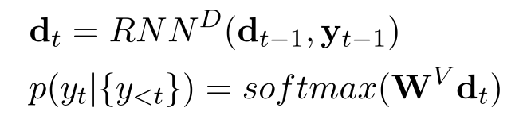

<!--
 * @Description: 
-->
# Paragraph-level Neural Question Generation with Maxout Pointer and Gated Self-attention Networks

- [Paragraph-level Neural Question Generation with Maxout Pointer and Gated Self-attention Networks](#paragraph-level-neural-question-generation-with-maxout-pointer-and-gated-self-attention-networks)
  - [问题建模](#问题建模)
    - [答案tag](#答案tag)
    - [门的自注意力](#门的自注意力)
  - [解码与注意力和Maxout指针](#解码与注意力和maxout指针)
    - [注意力](#注意力)
    - [复制机制、指针网络](#复制机制指针网络)
    - [Maxout 指针](#maxout-指针)
  - [实验](#实验)
    - [数据集](#数据集)
    - [测试标准](#测试标准)
    - [结论](#结论)
  - [问题](#问题)

如果使用整个段落(包含多个句子)作为输入，则表现较差。本文提出了一种带有门控自注意编码器的maxout指针机制，对于句子级输入，模型优于以前的句子级或段落级输入方法，且可以有效地利用段落作为输入，将最先进的结果从13.9推到16.3 (BLEU 4)。

在NLP中，QG主要通过两种方法来解决:
1. 基于规则的方法;
2. 神经QG方法:使用序列到序列(也称为编码器-解码器)框架对神经网络进行端到端训练;

SQuAD中大约20%的问题需要询问段落级信息，使用整个段落可以提高QG在这些问题上的表现。

本文利用maxout指针机制和门控自注意编码器扩展了先前的seq2seq注意力模型，对于段落级输入，将最先进的结果从13.9提高到16.3 (BLEU 4)。

## 问题建模

  

### 答案tag

其中P为一序列单词短文，答案A为span，Q则是来自P或词汇表V；

  

ut是t轮的隐藏状态。et是xt的嵌入表示，Mt是表示单词xt在答案内还是在答案外的元词。[a, b]表示向量a和b的连接。我们将这种方法称为答案标记，RNN双向则

### 门的自注意力

聚合整个通道的信息，并嵌入通道内依赖关系，以改进每个时间步长的编码通道-答案表示。分为两步：
1. 编码的信道应答表示u作为输入，计算出自匹配表示;

  

st是通道中所有单词的编码表示，根据它们与当前单词在t点对应的匹配强度加权和。

2. 使用特征融合门将输入与自匹配表示相结合；
  

新的自匹配增强表示ft、可学习的门向量gt、在原始通道-应答表示和新的自匹配增强表示之间选择信息，形成最终编码的通道-应答表示ut,算法符号为按位乘法；

## 解码与注意力和Maxout指针

解码是另一个RNN  

  

dt表示RNN在时刻t的隐藏状态，其中d0是从编码器的最终隐藏状态传递过来的。yt表示时刻t生成的单词，粗体yt表示yt对应的单词嵌入表示。  
在Eq. 8中，首先仿射层将dt投影到具有词汇表大小维度的空间中，然后softmax层计算固定词汇表V中所有单词的概率分布。

### 注意力

使用Luong注意机制来计算原始注意得分rt，注意层应用于解码器状态dt和注意上下文向量ct的串联之上，其输出用作新的解码器状态。

### 复制机制、指针网络

指针机制直接利用具有χ词汇表的输入序列上的原始注意力得分rt = {rt,k}Mk=1。

将每个时间步的单词。为唯一的复制目标，将一个单词的最终得分计算为指向同一单词的所有得分之和；xk和yt分别表示输入序列中第k个单词和解码序列中第n个单词的单词词汇索引。不出现词的分数被设置为负无穷大。对连接的向量执行softmax，并对指向相同单词的概率求和，由于共享的标准化分母，强制复制和生成模式相互竞争。

  

另一种流行的解决方案是对每个模式的分数独立执行softmax，然后将它们的输出概率与由可训练网络生成的动态权重相结合，在QG任务的准确性方面没有发现显著差异。选择前一种复制方法主要是因为它没有增加额外的可训练参数。

### Maxout 指针

在输入序列中重复出现的单词往往会导致输出序列重复，特别是当输入序列很长时，没有将所有的分数结合起来计算概率，而是将重复单词的分数限制在最大值。  

  

## 实验

### 数据集

- SQuAD：包含536篇维基百科文章和超过10万个由众包工作者提出的关于这些文章的问题。采用了两种类型的数据拆分:1)Split1:我们使用dev* set作为测试集，将训练集随机拆分为训练集和dev set，比例为90%-10%。保留了所有的样本
- MS MARCO：包含100,000个查询，带有相应的答案和段落。选择了MS MARCO数据的一个子集，其中答案是段落内的子跨度，并使用dev集作为测试集(7k)，并将比例为90%-10%的train集分成train (51k)和dev (6k)集。

### 测试标准

BLEU 1, BLEU 2, BLEU 3, BLEU 4、METEOR、ROUGE-L、***Relevance of unsupervised
metrics in task-oriented dialogue for evaluating nat-
ural language generation***测试包

### 结论

s2s:            基本序列到序列模型
s2s-a:          s2s + 注意机制
s2s-a-at:       s2s-a + 答案标注
s2s-a-at-cp:    s2s-a-at + 复制机制
s2s-a-at-mp:    s2s-a-at + maxout指针机制
s2s-a-at-mp-gsa:s2s-a-at + 门注意力机制  

  

  

自注意对齐图:每一行表示一个自注意对齐向量  

  

Split1上s2s-a-ct-mp-gsa模型的波束搜索与贪婪解码的比较；  

  

  

Xinya Du, Junru Shao, and Claire Cardie. 2017. Learn-
ing to ask: Neural question generation for reading
comprehension：开创了使用端到端可训练序列到序列神经模型的自动QG工作。

Linfeng Song, Zhiguo Wang, and Wael Hamza. 2017.
A unified auery-based generative model for question
generation and question answering：通过多视角匹配机制对答案和文章进行编码，提出了QG和问答的统一框架。

Qingyu Zhou, Nan Y ang, Furu Wei, Chuanqi Tan,
Hangbo Bao, and Ming Zhou. 2017.Neural question generation from text: A preliminary study：利用文章丰富的特点，包括答案的位置。

Nan Duan, Duyu Tang, Peng Chen, and Ming Zhou. 2017. Question generation for question answering：进行QG改进问答。由于包括问题回答在内的混合目标，他们的方法在QG上的表现低于最先进的结果。

## 问题

1. 回答span不作为输入提供。一种直接的方法是提取实体或名词短语，并将它们用作潜在的答案范围。也可以利用神经实体选择模型来提取好的候选答案，以提高精度。
2. 一个输入段落不包含任何符合条件的答案。在这种情况下，我们不期望模型输出有效的问题。我们可以去除生成概率较低的问题，而更好的方法是在问题生成步骤之前运行实体选择或质量检测模型来消除不合格的段落。
3. 一个答案可以由不同的问题共享。我们可以使用光束搜索输出多个问题。然而，波束搜索并不能保证输出多样化的候选者。我们需要在生成过程中明确地模拟候选人之间的多样性。