<!--
 * @Author: Suez_kip 287140262@qq.com
 * @Date: 2023-04-17 15:50:15
 * @LastEditTime: 2023-04-18 09:31:11
 * @LastEditors: Suez_kip
 * @Description: 
-->
# Cerberus: Query-driven Scalable Vulnerability Detection in OAuth Service Provider Implementations

## 常见的OAuth的实施方案

- 授权代码授予（常见）：web应用程序和本机应用程序都可以使用授权码授予来获取访问令牌。流程如图所示。
  - 授权码授权通过添加用于认证依赖方（客户端）的步骤来增强隐式授权。
  - 在用户向依赖方授予权限后，OAuth服务器将用户重定向回依赖方。这次服务器不是直接向依赖方提供访问令牌，而是发送授权码。
  - 然后，依赖方可以使用授权码通过在令牌端点发出新请求来交换访问令牌。要获得访问令牌，依赖方需要在此请求中包含其身份，以便服务器可以验证授权码是否授予了同一方.  
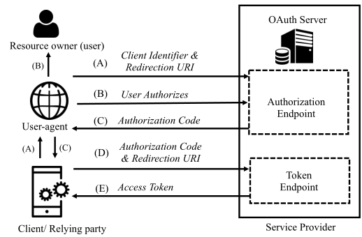  

- 隐式授予（常见）：最简单的授予类型。它有两个步骤：
  - 首先，将用户重定向到OAuth服务器，以授予依赖方（客户端）对其受保护资源的访问权限。在用户授予权限后，服务器将用户重定向回依赖方以及访问令牌。
  - 然后，依赖方可以使用此访问令牌向OAuth服务器请求用户的受保护资源。

- 资源所有者密码凭据授予
- 客户端凭据授予

授权代码授予容易受到代码拦截攻击，特别是对于公共客户端，其中攻击者拦截从授权端点返回的授权代码（图1中的步骤C），并通过在令牌端点交换代码来获得访问令牌（步骤D）。OAuth规范为此引入了一个名为代码交换证明密钥（PKCE）[18]的授权代码授予扩展，并要求所有OAuth服务器支持公共客户端的PKCE。

- PKCE 代码验证器的动态创建的加密随机密钥。使用PKCE允许OAuth服务器在没有密钥的情况下对客户端进行身份验证。
  - 客户端为每个授权请求生成唯一的代码验证器。代码验证器的转换值，称为代码质询，被发送到OAuth服务器以获得授权代码。
  - 当客户端在令牌端点处发出获取访问令牌的新请求时，它还发送代码验证器以及从先前请求中接收到的授权代码。
  - 为了验证客户端拥有代码验证器的证据，OAuth服务器转换代码验证器，并使用之前接收到的代码质询对其进行验证。
  - 如果没有代码验证器的一次性密钥，从授权端点截获的授权码就无法交换访问令牌。

## 威胁模型

攻击者对象：恶意依赖方，也可以是与受害者OAuth服务器（也称为服务提供商）交互的恶意用户（资源所有者）；  
攻击方式：不能直接修改服务提供商的源代码或逻辑，但可以通过向服务器发送请求来发起攻击；在OAuth服务器中发现了许多利用重定向URI的攻击；  

## Cerberus基础原理

在语句级别运行分析，Cerberus自动识别与OAuth查询相对应的程序组件；  

- 根据标准OAuth规范和安全最佳实践确定安全敏感资源。然后，我们精心设计了一种查询语言来正式表示资源，以便开发人员可以轻松定义它们，并且分析工具也可以理解它们。
- 使用系统依赖图（SDG）在语句级别表示OAuth服务器程序，同时维护语句之间的控制和数据流关系。
- 在Cerberus pin-points将其作用域指向程序中与OAuth相关的实现后，它将执行查询，以识别可能使服务器遭受安全攻击的资源违规行为。

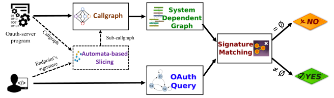  
Overview

### 代码表示

针对应用A，生成系统依赖图（SDG），主要生成(V,X,Y)

- V 一组程序语句，作为图中的顶点；
- X 控制依赖边的编码，SDG创建了三个额外的边来处理函数调用：
  - 调用边
  - 输入的参数
  - 输出的参数
- Y 一组数据依赖边$(v,v',d) \in Y$，其中d表示污染的数据源；X数据依赖于Y，如果Y是一个赋值，在Y中赋的值可以从X中引用.  

### SDG的事实与推理规则

#### 基础表示

Cerberus使用Datalog将应用程序的SDG转换为相应的事实和规则。Datalog[25]程序是用声明性逻辑语言编写的一组事实和规则。事实对应于评估为true的谓词。
path(x, y) :- edge(x, y).
path(x, y) :- path(x, z), edge(z, y).
如果边（x，y）为真，或者路径（x，z）和边（z，y）都为真，则路径（x、y）为假。除了变量之外，谓词还可以包含常量（用双引号括起来）或“不在乎”，用“_”表示。

与OAuthlint的分析是流敏感的不同，OAuth服务器中的许多关键资源都需要流敏感分析。Cerberus表示如下：

A(L,y, x1, ..., xn)

- A application；
- L application lable；
- y y是存储指令结果的变量（如果有）；
- $\hat x$ 输入参数

举例 l1: r1 = 0可以表示为A(l1,r1,0)
l: y = x 可以表示为(x,y)

branch(L1, X, L2, L3)

表示如果X = True则运行L2， 反之运行L3；

使用上述基本事实，Cerberus计算以下语义事实：（i）控制依赖谓词，其根据应用程序的CFG捕获指令依赖，以及（ii）数据依赖谓词。

#### 可扩展的目标谓词

depOn(y,x)表示值x对y具有数据依赖性
followBy(L1,L2)表示L2和L1在同一个基本块，并且L2跟随与L1，或者L1基本块有一条路径通向L2基本块；
SDG谓词是使用以下数据日志规则计算的；
depOn(x,y) : − alloc(_, y, x)
depOn(x,y) : − assign(_, y, x)
depOn(x, z) : − assign(_, y, x), depOn(y, z)
depOn(x, z) : − alias(y, z), depOn(x,y)
followBy(x,y) : − follow(x,y)
followBy(x, z) : − followBy(y, z), follow(x,y)

#### OAuth谓词

定义了一个特定于OAuth域的谓词列表；

- OAuthTag(L, T) L处的值定义了tagT，标签T与持有OAuth特定资源（如redirect_uri、access_token等）的程序语句相关联。如redirectUri = client.redirect_uri定义为OAuthTag(line, redirect_uri)OAuthTag谓词是通过W ALA中的标准数据流分析计算的:
  - 标记了一组可以返回OAuth资源作为源的API;
  - 源分配的所有变量（直接变量或传递变量）也将指向相应的源;
  - 使用模式匹配（即正则表达式）和特定于域的知识（即，可以返回重定向的URI或由规范中定义的键访问的对象值的API）来过度近似URI的域。
- invoke(L, M)，表示OAuth的方法和特定于编程语言的方法M在L调用；
- solad(L, q) 服务器存储模型的加载数据操作q;
- error(L, e) 错误消息e;

### 查询语言

对于每个OAuth属性，用户定义一个唯一的谓词，作为该属性的签名。用户还可以定义签名所使用的附加帮助谓词。在应用程序的语义事实上表达OAuth资源，接下来介绍表示安全模式的查询语言，由以下Backus–Naur形式（BNF）给出，其签名为F：  
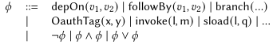  

资源G能完全匹配到应用A的SDG，也即是子图；子图即存在嵌入。以下资源在子图中不变：

- 一对一。对于不同的语句无法在F上映射到同一个顶点上；
- 类型保留。对于每个语句，必须在F下映射到与原先相同类型的顶点；
- 边缘保护。对于每个原有节点组成的边，都要映射到F下的一条边上；

使用查询语言表示的财产列表从标准OAuth规范[12、18、20]和安全最佳实践[11]的文档中获得这些资源：  

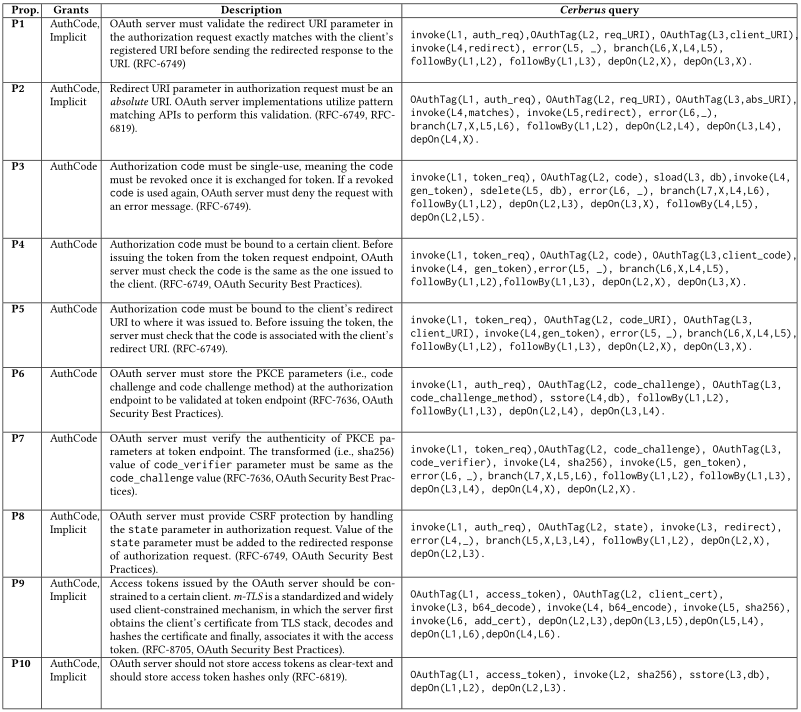  

一旦提交了表示OAuth规范中的属性的查询，Cerberus就会将其与输入程序的SDG表示进行检查。下图显示了过度近似表2中重定向URI属性（P1）的查询的图形表示。发现在下图中，只有request.redirect_URI和client.redirect_URI实现了检查，才能正常执行redirect；  

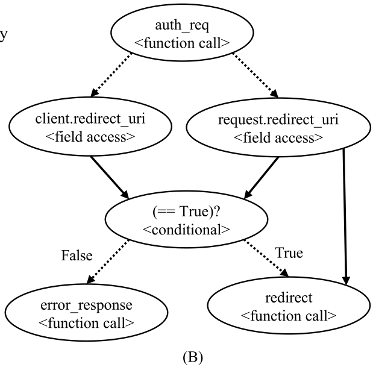  

而这张图并不是按上述方案实现的，仅与NULL进行了比较，因此造成了错误：

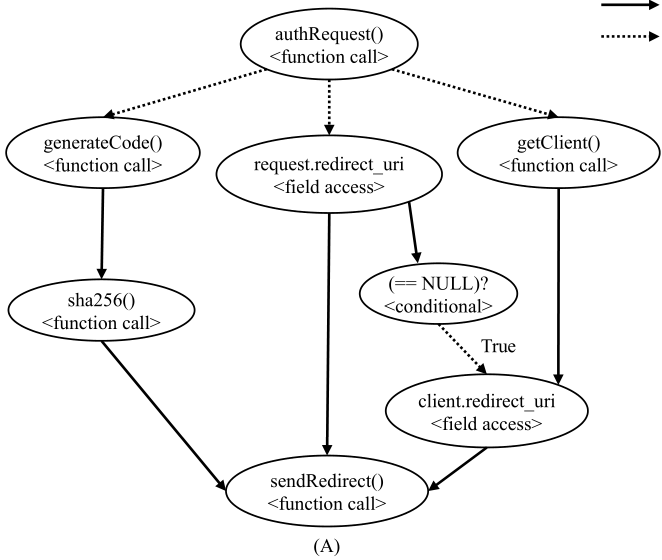  

## Cerberus的设计与实现

### 查询驱动探索

查询驱动的探索Cerberus利用系统依赖图（SDG）来捕获程序的控制和数据流依赖关系。目前，依赖于系统依赖图信息的分析必须实现自己的即席分析，以2回答特定于应用程序的查询。为了缓解这一挑战，我们引入了一种查询驱动的方法，其关键见解是只对与OAuth属性相关的小程序片段进行推理，只跟踪与OAuth属性相关的方法。  

OAuth请求端点Q的定义是指定相关代码片段的入口和出口点的实际OAuth属性的先决条件。给定一个端点正则表达式作为输入，我们使用自动机理论实现了一个轻量级程序切片：

- 为请求端点Q和调用图自动机（CGA）构造所谓的查询自动机（QA），查询自动机只是用户指定的正则表达式的NFA表示。正则转[FSM](Gerard Berry and Ravi Sethi. 1986. From regular expressions to deterministic automata. Theoretical computer science 48 (1986), 117–126.)
- 对于指定程序P，表示在P中的方法f，点字符（“.”）匹配任何方法名称，并且→ 运算符指示从一个方法到另一个方法的调用。“+”运算符用于取两个查询的析取。通常，“*”运算符代表Kleene闭包，并且Q+ 是的句法糖吗Q → Q∗.
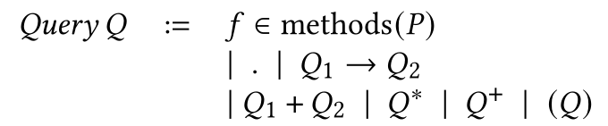  

其中（A）是为图2中的OAuth程序构建的部分调用图自动机（CGA），（B）是我们用来表示OAuth端点签名的查询自动机（QA）的示例，（C）是Cerberus构建的部分积自动机（乘积自动机（表示与签名相交的子调用图）），举例如下：  

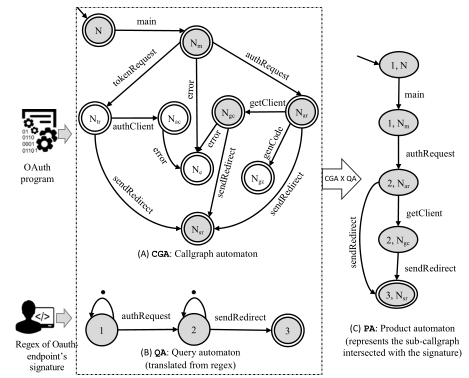  

```C
Kleene* tips：
给定集合V 设：
V0 = {ε} 即只包含空串
V1 = V
递归的定义集合Vi+1 ，这里的
Vi+1 = { wv: w ∈ Vi and v ∈ V } .
所以在 上的 Kleene 星号的定义是

就是说，它是由 中的符号生成的所有可能的有限长度的字符串所构成的集合。
```

### 动态特征的混合分析

上述方案存在的问题例子：

- 当前的抽象并不能解释正则表达式的语义；
- 工具是基于静态分析的，它可能无法确定分支条件的计算结果是否为true；

给定一个可能包含动态特征或正则表达式的应用程序：

- 将相关谓词分配为false来做出最保守的假设。如果分支谓词的条件包含正则表达式，则其计算结果将为false，这将使签名匹配过程失败，并引发潜在的误报。
- 执行如下轻量级delta测试：对于由于我们的保守假设而被赋值为false的每个谓词，我们动态地执行相关代码以恢复丢失的事实。

### cerberus Tool

在WALA框架的基础上实现了我们的核心静态分析，使用Andersen风格的指针分析和WALA提供的CHA（类层次分析）调用图算法。用正则表达式表示的OAuth端点使用JSA库转换为其查询自动机。

#### 从源代码到数据日志程序

利用WALA框架从字节码（对于Java）或脚本（对于Javascript）生成相应的系统依赖图（SDG），SDG的每个节点都对应于一个使用静态单赋值（SSA）形式的WALA中间表示的语句。每个语句都将被翻译成其Datalog事实，用于分配、赋值、函数调用等。

每个边都被翻译成Datalog中对应的谓词。

#### 解析Node.js模块

对于Javascript，调用图是直接从源代码（即脚本）构建的。来自Node.js框架中包含的模块的函数调用不会自动解析，因为所需的源文件对于分析来说是未知的。

## 实验

- RQ1：Cerberus能否识别现实世界中的漏洞？
- RQ2：我们的查询驱动方法是否高效？

### 数据集：

公开集：  

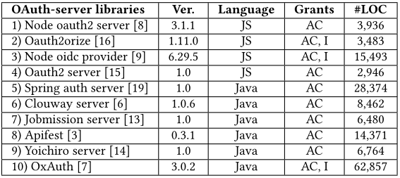  

漏洞集：  

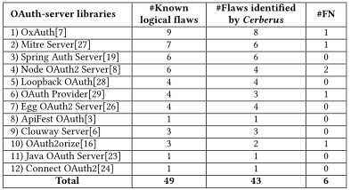  

### 基线程序

OAuthlin、S3kvetter

### 用户输入

对于每个基准，我们都会对照表2中定义的所有财产进行检查。一个研究生级别的安全类中招募了18名独立学生，他们被提供了OAuth财产（即来自用英语编写的规范）和查询语言的文档。我们为每个参与者提供五个随机选择的财产，并测量他们用我们的查询语言表达财产所花费的时间。我们发现参与者使用我们的查询语言指定给定的财产平均需要10.6分钟

为了加快分析速度，Cerberus提供了内置的OAuth端点（如规范中所定义），以利用查询驱动的切片方法（第5.1节）。同时，我们允许用户以regex格式提供（作为查询）自己的自定义端点，以检查标准规范未涵盖的任何其他端点。

### 实验结果

#### 有效性

我们在授权服务器的十个流行库中发现了47个已确认的漏洞，其中24个以前是未知的。  
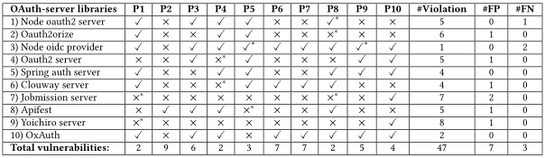  

Cerberus成功识别了47个属性违规（表5），并在数据集中报告了7个假阳性（FP）案例和3个假阴性（FN），三类未知漏洞导致我们有三个新的CVE条目，主要原因是WALA框架中对目标的虚假指向。此外，在Javascript库分析过程中，少数情况下也可能出现不一致性。我们总结了FP和FN情况的原因如下：

- 复杂字符串操作（例如，subString或concate）的语义无法通过WALA精确建模——这导致我们的分析无法跟踪某些字符串变量所持有的精确值。
- 用于执行动态生成代码（例如Javascript的eval）的函数的语义目前尚未建模，因为我们在这项工作中没有对动态代码进行推理。
- 对于在运行时计算对目标方法的引用的反射调用（例如Java的invoke），我们的静态分析可能无法准确解析目标方法，这可能会导致FNs。
- 具有动态功能（例如，动态模块加载）的Javascript库可能会导致WALA生成一个损坏且不精确的调用图，从而导致FP和FN。

#### 效率

eager变体是构建了整个程序的调用图

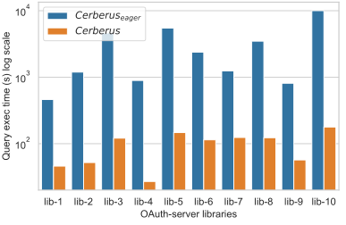  

与现有工具的比较。我们进一步扩展了对Cerberus和OAuthlint的比较，后者只支持OAuth财产和数据流谓词。

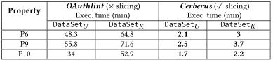  
