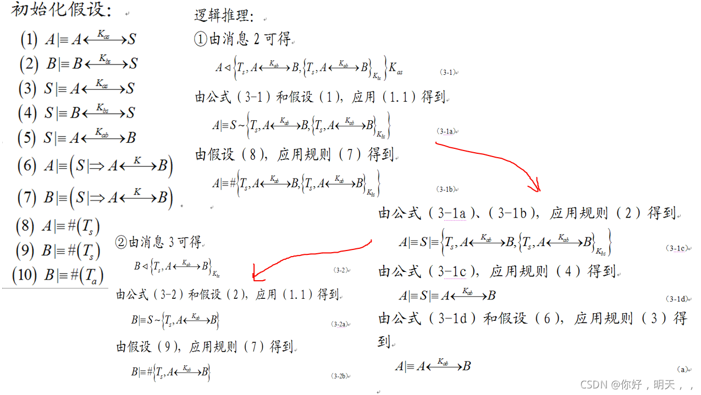
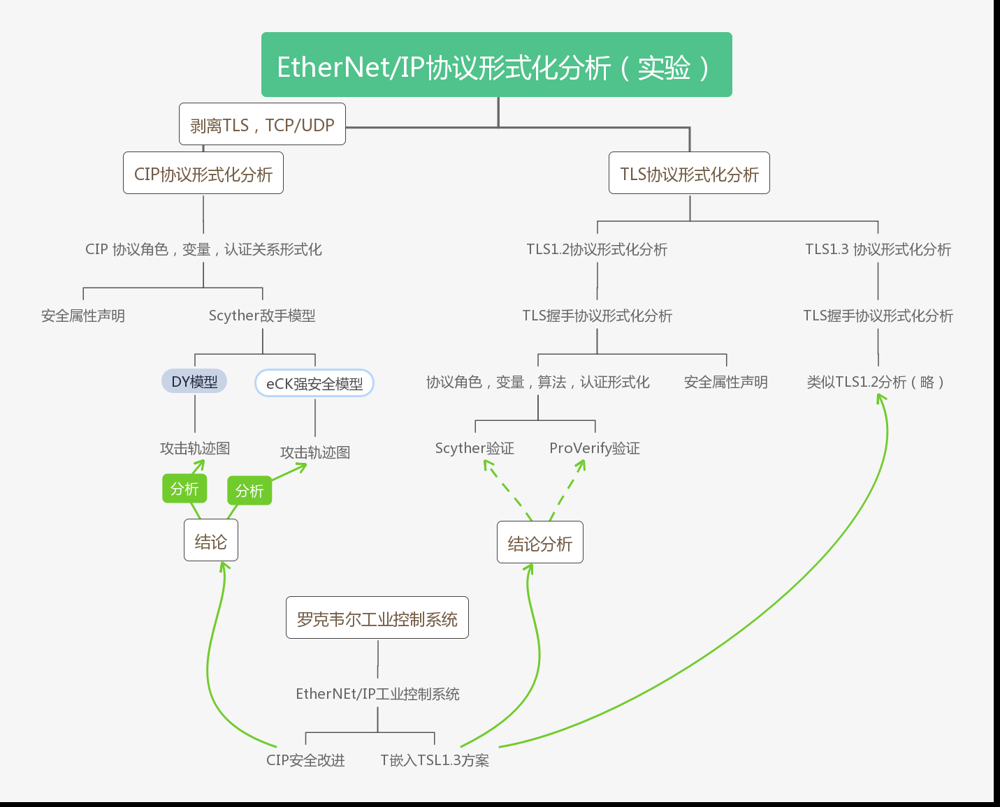

<!--
 * @Description: 
-->

# 协议安全

- 辑推理方法的概念
  - 由命题的知识或者推理规则组成，命题表示主体对消息的知识或信念，这类方法中最具有代表性的BAN逻辑，但是BAN逻辑处理能力有限，存在的问题是初始假设与理想化步骤非形式化，没有考虑入侵者存在等问题，GNYAT逻辑统称为BAN逻辑BAN逻辑的缺点是BAN抽象层次过高，无法对消息空间，消息交换以及协议运行环境进行细致的描述，BAN类逻辑适合描述不同的安全目标，很难把他们合并到统一的理论框架下。
  - 以下图为例，高抽象水平的逻辑证明。但是可以实现自动化。
  

- 模型检测方法
    也叫作状态空间搜索法，模型检测方法基于代数方法，首先建立协议运行的有限状态机模型，通过搜索所有可达状态，判断是否存在成功攻击协议的路径，基于模型检测的形式化分析方法的优点在于自动化的检测，过程和验证速度快，效率高，并且如果一个性质不满足，他能给出响应的反例，据此可对系统进行改进，模型检测的缺点是智能分析有限状态系统，随着状态的增加，存在状态空间爆炸问题，     ------------基于模型检测的方法 容易产生状态空间爆炸问题 ，所以不能分析复杂的协议，但是 Scyther工具完美的解决了这些问题。  一般需要制定运行的参数，一般包括运行实例和主体的数量，发现错误（攻击输出）说明协议确实存在错误，但是他不能证明协议时正确的。 模型检测能够实现自动化，即使不熟悉设计和分析人员也很容易使用。但是存在的两个缺陷的问题还是要关注：
    1. 如何解决状态空间的爆炸问题
    2. 实现模型检测方法的完备性

- 定理证明方法
  - 定理证明方法可以验证并无穷并发系统安全属性，具体的做法是将协议描述成为一些公式，协议的安全属性规约为需要证明的定理，然后利用模型的公式和推理规格证明目标定理成立，即证明协议满足安全属性，并不是寻找针对协议的攻击，但定理证明方法难以自动化，用户需要手动推导。而且需要具备专家级知识，有一定程度上限制其使用。形式化分析方法使用的相关工具是密不可分的，形式化分析工具是判定系统模型是否满足其规约的工具，不同的形式化分析方法在协议的建模 验证等方面都有很大的差异，因此每种形式化方法都有自己的形式化工具。
  - 泛化水平低

BAN逻辑的产生推动了协议的形式化分析这一方向的发展，1989年 Brrows和 Abadi 、Needdham 三个人提出了BAN逻辑，c从此安全协议的形式化分析进入了模态逻辑的分析阶段，BAN是一种基于信念的模态逻辑。 BAN在认证协议的形式化分析中发挥了积极的作用，但BAN逻辑仅仅关注在抽象层次上来讨论认证协议的安全性，他不考虑有协议的具体实现带来的安全缺陷，也不考虑由于加密体制的缺点所引发的协议缺陷。  

BAN逻辑的使用，很多假设的基础上的：   
1. 密文不能被篡改
2. 密文不能同时抵达两个
3. 其他基于加密系统的完善性的假设。

密文中包含足够的冗余信息， 消息中含有足够的冗余信息 ，假设参与协议的主体是诚实的。从实际上看 ，BAN逻辑证明了一些协议时安全的，但是后来发现协议却存在安全漏洞，实际山也是不安全的。也就是证明了BAN逻辑发现协议时不安全的，就证明看了该研究的协议时不安全的。但是如果说是BAN逻辑证明安全的协议，我们不能说该协议就是安全的。这个问题也是很多协议分析工具所面临的一个问题。
  
