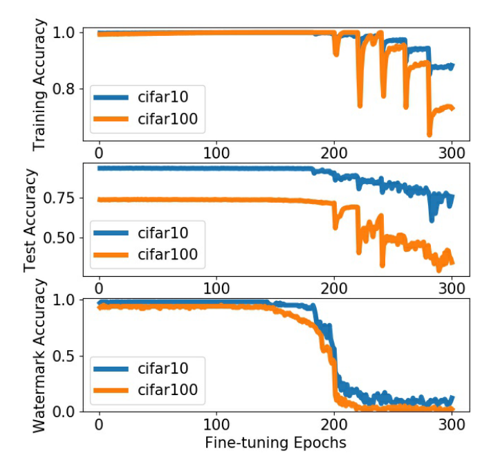

<!--
 * @Author: Suez_kip 287140262@qq.com
 * @Date: 2023-06-06 08:59:08
 * @LastEditTime: 2023-11-22 15:21:44
 * @LastEditors: Suez_kip
 * @Description: 
-->
<!--
 * @Description: 
-->
<!--
 * @Description: 
-->
# REFIT

- [REFIT](#refit)
  - [威胁模型](#威胁模型)
  - [基于微调的统一水印去除框架REFIT](#基于微调的统一水印去除框架refit)
  - [实验](#实验)
    - [Dataset](#dataset)
    - [baseline](#baseline)
    - [攻击场景](#攻击场景)
    - [水印方案](#水印方案)
    - [水印去除方案](#水印去除方案)
    - [评测指标](#评测指标)

## 威胁模型

- 无水印知识，无与训练。
- 不了解水印的实施方案，如先前工作都依赖于假设水印是基于图案的
- 微调的数据有限，之前的大多数工作都假设攻击者可以访问与模型所有者相同数量的任务T的良性数据，对手拥有比预训练数据集更小的数据集；

## 基于微调的统一水印去除框架REFIT

关键原因可能是这些作品中设置的微调学习率太小，无法通过少量的训练时代改变模型权值。  
分别在CIFAR-10和CIFAR-100训练的模型中嵌入水印。以类似于FTAL过程的方式对模型进行微调，即，我们更新所有层的权重。没有为微调设置一个小的学习率，在他们的评估中固定是0.001，而是改变学习率的大小来观察它的效果。具体来说，从1e-5开始，在微调过程中每20个epoch学习率翻倍，这是它们评估中用于水印去除的微调epoch的个数。
  

根据上图的得出的结论：

- 当学习率达到0.005左右时，模型性能的变化变得明显，并且需要更大的值才能达到足够低的水印精度；
- 当学习率增加一倍时，在每个epoch开始时，训练和测试准确率先下降，然后在接下来的20个历元内逐渐提高；水印不包含在微调数据集中，水印精度不断下降。
- 攻击者可以设置初始微调学习率，从而在前几个微调步骤中大大降低训练和测试精度，这表明模型权重被充分修改以去除水印;
- 微调收敛时，可以实现理想的测试性能，这意味着初始学习率不必太大，从而导致模型与从头开始训练的模型没有太大的不同。

问题：灾难性遗忘现象！当攻击者没有与水印模型所有者相媲美的训练数据时，这种基本的微调方案是不够的。虽然测试精度的下降通常比水印精度的下降要小得多，但这种下降仍然是相当大的，这可能会损害模型的效用。

水印模型的训练建模：
水印嵌入阶段，模型是在两个任务上进行联合训练的：

- 任务上取得良好的性能；
- 记住水印集合中图像的标签；
  
因此目标为最小化模型对水印任务的记忆，同时仍然保持对其评估的主任务的性能。

- 对手的训练数据与预训练数据不同，但调优数据有助于预训练模型的子任务，同时去除水印。  
- 灾难性遗忘研究中，不同的任务往往是相互补充的；

因此适用适应弹性权重巩固EWC：是减缓对先前训练任务很重要的参数的学习，为了衡量每个模型参数对任务的贡献，EWC首先计算前一个任务的Fisher信息矩阵的对角线如下:

当新数据也包含与老数据相关的信息，学习参数应该接近先前任务的参数；当Fisher信息矩阵的i-th对角线条目很大时，我们惩罚i和*i之间的距离。即loss函数：

  
优化新任务性能的损失(例如交叉熵损失) + 正则化的强度（记忆旧任务的重要性）/2 * fisher info 

进一步当微调数据与预训练数据属于不同的任务时，扩展到迁移学习设置中；首先以较小的学习率微调预训练的水印模型，从而得到一个适合他的新任务的模型，尽管水印通常仍然存在。攻击者将该新模型的模型参数视为$\theta*$

无法访问预训练的数据,原则上我们无法计算前一个任务的Fisher信息矩阵,无法计算L中的正则化项;通过假设"微调数据是从与预训练数据相似的分布中提取的",因此使用微调数据来近似Fisher矩阵；

微调数据中不包含水印，EWC组件使模型对获得较好的测试精度重要的模型权值更新较少，而对水印记忆重要的模型权值仍然得到充分修改。

AU：为未标记的样本集，预训练模型作为标记工具；尝试了更先进的半监督技术来利用未标记的数据，例如虚拟对抗训练和熵最小化，它们都没有提供显著的增益。因此使用此方法评估未标记的数据增强。该技术应用于迁移学习设置，首先对新任务的模型进行微调，而不考虑水印去除，然后使用该模型进行标记。

预训练模型本身的测试精度不是100%，这种标签标注本身就有噪声;当U来自不同于考虑任务的分布时，分配的标签可能根本没有意义。它们仍然使微调模型能够更好地模仿预训练模型的预测行为。

## 实验

### Dataset

- CIFAR-10：10个类别的彩色图像，其中每个类别有5000张用于训练的图像，1000张用于测试的图像。每张图像的大小为32 × 32。
- CIFAR-100：100个类别的彩色图像，其中每个类别有500张用于训练的图像，100张用于测试的图像，因此训练样本总数与CIFAR-10相同。每个图像的大小也是32 × 32。
- STL-10：广泛用于评估迁移学习、半监督学习和无监督学习算法，包括10个标签，每个标签有500个训练样本和800个测试样本。除了标记的样本，STL-10还提供了100,000张未标记的图像，这些图像来自于相似但更广泛的图像分布，即它们包括不属于STL-10标签集的标签图像。每张图像的大小为96 × 96；
- ImageNet32：ImageNet数据集的下采样版本，有1000个类的128万个训练样本，每个类有50张图像的50,000个样本用于验证。

### baseline

评估了基于模式的技术、样本嵌入水印、指数加权和对抗性前言拼接技术等水印嵌入方案：

- 基于模式的技术Pattern：指定一个键模式和一个目标标签，所有以该键值混合的图片，检测概率都很高。所有者生成一组图像将key混合进x，并以此赋值新的lable，用于训练；本文使用使用[52]中的文本模式
- 分布外样本嵌入水印OOD；水印图像来自[1]的代码库。
- 指数加权EW：第一个选择是关于水印的生成。设置权值为2.0，使用训练集中的最后100个样本来形成水印集，并确保这些水印样本不包含在微调训练集中。
  1. 训练样本的标签改为不同的随机标签，但不修改图像本身。
  2. 将训练过程分解为三个阶段。
     1. 他们首先只在正常的训练集上训练模型。
     2. 每个模型参数上添加指数权重算子。
     3. 采用指数加权方案对模型进行常规训练数据和水印数据的进一步训练。
- 对抗性边界拼接技术ADV：添加了对抗性扰动的图像作为水印。该水印集由50%的真对手(即模型提供错误预测的对抗扰动图像)和50%的假对手(即模型仍然预测正确标签的对抗扰动图像)组成。每一张都标注了其未扰动对应的地面真值标签作为水印标签，将这些水印添加到训练集中，对模型进行微调。本文没有水印训练的模型的水印精度在50%左右。

### 攻击场景

为了模拟对手只能从与预训练数据相似的分布中收集相对较少数量的标记训练样本的场景，改变了对手在整个训练集中可以访问的训练样本的比例，但在实践中，微调训练数据集不一定需要是预训练数据集的子集。

- 非迁移学习
  - 对于CIFAR-10和CIFAR-100，水印模型在其整个训练集上进行预训练；
  - 对于ImageNet32，预训练模型使用训练集中标签小于500的图像。只有那些标签大于500的训练样本被包括在无标签数据增强中。（丢弃了这些ImageNet32样本的标签，只使用图像进行增强。）
  - 进行未标记数据增强:(1)STL-10的未标记部分，包含100,000个样本;(2)对于CIFAR-10和CIFAR-100的分类，我们也使用整个ImageNet32进行未标记的数据增强。

其中CIFAR-100和STL-10之间的标签集几乎没有重叠，ImageNet32的标签集比CIFAR-10和CIFAR-100更细粒度。

- 迁移学习
  - 评估集中于在STL-10上实现，对手可以在具有更大训练集的另一个任务上利用预训练模型，然后在STL-10上微调模型。执行迁移学习以适应在CIFAR-10或ImageNet32上训练的模型到STL-10。没有考虑CIFAR-100，因为我们发现，与CIFAR-10和ImageNet32相比，从预训练的CIFAR-100模型进行适应会导致STL-10的性能较差，

### 水印方案

水印方案配置基本上遵循与原始论文相同的设置。模型预测与分配的水印标签相同。水印样本的预测置信度得分很高，例如在0.85以上，表明嵌入水印的强度。

### 水印去除方案

由于仅微调输出层不足以去除水印，迁移学习设置中，它将完全无法去除水印。尝试了FTAL、RTAL：

- FTAL直接对整个模型进行微调；
- RTAL输出层在微调之前被随机初始化；

非迁移学习，我们采用FTAL方法，因为RTAL不会提供额外的性能增益;对于迁移学习，我们采用RTAL方法，因为预训练数据集和微调数据集的标签集是不同的。

只要预先训练的模型达到较高的测试精度，并且很好地拟合水印。主要采用ResNet-18模型；

先前基于微调的水印去除方法的失败主要是由于微调的学习率调度不当。初始学习率为0.001，比预训练的初始学习率小100倍。将初始微调学习率设置得更大，例如0.05。使用SGD作为优化器，并将批大小设置为100，用于预训练和没有标记数据的微调，对模型进行微调，直到训练精度没有进一步提高，这通常是在20个epoch内。

未标记数据增强，每批包括100个未标记样本。每500步将学习率降低0.9。在整个训练集的t/10 -分数上进行训练后，学习率乘以0.9^t。

对于EWC组件，Fisher信息是通过从对手可用的分布中标记数据中绘制M样本来近似的。CIFAR-10、CIFAR-100或STL-10时，我们设置M = 10000，ImageNet32时，设置M = 40000。样本是通过替换绘制的，因此푀可能比可用的训练样例的数量大，在训练样例中，相同的样例可能被使用多次。首先对Fisher矩阵进行归一化,裁剪为$\frac{1}{\lambda - lr}$,带入EWC的公式；

基本版本只是在可用于微调的数据集上进行训练，而不利用预训练的模型。第二种变体，表示为AU，以与REFIT中的AU模块相同的方式将预训练的模型作为标记工具，但模型是随机初始化的，而不是从预训练的模型初始化。

### 评测指标

- 水印精度：水印集上的模型精度不超过水印决策阈值，不超过的水印输入，模型预测与分配的水印标签相同。精度设置为在没有水印训练的模型的水印精度范围内。对于ADV以外的水印方案，我们设置훾为CIFAR-10的20%，CIFAR-100的10%，和3%的ImageNet32。当使用ADV时，我们对所有基准设置58%；
- 测试精度：在常规测试集上最大化模型的准确性。我们评估前1名的准确性。

在我们的评估中，嵌入任意一种水印方案的预训练模型的水印精度都是100%，使用REFIT去水印后的模型水印精度始终低于阈值훾。