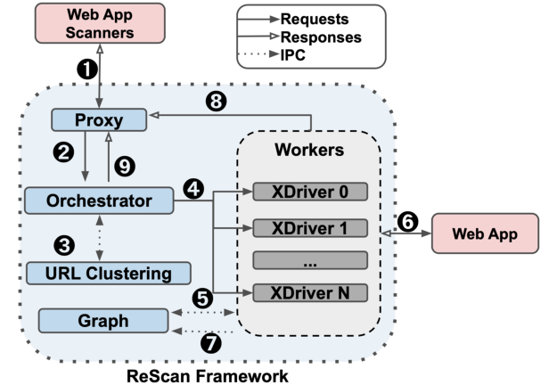
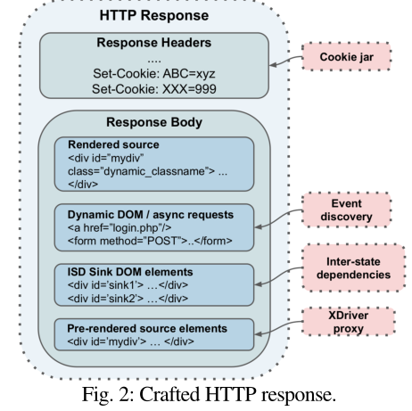
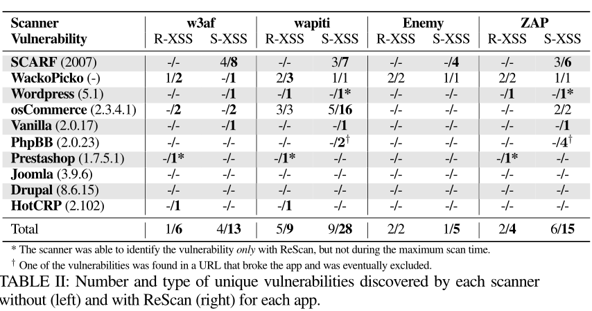
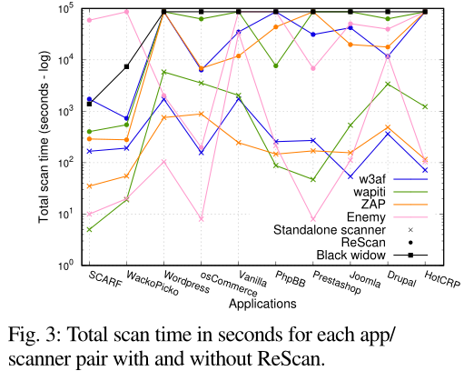
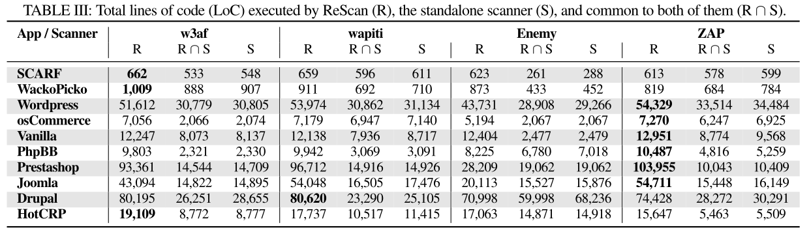
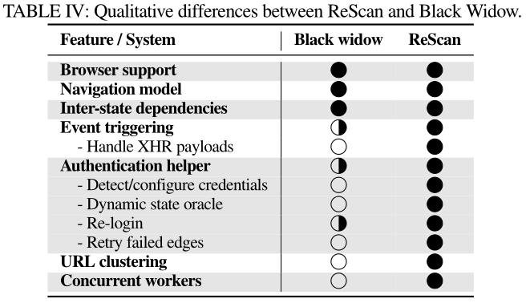
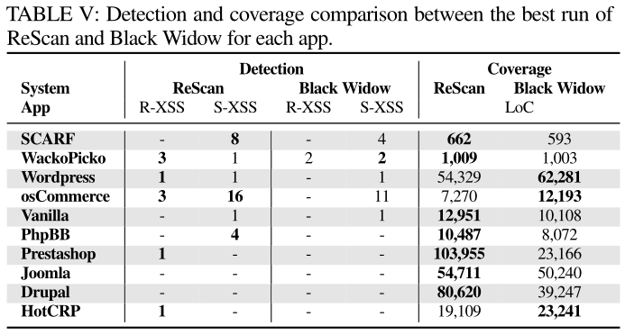

# ReScan: A Middleware Framework for Realistic and Robust Black-box Web Application Scanning

- [ReScan: A Middleware Framework for Realistic and Robust Black-box Web Application Scanning](#rescan-a-middleware-framework-for-realistic-and-robust-black-box-web-application-scanning)
  - [结构组成](#结构组成)
    - [结构一 Proxy](#结构一-proxy)
    - [结构二 Orchestrator](#结构二-orchestrator)
    - [结构三 Worker](#结构三-worker)
    - [结构四 Graph](#结构四-graph)
    - [结构五 Background Worker](#结构五-background-worker)
    - [结构六 Authentication helper身份权限验证器](#结构六-authentication-helper身份权限验证器)
      - [证书验证](#证书验证)
      - [Oracle](#oracle)
      - [重登录](#重登录)
      - [假阳性和假阴性排除模块](#假阳性和假阴性排除模块)
  - [URL聚类](#url聚类)
    - [代码相似性 mNDD](#代码相似性-mndd)
    - [流程](#流程)
  - [结论](#结论)
    - [漏洞检测结果](#漏洞检测结果)
    - [漏洞检测速度](#漏洞检测速度)
    - [代码覆盖率](#代码覆盖率)
    - [基于XSS与Black Widow比较](#基于xss与black-widow比较)
  - [展望](#展望)

Rescan是一个较为全面的基于扫描器的黑盒检测框架（即该框架不包括扫描器），他的概念图如下：
  

他主要针对的是XSS漏洞，但是也能够检测其他的web漏洞，他的主要创新点包括：

- 基于注入与检测获取的ISD状态间依赖链接，来将无关联页面间的数据关系进行绑定；
- 基于改进NDD的mDNN的一套URL聚类算法，目前来看非常先进，但是从mDNN的阈值设置还存在一些的问题；
- 一套精心设计的web页面事件获取方案，可以帮助发现大量折叠的事件，便于Rescan系统的扁平化处理，提高代码覆盖率；

[基于docker部署的代码](https://gitlab.com/kostasdrk/rescanApps)

## 结构组成

### 结构一 Proxy

基于mitmproxy的扫描仪截获请求，系统会基于该请求创建线程来执行后续内容，截获所有请求相关信息并且等待接收其响应；

### 结构二 Orchestrator

编排器Orchestrator，定期加载proxy②，并以FIFO的队列确保Worker的正常运行；

### 结构三 Worker

Worker执行

1. **检测目标获取**：从Graph处获取工作流，并用以执行Graph中的边；在某些情况下，有些边可能不需要，甚至不能重放，则只需忽略不存在的中间边，然后继续工作流程其余部分。
2. **DOM修改**：使用MutationObserver API在每个文档上注册一个观察者，检测DOM更改，比现有轮询检测高效；
3. **页面事件扩展器1**：通过使用j¨Ak的JS库，与事件监听器挂钩来识别注册了事件监听器的HTML元素，并且扩展了XDriver以精确触发每个事件；
4. **页面事件扩展器2**：修改了j¨Ak的库，以捕获异步请求中的系统所需的所有信息。在触发每个事件之前，我们阻塞了所有异步请求;在获取请求信息之后，我们不会将实际的请求发送到应用程序，以避免由于更改应用程序的状态(例如，注销或删除用户)而可能产生的副作用？
5. **页面事件扩展器3**：***带有事件的元素可以产生其他元素，这些元素也可以产生其他元素，进行DOM更改等***，该框架遵循BFS方法，并在加载页面时触发所有显示的事件，存储这个依赖链接，如果一个事件隐藏了任何零级事件(例如，由于打开了一个重叠的菜单)，或嵌套事件，立即触发，以防止其他事件导致被掩盖；
6. **事件重复触发抑制器**：许多相似的边(即相同的基本URL但不同的查询)落在相同或相似的页面上，并包含相同或许多共同的事件，导致事件重复触发；对于每个基本URL，我们存储每个事件及其唯一的CSS选择器，对于具有不同参数的相同基URL的后续请求，我们跳过之前遇到的任何事件，只触发可能存在的新事件；
7. **状态间依赖链接(ISD)的提取**：***有些漏洞在有效载荷注入后在着陆页上不直接可见，但出现在其他url上***；识别给定POST请求(ISD源)的参数值是否出现在另一个页面(ISD接收器)上。每当浏览器worker执行POST请求时，映射到FORM或EVENT边，它会将请求的边ID，以及所有参数和它们的值提供给后台worker，后台worker负责检测这些依赖关系。执行请求时，worker将收集其值的熵值超过阈值的参数，以捕获正在测试的实际扫描仪有效负载；发现则存储值及其封装的HTML元素，以便在最终的HTTP响应中使用，并“携带”扫描器正确评估其注入所需的上下文。
8. **增强器**：Rescan与扫描仪无关，将每个扫描仪视为产生HTTP请求并消耗响应的黑盒。需要将这些新发现的工件转录为最终的静态HTTP响应，以一种扫描器可以“检测”并利用它们的方式。我们最初将ISD接收器的相关HTML元素附加到响应中，并将DOM更改为“原样”(例如，将动态生成的表单附加到文档正文中)。简单的异步GET请求和重定向被转录为新链接，复合请求被转换为等效的HTML表单，并处理浏览器改变的原始页面源代码的语法语义结构，例如，如果浏览器遇到只有一个属性名而没有值，它将修改它们的结构。使用BeautifulSoup和html5lib标准兼容的解析器，来解析和修改最终的HTTP响应；
9. **Cookie**：应用程序可能在工作流执行期间通过set - cookie响应报头或通过JavaScript设置或取消设置cookie。因此需要将捕获了最后执行边缘的响应头(即最初的扫描器请求)传递给扫描器，遍历浏览器的cookie jar，组成等价的Set-Cookie报头，并将它们附加到响应中，以便通知扫描器当前状态。
  
10. **Graph结构传导**：worker将所有发现的事件，以及页面的所有链接、表单、iframe和重定向提交给graph worker，这样它们就可以作为新边包含在导航模型中。

### 结构四 Graph

由两个独立线程组成：  

- 只读线程：等待Worker对特定边的请求，构造并返回必要的工作流
- 只写线程：接收Worker新提交的边，并将它们添加到模型中

### 结构五 Background Worker

检测ISD关系的部件，但这里仅仅考虑POST请求，最初跟踪所有提交的值，这些值的熵高于给定的阈值约1.4，以消除常见的值(例如，“1”，“true”)。

- 查询图工作者并收集到目前为止发现的所有GET、IFRAME和REDIRECT边，因为它们构成了潜在的ISD接收器。
- 更直接的方法是利用底层扫描器的请求来检测ISD链接。执行一个工作流时，我们都可以检查之前提交的值，但这会导致有效性强烈依赖扫描程序：如果扫描程序决定模糊一个表单，并且之后没有访问相应的ISD接收器，要么是因为没有发现它，要么是因为它更早地爬了它，那么我们将没有机会及时检测到ISD链接，潜在的漏洞将被错过。

篡改需要注意动态生成高熵值的负载，来保证每一个ISD发送端的独特性，以此保证ISD的唯一链接；

### 结构六 Authentication helper身份权限验证器

现有检测器基本无法实时检测身份信息有效性，导致后续检测回顶着一个无效的身份信息模块不断检测，或中间流程的行为导致身份信息失效，为此Rescan设置了以下几个模块：

#### 证书验证

模块捕获第一个身份验证请求(即在其POST数据中包含密码)，并根据公共参数的命名约定检测有效的用户凭据。

#### Oracle

1. 执行登录的工作人员将向登录页发送另一个不包含任何cookie的请求，以获得未经身份验证的响应。
2. 模块将检查**检测到的用户名(或电子邮件)或任何与登录相关的字符串**是否出现在已验证的响应中，而没有出现在未验证的响应中。
   1. 如果是这样，它就推导出了一个健壮的身份验证oracle。
   2. 如果它们出现在两个响应中，worker将获取包含登录表单的页面，并检查表单是否只出现在未经身份验证的响应中。

#### 重登录

尝试方案：  

1. 重新访问登录URL，并尝试使用有效的凭据登录，并咨询oracle以验证重新登录成功。
   1. 如果成功，工作线程将重新尝试手头的请求，以确保其工作流被正确执行。如果会话再次中断，表明这确实是错误的请求，我们重新登录并跳过此请求的其余组件;否则我们照常进行。
   2. 如果重新登录失败，我们通知所有工作人员关闭，因为我们无法继续经过身份验证的扫描

#### 假阳性和假阴性排除模块

为了防止一些执行注入漏洞只是以文字形式注入，而不执行，设立这个模块；出现的问题如下：

- 一个“按原样”显示但从未执行过的有效负载(例如，由于它是输入元素的value属性的一部分)将导致FP。
- 执行了有效负载，但其结构被客户端代码改变或完全删除，扫描器将无法检测到成功的注入，从而导致FN。  

rescan实现提供额外的结果作为单独的报告来消除或减少这种情况，方案如下：

1. 通过收集GET请求的所有查询参数和POST请求的有效负载参数来识别它是否是注入尝试；
2. 根据扫描器之间使用的常见关键字(例如，alert、prompt、javascript:)检查它们的值；
3. 打开警报框时，我们提取其文本，并尝试将其与前一步中检测到的所有注入进行匹配；

## URL聚类

这里关注的问题是对同一URL的不同参数是否会作为同一个行为：

同一个URL但是由于参数不同，他执行的行为是不同的，那就不能将其进行聚类，例如：www.example.com/account.php?action=edit和www.example.com/account.php?action=add就是一个编辑账户、一个添加账户，从逻辑上这就是完全两种不同的行为，并导向完全不同的next page；

现有的方案包括：

- Wapiti限制抓取的深度，但会导致跳过出现在应用程序较深级别的重要url，而处于相同深度的类似url将被冗余抓取；
- w3af限制具有相同路径的url的数量，并限制扫描期间将考虑的一组查询参数；一些具有相同查询参数的url可能需要与其他url不同的阈值;例如，将阈值设置为1对于/products.php?pid=X个url，因为多个产品页面是冗余的，但是对于表单/products.php?pid=X&action=Y，其中action可以是编辑、更新、删除中的一种，值为1将导致扫描程序只考虑这些功能中的一种，从而直接影响其覆盖范围，并可能影响检测到的漏洞。
- [Enemy of the state](A. Doup´e, L. Cavedon, C. Kruegel, and G. Vigna, “Enemy of the state: A state-aware black-box web vulnerability scanner,” in 21st USENIX Security Symposium, 2012)  
- [j¨ak](G. Pellegrino, C. Tsch¨urtz, E. Bodden, and C. Rossow, “: Using dynamic analysis to crawl and test modern web applications,” in Research in Attacks, Intrusions, and Defenses, 2015.)
- 这两个仅依赖于页面的链接结构，或者没有考虑url的查询参数值。出现两个问题：
- 现代web应用程序利用新的方法来导航和不同的功能(例如，分散的输入或不属于表单的按钮元素)，这些都是由客户端事件驱动的。忽略这些可能导致不同页面的不正确聚类。
- 不同的单独参数可能会导致操作的结果不同比如?id=1和?id=2虽然属于同一个url聚类，但是会导致操作点和接受点的错位，比如在?id=1处检测到了执行上传评论操作，在?id=2处检测到了查看评论操作，那么有可能就会导致ISD链的漏检；

### 代码相似性 mNDD

这里要考虑到：  

1. 实时性，需要提高代码的效率
2. 准确性，准确认识到页面的逻辑相似性和页面的相似度之间的关系

方案如下：  

1. 不管URL查询参数如何，如果两个URL共享相同的路径，我们会认为它们是相似的。
2. 对相似路径的页面实现基于dom的相似检测，Rescan基于标准化DOM-编辑距离度量(NDD)进行了改进；

- 树编辑距离算法(ZSS)相当缓慢；
- APTED在更复杂的dom的某些情况下，对于我们的用例来说，即使这个算法的处理时间也很长。
- 减少输入大小：
  - 采用了水平修剪方法，丢弃了5级以下的所有树节点，但这种方法不适用于web的案例，可能导致不考虑两个页面之间的细微但重要的差异(例如，驻留在DOM更深层次的表单)，从而导致页面错误地聚集在一起；
  - 递归地丢弃了不提供任何功能的叶节点(例如，换行，段落，span, div或字体格式标签)，同时保留了表示功能的节点(例如，脚本，表单，iframe，按钮和输入)。如果一个节点的所有子节点都被移除，变成了一个叶节点，并且是一个非功能标记，那么它也会被丢弃。

两个不包含任何表示节点的功能的页面(例如，两个静态页面)将被过度简化并错误地聚集在一起，只对共享相似URL的页面使用我们的NDD变体，从而避免将不相关的页面聚集在一起；  

同时，这里将不考虑post报文，而是只考虑get报文，因为只有get报文中才会包含url的聚类信息；  

手动编译了三组页面。第一组包含url和功能完全不同的页面，这些页面不应该被聚在一起，而第二组包含url和功能相似的页面，这些页面应该被聚在一起。最后，第三组包含了具有相似url的页面，但由于功能不同而不应进行聚类。对于不应该聚集的页面(第1和第3集)，最小mNDD值为0.014，为阈值设置了上限。对于应该分组在一起的页面，最大mNDD值为0.009，表示阈值的下限。选择使用两者中较低的值作为页面相似度阈值(即0.009)，以确保我们避免误报，即mNDD略小于0.014的不同页面被聚在一起。

### 流程

1. 收集超过一个值的get参数点，放入一个{X}待选区，并设置一个空的{X'}完成区；
2. 每当发现一个新的值未被请求则记录；
3. 交换{X}{X'}差集与刚刚收集到的未知值（初始时值均为未知）；
4. 获取替换和原有的URL的结果进行mNDD的检测；
5. 建立一个基于相似页面的URL聚类；
6. 若不相似：
   1. 重置{X'}；
   2. 选择一个参数去保存原始数据，加入{X'}；
   3. 再次从第三步开始；
   4. 3-6步骤的检测流程是从单个参数、组合的二参数、三参数
7. 无参数可替换后，记录上述URL、参数以及后续的比较和聚类的结果；

由于必须测试大量的参数组合，大量的URL参数可能会潜在地导致状态爆炸或令人望而却步的处理时间。然而，在实践中，由于几个原因，这种情况不太可能发生。首先，由于算法一开始会忽略新看到的参数和已知值的参数，因此不需要测试和比较所有的组合。此外，要做到这一点，所有的组合都需要指向不同的页面，因为如果找到一对相似的页面，算法就会停止。最后，在我们的实验评估过程中没有遇到这样的情况。

## 结论

这里检测了本文主要针对的反射型、存储型XSS，文件上传，登录爆破，盲SQL注入

### 漏洞检测结果

  
  
### 漏洞检测速度

  
开销很大

### 代码覆盖率

  
代码覆盖率提高了至少3%到最多935%的改进，平均为168%；

### 基于XSS与Black Widow比较

  
  

## 展望

- 扫描器可能会以反射的方式报告存储的XSS
- 应用程序状态或内容的更改可能导致系统无法进行检测，这可能是由于一个成功的有效负载被一个不触发漏洞的有效负载覆盖，或者反射页或注入点不再可用;直接检查ISD接收器可以解决这个问题；

- 扫描器对漏洞提取、分类存在错误，导致Rescan无法解决；
- 基于session共享机制，可以提高worker之间的工作效率；
- 本文针对的时XSS类型漏洞，其他漏洞的FP和FN是很显著的；
- 开销过大，探索的成本和Background Worker的探索成本很大，但是达到了较高的覆盖率和逻辑准确性；
