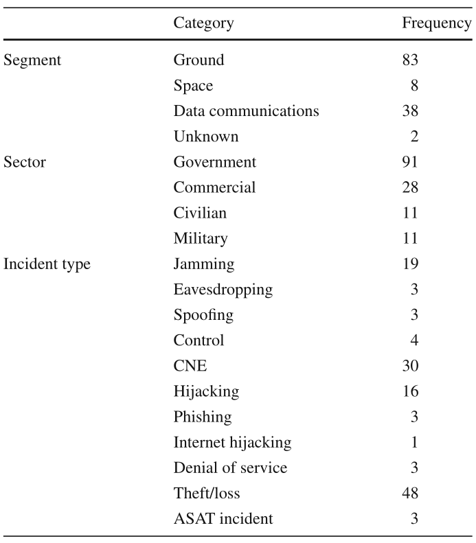

# SPACE MISSION SECURITY

参考文献：[绿皮书](../其他分类/SAT/350x1g3.pdf)

1977年至2019年的太空安全问题统计：

  

  

## Threats Model

涉及的领域：

- 人类空间飞行:
  - 商业
  - 代理赞助
- 地球观测(气象)卫星:
  - 低地球轨道(LEO)
  - 地球同步地球轨道(GEO);
- 通讯卫星:
  - LEO低轨;
  - MEO中轨;
  - GEO地球同步轨道
- 科学任务
  - 近地球/地球轨道
  - 月球
  - 星际/深空
  - 导航卫星
  - 轨道服务(OOS)。

可能发生的威胁环节：

  

威胁发生的对应位置：

  

下面将描述部分威胁：

1. 数据修改；
2. 接地系统损耗；
3. 数据截取；
4. 干扰；
5. 拒绝服务；
6. 地址伪装；
7. 重放；
8. 软件威胁；
9. 未授权访问；
10. 硬件污染；
11. 供应链威胁；

  

  

### 数据修改

- 适用于:空间段、地面段、空间链路通信。
- 说明:数据修改是指有意或无意地对数据进行更改，无论是在通信中还是在静止状态下。数据修改意味着对完整性的破坏。数据可以在其来源、在地面和空间系统之间传输期间、在航天器上或在地面系统上进行修改。
- 可能的任务影响:修改可能是由于软件故障、错误或弱点、硬件故障、使用未经授权的软件、伪造的硬件或软件，或主动尝试更改/修改数据以拒绝使用。如果没有采取任何行动(例如，命令被丢弃)或在航天器上采取了错误的行动，修改或损坏的航天器命令可能导致灾难性的损失。例如，如果导航机动命令被破坏，航天器可能最终进入一个无法使用的轨道，错过与彗星/行星/小行星的相遇，或者被摧毁。

### 地面系统损耗

- 适用于:地面段。
- 说明:通过物理/网络攻击成功利用漏洞可能会使地面设施瘫痪，并直接影响特派团的运作和提供的服务。攻击还可能对设施进行物理控制，以在不从技术上攻击设施系统的情况下控制航天器。环境因素也可能导致地面设施的损失。龙卷风、飓风、海啸、洪水或其他与天气有关的因素可能会对设施造成物理破坏或对地面站造成电力损失。
- 可能的任务影响:地面系统的损失可能导致数据丢失、无法及时访问数据、航天器指挥能力下降或丧失，或整个任务的损失。

### 数据截取

- 适用于:空间段、地面段、空间链路通信。
- 说明:从航天器上收发的数据都是通过射频(RF)通信链路发送的。所有射频通信都要通过监听特定的分配频率来进行拦截。然而，用于航天器通信的射频可能比普通无线电更不容易被拦截，因为用于在地面和空间之间通信的地面天线较大，波束宽度较窄，相反，从空间到地面使用的波束宽度较低，功率较窄。这取决于任务，因为所有任务都是不同的。随着航天器发展到使用光通信，数据拦截将变得更加困难，但并非不可能。试图拦截光通信的威胁行为者必须非常接近狭窄的光束宽度。如果地面系统通信在公共网络(例如因特网)上运行，它们很容易被拦截，因为数据是通过许多可能被利用的不受控制的资源路由的。
- 可能的任务影响:如果数据没有加密，或者使用较弱的算法或实现进行加密，数据被拦截可能会导致数据机密性和数据隐私性的丧失。除了获得数据授权的实体外，未经授权的实体也可能获得访问权限。数据拦截还可能导致伪装攻击或重放攻击。

### 干扰

- 适用于:空间段、地面段、空间链路通信。
- 描述:通过干扰射频或光信号来阻止与航天器的通信。这可以通过注入噪声、以相同频率从另一个源、电磁脉冲(EMP)、高功率微波或压制原始源来实现。光学传感器可能被激光干扰，太阳能电池阵列可能被激光损坏。
- 可能的任务影响:干扰可能导致链路丢失和任务控制丧失。航天器的指挥，以及从航天器接收科学或工程数据的能力，可能会受阻。此外，对系统资源的授权访问可能受到阻碍，可能会延迟地面和空间上的时间关键操作。

### 拒绝服务

- 适用范围:空间段、地面段。
- 描述:拒绝服务攻击可能以几种方式发生:消耗资源(例如，通信带宽，处理器带宽，磁盘空间，内存)，中断系统/网络配置(例如，路由更改)，中断状态信息(例如，持久网络连接重置)，中断网络组件(例如，路由器或交换机崩溃)，或阻塞/破坏通信路径。高功率激光可以使传感器失明或破坏太阳能电池。高功率微波可能导致CPU重启、电子设备中断或内存错误。
- 可能的任务影响:拒绝服务攻击可以阻止对空间和地面资源的授权访问。地面和空间系统及其网络可能受到系统可用性丧失的极大影响，这可能导致无法控制任务或从任务获取数据。

### 实体伪装

- 适用范围:空间段、地面段。
- 描述:验证实体的真实身份对于应用访问控制策略至关重要。在实施访问控制策略时，选定的实体可以执行特定的操作，而其他实体可能会被拒绝。如果实体伪装其真实身份或伪装成另一个实体，则访问控制将变得无用。缺乏认证会影响所有空间通信。‘
- 可能的任务影响:如果仪器操作员伪装成航天器操作员，不正确的航天器健康和状态操作可能导致任务失败。同样，如果外部实体可以伪装成航天器操作员，则可能向航天器发送未经授权的命令，导致损坏、数据丢失或任务失败。

### 重放

- 适用于:空间段、地面段、空间链路通信。
- 描述:与宇宙飞船之间或与地面系统计算机之间的传输可以被拦截、记录，并在以后的时间回放。
- 可能的任务影响:如果记录的数据是从地面到航天器的命令集，并且它们被重新传输到最初预定的目的地，它们可能会被执行，可能是第二次。如果重放的指令没有被拒绝，它们可能会导致重复的航天器操作，例如机动或航天器重新定向，结果航天器处于非预期的方向(例如，翻滚，天线指向错误的方向，太阳能电池阵列指向远离太阳，或重置关键的机载参数)。

### 软件威胁

- 适用范围:空间段、地面段。
- 描述:用户、系统操作员和程序员经常会犯可能导致安全问题的错误。用户或管理员可能会安装未经授权或未经检查的软件，这些软件可能包含错误、病毒或间谍软件，从而导致系统不稳定。系统操作人员可能会错误配置系统，从而导致安全漏洞。程序员可能会引入可能导致系统漏洞或不稳定/可靠性的逻辑或实现错误。弱点可能会在任务运行后被发现，外部威胁代理可能会试图利用这些弱点注入指令、软件或配置更改。
- 可能的任务影响:软件威胁可能导致数据丢失和安全问题，例如失去航天器控制、未经授权的航天器控制或任务丢失。

### 未授权访问

- 适用范围:空间段、地面段。
- 描述:基于强认证的访问控制策略提供了一种只允许授权实体执行系统操作，禁止其他实体执行系统操作的方法。
- 可能的任务影响:访问控制漏洞将允许未经授权的实体控制地面系统或地面系统网络，关闭地面系统，向航天器上传未经授权的命令，在载人任务中执行未经授权的命令，获取未经授权的数据，污染存档数据，或完全关闭任务。如果存在弱访问控制，则可能获得未经授权的访问。拦截数据可能会导致未经授权的访问，因为可能会获得身份、标识符或密码。社会工程可以用来获取身份、标识符、密码或其他允许未经授权访问的技术细节。

### 硬件污染

- 适用范围:空间段、地面段。
- 描述:地面和飞行硬件都可能出现故障。冗余是为了保证运行的连续性。然而，硬件可能会受到污染，因为它可能包含隐藏的恶意功能。硬件可能不是由声称的制造商生产的，并且是假冒的。
- 可能的任务影响:任务可能受到不具备正版硬件或软件的所有指定功能的硬件的严重影响。受污染的硬件可能导致过早故障。任务可能会受到假冒硬件中包含的额外隐藏功能的影响，例如将数据传输到未经授权和意外的目的地、间歇性系统不稳定、对其他系统组件的损坏或其他可能导致任务损失的不良系统影响。

### 供应链威胁

- 适用范围:空间段、地面段。
- 描述:软件和硬件的来源多种多样。有些来源是国内的，有些则不是。有些是经过审查、可信的消息来源，而有些则不是。监管链，即使来自经过审查的来源，也必须确保只交付和集成完全符合要求和规格的真正硬件和软件。信任必须经过验证和重新验证，因为供应链可能会访问需要保护的敏感材料。
- 可能的任务影响:供应链中断可能导致正品部件不可用，从而导致假冒部件的潜在使用。如果没有验证信任，伪造的硬件或软件可能会在任何人都不知情的情况下交付并用于任务。硬件或软件可能包含可能导致意外任务后果的恶意电路或恶意代码。硬件或软件可能允许对系统进行未经授权的访问，也可能禁止已授权的访问。它可能会向未经授权的实体发送遥测或观测数据。它可能会忽略真实的命令。其中一些情况可能导致任务失败。供应链中的合作伙伴可能会暴露或提供对敏感材料的访问。有安全漏洞的连接供应商可能会受到威胁，并被用来对机构、系统和任务发起攻击。

### 平台中部署的未打补丁/过时/遗留COTS软件是已知的攻击面

## 空间安全遇到的挑战

[空间安全](../其他分类/SAT/s10207-020-00503-w.pdf)

- 带宽低与协议开销的冲突；
- 安全控制导致的能源消耗加剧；
- 协议取决于任务，但没有达成共识；
- 基于信息理论模型的物理层实现而不是计算安全性加密协议提供安全性；
- 可扩展性导致密钥扩展问题；
- 星间联系ISL链路机密性问题
- 群动力学……
- 密钥的管理、保密；
- 量子密钥分发……

## 未来的发展方向

### 认知卫星地面网络

无线通信系统中的认知无线电是一个研究领域。简而言之，认知无线电系统允许主要用户（使用拥有许可证的设备使用特定频段）和次要用户（允许与主网络共享资源，但不拥有许可证）在同一网络和频谱上共存，共享相同的无线电资源。一些作品在SATCOM的背景下应用了认知无线电网络的概念，建议保护认知卫星 - 地面网络中的通信。它们假设主网络由GEO、MEO或LEO卫星组成，在试图捕获卫星信息信号的窃听者（次级用户）在场的情况下向固定卫星运营商发送机密消息。在自己的（二级）网络中，网络运营商与用户终端通信。尽管如此，认知无线电技术在卫星 - 地面网络背景下的实际适用性仍然存在疑问。这主要是因为卫星的覆盖范围极广，而CR技术可能无法很好地工作。

### 无人机到卫星

在卫星通信的背景下，最关键的挑战之一是允许小型/商用无人机和卫星之间的安全通信。使用卫星链接，用户可以：（i）远程驾驶无人机;（ii） 从无人机的摄像头流式传输视频;（iii） 使用无人机从远程卫星收集信息;以及（iv）将无人机用于光学遥感应用。

### 卫星通信中的人工智能

在卫星通信的背景下，人工智能技术可用于多种目的，例如，识别卫星发射信号的物理层特征，区分真实信号和注入信号，以及用于入侵检测，例如通过实验表明，使用专用的卷积神经网络（CNN）可以对从LEO卫星（Iridium）接收的原始IQ样本进行指纹识别，并验证卫星上的发射收发器，尽管距离很远。

### 软件定义卫星

将软件定义网络（SDN）集成到SATCOM中可以通过允许运营商根据需要重新配置卫星来改善使用宽带通信的连接覆盖范围和性能。然而，SDN也伴随着他们的安全问题，这些问题进一步专注于SATCOM用例。

### 空间物联网的网络切片

纳米卫星的不断发展正在加速低成本卫星网络的部署。新兴范式，如空间物联网（IoST），需要一个网络切片框架来为大量的空间应用场景提供支持。网络切片是网络中独立于其他部分且逻辑上分离的一部分。特定切片具有特定的安全策略，用于在满足特定系统要求的同时保护切片。但是，在SATCOM的上下文中，没有适合设计网络切片的通用策略或协议。

### 用于机会主义导航的卫星信号

特定的卫星信号可用于精确定位地球上的特定位置，类似于GPS。一组研究人员基于引用的逻辑开发了一种工作解决方案，利用Starlink互联网服务卫星广播的信号。使用额外的卫星星座可以为地球上的设备提供可靠性和欺骗检测机制。

### 商业卫星运营的网络安全

美国国家标准与技术研究院（NIST）正在征求对NISTIR 8270规范草案的意见，该草案描述了商业太空操作的安全程序和概念。草案考虑了管理方面、风险管理操作，并界定了“空间飞行器系统内可能共存”的要求。NIST要求对整体方法、示例用例以及针对拟议用例的已确定控制措施提供反馈。

### 非地面网络安全标准化

非地面网络（NTN）的标准化已由3GPP在3GPP第16版中启动。同时，3GPP最近在Release 17中定义了新的安全方面，并计划在即将发布的Release 18中进行新的修订。在这种情况下，3GPP编辑的规范都没有专门考虑NTN的网络安全问题。因此，3GPP推荐的当前方法包括将5G安全架构和协议直接集成到NTN中。然而，这种集成在通信开销、软件更新和无线链路的不可靠性方面带来了一些挑战。工作组开展了几项与安全相关的活动，即：（i）分析了NTN安全的最新情况;（ii） 为新界北领地情景提供威胁分析;（iii）通过在原型平台上进行实验验证，确定了在5G-NTN网络上使用5G安全解决方案所产生的特定复杂性;最后，（iv）确定了其他安全问题，主要与新兴技术的集成有关，例如网络切片，边缘计算和卫星网络上的多播。建议是采用IPSec协议套件来保护通信链路，但他们也建议在3GPP标准化级别进一步研究这些问题。然而3GPP拒绝进一步调查这个问题，仍然建议将5G安全直接集成到NTN域中。尽管如此，由于将5G安全集成到NTN中会引起性能问题.

### 6G 的安全和隐私

6G网络将容纳卫星，无人机和海底通信。在这种情况下制定的任何安全提案都必须保护通信，同时保证可靠性、低延迟以及安全高效的传输服务，这一点至关重要。物理层安全是这些新兴技术的第一个候选防御，但如果与现有服务仔细系统化和协调，新兴的基于密码学的解决方案也可以发挥作用。在6G计划的背景下，3GPP声称，对于所引用的场景，期望采用实时安全通信协议和新兴的架构解决方案，例如零信任。
