<!--
 * @Author: Suez_kip 287140262@qq.com
 * @Date: 2023-10-18 12:07:24
 * @LastEditTime: 2023-10-19 16:25:37
 * @LastEditors: Suez_kip
 * @Description: 
-->
# SZZ

1. Nguyen等人提出了一种基于原始SZZ算法，SZZ算法被设计为检测常见错误的诱导提交，以此检测NVD中脆弱版本的虚假声明。
2. B-SZZ由Sliwerski等人提出的：
    1. 相对SZZ根据错误报告的提交消息的描述识别问题跟踪系统中的错误修复更改；
    2. 利用版本控制系统(VCS)提供的diff命令来识别由于bug修复更改而修改的代码行；
    3. 使用VCS中的annotate命令追溯代码历史，以识别引入一条或多条错误行的更改；
3. AG-SZZ由Kim等人提出，B-SZZ可能会将非语义行(包括空白/注释行和涉及格式修改的行(例如对代码缩进的修改)视为有bug的行：使用注释图，该注释图提供了比annotate命令更全面的关于文件内行移动和修改的信息；
4. MA-SZZ由Da Costa等人提出，由于标注图的限制而将元更改标记为可能引起bug的更改。元更改不更改源代码的提交，包括：
    1. 分支更改(即将代码从一个分支复制到另一个分支的更改)；
    2. 合并更改(即将代码修改从一个分支应用到另一个分支的更改)；
    3. 属性更改(即影响文件属性的更改)；
5. RA-SZZ由Neto等人实现，分别基于RefDiff和Refactoring Miner。根据V-SZZ所述，Refactoring Miner的RA—SZZ较为有效，RA-SZZ只能用于Java项目，因为这两种重构检测工具只针对Java代码。

## V-SZZ

本文的背景是在CVE正确的前提下，其版本描述并不完全正确，如下例子：

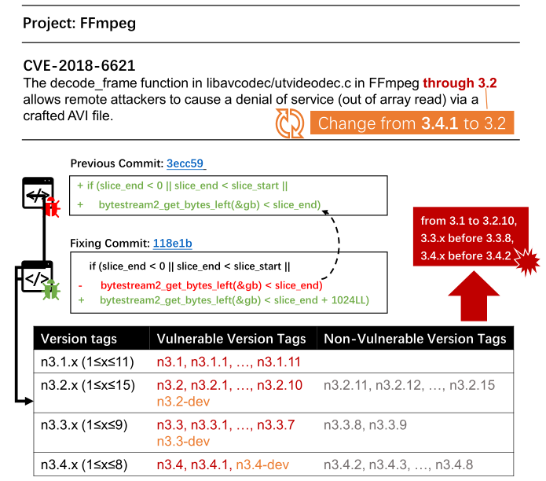  

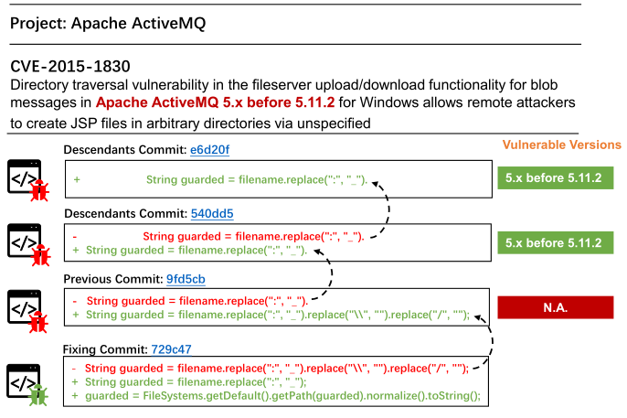  

对于此漏洞的修复提交，SZZ算法将最后修改易受攻击行的提交识别为诱导提交(图2中称为“Previous Commit”)。但如果我们使用此Previous Commit来推断受此漏洞影响的版本，则不会检测到易受攻击的版本。然而，根据CVE描述和修复提交，此漏洞仍然存在于Previous Commit的版本中。因此，我们继续识别修改了易受攻击行的提交(称为“Descendants Commit”)。由于第一个子类提交的更改只是格式更改，因此我们将第二个子类提交视为真正的诱导提交，其中首次添加了易受攻击的代码行。这个漏洞可以被认为是基础性的，因为它存在于初始版本中。基于这种诱导提交，我们推断出易受攻击的版本是' 5 '。该版本号与CVE描述信息中的版本信息一致。

***Previous Commit***: the immediately previous commits to the lines changed in the fixing commit  
***Descendants Commit***: all the commits that previously modified the lines changed in the fixing commit

在V-SZZ研究中，我们希望研究SZZ算法是否能够有效识别漏洞的诱导提交，并帮助改进CVE漏洞的虚假版本。我们还希望改进当前的SZZ算法，以识别诱导提交的漏洞，并有效地改进易受攻击的版本。

### 技术路线流程图

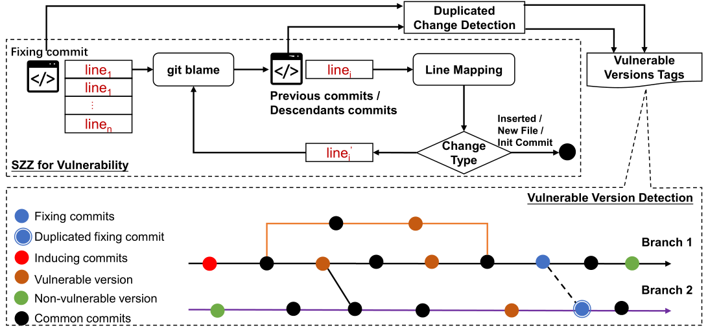  

1. git blame获取单个文件相关的Commit；
2. 应用改进的SZZ算法来识别此漏洞的诱导提交：
   1. 忽视非语义行和非语义修改行；
   2. 自动识别后代提交，利用行映射算法将修改后的行映射到以前版本中的行，继续使用git blame命令返回来识别后代提交。
   3. 利用抽象语法树(AST)映射算法,来映射两个版本的源代码文件之间的修改行。采用Fan的线映射算法。
   4. 大多方案会继续考虑JAVA，在考虑C、C++时，考虑字符串的相似性和行之间的定位来映射修改后的行。我们根据编辑距离计算行相似度，并设置相似度阈值为0.75。
   5. 如果行映射算法可以在之前的提交或后续提交中识别相应的行，我们通过运行git blame命令继续返回该行。直到行映射算法将该行标识为新行、该行的源代码文件首次添加或提交是存储库的初始提交时，该过程才会停止；
   6. 将最早的提交视为每一行修改代码的诱导提交；
3. 扫描项目存储库，以识别在修复提交和诱导提交中包含相同更改的提交；
4. 根据修复提交和诱导提交推断出受此漏洞影响的版本

**重复的变更检测**：漏洞的修复提交或诱导提交经常被应用到其他分支。在修复提交和诱导提交中识别所有包含更改的提交。如果缺少修复提交，则认为一些非易受攻击的版本是易受攻击的。另一方面，如果缺少一个诱导提交时，一些易受攻击的版本将被视为不易受攻击。使用基于散列的重复更改检测方法来识别复制到其他分支的提交，而不需要显式消息。我们首先对项目存储库中所有提交的块进行散列。给定一个提交，我们搜索包含其中所有哈希值的提交。

**漏洞版本检测**: 根据一组修复提交和相应的诱导提交来识别受漏洞影响的版本。由诱导提交引入的漏洞将被转移到未来的提交中，直到它被修复。因此，易受攻击的版本位于诱导提交和修复提交之间。首先用诱导提交可访问的版本标签(表示为Ci)标识提交。提交A对另一个提交B是可访问的，这表明A属于B的父辈提交或祖先提交。我们还用版本标签来标识提交，这些版本标签可以被修复提交(表示为Cf)所访问。则可以得到脆弱版本的集合Cv，即Ci与Cf的集合差值(即Ci−Cf)。

### 针对漏洞提交的手动注释

基于Rodríguez-Pérez等人提出的模型，将检查bug修复提交中每行的先前提交和后代提交，直到确定第一个失败的更改。他们使用“完美测试”来检查某个快照中是否存在bug。遵循Rodríguez-Pérez等人的“完美测试”思想，我们利用漏洞的相关信息(例如，CVE描述、修复提交和提交消息)来确定它是否存在于快照中(称为软件系统上的提交)。  

本文为此开发了一个集成了git责备工具的web应用程序。对于漏洞修复提交中的每个修改行，我们首先识别其先前的提交，以检查快照中是否存在漏洞，然后进一步递归地分析后代提交。因此，当有多行修改的代码时，我们可能会得到多个诱导提交。本文认为最早的带注释的诱导提交是真正的诱导提交，因为我们假设修复提交中所有修改的代码行都是易受攻击的，而最早的包含易受攻击代码行的诱导提交更容易受到攻击。只有四个漏洞(见表2)是由之前的提交引入的，而不是由后续提交引入的。如下图所示：图5中CVE-2018-14884的修复提交的提交消息提到“Content-Length和Transfer-Encoding的sizeof()s缺少末尾的“:””。因此，我们认为这个漏洞是由之前的提交引入的，因为在脆弱的代码行中，sizeof函数是在之前的提交中首先添加的。

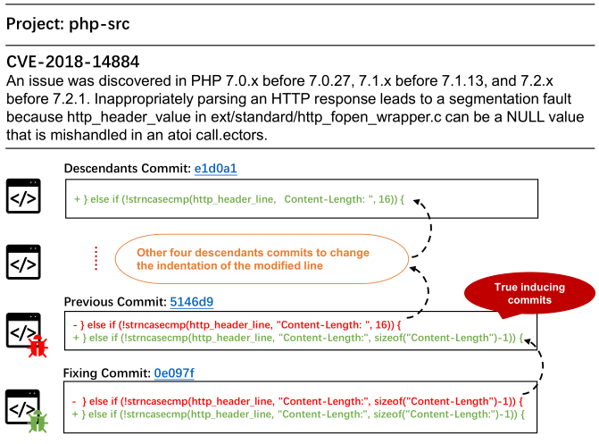  

### 版本

想验证我们的方法生成的版本标签集是否真的是易受攻击的版本，是否与CVE中的版本描述一致。基于我们注释的修复提交和诱导提交，我们应用我们的方法来生成一组版本标记。版本标签汇总成一个文本描述，并验证我们汇总的漏洞版本是否与CVE漏洞的版本信息一致。

### 漏洞选择

使用以下标准排除漏洞:

1. 忽略未在CVE/NVD中列出的漏洞，因为我们需要利用CVE的信息作为“完美测试”的代理来注释诱导提交。
2. 排除修复提交中没有删除代码行的漏洞。SZZ算法无法识别修复提交的诱导提交，因为它们假设修复提交中删除的代码行与诱导提交中的代码行相同，或者是从诱导提交中的代码行演变而来。漏洞通常是基础的(即，它们存在于初始版本中)。在修复提交之前，版本修改文件中的所有代码行都可以被认为是脆弱的。因此，初始化修改文件的提交可以被认为是诱导提交。？？？？？？？
3. 排除了修复提交包含大更改的漏洞，即有超过五行代码。在修复提交中更改的代码行不一定是易受攻击的，并且很难在大更改中识别这样的代码行。此外，用于诱导具有较大更改的提交的手动注释既复杂又耗时。？？？？？？？***是否可以加入AI来解决大体量Commit***
4. 如果受CVE漏洞影响的版本不能映射到软件项目的版本标签上，将被排除，因为我们无法验证其漏洞版本是否正确。例如，Apache/Tomcat项目中的所有版本标签都在7.0.0以上，但某些CVE漏洞中的版本信息可能是更低的版本，例如5.x。X或6. X。在剩余的漏洞中，我们从C/ c++数据集中随机抽取每个项目的20个漏洞(即总共100个漏洞)。对于Java数据集，我们标记了覆盖41个项目的所有剩余漏洞(即72个)。我们总共注释了172个CVE漏洞，并提交了188个修复提交。***可验证性***

### DataSet

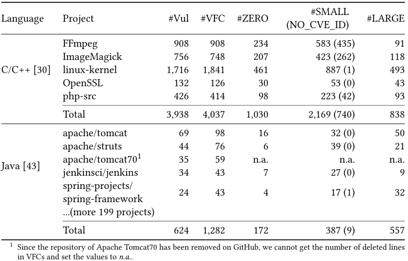  

 #Vul和#VFC分别是漏洞的数量和修复提交的数量。请注意，有些漏洞有多个修复提交。没有删除行的漏洞修复提交(#ZERO)，分别大于0，小于或等于5个已删除行(#SMALL)，大于5个已删除行(# large)。
两个漏洞修复提交数据集：

1. C/ c++[论文链接](../AI%E6%BC%8F%E6%B4%9E%E6%8C%96%E6%8E%98/%E7%89%88%E6%9C%AC%E5%88%86%E6%9E%90/A%20Large-Scale%20Empirical%20Study%20on%20Vulnerability%20Distribution.pdf)，有五个流行的C/ c++项目，即FFmpeg(多媒体框架)、ImageMagick(代表性的栅格/矢量图像文件处理软件套件)、OpenSSL(安全通信协议的实现)、PHP- src (PHP语言的官方解释器)和Linux内核(最广泛使用的操作系统之一)。该数据集中有3,938个漏洞和4,037个修复提交。
2. Java[论文链接](../AI%E6%BC%8F%E6%B4%9E%E6%8C%96%E6%8E%98/%E7%89%88%E6%9C%AC%E5%88%86%E6%9E%90/A%20Manually-Curated%20Dataset%20of%20Fixes%20to%20Vulnerabilities%20of%20Open-Source%20Software.pdf)，漏洞影响了SAP产品或内部工具中使用的200多个Java开源项目，包括Apache Tomcat和Struts、Jenkins(促进持续集成和持续交付的自动化服务器)和Spring框架。在这个数据集中，总共有624个漏洞和1282个修复提交。

### 注释结果

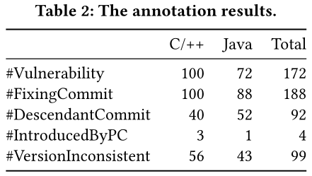  

在这个表中，# descenantcommit是有后代提交的漏洞修复提交的数量，# introedbypc是有后代提交的漏洞修复提交的数量，如果存在后代提交，则由先前提交引起的漏洞，并且#VersionInconsistent是版本信息与我们验证的漏洞版本不一致的漏洞数量。我们发现大约一半的漏洞修复提交(92/188)有后代提交。在有后代提交的漏洞中，除了4种情况外，大多数漏洞都是由后代提交引入的。我们还发现，除了这四种情况外，所有的漏洞都是基础性的，即它们存在于初始版本中。此外，172个漏洞中，有99个漏洞的NVD/CVE版本信息与人工验证的漏洞版本不一致。特别是，在99个漏洞中，我们发现有11个案例中，无漏洞版本也不受其他漏洞的影响。但是这些相应的项目存在非常少的漏洞。例如，Facebook/Buck项目总共只有一个CVE。  

许多不一致的情况是，软件的早期版本被错误地标记为易受攻击。这是因为NVD应用了一个保守规则:“如果版本X是脆弱的，那么它之前的所有版本都是脆弱的”

### 实验

#### 评价指标

采用召回率和精度这两个广泛的指标来衡量SZZ算法的准确性：

$recall_c=\frac{|correct_c\cap identified_c|}{|correct_c|}$

$precision_c=\frac{|correct_c\cap identified_c|}{|identified_c|}$

correctc和identitif分别是SZZ算法检测到的真正诱导提交集和诱导提交集。我们还计算了f1分数，这是准确率和召回率的调和平均值。给定一个漏洞vi，基于带注释的诱导提交和修复，检测出一组漏洞版本的标签提交，表示为正确。对于每一种SZZ算法，我们还根据其生成的诱导提交有一组易受攻击版本的标记，记为identii f . vi。

然后，我们计算了一种改进漏洞版本的SZZ算法的查全率和查准率。召回率(recall)表示SZZ算法检测到的漏洞版本占整个真实漏洞版本的比例，精度(precision)表示SZZ算法检测漏洞版本的准确率。最后，我们将标注漏洞的召回率和精度的平均值报告出来，公式如下:

$average_recall=\sum_{v_i=1}^{N}{\frac{N|correct_c|}{|correct_c\cap identified_c|}}$

$average_recall=\sum_{v_i=1}^{N}{\frac{N|identified_c|}{|correct_c\cap identified_c|}}$

其中N为漏洞数量。

#### RQ1:我们的方法能否有效地识别漏洞的***诱导提交***?

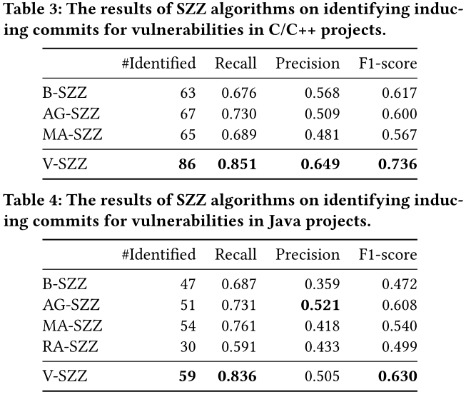  

V-SZZ仍然无法识别少数漏洞的诱导提交。其中一个原因是，一些真正诱导提交的漏洞并不在最早的后代提交中，另一个原因是我们提出的方法中的映射算法不能识别修改行。对于C/ c++项目，基于字符串相似度的行映射算法不考虑源代码的语义。

对于Java项目，基于AST的映射算法[17]在某些情况下也会失败。修复提交中的脆弱行不能映射到之前的提交中，因此我们的方法不能识别后代提交，这是真正的诱导提交。  

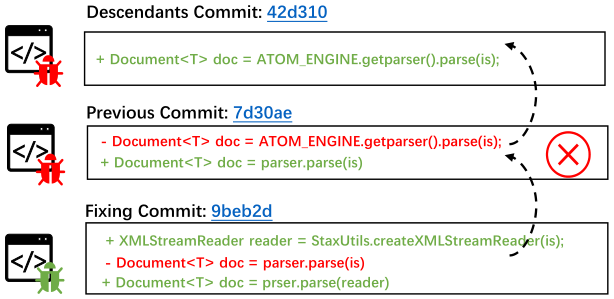  

#### RQ2:我们的方法能有效地改进受CVE漏洞影响的软件版本吗?

SZZ算法在C/ c++和Java项目中提炼受漏洞影响的脆弱版本的结果。

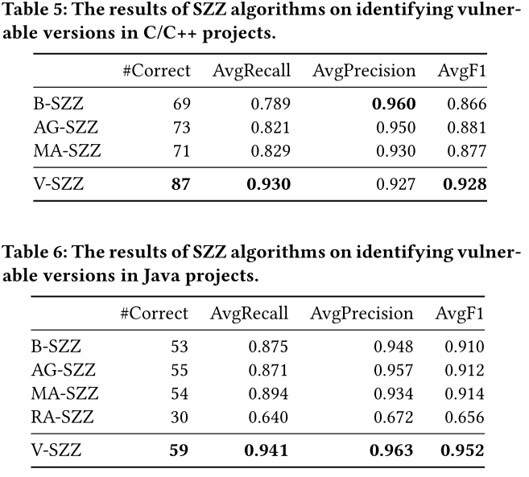  

Wilcoxon signed-rank检验[58]。我们发现p值小于0.05，这表明改善在95%的置信水平上具有统计学意义。

### Discussion

----

第二步是检测具有修复提交和诱导提交的重复更改的提交。  
这一步的新颖性贡献很小，但它对我们的方法的结果有重大影响。为了验证重复更改的影响，我们在未检测带注释的数据集上的重复更改的情况下应用我们的方法。我们发现检测到的所有漏洞的漏洞版本都不同于考虑重复更改的漏洞版本。如果在修复提交中缺少包含重复更改的提交，则误报的数量会增加。如果在诱导提交中丢失了包含重复更改的提交，则假阴性的数量会增加。

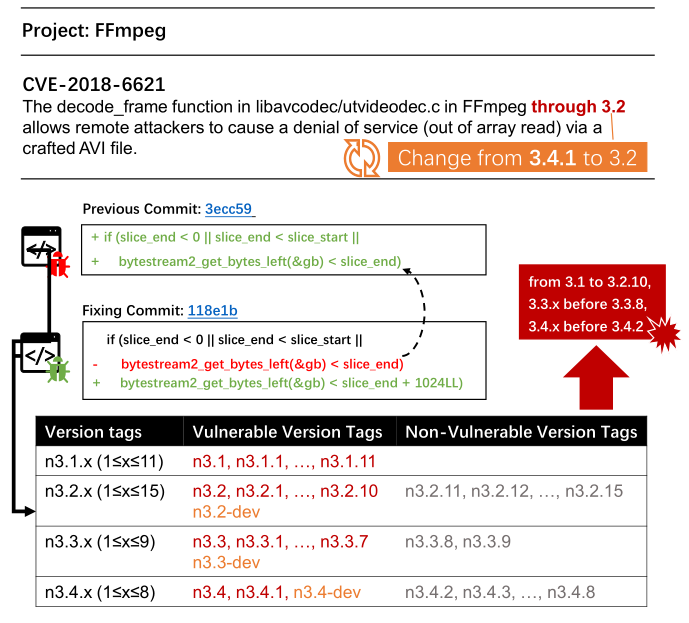  

第一个激励示例中的漏洞修复提交(参见图1)有三个精心挑选的提交。如果我们不考虑这三个精心挑选的提交，一些非易受攻击的版本(例如高于3.2.10,3.3.7和3.4.2的版本)被检测为易受攻击。认为有必要检测重复的更改，以获得更准确的易受攻击的版本。

----

SZZ算法假设以前的提交引入了错误，但它们无法识别许多常见错误的诱导提交，如果由SZZ算法生成的bug诱导提交集包含真正的诱导提交，我们将其视为真正;否则，我们计算一个假阳性。
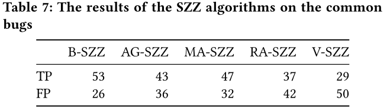  

B-SZZ比其他SZZ算法检测到的真阳性最多，这可能是因为一些引起bug的提交是由非语义行引入的。V-SZZ检测到的真阳性最少。此外，我们还检查了V-SZZ与其他SZZ算法生成的诱导提交集之间的差异。如果将所有以前的提交和后代提交视为引起bug的提交集，V-SZZ可以检测到一个额外的引起bug的提交(项目adamretter/存在的bug修复提交78d23a)。因此，我们发现大多数常见的bug不是由后代提交引入的，这与漏洞不同。

----

只对规模较小的漏洞修复提交应用V-SZZ，因为手工验证费时且困难。
小的提交有助于减少方法中的偏差。这是因为大型提交可能包含嘈杂的(不必要的或琐碎的)更改。一些现有的方法来识别根变化以减少这些噪声变化[论文一](../AI%E6%BC%8F%E6%B4%9E%E6%8C%96%E6%8E%98/%E7%89%88%E6%9C%AC%E5%88%86%E6%9E%90/Identifying%20Casualty%20Changes%20in%20Software%20Patches.pdf),[论文二](../AI%E6%BC%8F%E6%B4%9E%E6%8C%96%E6%8E%98/%E7%89%88%E6%9C%AC%E5%88%86%E6%9E%90/CoRA_Decomposing_and_Describing_Tangled_Code_Changes_for_Reviewer.pdf)

----

基于“完美测试”思想提出的模型，对漏洞的诱导提交进行标注。但是，我们必须根据cve提供的信息在心理上创造这样的“完美测试”，这可能会导致结果受到威胁。减轻这种威胁:

- 2位注释者讨论了不确定真正的诱导提交的情况。
- 手动验证了我们的方法生成的易受攻击的版本。
- 手动检查边界版本中是否存在易受攻击的代码。

构建数据集时可能会出现错误，标注者专业性低下和讨论无法统一；  
总共分析了172个漏洞。但这个数字与之前的研究中手工分析的bug数量相似。
只有两种编程语言(C/ c++和Java)。之前的一项调查显示，C/ c++和Java覆盖了大约65%的漏洞。
