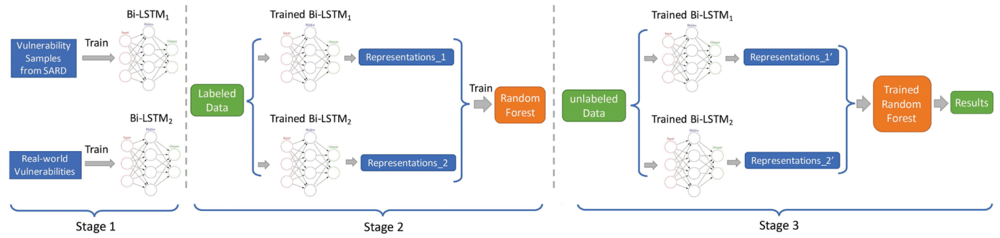
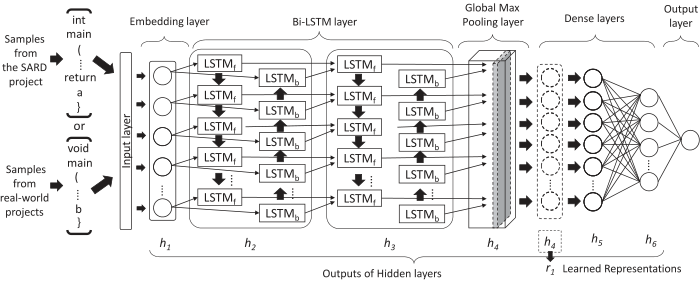
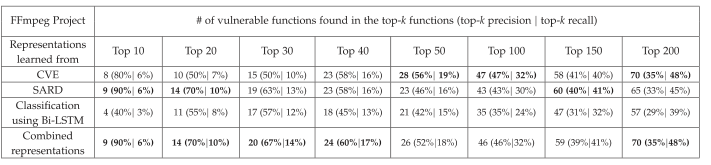

<!--
 * @Author: Suez_kip 287140262@qq.com
 * @Date: 2022-11-30 20:22:20
 * @LastEditTime: 2023-11-22 15:22:51
 * @LastEditors: Suez_kip
 * @Description: SampleSizeIssueSolution
-->

# 解决小样本问题的模型方案

- [解决小样本问题的模型方案](#解决小样本问题的模型方案)
  - [Software Vulnerability Discovery via Learning Multi-Domain Knowledge Bases](#software-vulnerability-discovery-via-learning-multi-domain-knowledge-bases)
    - [I 学习分别提取特征](#i-学习分别提取特征)
    - [II 特征组合](#ii-特征组合)
    - [III 基于组合的RF训练](#iii-基于组合的rf训练)
    - [结论](#结论)

## Software Vulnerability Discovery via Learning Multi-Domain Knowledge Bases

[论文原文](./benchmark.md)

基于多数据集和模型的组合迁移学习；

主要方案：在函数粒度下，针对异构漏洞，实现跨域联合使用，提高数据集使用效率；  
使用两个modle对以下两个部分分别训练：人工漏洞中导出的“基本模式”+真实漏洞中的“实际模式”；
本文基于假设：用同一编程语言编写的真实世界软件项目中的易受攻击功能共享通用的漏洞模式，
  
针对漏洞集和无漏洞集的数据量不平衡，因此提供一组权重保证提高弱势群体将具有更大的权重来惩罚弱势群体的错误分类成本；

### I 学习分别提取特征

使用CodeSensor将源代码解析为AST，并使用深度优先遍历（DFT）遍历AST。
将SARD中的短漏洞函数生成具有填充的seq来适配现实社会的长漏洞函数（长seq还可以进行裁剪），生成1000的定值seq，然后用word2vec实现单词向量化；
Bi-LSTM训练；使用使用其中一个隐藏层的输出作为学习的高级表示。
  

### II 特征组合

用上图的h4作为中间的特征输出，这里将特征叠加作为输出；

### III 基于组合的RF训练

### 结论

  
存在问题：

- 长度限制造成的语义损失；
- 限制在函数内的检测；
