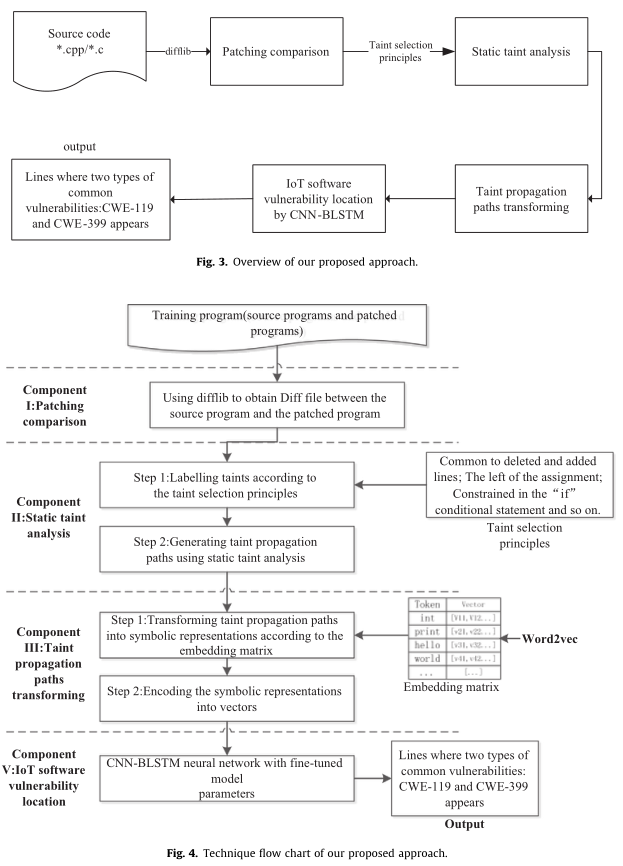
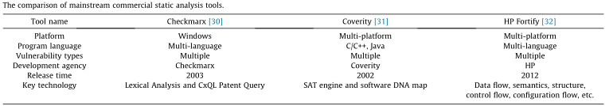
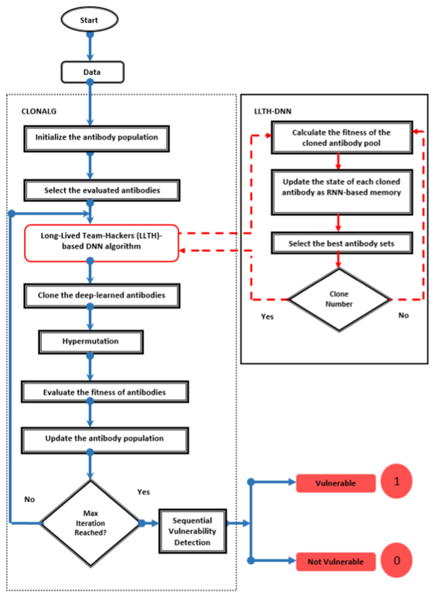
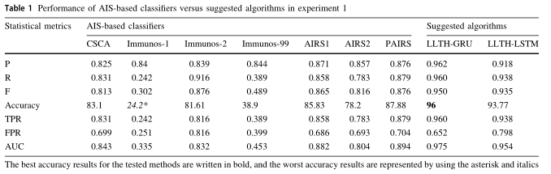

<!--
 * @Author: Suez_kip 287140262@qq.com
 * @Date: 2022-12-01 20:57:24·   
 * @LastEditTime: 2022-12-07 17:26:47
 * @LastEditors: Suez_kip
 * @Description: 
-->
# 结合传统漏挖技术的AI

## A deep learning based static taint analysis approach for IoT software vulnerability location

Main Idea：污点分析+Bi-LSTM  
  

### 静态分析工作总结

- Flawfinder：内置的C/C++函数数据库进行简单的文本模式；
- RATS：提供了C、C++、Perl、PHP和Python源代码的潜在问题列表；
- 针对交互式编程环境的ITS4：无上下文解析器生成的解析树与token来表示程序并匹配；
- Checkmarx的CxSAST：多语言，搭配词汇分析技术使用CxQL专利查询技术；
- Coverity：和CI/CD系统的集成，多语言，提供深度、全路径覆盖精度；使用过程间分析；
- HP Fortify：数据流、语义、结构、控制流、配置流分析引擎，但无法有效定位漏洞的位置；
- Vulture：用于从组件级别挖掘漏洞数据库、版本存档和代码库，并将过去的漏洞映射到组件，根据新组件的导入和函数调用预测新组件的漏洞；
- Neuhaus：使用支持向量机来预测易受攻击的包；
- Yamaguchi1：在向量空间中嵌入代码，并使用机器学习自动确定API使用模式；
- Yamaguchi2：AST，基于漏洞外推的思想搜索漏洞，但它们无法自动识别漏洞；
- Grieco：ML+轻量级静态和动态特征；
- VulPecker：生成目标程序的签名，然后使用代码相似性算法检测漏洞；
- VUDDY：函数级粒度和长度过滤技术；：利用信息理论预测臭味的数学模型
- TFI-DNN：自动漏洞分类模型
- Jurn等人：二进制复杂度分析的混合引信方法，并引入了一种自动补丁技术，修改了PLT/GOT表，以将脆弱函数转换为安全函数；
- Spanos：文本分析和多目标分类技术，将脆弱性特征视为六个目标的向量；
- Aakanshi等人：利用信息理论预测臭味的数学模型（Shannon、Rényi和Tsallis熵）；
- Madhu等人：用户提交的错误和评论的摘要描述，提出了基于错误依赖性的数学模型；
  

本文还总结了一些其他IOT方向的工作，不做收录；

### I diff文件获取

1. 使用difflib获取源代码和补丁代码之间的Diff文件；其中常见源代码比较工具包括：
   1. DiffMerge
   2. Textdiff
   3. Meld
   4. Gitdiff
   5. difflib

### II 污点分析

1. 根据污点选择原则标记初始污点；
   1. 基于补丁的diff文件中删除和添加的行共享的变量；
   2. 已知漏洞函数或普通函数的参数；
   3. if条件语句中的受限变量；
2. 污点权重（专家干预）（泛化性也太弱了）
   1. 如果污点是CWE-119或CWE-339漏洞相关函数的参数，则污点权重为1
   2. 如果污点是普通函数的参数，则污点权重为2；
   3. 如果污点受If语句约束，则污点权重为3；
   4. 否则，污染权重为4。
3. 基于静态污染分析和污染首次出现的行号生成污染传播路径；

### III 污点传播路径嵌入

1. 将污点传播路径转换为符号表示；
   1. 使用keras:preprocessing:text:tokenizer过滤特殊字符后进行数据分割；
   2. 基于词频生成单词分词词典；
   3. 将原始代码段中的每个单词替换为与词典对应的单词的编号；
2. 将所述符号表示编码成向量；
   1. word2vec的CBOW

### IV 基于深度学习的物联网软件漏洞定位系统

CNN-BLSTM神经网络来定位漏洞

### V 结果

DB：NVD+SARD
始终在和RNN、LSTM、BLSTM、CNN-BLSTM比较，效果有但不明显，30000+的数据集训练大约50分钟，8000文件训练30s；
在特定数据集上acc数据达到97%，但是比较的有点云里雾里，都在和CNN-BLSTM比较FP、FN；

## A novel deep learning-based feature selection model for improving the static analysis of vulnerability detection

一种基于DNN方法的增强型克隆选择算法：

本文认为特征选择通常用于通过利用较少数量的特征来实现相同或更高的性能。它可以被视为一个优化问题，旨在通过特定的标准函数从现有特征中确定最优特征子集，而LONALG是该问题的一个解决方法；  
建议采用不同的策略来理解免疫系统的学习和记忆。
抗原“选择”了正确的B细胞，产生抗体，用于对抗它，并摧毁受感染的细胞。选定的B细胞或T细胞随后将被克隆，但有些细胞不会被激活，而是采用长期记忆形式。
软件漏洞的分析是使用被称为智能抗体的长期团队黑客（LLTH）+DNN来进行的；LLTHDNN基于生命周期的机制
  

### 流程

1. 表示：数据为有标签的n长度的向量（咋来的？）；每个抗原模式（候选解决方案）表示为长度为n的位串，其中n是特征的总数。如果第j位为1，则保留第j个特征；
2. 抗原模式的适合度与所选特征子集的测试集上模型的分类精度成比例。DNN输入有标签的n长度的向量，根据随机森林分类器方程的精度计算了算法的适应度函数，脆弱性适应度最大值的抗原模式可以被视为脆弱性群体的最具代表性的例子。
3. 训练：LLTH包括抗体集（随机生成m与r大小的两个集）和抗原集，使用深度学习方法（GRU和LSTM）可以相对检测脆弱度量。可以通过DNN检测在抗体生命周期内发生的一系列漏洞。

### 结论

  

### 人工免疫系统（AIS）

警报的生存期短的生存期意味着发现了警报，并且足够重要，可以快速修复它。
具有高度分布,自适应和自组织的，保留了以前会议的记忆，并不断学习新的安排。

克隆选择CLONALG：  

- 原则表示：描述对入侵抗原刺激的适应性免疫应答（B细胞该边抗原的过程）的主要特征;
- 算法流程：选择、克隆、突变、再选择和替换；
- 目标：解决方案的抗体存储池。
- 目标解决机制：
  - 克隆抗体的亲和力成熟（超突变）提供的局部搜索；
  - 搜索机制提供全局范围：将随机产生的抗体插入到群体中，以进一步增加多样性，并提供可能逃避局部最优的方法。

克隆选择分类算法（CSCA）是一种受克隆选择启发的高效、方便的分类算法，是WEKA机器学习工作台的一个插件；

免疫算法：

- Immunos-1；克隆群体被保留用于新数据实例的分类；它假设了一个单一的问题域，从而将T细胞和氨基酸库的需求转化为绝对需求。对于每个分类标签，形成一个B细胞克隆群体，同时包括训练集中的每个抗原。在分类阶段，得到B细胞克隆群体的亲合力值。根据亲合力值，将数据实例分配给具有最大亲合力值的一类克隆，亲和力是特征向量的每个维度的亲和力总和的开方，用欧式举例计算数字特征之间的亲和性度量，亲和力为B细胞总数/克隆亲和性；
- Immunos-99，增加了细胞增殖和超突变；基于分类标签划分抗原组->从每个抗原组获得B细胞群体（每个B细胞与抗原之间的亲和力测量）；群体的排序是基于声明的亲和度值进行的，然后计算适合度分数。适合度分数指示特定B细胞的有用性。；

人工免疫识别系统（AIRS）
根据计算出的适应度值，对种群进行修剪以保持完全健康。

- AIRS1：利用用户可以定义的突变参数，克隆的类发生突变后可以改变；
- AIRS2：利用体细胞超突变概念，克隆的突变率与亲和力成比例，克隆的类发生突变后不可改变;
- AIRS并行：显示了免疫系统的分布特征及其相似的处理特征，数据集的每个部分分配给进程的数量；
