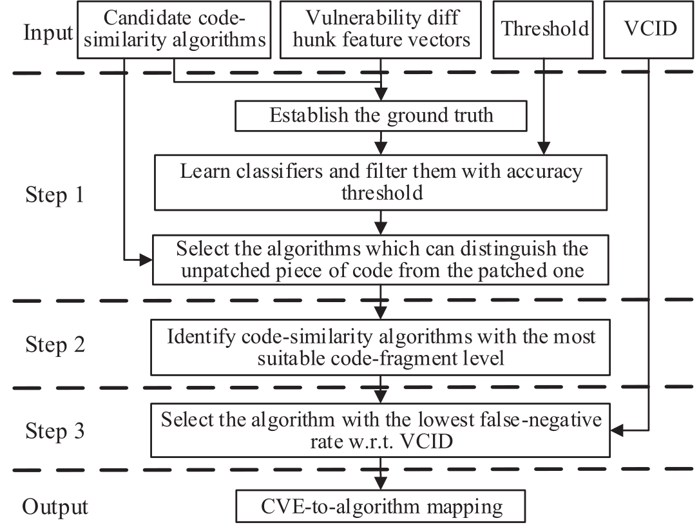
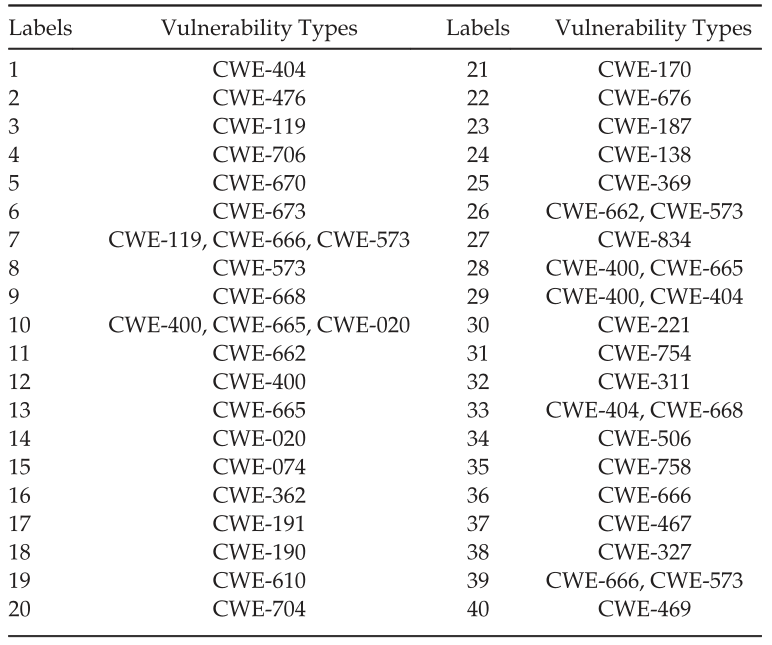

<!--
 * @Author: Suez_kip 287140262@qq.com
 * @Date: 2022-10-26 14:54:55
 * @LastEditTime: 2022-12-08 15:47:26
 * @LastEditors: Suez_kip
 * @Description: 
-->

# vulpecker

[论文链接](../AI%E6%BC%8F%E6%B4%9E%E6%8C%96%E6%8E%98/TraditionalStatic/VulPecker.pdf)

测试基准：表征补丁的一组特征；代码相似性算法；

基于假设：代码重用(精确克隆、重命名克隆、近乎缺失克隆和语义克隆)

当时研究存在的问题：

- 不存在稳定的训练集；
- 代码相似性算法缺失；无法区分脆弱代码和其修补代码!
ReDeBug[13]可以在代码库的OS分发规模上快速找到未修补的代码克隆，但很难应用于涉及变量名修改、行添加或删除等的代码克隆。

该程序贡献：自动化检测漏洞的存在性和位置;VPD与VICD的漏洞集<https://github.com/vulpecker/Vulpecker>  
  

五种补丁特征：

- 非实质性特性：对有用代码没有影响的空白、格式或注释的更改。
- 组件特征：变量、运算符、常量和函数等语句中组件的变化。
- 表达式特征：赋值表达式、if条件和for条件等语句中表达式的变化。
- 语句特征：涉及添加、删除和移动的语句的变化。
- 函数级特性：函数的变化或函数外部的变化，如宏和全局变量定义。
  

## 代码表示粒度

无上下文补丁、切片、带上下文补丁、函数和文件/组件  
在无上下文补丁片段级别，通过提取以“-”符号为前缀的连续行（表示应该修补的行），从diff文件中获取片段。该粒度已用于错误检测。在切片片段级别，根据程序依赖图（PDG）对程序进行切片。由于切片通常保留PDG的结构，因此子图之间的同构表示代码相似性。该粒度已用于克隆检测。在具有上下文片段级别的补丁中，通过提取以“-”符号为前缀的行和没有前缀的行，从diff文件中获取片段。该粒度已用于错误检测和漏洞检测。在函数片段级别，函数被视为一个独立的单元。该粒度已用于漏洞外推和克隆检测。在文件/组件片段级别，每个文件/组件都被视为一个单元。这种粗粒度主要用于漏洞预测

## 代码表示

特征提取：

1. 可以直接从差异块中提取非实质性特征和功能级特征。
2. 其他三种类型的补丁特征（即表中的类型3–类型5）可以通过一系列编辑操作从未修补的代码段提取到修补的代码，例如gumtree算法。
3. 漏洞差异块的特征向量由基本特征和补丁特征组成。代码相似性算法选择引擎。

## 表示比较方法

矢量比较和近似/精确匹配。向量比较方法首先将漏洞的表示和目标程序的表示转换为向量，然后比较这些向量以检测漏洞。近似/精确匹配方法通过包含、子串匹配、全子图同构匹配或近似γ-同构匹配搜索目标程序代码表示中漏洞的表示。

1. 根据是否能分类补丁前后的文件，筛选一批算法s；
2. 平均分配一组漏洞代码差一块特征向量F为F1与F2；
3. F1测试算法的正确性，依照准确率a的阈值进行筛选；
4. F2测试相似性算法是否能识别补丁代码为无漏洞来筛选；

5. 将补丁删除的行默认为漏洞点，进一步将切片hi为核心代码片段的近似值；
行数差距量化表示代码片段级别间的差距，五种代码级别cf与未修补代码片段切片cc的近似程度DOA；  
$doa(cc,cf)=\frac{|l_{cf}-l_{cc}|}{l_{cc}}$追求DOA最小化；  
核心代码属于slice左右的粗糙程度，因为补丁删除的代码行被认为是易受攻击的代码行；$doa(cc,sc)<doa(cc,pc)和doa(cc,sc)<doa(cc,pwc)$，slice的DOA最小，若无法提取slice，patch with context的DOA最小，因为没有上下文的补丁在代码片段级别的表示不能从对应于所讨论的差异块的未修补代码片段中提取；
搜索最小化DOA的代码粒度；
6. VCID评估si
   1. 首先进行筛选：
      1. VCID中的代码重用实例不能应用于相似性算法si，对于没有“-”前缀符号的diff hunk，使用无上下文补丁的代码片段级别的代码相似性算法不能用于识别该diff huck的代码重用实例；
      2. 如果两个代码重用实例具有相同的代码重用特性，并且被si同时检测为易受攻击或不受攻击（即si无法区分它们），则其中一个将被消除；
   2. 使用筛选si的FNR
7. 漏洞签名生成；提取与漏洞对应的修补的/未修补的diff代码和未修补的代码片段，“-”、“+”符号和无前缀获得未修补的差异代码；代码预处理，去除空白与冗余，修补不完整部分；根据diff hunk选择的si的代码表示，来表示预处理的有/无补丁的差异块和未补丁的代码块；
8. 签名搜索；漏洞检测引擎使用为diff hunk选择的代码相似性算法的比较方法从目标程序签名中搜索漏洞签名。

  

# VulDeePecker

[论文链接](../AI漏洞挖掘/vuldeepecker.pdf)

***PAPER SOURCE:VulDeePecker: A Deep Learning-Based System for
Vulnerability Detection***
  
## 基本信息

相对VUDDY 和 VulPecker的项目：VUDDY和0%，0%，该文章追求的是只要假阳性率不太高，就可以把重点放在降低假阴性率上。  

**Target：** 泛化性、专业知识转化率（仍然需要人工先验知识）、自动化水平
  
## VulDeepecker设计准则

1. 转化为保留数据依赖性以及控制依赖性等信息的中间状态在进行学习，以保证网络的feed包含非扁平代码信息；code gadget 一串不连续的包含上下文含义的代码段；
2. 细粒度的划分可以保证后期漏洞定位力度，划分粒度应小于函数级别，以确定小代码片段；code gadget
3. 存在上下文分析的需求->适合用于NLP的网络框架（e.g. RNN（存在梯度消失VG问题，其双向变体BRNNs继承）、LSTM、GRU（这二者通过加入memory cell用于解决VG，其中LSTM优于GRU，LSTM单向性导致只受到前缀影响，弃用）、BLSTM（解决LSTM单向性））  
  
softmax layer表示和格式化分类结果
Dense Layer为密集层，也即FCN全连接，此处用于减少复杂BLSTM的输出向量维度；  
BLSTM Layer包含复杂的LSTM cell；参考文献：**S. Hochreiter and J. Schmidhuber, “Long short-term memory,” NeuralComputation, vol. 9, no. 8, pp. 1735–1780, 1997.**
  
  
  

## 具体设计

### code gadget

包含数据依赖和控制依赖信息的数段代码句（此处以行为单位）

以关键点的启发式（***该问题可以进一步研究***）：  

- 其中，关键点为漏洞中心或提示存在漏洞的代码段；
- 漏洞中心指该类漏洞的发生点、发生原因等；
- 一对多且多对一（例如，缓冲区错误漏洞可能对应于以下关键点：库\API函数调用、数组和指针）  

该文章仅研究的是与库/API函数调用的关键点相对应->是一篇证明性质的文章

主要研究过程：

  

### 学习阶段

- 步骤一：
  
1. 提取关键点（此处是API/库的调用）；包括前向call（来自于命令行、程序、套接字或文件的外部输入直接作用于函数，recv）和后向call（没有来自于外部输入直接作用于函数strcpy）；  
2. 为绕关键点的参数信息提取code slice；前向集中考虑直接输入的参数，后向集中考虑输入参数前期的语句；下面的例子中每一个参数都能提出一条code slice；  
  
前向切片对应受所讨论的参数影响的语句（调用时或之后的分支与该参数相关的），后向切片对应可能影响所讨论的变量的语句（时或之前合并与该参数相关的）。  
前向调用考虑后续内容，后向调用考虑之前处理；  

- 步骤二：

1. slice->gadget 将一组slice对应到一个centre，此处就是一个API/库函数的调用；这里是将多对一转化为一对一；  
   1) 首先将同一函数域中的slice整合，去重（与同一func存在联系）；
   2) 组装不同函数域的slice，顺序有则保留，没有则随机；
    ***问题：当存在one slice对multiple centre，那么完成后每个centre对应一个gadget，会不会导致一个slice在多个centre里共用？ --复用好像问题也不是很大***

2. lable the code gadget

- 步骤三：code gadget -> vector
  
  

1. 将gadget转化为特定符号，来保留语义；

    - 去除冗余信息（非ASCII，注释）；
    - 标准化用户定义（参数与函数）；

2. 符号表示的gadget转化为向量；word2vec 后向前端补零后端删，前向后端补零前端删，以保证等长

- 步骤四：标准BLSTM学习

### 测试阶段

- 步骤一：跳过学习阶段中的gadget Labeling，完成其前三步；

- 步骤二：使用模型；

检测指标：metrics false positive rate (F P R),
false negative rate (F N R), true positive rate or recall (T P R),
precision (P ), and F 1-measure (F 1)；  
  
测试集选择：  
NVD in NIST(National Institute of Standards and Technology)<https://nvd.nist.gov/>  
SARD(Software Assurance Reference Dataset)<https://samate.nist.gov/SRD/index.php>  

测试目标选择：缓冲区溢出漏洞和资源管理错误漏洞；
minibatch stochastic gradient descent together with ADAMAX；

在足量样本的基础上，如SARD，该项目效果优于VukPecker、Xen4.6.0、Libav10.2,但是在NVD数据集上，260个程序的体量的训练集上，效果没有VulPecker等效果好；  
有人类提供进一步标签的状况下，效果会更优异；

## 未来方向

- 仅限于源代码，目前无法适用于二进制可执行文件类等；
- 仅限于C++；
- 目前vul center仅限于API和库函数的调用；
- 切片的设计仅限于数据流的管理；
- code -> slice -> gadget -> simblization -> vector直观但有待进一步研究；
- 仅限于BLSTM；
- 该论文对系统的评价有限；最好可以发现0day漏洞的能力、扩大研究方向；

## 相关工作

1. 基于模式
   1. 模式由人类专家手动生成：**开源工具Flawfinder、RATS和ITS4、商业工具Checkmarx、Fortify和Coverity**，存在较高的假阳性率或假阴性率；
   2. 根据预先分类的漏洞半自动生成的，特定于一类：***缺失检查漏洞、污点式漏洞和信息泄漏漏洞**
   3. 无预先分类的半自动生成，依赖于人类专家定义特征来表征漏洞；这类粒度粗，导致无法确定位置；
2. 基于代码相似性（划分、抽象、相似性计算）仅能检测i，ii类漏洞（clone），以及一部分iii类（语句的删除、插入和重新排列）；
3. 基于深度学习：标记映射向量、AST节点映射向量

# $\mu$VulDeePecker

基于VulDeePecker的code-gadget，该文章加入了以下内容，实现了一个六步训练模型：

- 除了数据流信息，还捕获了一定控制流信息；
- 注意力机制，针对类似于调用等信息的关注，以获得等有效的语义信息来帮助系统分类；
  - 强制执行数据源检查
  - 关键路径检查（条件语句）
  - 危险函数使用检查
  - ......

数据集来源是SARD和NVD；
针对C/C++库适配的检测范围：
  

## Step I

首先将程序分析并分解成code gadget；

1. 在增加节点行为分类的基础上，系统依赖图生成；SDG源自一组程序依赖图（PDG），其表示数据依赖和控制依赖关系（Joern用于构建PDG）；
2. 实现调用的提取，与库定义的调用进行匹配；
3. 使用了双向切片的CF和DF的同时获取，数据流覆盖控制流；对VulDeepecker的三个问题进行改进：仅考虑DFG；仅考虑前向函数和后向函数；考虑这两类的时候只进行相应的切片，切片方式单一；
  
   1. sbvi识别SDG中节点n的后继节点；
   2. sfvi识别SDG中节点n的前置节点；
   3. 合并sfvi和sbvi；

## Step II

设置gadget标记：0为无漏洞1为各类漏洞；

## Step III

编码习惯影响后期学习，因此对代码进行预处理，将用户定义全部标准化；

## Step IV

解析规范化code gadget，分为以下三步：

1. 分析将语句pi解析为有序的标记集；
2. 通过分析这些标记的上下文结构推断语句pi的属性attr（例如，“def”、“cond”、“expr”）；
3. 对以下内容设置关注度：
   1. 库/API函数call中assignment的定义；
   2. 控制语句，判断边界检查和安全筛选的存在性和合理性；
   3. 库/API函数call语句；
  

## Step V

对code gadget进行嵌入为的等长的单词向量（skip-gram，窗口大小为10，向量维度为50，完成后拼接、裁剪或填充）和注意力向量；

## Step VI

分为三个Bi-LSTM模型和预处理层：

1. 预处理层主要过滤0向量；
2. 训练局部特征(from attention)使用相同的网络的小规模网络，每个神经元相当于一个时间步长，并在一个code gadget中接收一个单词；
3. 训练全局特征(from code gadget)，使用合并层、BLSTM层和softmax分类器；
4. 基于local and global feature训练综合特征；
  

## 多类型统计

L为漏洞类型总数；  
  

- RQ1:mVulDeePecker对多类漏洞检测的有效性如何？  
  
- RQ2：适应控制依赖性确实提高了mVulDeePecker在多类漏洞检测中的有效性吗？  
当额外调节控制依赖性时，mVulDeePecker可以将M_F1提高12.63%，W_F1提高11.13%，M_FNR降低12.27%，W_FNR降低6.9%。  
- RQ3：mVulDeePecker能否与其他基于深度学习的系统（例如，VulDeePecker）一起使用以获得更高的效率？  
  

## 附录信息

### 图像处理的注意力机制

分为： 硬注意力、软注意力、此外，还有高斯注意力、空间变换；

- 强注意力是一个不可微的注意力，每个点都有可能延伸出注意力，随机的预测过程，更强调动态变化，训练过程往往是通过增强学习；
- 软注意力是可微的，是确定性的注意力，可以通过网络生成；始终计算，会导致无意义的过度参数化；
  - 空间域(spatial domain)
  - 通道域(channel domain)
  - 层域(layer domain)
  - 混合域(mixed domain)
  - 时间域(time domain)
- 自注意力是注意力机制的改进，其减少了对外部信息的依赖，更擅长捕捉数据或特征的内部相关性，以（key, query, value）的三元组提供了一种有效的捕捉全局上下文信息的建模方式。由于每一个点都要捕捉全局的上下文信息，这就导致了自注意力机制模块会有很大的计算复杂度和显存容量。

# VulDetector

针对函数粒度的C/C++漏洞的静态分析工具

## Prestep 数据收集

1. CVE爬取func name和file name;
2. 函数名、文件名不可用则求助于相关文件名和函数名可能所在的补丁;
3. 补丁链接不可用则搜索其他网站

## STEP I 图提取

在CFG的基础上为加权特征图（WFG）模型：每个节点设置了不同的权重，其中权重表示节点对精确定位语句的敏感性

## STEP II 关键词、code gadget提取

### 关键词获取

解决直接从CVE等专家经验中获取泛用性与兼容性较低，这里使用概括从Diff文件中提取的标识符；  
对标识符进行Kmeans聚类后，手动确定代表性单词（自动化水平降低一大截）  
这里可能错过了if检查和指针算术等语句...  

计算概括标识符的重要性，最后根据其重要性选择关键字：

- TF术语频率：一个术语在文档内部发生（出现）的次数；
- IDF反向文档频率（弃用）：DF逆相关；
- DF文档频率：文档频率是指包含特定术语的文档的数量；
- 重要性由TF ∗ DF表示。

本文CWE确定top-K（K表示所选关键字的数量）关键字；

### Code Gadget 获取

关键字分割函数的控制流图，与匹配关键字具有控制和数据依赖性的节点和语句；  
关键词从定位到根行开始进行BFS搜索（本文设置的阈值为5），获取向前向后行切片；  
关键词从定位到根节点开始进行BFS搜索（本文设置的阈值为5），获取向前向后CFG切片；  
关键思想是将代码块的文本AST表达式嵌入到量化向量中，然后将其分配给图节点。  
这一步排除小函数，因为根据前人经验，小函数复杂度低，脆弱性也相对较低；  

### WFG生成

向量的每个维度表示AST中的一个类型（例如，V值定义，If控制节点），其值测量代码块的AST表达式中该类型出现的频率。对于包含多个语句的节点，我们合并这些语句的AST表达式，计算每个AST类型的数量，最后构建向量。具体如下图所示针对第九行代码：  
  
LLVM在AST中提供了160多种类型，仅能用大向量表示，本文选top32常用类型。每个WFG由两个矩阵形式化，即P∗P表示图结构的P邻接矩阵，其中P表示节点的数量P∗32特征矩阵，其中每行表示节点的句法特征。  

本文的假设：更接近根的代码贡献更大，赋予更大的权重（分别计算图节点和行节点的权重做综合）

- $W_a=NW_k*argmax(LW_j),j\in n_k$
- Node：$NW_k=NW_0*D^{k-1}$
- Line：$LW_k=LW_0*D^{k-1}$
- D为衰减矩阵；
- 本文设置$LW_0=1,NW_0=1,D=0.85$

获取的重复子图CFG的消除：

1. 如果它们位于不同的根节点，则这两个子图在结构上不同；
2. 否则，考虑节点属性不同，只使用一条线来分割图形：
   1. 通过这一行中匹配关键字的TF*DF值的汇总来计算每一行的权重；
   2. 选择具有最大权重的线；
   3. 如果多条线具有相同的权重，则随机选择一条线作为根线；

### 图相似算法

使用Genius中提出的方法，该方法利用二分图匹配来计算两个属性控制流图（ACFG）之间的相似度；  
本文中将$sim(N_i,N_j)$替换为$W_i\times W_j\times sim(N_i,N_j)$  
利用漏洞VWFG、补丁PWFG来改进相似度计算，只有当sim（T，V）>sim（T，P）时，才认为其易受攻击。

## STEP III 训练

区别漏洞WFG、补丁WFG和测试WFG

## RESULT

  

# VulDeeLocator

解决的问题：跨文件、函数，宏的忽略，精确的定位

定义一：sSyVC是一串符合漏洞模板的（标识符、运算符、常量和关键字）的连续token；
定义二：iSeVC是sSyVC的中间代码表示，也即源码中间代码的slice；

## STEP I sSyVC

从AST中提取sSyVC，针对四种特征：

- API/库函数漏洞：名称与参数匹配；
- 队列定义：“[” 、“]”；
- 指针定义：“*”；
- 算数表达式：赋值,“=”，后匹配至少一个变量；

## STEP I iSeVC

1. 跨文件：用编译器（Clang）IR文件，然后根据依赖链接LR文件；
2. 跨函数：IR链接后生成CFG和DFG；
3. 通过dg等工具实现基于sSyVC的切片：
   1. 每个局部变量表示为前缀为%的数值；对于LLVM IR切片中的每个函数，第一个局部变量的数值为1，然后每个后续局部变量的值增加1（归一化局部参数）；
   2. 函数调用的插入，循环互调仅各插入一次，插入后再分配局部变量；
4. 标记为漏洞发生点行号或者0（无漏洞）；
5. 为了在捕获程序语义信息时使iSeVC独立于用户定义的函数名，函数定义名规范化；
6. 定长化：使sSyVC出现在结果向量的中间；

  

## STEP III Training

标准BRNN的输出可以映射回易受攻击的令牌，从而映射到中间代码的易受攻击行（即，多个连续易受攻击令牌）。无法实现粒度细化、注意力机制；

  

本文使用针对性网络BRNN-vdl：
1. 输入：
   1. 表示iSeVC的向量；
   2. 表示每个向量中漏洞位置的漏洞位置矩阵；
2. 用多层实现注意力机制，用以剔除漏洞代码中包含的无漏洞代码行造成的误报特征（iSeVC向量*漏洞位置对角矩阵，有漏洞的例子漏洞范围内为1，无漏洞的例子均为1z）：
   1. 对于易受攻击的iSeVC，乘法层用于选择与***易受攻击代码行***相对应的令牌的输出。（这些选定的输出将用于BRNN vdl的后续层和反向传播过程，因为它们将有助于以更高的精度（比不使用此乘法层）定位漏洞）
   2. 对于不易受攻击的iSeVC，乘法层旨在选择令牌的***所有输出***（在后续层和BRNN vdl的反向传播过程中使用它们，因为就学习阶段而言，这些令牌同样重要）
3. k个最大元素的均值，来实现池化；

  

