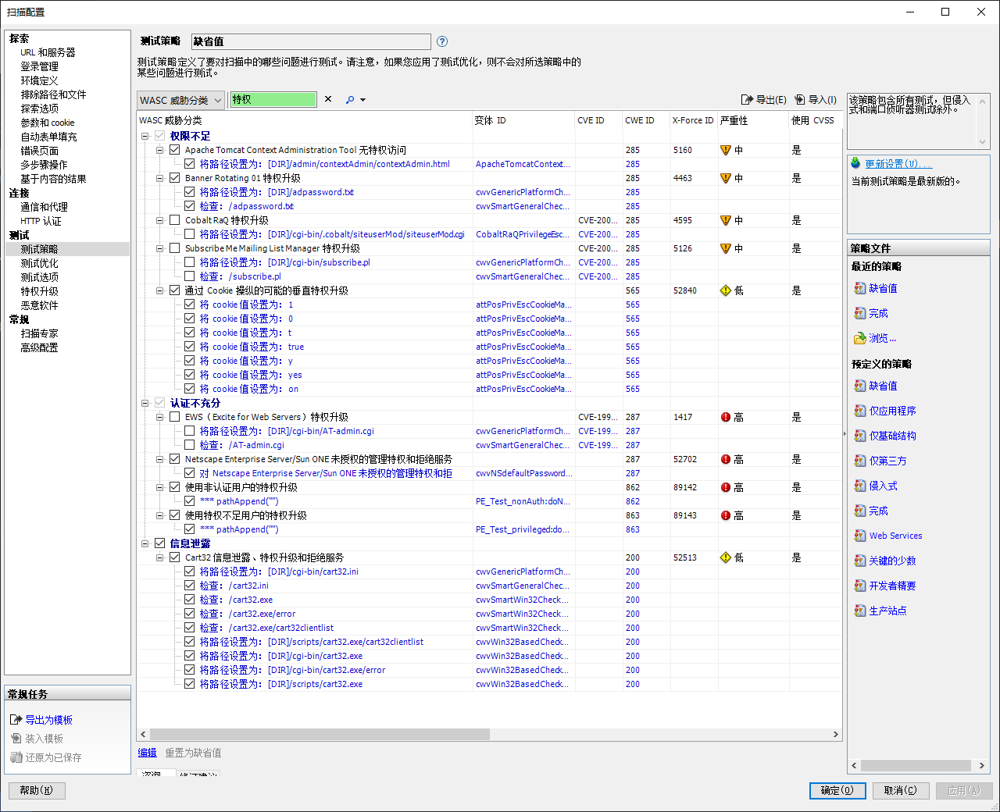
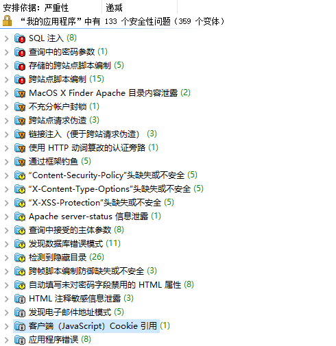
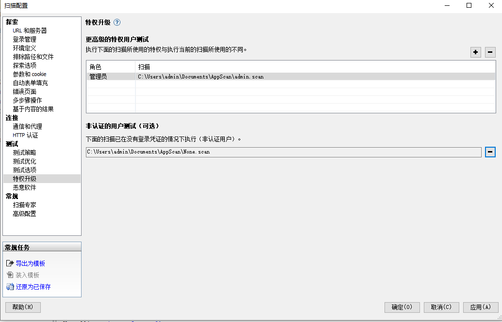
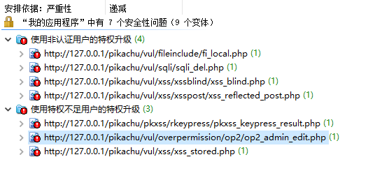
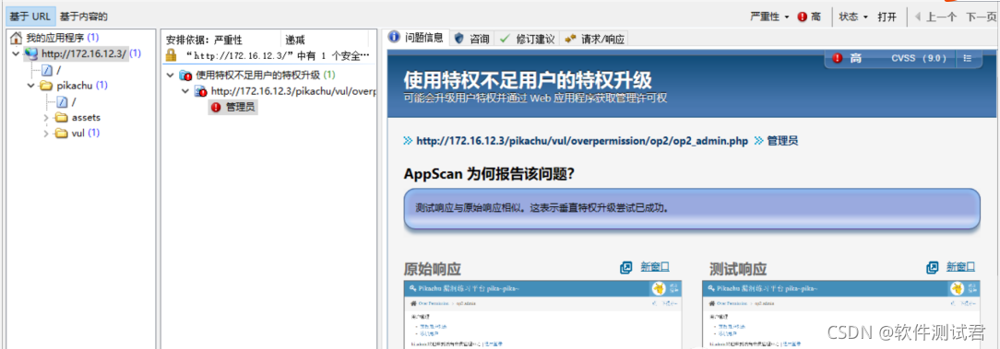

<!--
 * @Author: Suez_kip 287140262@qq.com
 * @Date: 2023-04-03 17:19:16
 * @LastEditTime: 2023-04-03 23:06:31
 * @LastEditors: Suez_kip
 * @Description: 
-->
# APPSCAN越权调研

## 调研对象

HCL AppScan Standard version10.0.0破解版本  

目前最新版本10.1.0

## 越权漏洞检测项目

  

具体的检测项目如下：  

- 权限不足：
  - Apache Tomcat Context Administration Tool无特权访问
  - Banner Rotating 01特权升级
  - Cobalt RaQ特权升级
  - Subscribe Me MailingListManager特权升级
  - 通过Cookie操纵的可能的垂直特权升级

- 认证不充足：
  - EWS ( Excite for Web Servers)特权升级
  - Netcape Enterprise Server/Sun ONE未授权的管理特权和拒绝服务
  - 使用非认证用户的特权升级
  - 使用特权不足用户的特权升级

- 信息泄露：
  - 白日Cart32信息泄露、特权升级和拒绝服务

## 部分结果记录

检测结果均在

- CPU: 11th Gen Intel(R) Core(TM) i5-1135G7 @ 2.40GHz   2.42 GH
- RAM: 16.0 GB
- 操作系统: Windows10

的笔记本电脑上进行检测。

按照blog进行操作，首先使用admin账户进行检测，然后进行

### 首次检测

本次检测使用admin登录信息进行检测：

- 开始扫描时间19:38，结束扫描时间20:00，共计24分钟，共扫描60个页面，发送http请求共1615；67/s
- 开始检测时间20:14，结束扫描时间21:05，共计50分钟，共检测360个元素，发送http请求共36160；2893/s
- 检测结果：
  

### 二次检测

本次检测使用无账户登录信息进行扫描；

- 开始扫描时间15:39，结束扫描时间15:50，共计11分钟，共扫描46个页面，发送http请求450;
- 开始检测时间15:53，结束扫描时间15:54，共计1分钟，共检测272个元素，发送http请求共563；

### 三次检测

本次检测使用pikachu登录信息进行检测：  

  

- 开始扫描时间21:43,结束扫描时间22:11，共计28分钟，共扫描72个页面，发送http请求2407;
- 开始检测时间16:03，结束扫描时间16:09，共计6分钟，共检测430个元素，发送http请求共2635；

两次的实验结果，其结果均为漏报、误报；

  

blog预期结果：

  
