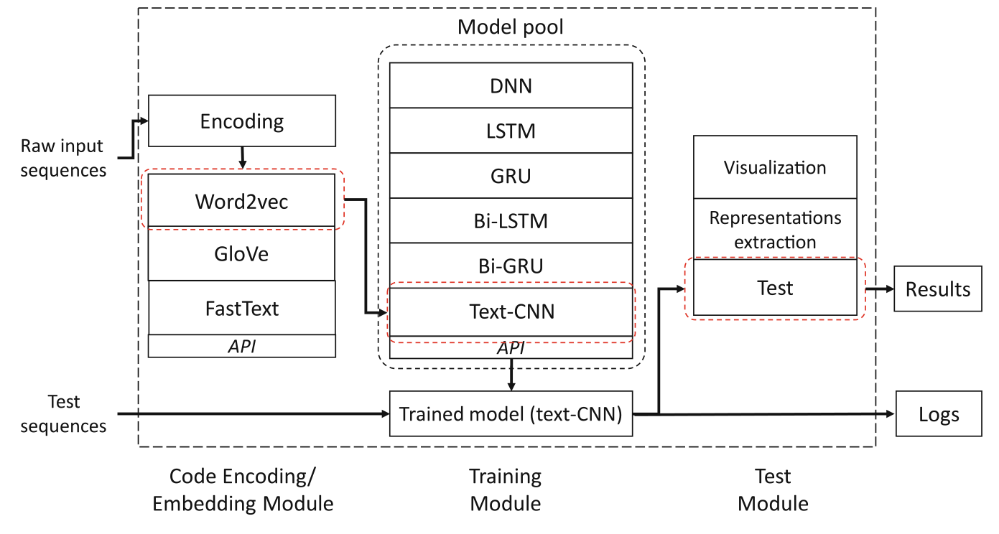

<!--
 * @Author: Suez_kip 287140262@qq.com
 * @Date: 2022-11-28 13:36:24
 * @LastEditTime: 2022-11-28 14:50:35
 * @LastEditors: Suez_kip
 * @Description: 
-->
# BenchMark

## Deep Learning-Based Vulnerable Function Detection: A Benchmark

- 封装六个主流AI框架；
- 基于两个粒度的数据集：Func、File（保证文件内存在完整的易受攻击段）
- 针对补丁与原漏洞的评估仍未涉及；
- 主要框架：
  - 代码嵌入模块：Word2vec, GloVe, FastText；
  - 训练模块：DNN, text-CNN and four RNN variants (i.e. LSTM, GRU, bidirectional forms (Bi-LSTM, Bi-GRU)).；
  - 测试模块；
  
- 数据集来源：
  - SARD合成数据集；
  - NVD/CVE描述的漏洞；
    - 含有Func内/跨Func不跨file的漏洞则标记；
    - 剩余不标记，不标记的file收录所有的func；
    - 不明确标记的丢弃；
- 检测标准
基于前k%的易受攻击测试用例进行回归以及准确度的计算；

## Magma
