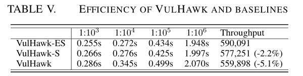

<!--
 * @Author: Suez_kip 287140262@qq.com
 * @Date: 2022-11-26 16:14:20
 * @LastEditTime: 2023-02-20 18:19:04
 * @LastEditors: Suez_kip
 * @Description: 
-->

# 代码表示

## Automated Vulnerability Detection in Source Code Using Deep Representation Learning

[代码链接](./../AI漏洞挖掘/codeRepresenting/Automated_Vulnerability_Detection_in_Source_Code_Using_Deep_Representation_Learning.pdf)  
  

- 代码词法分析
  - 创建了一个定制的C/C++的词法分析器，旨在捕获关键令牌的相关含义；
  - 同时保持表示的通用性并最小化令牌词汇表的总大小；
  - 相较于标准的逆向词法分析器，更加简化，包含156关键token；
  - 一些通用token会被映射到为一个token；
- 数据管理
  - 删除开源库重用导致的训练集to测试集泄露问题、代码重复问题；
  - 删除标准一：具有源代码的重复词法分析表示；
  - 删除标准二：重复编译级特征向量的任何函数，基于以下参考数据：
    - CFG；
    - 基本块操作（操作码向量/操作向量）
    - 变量的定义与使用
- 数据集标记
  - 动态：资源代价大，规模有限；
  - 静态：Clang、Cppcheck和Flawfinder，并删减、映射值CWE；
  - 基于提交和bug报告：关键词搜索：“buggy”、“breaked”、“error”、“fixed”等，但仍需要手动检查，规模有限；
- token seq的卷积与池化
  - 词法分析的token映射到13维的向量~[-1,1]（基于之前实现的小token库）;
  - 随机高斯噪声抵抗过拟合，效果好于权重衰减（放在正则项前面的一个系数，可以部分避免梯度消失等问题）；
  - 特征提取：
    - 卷积特征提取：
      - m，k的卷积核，保证包含整个令牌空间；
      - 共512个滤波器总数，与ReLU配对；
    - RNN特征提取：
      - 两层GRURNN，隐层256；
  - 池化
  - dense layer：完全连接的分类器
  - 训练参数：Batch size 128；Adam优化；交叉熵损失；Matthews Correlation Coefficient (MCC)$|MCC|=\sqrt{\frac{X^2}{n}}$;    

    

# IRFM

来自论文VulHawk，基于传统IR实现了指令简化：

- 将隐式操作数(EFLAGS)的赋值视为真实的赋值指令
- 指令简化是基于defuse关系对微码进行简化，既去掉了冗余指令，又保留了二进制函数的主要语义
- 提出了根操作数预测(ROP)和相邻块预测(ABP)预训练任务，以帮助模型理解操作数之间的关系和基本块之间的数据流关系。

- 将2556个场景的相似度计算问题划分为71个嵌入转移问题。我们将编译器、体系结构和优化级别的组合称为文件环境。面对72个文件环境，我们选择一个中间文件环境，将不同文件环境中的函数嵌入传递到同一文件环境中，以缓解差异。
  - 引入香农熵[47]来表示二进制文件中的信息量，使用熵流来识别文件环境，因为相同文件环境的二进制文件具有相似的熵分布；
  - 提出了一种渐进搜索策略来搜索候选函数，以保持检索的高效率和精度：
    - 函数嵌入来检索基于欧氏距离的top-K候选函数
    - 提出了一种相似度标定方法，利用细粒度特征对函数嵌入进行**补充**，以减少误报。

1. micro code as language;
2. block embedding with RoBERTa;
3. basic block embedding with GCN;
4. function embedding with CFG;

## micro code&归一化和简化

使用IDA Pro[45]及其IR(称为微码)，但其他反汇编程序和IR也可以工作(例如，McSema)；  
微码组将来自不同体系结构的各种指令分为73个操作码和16种操作数，进行指令的归一化：
  

- 针对指令划分问题：对指令的划分上，相较于PalmTree的将一条指令分割成细粒度的基本元素(例如，“mov”，“[”，“+”和“qword”)，这里将一条指令分割成一个操作码和三个操作数(即，左，右和dest)；  
- 针对不同编译器中的基址和偏移量的问题：用一个特殊的标记[addr]来规范化这些地址(例如0x4040E0和0x4150D0)；
- 针对OOV（out of vocabulary）：根据表一的操作数类型引入16个根操作数令牌，对于词汇表中的操作数，我们使用它们自己的标记，而对于那些OOV操作数，我们使用根操作数标记来表示它们的基本语义。我们将频率小于100次的令牌替换为其根操作数令牌，以构建根操作数令牌嵌入。

## embedding

分为块嵌入和函数嵌入两步；  

基于RoBERTa的修改：

1. 从单词级别的token特化为了操作码和操作数结合的操作手段，将令牌分为三种类型:操作码、操作数和其他。其他类型包括没有实际语义的特殊标记(例如，[pad])；
2. 这里为了减轻负担且不至于导致损失大量逻辑信息，因此考虑研究使用过的EFLAGS，将每个隐式操作数指令的赋值转换为实赋值指令(例如，图3(a)中的Ln.12)，并将其使用的EFLAGS保存为指令序列。
  
3. 标记重要类型指令需要保留：
   1. 全局变量和局部变量存储在内存中而不是寄存器中，因此我们标记其目标操作数为内存地址的赋值指令，例如图3(a)中的Ln.18。
   2. 返回值通常存储在特定的寄存器中，例如rax (x86)和x0-x1 (arm)。因此，我们在所有路径的返回指令附近根据调用约定标记特定的寄存器，例如，图3(a)中的Ln.19。
   3. 子函数的参数出现在函数调用之前，并且在传递到子函数之前不会被其他指令覆盖，例如图3(a)中的Ln.2。
4. 删除指令类型：直接分配给另一个变量的寄存器的指令，称为值传递指令；

tips：二进制代码包含EFLAGS(即标志寄存器)作为隐式操作数。这些EFLAGS由指令隐式分配，并用作条件跳转的输入。它们控制函数执行路径，并对函数语义具有重要含义，在VEX等动态检测中会被考虑到；

## Pre Train

loss函数就有以下三个模块共同生成：
$L_{LM} = L_{MLM}+L_{ROP}+L_{ABP}$

### mask语言模型(MLM)

参考RoBERTa的动态mask方案；

### 根操作数预测(ROP)

将令牌语义与其根令牌语义相关联，使我们的模型为OOV词生成更可靠的根令牌语义。执行一个ROP头来预测他们的根令牌。

### 相邻块预测(ABP)

在二进制函数中，基本块之间存在数据流关系。与自然语言不同，二进制代码中的变量在使用之前需要定义。具有数据流关系的基本块是顺序敏感的，IRFM不能直接捕获它。  

给定两个基本区块A和B，其中B是A的后继区块，变量x定义在区块A中，变量x使用在区块B中，我们将A-B的顺序标记为正，B-A的顺序标记为负。注意，A和B不是同一个块，A也不是B的后继块。另外，我们不认为这些情况下A和B只有控制流关系而没有数据流关系。  

我们将IRFM中令牌[cls]的最终隐藏状态输入到ABP头中，这是一个线性变换，以识别输入的两个微码序列是否正序。

## 函数嵌入

在预训练过程中，最后一层隐藏状态与目标任务(如MLM)过于接近，可能会偏向于这些预训练任务。倒数第二层的隐藏状态比最后一层的隐藏状态具有更强的泛化能力。因此，我们在**倒数第二层**的隐藏状态上使用均值池来生成基本块嵌入。  

考虑到二进制函数的多分支结构，我们使用GCNs[24]捕获CFG结构，并将基本块语义聚集到它们的邻居基本块。我们将二进制函数视为属性图，其中它们的基本块是图中的节点，它们的嵌入是节点的属性。将属性控制流图(acfg)输入到GCN层。16层GCN聚合邻居语义嵌入。最后，我们在GCN层的输出上使用平均池来生成函数嵌入。  
用欧几里得距离来计算两个函数的相似度s：  
$s = \frac{1}{1+Distance(X_1,X_2)}$  
Loss则为  

## 熵适配器

将编译器、体系结构和优化级别的组合称为文件环境。

### 分治

- P1：现有方法没有区分函数的文件环境，在混合文件环境下建立一个模型生成二进制函数的嵌入。但是混合文件环境可能会造成嵌入冲突，这大大增加了二进制代码相似度搜索的复杂性。这里考虑的条件有：
  - 架构包括x86,ARM和mips
  - 字大小包括32位和64位
  - 编译器包括Clang和GCC
  - 6优化级别包括O0, O1、O2、O3、Os和Ofast
  - 共有72个文件的环境(3×2×2×6)。

方案：

1. 将混合文件环境的嵌入空间拆分为多个嵌入子空间。
2. 选择其中一个文件环境V作为中间文件环境，将N个具有C2N个场景的文件环境中的函数相似度问题划分为N−1个子函数嵌入传递问题
3. 我们使用经过训练的适配器将不同文件环境的函数嵌入传递到同一个文件环境V中进行相似度计算，可以缓解不同文件环境造成的差异。

这里选择了选择O1-gcc-x86-64文件环境作为中间文件环境。注意，它还可以选择其他文件环境作为中间文件环境。

### 熵匹配

#### 分析

二进制文件中没有直接指示编译器和优化级别的信息。为了解决这个问题，我们从信息理论的角度来理解二进制文件，并引入熵来识别二进制文件的编译器和优化级别。  

通常，经过压缩或加密的代码段往往比本机代码[33]具有更高的熵。这也可以应用于区分不同的编译器和优化。

防止单个熵流冲突：

- .text段的熵流，分别是256个原始字节的概率(0x00-0xFF)。

- .text段熵，它是.text段熵流的积分。这主要关注二进制文件中的可执行部分，并避免了数据段更改的影响。

- 文件熵是整个文件熵流的积分，在文件级提供全局信息。

残差神经网络(ResNet)作为分类器，并使用上述特征作为识别文件环境的输入。

#### 匹配器

在IRFM之后提出了一个基于熵的适配器层。  
给定来自源代码的两个函数嵌入x和x0，但不同的文件环境V和V0，我们将x重写为x0−α，其中α表示x和x0之间的偏差。它们的相似度s表示为s = 1 1+|(x0−α)−x0|2。当偏差α趋于0时，相似度s趋于1。  
冻结了IRFM的参数。我们用函数相似度作为ground truth，即different(0)和similar(1)。训练目标是使相似函数的相似度趋近于1，不同函数的相似度趋近于0。  

### 渐进搜索策略

已有方案  

- 相对缺乏细粒度信息(例如块级特征)的粗粒度函数相似检测方法，开销低但高假阳性；
- 使用图匹配网络等方法，使用Siamese网络在细粒度级别上计算每个函数对的相似度，可以达到较高的性能，但计算成本较高

本文方案  

1. 使用函数嵌入作为粗粒度搜索的全局摘要：

基于熵的适配器相似函数生成的函数嵌入在嵌入空间上是紧密的，采用函数嵌入的欧式距离相似度对候选函数进行粗粒度检索，大大减小了细粒度检测的范围，减轻了计算负担。
给定包含n个函数的查询集和包含m个函数的函数库,d为嵌入的维度，VulHawk生成它们的函数嵌入矩阵：
$Y=(N \times N)\vec{l_d}\vec{l_m}^T+\vec{l_n}\vec{l_d}^T(M\times M)-2NM^T$
我们使用  
$s = \frac{1}{1+Distance(X_1,X_2)}$  
将欧氏距离矩阵Y转换为相似度S (sij∈[0,1])。在默认阈值h的情况下，我们将前k个候选作为结果。还可以使用Faiss[21]这样的库来进一步加速搜索。

2. 设计了候选函数的成对相似度校准，用细粒度信息补充函数嵌入

它结合基本块、字符串常量和导入函数的信息，计算成对相似度得分，从中提取向量，并与函数级信息相结合，提高漏洞检测性能。

接下来对这几个特征进行描述：

- 块特征：给定两个函数f1和f2，我们首先用公式10计算它们的基本块集的相似度，然后按照范围[0,0.2)，[0.2,0.4)，[0.4,0.6)，[0.6,0.8)和[0.8,1.0]计算最大相似度，来获得一个5维矢量Vblk作为基本块级的补充。
- 字符串特征：使用预训练的模型Sentence-BERT[46]来生成字符串嵌入，提高相似字符串的相似性，生成一个二维向量Vstr:字符串的相似度和字符串的总长度；
- 导入函数：使用Jaccard指数计算两个导入函数集I1和I2的相似度$s_i=1-\frac{|l_1\bigcap l_2|}{|l_1\bigcap l_2|}$其中|I1∩I2|表示两个集合中导入函数的个数，|I1∪I2|表示导入函数的总个数。

向量和函数嵌入搜索中的相似度s连接到向量V中。然后，我们将向量V输入前馈网络学习权重并预测最终函数相似度s0。我们使用交叉熵损失函数来优化网络权值。最后，我们使用默认阈值h来过滤出与结果相似的函数。

## 实验

实验目标：
1. 给定两个二进制函数，VulHawk能否判断它们是否相似(即一对一比较)?
2. VulHawk可以用于搜索大型函数库中的一个函数(即一对多搜索)吗?
3. VulHawk能从两个二进制文件中识别出多少相似的函数(即多对多匹配)吗
4. 在大型存储库中搜索VulHawk的有效性(即运行时效率)?
5. 各组成部分在VulHawk(即烧蚀研究)中的贡献如何?
6. VulHawk能够检测到现实世界中的1-day漏洞吗?

数据集：
针对文件Coreutils-8.30, Curl-7.70, Diffutils-3.6, Findutils-4.7.0, Libmicrohttpd-0.9.75, mtools-4.0.36, OpenSSL-1.1.1l, putty-0.74, wget2-2.0.0和sqlite-3.37.1使用2个编译器(GCC-10和Clang-10)、6个优化级别(O0、O1、O2、O3、Os和Ofast)、3个架构(x86、arm和mips)和2个字大小(32位和64位)来编译这些项目。我们总共获得了3393个文件，包含596,099个二进制函数和13,398,845个基本块。
通过七个不同的任务来评估:(1)XO， (2) XC， (3) XA， (4) XO+XC， (5) XO+XA， (6) XC+XA， (7) XO+XC+XA，

Baselines:

- PalmTree 
- SAFE
- Trex
- Asteria
- Asm2V
- BinDiff
- Graph Matching Networks (GMN)

还额外设置了：

- VulHawk: 原始VulHawk
- VulHawk-ES: 将基于熵的适配器替换为神经网络，并且不使用相似度校准
- VulHawk-S: 没有相似性校准的VulHawk

  
一对一的检测：
  
一对多的检测：  
  
多对多的检测：
  
效率：  
  
基于熵的适配器、相似度校准、ROP和ABP训练任务对VulHawk的性能有正向贡献。  
文件环境识别方案：  
  
  
  
一日漏洞检测：
  
