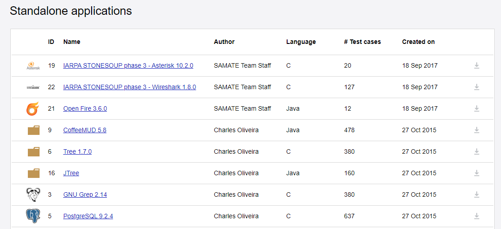

<!--
 * @Author: Suez_kip 287140262@qq.com
 * @Date: 2022-10-26 14:56:24
 * @LastEditTime: 2022-11-09 15:43:58
 * @LastEditors: Suez_kip
 * @Description: 
-->

# DATA SET

## NVD  
  
NVD in NIST(National Institute of Standards and Technology)<https://nvd.nist.gov/>  
NVD中CVE信息：一个完整的CVE信息 包含 六部分：

- 元数据  
- 漏洞影响软件信息  
- 漏洞问题类型  
- 参考和漏洞介绍  
- 包含CPE信息
- 漏洞影响和评分

tips：CPE是（Common Platform Enumeration的缩写）以标准化方式为软件应用程序、操作系统及硬件命名的方法。CPE是用于信息技术系统，软件和程序包的结构化命名方案。基于统一资源标识符（URI）的通用语法，CPE包括形式名称格式，用于根据系统检查名称的方法以及用于将文本和测试绑定到名称的描述格式。

```cpe:/<part>:<vendor>:<product>:<version>:<update>:<edition>:<language>:<sw_edition>:<target_sw>:<target_hw>:<other>```  

其中，part表示目标类型，允许的值有a（应用程序）、h（硬件平台）、o（操作系统）；vendor表示向量类型；product表示产品名称；version表示版本号；update表示更新包；edition表示版本；language表示语言项。  
具体下载地址：<https://nvd.nist.gov/vuln/data-feeds>  

## SARD  
  
SARD(Software Assurance Reference Dataset)网站主页：<https://samate.nist.gov/SRD/index.php>  
包含代码类型：Java、C、php、C++、c#；漏洞类型：150 classes of weaknesses  
具体测试套件下载地址：<https://samate.nist.gov/SARD/test-suites>  
  

## CWE

Community-developed list of software and hardware weakness types.<https://cwe.mitre.org/>

## VCD

VulPecker使用的漏洞数据集<https://github.com/vulpecker/Vulpecker>

## 其他（待研究）

1, 赛门铁克的漏洞库 <https://www.securityfocus.com/>
2, 美国国家信息安全漏洞库 <https://nvd.nist.gov/>---------
3, 全球信息安全漏洞指纹库与文件检测服务 <http://cvescan.com>
4, 美国著名安全公司Offensive Security的漏洞库 <https://www.exploit-db.com/>
5，CVE(美国国土安全资助的MITRE公司负责维护) <https://cve.mitre.org/>
工控类
1, 美国国家工控系统行业漏洞库 <https://ics-cert.us-cert.gov/advisories>
2, 中国国家工控系统行业漏洞：<http://ics.cnvd.org.cn/>
国内：
1，中国国家信息安全漏洞共享平台(由CNCERT维护): <http://www.cnvd.org.cn>
2，国家信息安全漏洞库(由中国信息安全评测中心维护)：<http://www.cnnvd.org.cn/>
3，绿盟科技-安全漏洞：<http://www.nsfocus.net/index.php?act=sec_bug>
其他：
<https://blog.csdn.net/weixin_41843972/article/details/103885572?utm_medium=distribute.pc_relevant.none-task-blog-2~default~baidujs_utm_term~default-0-103885572-blog-109024171.pc_relevant_recovery_v2&spm=1001.2101.3001.4242.1&utm_relevant_index=3>

## 预处理（待研究）

四、软件漏洞文本预处理：  

- 去除标点符号和特殊字符

原始漏洞文本中包含很多标点符号和特殊字符，而这些元素与上下文并不存在语义上的联系，因此首先需要对文本中的所有标点符号和特殊字符进行过滤，只保留含有较多语义信息的词汇。（可以使用正则表达式去除）

- 分词并将所有字符的大写转换为小写

对漏洞文本进行分词是指将连贯的漏洞文本信息切分成一个一个的单词，即将整个漏洞文本信息转换为可以通过统计学进行统计的最小语义单元。对于英文描述的漏洞文本，分词是非常简单的，只需要通过识别文本之间的空格或者标点符号即可将整条漏洞文本划分成一个一个的单词。然后将单词中所有字母的大写形式转换为字母的小写形式。

- 词形还原

词形还原是把一个任何形式的英文单词还原为一般形式，即将英文描述中的动词根据人称不同而变化的单词转换为动词原形；将名词的复数形式转换为名词的单数形式；将动名词形式转换为动词原形等，这些词都应该属于同一类的语义相近的词。比如“attack”，“attacking”，“attacked”则可划分为同属于一个词，用词根形式“attack”表示即可。

- 停用词过滤

停用词是指在漏洞文本中频繁出现且对文本信息的内容或分类类别贡献不大甚至无贡献的词语，如常见的介词、冠词、助词、情态动词、代词以及连词等对于漏洞分类来说毫无意义，因此这类词语应该被过滤掉。同时针对漏洞文本中有些词如“information”,“security”,“vulnerability”等词对于漏洞分类来说毫无意义，因此这类词语也应该被过滤掉。  
  
本实验通过参考从网上下载的通用停用词表，并结合漏洞文本信息自身的特点构建针对漏洞分类专属的专用停用词表实现频繁无用词的过滤。（针对漏洞自身的频繁无用词的提取方法可以使用基于词频统计的方法，比如将每个单词按词频大小降序排列，然后设定一个阈值，将低于这个阈值的单词加入到专业停用词表中。）  
  
停用词的过滤可以大大消除漏洞文本中的冗余信息，减少数据的冗余性。

# EMBER: An Open Dataset for T raining Static PE Malware Machine Learning Models

一个针对PE文件的特定数据集

## 选取准则

在制作Ember数据集时，我们考虑了几个实际用例和研究，包括以下内容。

- 比较恶意软件检测的机器学习模型。
- 量化模型退化和概念随时间推移的漂移。
- 研究可解释的机器学习。
- 比较恶意软件分类的特征，特别是烬数据集中未显示的新特征。这需要可扩展的数据集。
- 与无特色的端到端深度学习相比。这可能需要代码从新的数据集中提取特征，或者shas256散列来构建与烬匹配的原始二进制数据集。
- 研究针对机器学习恶意软件的对抗性攻击以及后续防御策略。
- 通过PE文件表示的无监督学习或分类的半监督学习，利用未标记的样本。

## 文件格式

烬数据集由一组JSON行文件组成，其中每行包含一个JSON对象。每个对象都包含以下数据类型：
- 原始文件的sha256哈希作为唯一标识符；
- 粗略时间信息（月分辨率），用于确定首次看到文件的时间；
- 一个标签，可以是0表示良性，1表示恶意，-1表示未标记；
- 八组原始特征，包括解析值和格式不可知直方图。

例子和具体介绍如下
```
"sha256": "000185977be72c8b007ac347b73ceb1ba3e5e4dae4fe98d4f2ea92250f7f580e",
"appeared": "2017-01",
"label": -1,
{
    "general": {
        ...
    },
    "header": {
        ...
    },
    "imports": {
        ...
    },
    "exports": []
    "section": {
        ...
    },
    "histogram": [ 3818, 155, ..., 377 ],
    "byteentropy": [0, 0, ... 2943 ],
    "strings": {
        ...
    },
}
```
### PE文件本体信息

常规文件信息。通用文件信息组中的一组功能包括文件大小和从PE头获得的基本信息：文件的虚拟大小、导入和导出函数的数量、文件是否具有调试部分、线程本地存储、资源、重定位或签名，以及符号的数量。

标题信息。从COFF标头中，我们报告标头中的时间戳、目标机器（字符串）和图像特征列表（字符串列表）。从可选标头中，我们提供了目标子系统（字符串）、DLL特性（字符串列表）、文件魔法字符串（例如，“PE32”）、主要和次要图像版本、链接器版本、系统版本和子系统版本以及代码、标头和提交大小。为了创建模型特征，在训练模型之前，使用特征哈希技巧对字符串描述符（如DLL特征、目标机器、子系统等）进行总结，为每个有噪指示符向量分配10个容器。

导入的函数。我们解析导入地址表并按库报告导入的函数。为了为基线模型创建模型特征，我们只需收集一组唯一的库，并使用哈希技巧绘制该集合（256个库）。类似地，我们使用哈希技巧（1024个bin）来捕获单个函数，方法是将每个函数表示为一个字符串，例如library:FunctionName对（例如kernel32.dll:CreateFileMappingA）。

导出的函数。原始功能包括导出函数的列表。使用具有128个箱的哈希技巧将这些字符串汇总为模型特征。

章节信息。提供了每个部分的属性，包括名称、大小、熵、虚拟大小以及表示部分特征的字符串列表。入口点由名称指定。为了转换为模型特征，我们使用哈希技巧（节名称、值）对来创建包含节大小、节熵和虚拟大小（每个50个容器）的向量。我们还使用哈希技巧来捕获入口点的特征（字符串列表）。

### 其他特征

字节直方图。字节直方图包含256个整数值，表示文件中每个字节值的计数。当生成模型特征时，由于文件大小在一般文件信息中表示为特征，因此该字节直方图被归一化为分布。

字节熵直方图。字节熵直方图近似于熵H和字节值X的联合分布p（H，X）。如[26]中所述，通过计算固定长度窗口的标量熵H，并将其与窗口内的每个字节匹配来完成此操作。当窗口在输入字节上滑动时，会重复此操作。在我们的实现中，我们使用2048的窗口大小和1024字节的步长，以及16×16个量化熵和字节值的箱。在训练之前，我们将这些计数标准化，以求和。

字符串信息。数据集包括可打印字符串的简单统计信息（由范围0x20到0x7f（包括0x20和0x7f），长度至少为五个可打印字符。特别是，报告的是字符串的数量、它们的平均长度、这些字符串中可打印字符的直方图以及所有可打印字符串的字符熵。可打印字符分布提供了与上述字节直方图信息不同的信息，因为它仅来自包含至少五个连续可打印字符的字符串。此外，字符串特征组包括可能指示路径的以C:\（不区分大小写）开头的字符串的数量、可能指示URL的http://或https://（不分大小写）的出现次数、可能指示注册表项的HKEY_的出现次数，以及短字符串MZ的出现次数，其可能提供Windows PE滴管或捆绑的可执行文件的微弱证据。通过提供字符串的简单统计摘要而不是原始字符串的列表，我们减轻了一些良性文件可能存在的隐私问题。

## 具体分布

  
确保在烬中标记为恶意的文件在VirusTotal中可用，并有40多家供应商报告为恶意。因此，烬是一个相对“简单”的数据集。


