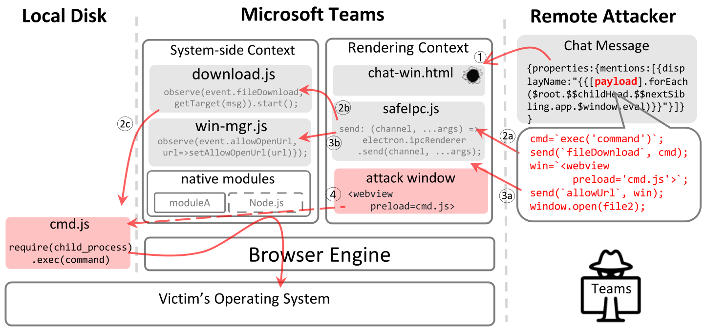
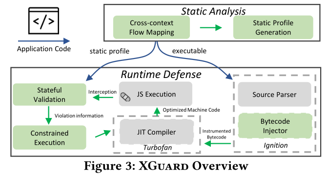

<!--
 * @Description: 
-->
<!--
 * @Description: 
-->
# Understanding and Mitigating Remote Code Execution Vulnerabilities in Cross-platform Ecosystem

[源码地址](https://github.com/xiaofen9/XGuard)

但是目前源码仍未放出，后续再做调研；

## 对远程代码的分析

### 远程代码执行的必要条件

真实攻击案例：  

  

1. 注入点：注入点是指对手将恶意有效载荷注入跨平台应用程序，并在运行他们如果呈现上下文中的任何应用程序功能接受/加载外部输入，则可能会被滥用以注入恶意代码。
2. 给定一个跨平台应用程序，如果一个上下文中的函数与另一个上下文交互（例如，跨上下文访问变量），它就构成了跨上下文流。对于典型的Xrce攻击，远程攻击者需要首先将恶意代码注入渲染上下文（通过现有的注入点），然后执行跨上下文流以到达特权系统侧上下文；

### 新攻击面的分析

1. 本地文件系统中的脚本。开放运行时为注入点发现开启了新的可能性。本地文件系统中的任何脚本都可能成为攻击目标。例如，攻击者可能以文件系统中的随机脚本为目标，并使用iframe在渲染上下文中调用它。需要包含以下能力：
   1. 它接受外部输入（例如，通过查询字符串）；
   2. 对外部输入进行评估；
2. 在其他跨平台应用程序中捆绑脚本。只要目标应用程序能够识别归档格式，就可以在其他跨平台应用程序中滥用捆绑脚本。例如，所有Electron应用程序都使用一种称为asar的压缩格式来归档文件。因此，位于一个应用程序（例如Slack）中的攻击者可以利用另一个应用软件（例如VSCode）的脚本注入代码（回到Slack中）。

### 攻击行为分析

1. 直接调用通道滥用。恶意呈现上下文代码通过直接利用暴露的本机系统端模块来启动跨上下文流。通常，这些公开的模块分为两类：
   1. Node.js模块；
   2. 跨平台框架特定库；
2. 浏览器状态中毒：因为系统端和渲染上下文在同一个浏览器引擎中执行（如图1所示），所以它们共享一些全局状态，如JavaScript原型。从技术上讲，浏览器状态中毒包括在浏览器运行时对全局状态的任何恶意修改。
3. 自定义通信通道滥用：由于这些通道经常大量使用本地API来提供跨上下文流，因此可以对其实现滥用。

## XGUARD

  

在第一阶段，给定一个跨平台应用程序，XGuard分析其发布的JavaScript代码，为合法的跨上下文流生成限制性配置文件。这一步骤面临的一个关键挑战是如何识别包含的跨上下文流。为了解决这个问题，XGuard应用了静态程序分析，以其高覆盖率适用于学习所有跨上下文流。XGuard使用静态分析收集必要的上下文信息（例如，调用图），定位相关的API，并将其调用站点标识为跨上下文流的良性创建者。  

在第二阶段，当目标应用程序运行时，XGuard执行实时安全强制执行。XGuard动态监控所有跨上下文流，了解跨上下文行为的真正发起者，并执行细粒度验证。然而，在处理这项任务时，必须克服一些挑战。

### 一阶段

1. 将跨上下文流映射到应用程序逻辑。定位从渲染上下文启动的良性跨上下文流。可用的本地模块，并将它们的敏感API（例如，IPC sender方法）添加到列表中；
2. 在渲染上下文中定位映射的跨上下文流。使用目标API列表，XGuard在呈现上下文代码中搜索所有调用敏感API的调用站点 CALL SITE。包括了以下两种方案：
   1. 基于轻量级词汇的呼叫站点搜索：获得其抽象语法树（AST），通过遍历AST，XGuard使用与目标API列表中相同的词法函数名称来识别调用站点（词法名称通常在本机模块和呈现上下文之间保持不变（即，开发人员在从呈现上下文调用本机API时通常不会更改其名称））。
   2. 基于细粒度污点的呼叫站点查找。执行定义使用分析，以检查目标列表上是否有任何API是从本机模块导入的。如果是这样，它会将导入的变量标记为源，并执行静态污点跟踪。在识别所有呼叫站点后，XGuard将其唯一识别为呼叫站点集<F，LOC>，其中F是API名称，LOC是代码位置信息，包括文件名和行号。
3. 生成限制性配置文件profile。在识别所有跨上下文流调用站点后，直接防御会强制执行基于白名单的配置文件，只允许识别的调用站点启动跨上下文流。（尽管静态分析的完整性使其成为生成配置文件的良好候选者，但JavaScript的动态特性（例如，动态属性访问）使其难以提取准确的控制流信息）

当控制流完整性无法完全验证时（由于JavaScript静态分析不准确），XGuard会启动数据流分析，以推理和验证创建敏感API输入参数的“出处”（通常是一个函数）。

### 二阶段

1. 拦截跨上下文流。在运行时对跨上下文流强制执行限制性配置文件之前，XGuard需要首先暂停应用程序执行，并从渲染上下文中截取跨上下文流（包括带有预加载选项的脚本）。在相关敏感API调用的开头注入一个钩子来定制V8。
2. 收集运行时信息。在安装挂钩到位的情况下，XGuard收集跨上下文流运行时信息。它稍后会使用这些信息来验证流的完整性，首先，为了收集控制流信息，XGuard利用V8的V8:：internal:：JavaScriptFrameIterator遍历调用堆栈并学习调用路径。对数据流的轻量化检测，使用的是v8::internal::context;
3. 执行安全：
   1. 状态验证：将profile识别为一个FSM，检查当前截获是否尊在于FSM中。如果存在，则获取动态呼叫链信息；如果是非法流程或搜索完也未发现，则认为是一种非法攻击，放入沙箱运行或直接拒绝运行；
   2. 有约束执行的违规处理：
      1. 调用路径、静态profile一致，可信创建者创建的数据，完全一致的上下文流，则正常进行完全执行；
      2. 沙箱执行时，我们根据目标API列表创建一个过滤的API列表，并且在沙盒执行中只允许该列表中的方法。通过白名单策略轻量化的实现对沙箱内的运行实现限制；

## 实验与结果