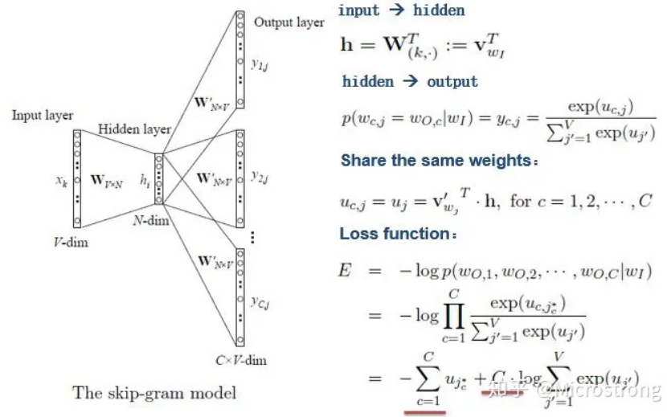

<!--
 * @Author: Suez_kip 287140262@qq.com
 * @Date: 2022-10-27 20:47:46
 * @LastEditTime: 2022-11-06 09:15:36
 * @LastEditors: Suez_kip
 * @Description: 
-->
# word2vec

## 文本表示

1. Skip-gram模型：从大量非结构化文本数据中学习单词的高质量矢量表示；
其中模式中的许多可以表示为线性翻译：vec(“Madrid”) - vec(“Spain”) + vec(“France”) is closer to vec(“Paris”)  
  

相对词汇自然组合得出地含义更有意义如“波士顿”和“环球报”的组合含义；  
2. 递归自动编码器，受益于短语向量而非单词向量，单词->短语模型扩展更为简单；  
数据驱动获取大量短语，视之为单独标记

本文有基于skip-gram的扩展；对频繁单词进行二次采样->速度提高、稀有词汇准确性提高；
本文提出一种简化的噪声对比估计（NCE）变体，训练skip-gram，相对分层softmax更快更好地表示；
本文提出了一组包含单词和短语的类比推理任务，例子如下：  
vec（“蒙特利尔加拿大人”）-vec（蒙特利尔”）+vec（多伦多”）接近vec（”多伦多枫叶”）则为正确；  

本文发现Skip-gram模型符合一定的数学运算能力；

word2vec基本架构是由CBOW+Skip-gram组成的;

### CBOW（连续词袋模型）context->words next

- CBOW simple
  

tips:

1. 输入层x可作为选择矩阵（其中的值均为0或1）；
2. 目标函数为：
  
并转化为  
  

- CBOW multiple2multiple
  

## word2vec提出的加速训练方法

### Hierarchical softmax 层次softmax

- CBOW based on Hierarchical softmax:
  
输入：2c个词向量  
投影：累加  
⭐输出：Huffman Tree  
此处认为设定0为正类，1为负类，即将节点作为二分类器（sigmod）
  
基于以上概率函数可以总结为：
  

带入CBOW的目标函数可得下式，并可进一步获得梯度更新：
  

- Skip-gram based on Hierarchical softmax:
结构与CBOW on HS相似
  

### Negative Sampling 基于负采样的CBOW、skipgram

#### 负采样

参考博客<https://zhuanlan.zhihu.com/p/39684349>

采样的本质：每次让一个训练样本只更新部分权重，其他权重全部固定；减少计算量；（一定程度上还可以增加随机性）  
```随机选择一小部分的negative words（比如选5个negative words）来更新对应的权重。我们也会对我们的“positive” word进行权重更新;在论文中，作者指出指出对于小规模数据集，选择5-20个negative words会比较好，对于大规模数据集可以仅选择2-5个negative words。```  

一元模型分布（unigram distribution）”来选择“negative words”。
  
  

  
