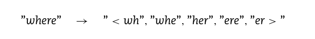
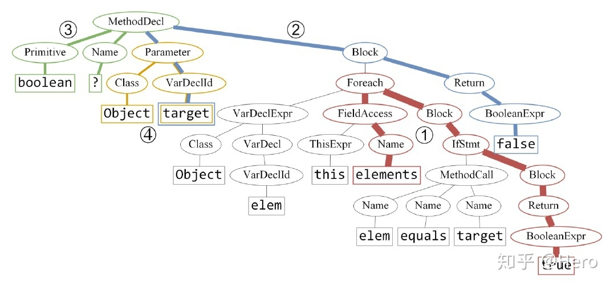
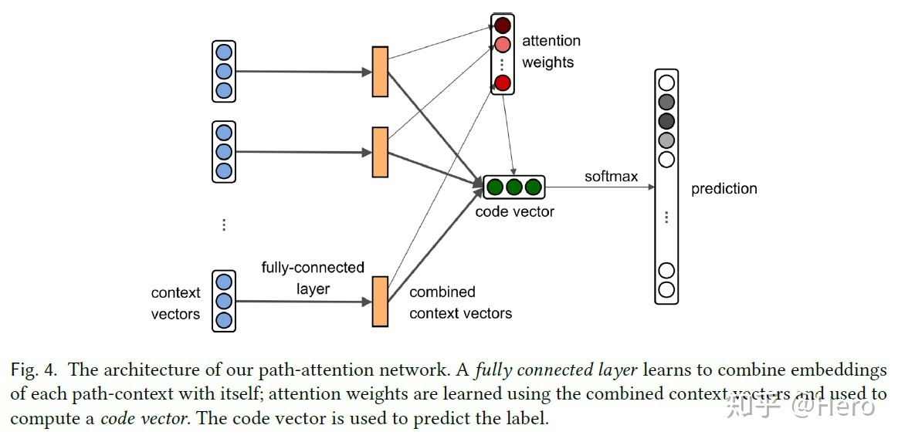
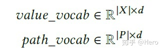
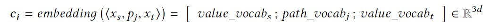
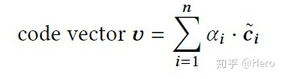
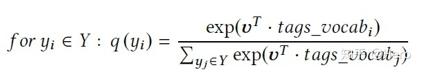

<!--
 * @Author: Suez_kip 287140262@qq.com
 * @Date: 2022-10-27 20:47:46
 * @LastEditTime: 2022-11-28 11:36:38
 * @LastEditors: Suez_kip
 * @Description: 
-->
# word2vec

## 文本表示

1. Skip-gram模型：从大量非结构化文本数据中学习单词的高质量矢量表示；  
通过中心词来推断上下文一定窗口内的单词，对独热码生成嵌入词向量；  
  
  
其中模式中的许多可以表示为线性翻译：vec(“Madrid”) - vec(“Spain”) + vec(“France”) is closer to vec(“Paris”)  
相对词汇自然组合得出地含义更有意义如“波士顿”和“环球报”的组合含义；  

1. N-gram模型：进行大小为N的滑动窗口操作，形成了长度是N的字节片段gram序列。常用二元和三元gram模型；
N-gram模型是基于统计的概率预测，以二元模型为例：  
  
根据一个语料库中的参数统计分析，得到相应的概率：  
  
进一步可以求出一个相应的句子所对应的概率（通过链式法则），来研究这句句子在语料库中的存在概率；  

1. 递归自动编码器，受益于短语向量而非单词向量，单词->短语模型扩展更为简单；  
数据驱动获取大量短语，视之为单独标记

本文有基于skip-gram的扩展；对频繁单词进行二次采样->速度提高、稀有词汇准确性提高；
本文提出一种简化的噪声对比估计（NCE）变体，训练skip-gram，相对分层softmax更快更好地表示；
本文提出了一组包含单词和短语的类比推理任务，例子如下：  
vec（“蒙特利尔加拿大人”）-vec（蒙特利尔”）+vec（多伦多”）接近vec（”多伦多枫叶”）则为正确；  

本文发现Skip-gram模型符合一定的数学运算能力；

word2vec基本架构是由CBOW+Skip-gram组成的;

### CBOW（连续词袋模型）context->words next

- CBOW simple  
词袋
  
连续词袋，用多个上下文去训练一个词；  
tips:

1. 输入层x可作为选择矩阵（其中的值均为0或1）；
2. 目标函数为：
  
并转化为  
  

- CBOW multiple2multiple
  

## word2vec提出的加速训练方法

### Hierarchical softmax 层次softmax

- CBOW based on Hierarchical softmax:
  
输入：2c个词向量  
投影：累加  
⭐输出：Huffman Tree  
此处认为设定0为正类，1为负类，即将节点作为二分类器（sigmod）
  
基于以上概率函数可以总结为：
  

带入CBOW的目标函数可得下式，并可进一步获得梯度更新：
  

- Skip-gram based on Hierarchical softmax:
结构与CBOW on HS相似
  

### Negative Sampling 基于负采样的CBOW、skipgram

#### 负采样

参考博客<https://zhuanlan.zhihu.com/p/39684349>

采样的本质：每次让一个训练样本只更新部分权重，其他权重全部固定；减少计算量；（一定程度上还可以增加随机性）  
```随机选择一小部分的negative words（比如选5个negative words）来更新对应的权重。我们也会对我们的“positive” word进行权重更新;在论文中，作者指出指出对于小规模数据集，选择5-20个negative words会比较好，对于大规模数据集可以仅选择2-5个negative words。```  

一元模型分布（unigram distribution）”来选择“negative words”。
  
  

  

# Doc2Vec

word2vec的词嵌入很优秀，但其拼接后表达长句子仍然表现力很差；在word2vec的词向量基础上，能更好地表达句子的语义信息；  

一种无监督算法，能从变长的文本（例如：句子、段落或文档）中学习得到固定长度的特征表示， 它有两种训练方式：

## 分布记忆的段落向量（Distributed Memory Model of Paragraph Vectors , PV-DM）->CBOW模型；
  

每一句话用唯一的向量来表示，用矩阵D的某一列来表示；  
每一个词也用唯一的向量来表示，用矩阵W的某一列来表示；
每次从一句话中滑动采样固定长度的词，取其中一个词作预测词，其他的作为输入词。输入词对应的词向量和本句话对应的句子向量作为输入层的输入，相加求平均或者累加构成一个新的向量，进而使用这个向量预测此次窗口内的预测词。

其实只是增加了一个用于外置记忆和调控的句vector

## 分布词袋版本的段落向量（Distributed Bag of Words version of Paragraph Vector，PV-DBOW）->Skip-gram模型。

另外一种训练方法是忽略输入的上下文，让模型去预测段落中的随机一个单词。就是在每次迭代的时候，从文本中采样得到一个窗口，再从这个窗口中随机采样一个单词作为预测任务，让模型去预测，输入就是段落向量。

# sent2vec

上下文窗口大小与句子中的单词数匹配。

# GloVe

针对word2vec的语义嵌入的局限性（仅保留在窗口中，而无法实现挖掘语料库的全局共现性）

# FastText 

将原始单词表示为子单词向量并进行处理，然后再使用word2vec，一般使用3-6grams；处理不足语料库的能力也会提高，在嘈杂（错词）的语料库中具有优势。  
  

# code2vec

## STEP I 代码片段对应的AST，提取不同的路径

将每个path-context中的结点embedding后concatenate成一个vector来代表这个path-context。对于每个path-context按权重(attention)加权融合成总体的向量，这个总体的向量就是最终对应方法名字的向量。  
路径的长度与其对应的attention权重是成比例的，红色路径比蓝色路径长，其attention值也更高。  
  
值得注意的是，一条路径的attention并不是恒定的，是和上下文相关的。即使一模一样的两条路径，如果上下文代码不同，则attention值一般也不相同。

## STEP II Training

  

首先我们对于代码片段的每个token和路径都做编码，为两个矩阵如下：  
  

而后对于每一个path-context，结合首末token(看作keyword)和路径得到一个综合向量：
  
a为global attention的值,则：  
path context attention weight $\alpha _i = \frac{exp((tanh(W*c_i))^T*a)}{\sum_{j=i}^n((tanh(W*c_j))^T*a)}$  
此时我们会给出一些单词作为候选标签，构成一个标签矩阵：

  

利用softmax计算我们得到的向量适合哪个标签，则该标签就作为方法的名字：  

  

以上就是该模型的过程简述。